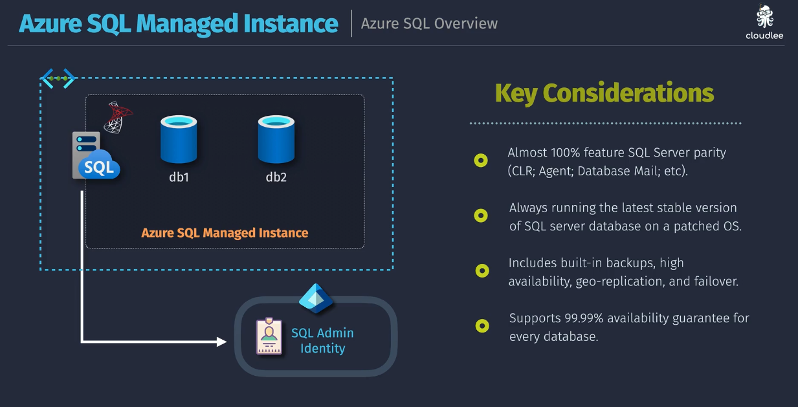
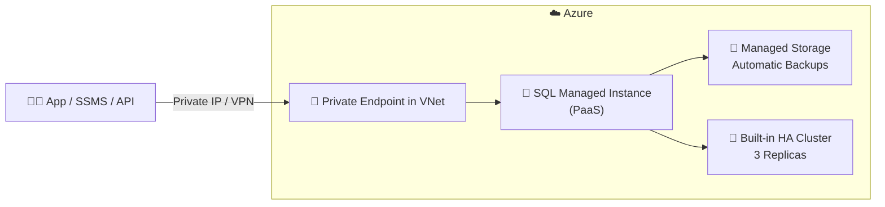
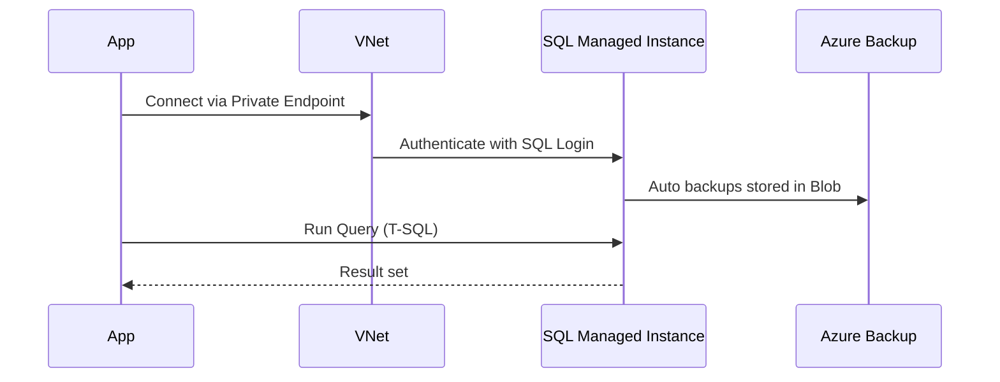

# 🧱 **Azure SQL Managed Instance (PaaS)**

> ☁️ “Fully managed SQL Server engine — just bring your database, Azure handles the rest.”

---

## 🧠 What Is Azure SQL Managed Instance?

**Azure SQL Managed Instance (MI)** is a **Platform as a Service (PaaS)** offering that gives you **nearly 100% SQL Server compatibility** while **removing the burden of managing infrastructure**, patching, backups, or high availability.

It sits **between**:

- 🏗️ **SQL Server on Azure VM (IaaS)** → Full control
- 🧩 **Azure SQL Database (PaaS)** → Fully abstracted

👉 Think of it as a _“lift-and-shift friendly PaaS”_ for existing SQL workloads.

---

<div align="center" style="background-color: #242A3A ;border-radius: 10px;border: 2px solid white">
  
</div>

---

## ⚙️ Core Concept Overview

<div align="center" style="background-color: #1b3f47ff; border-radius: 10px;">

| Feature               | Description                                             |
| --------------------- | ------------------------------------------------------- |
| **Service Type**      | Platform as a Service (PaaS)                            |
| **Deployment**        | Always inside a **Virtual Network (VNet)**              |
| **SQL Compatibility** | 100% with SQL Server (Agent, Linked Servers, CLR, SSIS) |
| **High Availability** | Built-in (3-node quorum-based replica model)            |
| **Backups**           | Automatic (Point-in-Time Restore up to 35 days)         |
| **Scaling**           | Dynamically adjust vCores and storage                   |
| **Pricing Model**     | vCore-based (General Purpose or Business Critical)      |

</div>

---

## 🧱 When to Choose Managed Instance

<div align="center" style="background-color: #1b3f47ff; border-radius: 10px;">

| Use Case                              | Why MI Fits                               |
| ------------------------------------- | ----------------------------------------- |
| 🧩 **Lift-and-shift from SQL Server** | Compatible with on-prem SQL features      |
| 🧮 **Automated maintenance**          | Azure manages patching, backups, failover |
| 🔒 **Private connectivity**           | Always deployed inside VNet               |
| 💾 **Always-on availability**         | Built-in HA (no cluster setup needed)     |
| 💼 **Multi-database apps**            | Support cross-database queries            |
| ☁️ **Hybrid or secure scenarios**     | Works with VPN or ExpressRoute            |

</div>

---

## 🧩 Architecture Diagram

<div align="center" style="background-color: #1b3f47ff; border-radius: 10px;">



</div>

💡 _Unlike SQL Database, MI has **a dedicated VNet and subnet** — allowing hybrid apps to access it privately._

---

## 💡 5️⃣ Service Tiers

<div align="center" style="background-color: #1b3f47ff; border-radius: 10px;">

| Tier                       | Description                          | Performance | Storage     | Use Case                      |
| -------------------------- | ------------------------------------ | ----------- | ----------- | ----------------------------- |
| **General Purpose (GP)**   | Azure premium storage + remote disks | Good        | Up to 16 TB | Most workloads                |
| **Business Critical (BC)** | Local SSD + read replica             | High        | Up to 4 TB  | Low latency, HA-critical apps |

</div>

---

## 🧭 Step-by-Step: Create SQL Managed Instance (Portal)

> 🎯 _We’ll create a managed instance using the Azure Portal._

### 1️⃣ Step — Navigate to Azure Portal

Go to **Azure Portal → Create a Resource → Databases → Azure SQL Managed Instance**

---

### 2️⃣ Step — Basics Tab

<div align="center" style="background-color: #1b3f47ff; border-radius: 10px;">

| Setting                   | Description                                                  |
| ------------------------- | ------------------------------------------------------------ |
| **Subscription**          | Choose your subscription                                     |
| **Resource Group**        | Create or select existing                                    |
| **Managed Instance Name** | e.g., `mi-prod-eastus`                                       |
| **Region**                | Choose close to your app region                              |
| **Compute + Storage**     | Choose tier → vCore model → storage (e.g., 4 vCores, 256 GB) |
| **SQL Authentication**    | Username & password for SQL admin                            |
| **Azure Hybrid Benefit**  | Yes (if you own SQL license) or No                           |

</div>

💡 _Each Managed Instance runs on its own compute cluster, so deployment takes 4–6 hours for first instance._

---

### 3️⃣ Step — Networking Tab

<div align="center" style="background-color: #1b3f47ff; border-radius: 10px;">

| Setting                        | Description                                          |
| ------------------------------ | ---------------------------------------------------- |
| **Virtual Network**            | Must exist or create new                             |
| **Subnet**                     | Dedicated subnet (Azure creates rules automatically) |
| **Connection Type**            | Private (only via VNet)                              |
| **Public Endpoint (optional)** | You can enable later for SSMS over internet          |
| **DNS Zone**                   | Automatically managed                                |

</div>

🔒 _MI cannot exist without a subnet — it’s isolated for security._

---

### 4️⃣ Step — Security Tab

<div align="center" style="background-color: #1b3f47ff; border-radius: 10px;">

| Setting                               | Description                           |
| ------------------------------------- | ------------------------------------- |
| **Authentication Type**               | SQL + Azure AD supported              |
| **Managed Identity**                  | Enable for Azure services integration |
| **TDE (Transparent Data Encryption)** | Default ON                            |
| **Customer-managed key (CMK)**        | Use Azure Key Vault if needed         |

</div>

---

### 5️⃣ Step — Additional Settings

<div align="center" style="background-color: #1b3f47ff; border-radius: 10px;">

| Setting                | Description                                              |
| ---------------------- | -------------------------------------------------------- |
| **Collation**          | Default or custom (e.g., `SQL_Latin1_General_CP1_CI_AS`) |
| **Time Zone**          | Local or UTC                                             |
| **Maintenance Window** | Choose when Azure applies updates                        |
| **Geo-Replication**    | Optional at creation (Secondary MI in another region)    |

</div>

---

### 6️⃣ Step — Review + Create

- Validate → **Create**
- Azure begins provisioning (usually 3–6 hours for first MI in region)
- Instance appears in **Azure SQL → Managed Instances**

---

## 🧪 Post-Deployment Configuration

### 1. Connect via SSMS

- Open **SQL Server Management Studio**
- Use **Private IP or DNS name**

  ```ini
  mi-prod-eastus.XXXX.database.windows.net,1433
  ```

- Authentication: SQL login or Azure AD

### 2. Configure Access

- Ensure VM or App resides in same VNet (or peered network)
- Use Azure Bastion or VPN if external
- To enable **Public Endpoint** (optional):

  - Go to **Networking → Enable Public Endpoint → Add firewall rules**

---

## ⚙️ Built-in Features

<div align="center" style="background-color: #1b3f47ff; border-radius: 10px;">

| Feature                       | Description                                    |
| ----------------------------- | ---------------------------------------------- |
| **Automatic Backups**         | Full + differential + log; 7–35 days retention |
| **Point-in-Time Restore**     | Restore to any time within retention window    |
| **Failover Groups**           | Cross-region replication for HA/DR             |
| **Maintenance Control**       | Define your patching window                    |
| **Managed Security**          | TDE, threat detection, vulnerability scans     |
| **Scaling**                   | Adjust vCores and storage without downtime     |
| **Azure Monitor Integration** | Metrics, logs, and alerts built-in             |

</div>

---

## 📦 Backup and Restore

<div align="center" style="background-color: #1b3f47ff; border-radius: 10px;">

| Operation                     | Managed Behavior                            |
| ----------------------------- | ------------------------------------------- |
| **Backups**                   | Azure-automated to blob storage             |
| **Restore**                   | To same or another MI                       |
| **Point-in-Time Recovery**    | Any second within 7–35 days window          |
| **Long-Term Retention (LTR)** | Store backups up to 10 years (configurable) |

</div>

---

## 🧮 Licensing & Cost Model

<div align="center" style="background-color: #1b3f47ff; border-radius: 10px;">

| Option           | Description                           |
| ---------------- | ------------------------------------- |
| **vCore model**  | Pay per vCore + storage               |
| **License Type** | Pay-as-you-go or Azure Hybrid Benefit |
| **Auto-pause**   | ❌ Not available                      |
| **Scaling**      | Manual (few mins downtime)            |
| **Billing**      | Per second after deployment ready     |

</div>

---

## 📈 Monitoring and Maintenance

<div align="center" style="background-color: #1b3f47ff; border-radius: 10px;">

| Tool                      | Purpose                                      |
| ------------------------- | -------------------------------------------- |
| **Azure Monitor Metrics** | CPU, storage, sessions, DTU usage            |
| **Query Store**           | Performance insights                         |
| **Log Analytics**         | Centralized query logs                       |
| **Automatic tuning**      | Force last good plan, fix regressions        |
| **Maintenance window**    | Azure applies OS + SQL updates automatically |

</div>

---

## 🧩 Example: Private Access with App

<div align="center" style="background-color: #1b3f47ff; border-radius: 10px;">



</div>

---

## 💡 Best Practices

<div align="center" style="background-color: #1b3f47ff; border-radius: 10px;">

| Area           | Recommendation                                    |
| -------------- | ------------------------------------------------- |
| **Network**    | Always deploy in dedicated subnet                 |
| **Security**   | Use private endpoints and Azure AD auth           |
| **HA/DR**      | Configure Auto-failover groups across regions     |
| **Backup**     | Enable long-term retention for compliance         |
| **Monitoring** | Integrate with Azure Monitor and Defender for SQL |
| **Scaling**    | Scale up during peak, down in off-hours           |

</div>

---

## 📚 Summary

<div align="center" style="background-color: #1b3f47ff; border-radius: 10px;">

| Concept           | Description                                                    |
| ----------------- | -------------------------------------------------------------- |
| **What It Is**    | PaaS SQL with near full SQL Server compatibility               |
| **Network**       | Always inside VNet                                             |
| **Maintenance**   | Fully managed (patching, HA, backup)                           |
| **Best Use Case** | Lift-and-shift apps that require private, managed SQL          |
| **Next Step**     | Deploy Azure SQL Database for lightweight, single-DB workloads |

</div>
