# 🧩 **Azure SQL Database (PaaS)**

> ☁️ _Fully managed relational database for modern apps — zero infrastructure headaches._

---

## 🧠 What Is Azure SQL Database?

**Azure SQL Database** is Microsoft’s **flagship PaaS database service**, designed for **modern, cloud-native applications** that need **scalability, security, and high availability** — without managing any OS, patching, or backups.

It runs the same **SQL Server engine** as on-prem but with **abstracted infrastructure**.

---

<div align="center" style="background-color: #ffffffff ;border-radius: 10px;border: 2px solid white">
  
</div>

---

## 🧱 Where It Fits in the Azure SQL Family

<div align="center" style="background-color: #1b3f47ff; border-radius: 10px;">

| Product                            | Level          | Management          | Network        | Ideal For         |
| ---------------------------------- | -------------- | ------------------- | -------------- | ----------------- |
| 🖥️ **SQL on VM (IaaS)**            | Full instance  | You manage OS + SQL | Public / VNet  | Legacy apps       |
| 🧩 **SQL Managed Instance (PaaS)** | Instance-level | Azure manages infra | Private VNet   | Lift-and-shift    |
| 🧱 **SQL Database (PaaS)**         | Database-level | Fully managed       | Public/Private | Cloud-native apps |

</div>

💬 _Think of it like:_

> **You manage code and data** → Azure manages everything else.

---

## ⚙️ Deployment Options

Azure SQL Database can be deployed in 3 forms:

<div align="center" style="background-color: #1b3f47ff; border-radius: 10px;">

| Option              | Description                        | Use Case                    |
| ------------------- | ---------------------------------- | --------------------------- |
| **Single Database** | Isolated DB with its own resources | Microservices or small apps |
| **Elastic Pool**    | Group of databases sharing vCores  | Multi-tenant SaaS           |
| **Hyperscale**      | Distributed storage architecture   | Large OLTP/OLAP workloads   |

</div>

---

## 🧩 Architecture Overview

```mermaid
flowchart TB
    subgraph Azure["☁️ Azure Cloud"]
        direction TB
        S["🧱 Azure SQL Logical Server"]
        D1["📄 Database 1 (Single or in Pool)"]
        D2["📄 Database 2"]
        P["⚙️ Elastic Pool (optional)"]
        S --> D1
        S --> D2
        P --> D1
        P --> D2
        B["💾 Azure Storage (Automatic Backups)"]
        S --> B
    end
    C["👩‍💻 Client App / SSMS / Azure App Service"] -->|SQL Connection String| S
```

<div align="center" style="background-color: #1b3f47ff; border-radius: 10px;">



</div>

💡 **Server ≠ actual SQL instance.**
In Azure, the _SQL Server_ is a **logical container** that holds one or more **databases** and manages:

- Authentication
- Firewall rules
- Auditing
- Elastic pools

---

## 🧭 Step-by-Step: Create Azure SQL Database (Portal)

### 1️⃣ Step — Navigate to Portal

Go to **Azure Portal → Create a Resource → Databases → SQL Database**

---

### 2️⃣ Step — Basics Tab

<div align="center" style="background-color: #1b3f47ff; border-radius: 10px;">

| Setting                       | Description                                      |
| ----------------------------- | ------------------------------------------------ |
| **Subscription**              | Choose your Azure subscription                   |
| **Resource Group**            | Create or reuse existing                         |
| **Database Name**             | e.g., `appdb-prod`                               |
| **Server**                    | Choose existing logical server or **Create new** |
| **Compute + Storage**         | Choose **Service Tier (vCore or DTU)**           |
| **Backup Storage Redundancy** | Locally-redundant, Geo-redundant, Zone-redundant |

</div>

💡 _When creating a new logical server, you define:_

- Server name (e.g. `myserver.database.windows.net`)
- Location
- Admin login & password

---

### 3️⃣ Step — Networking Tab

<div align="center" style="background-color: #1b3f47ff; border-radius: 10px;">

| Setting               | Description                                   |
| --------------------- | --------------------------------------------- |
| **Connectivity**      | Public endpoint (default) or Private Endpoint |
| **Firewall Rules**    | Allow Azure Services or your client IP        |
| **Connection Policy** | Default (proxy) or Redirect (preferred)       |
| **VNet Integration**  | Optional — via Private Link                   |

</div>

💡 _For production, use Private Link for secure VNet-only access._

---

### 4️⃣ Step — Security Tab

<div align="center" style="background-color: #1b3f47ff; border-radius: 10px;">

| Setting                               | Description                    |
| ------------------------------------- | ------------------------------ |
| **Authentication**                    | SQL or Azure AD                |
| **Microsoft Defender for SQL**        | Optional threat protection     |
| **Transparent Data Encryption (TDE)** | On by default                  |
| **Customer-managed keys (CMK)**       | Optional — stored in Key Vault |

</div>

---

### 5️⃣ Step — Additional Settings

<div align="center" style="background-color: #1b3f47ff; border-radius: 10px;">

| Setting             | Description                                       |
| ------------------- | ------------------------------------------------- |
| **Collation**       | `SQL_Latin1_General_CP1_CI_AS` or custom          |
| **Backup**          | Automatic daily backups                           |
| **Geo-Replication** | Optional active secondary region                  |
| **Sample Database** | You can choose `AdventureWorksLT` to test queries |

</div>

---

### 6️⃣ Step — Review + Create

- Review configurations
- Click **Create**
- Deployment finishes within **2–5 minutes**

---

## 🧠 Understanding the “Logical Server”

When you created the database, you also created a **SQL Server (logical)**.

This is **not** a real VM — it’s a **management container** for:

- Database-level logins
- Firewall rules
- Auditing and security settings
- Elastic pools

💡 You can have multiple databases under one logical server.

---

## ⚡ Performance Models

Azure SQL offers two compute models:

<div align="center" style="background-color: #1b3f47ff; border-radius: 10px;">

| Model           | Description                                     | Billing                           | Example              |
| --------------- | ----------------------------------------------- | --------------------------------- | -------------------- |
| **DTU-based**   | Blended CPU + memory + I/O (simpler)            | Tiered (Basic, Standard, Premium) | Small apps           |
| **vCore-based** | Independent control of vCores, RAM, and storage | Per vCore + storage               | Enterprise workloads |

</div>

💬 _vCore model also supports Azure Hybrid Benefit and reserved instances for cost saving._

---

## 🧩 Service Tiers (vCore Model)

<div align="center" style="background-color: #1b3f47ff; border-radius: 10px;">

| Tier                  | Storage Type       | HA                | Max Size | Use Case             |
| --------------------- | ------------------ | ----------------- | -------- | -------------------- |
| **General Purpose**   | Remote SSD         | Zone redundant    | 4 TB     | Balanced performance |
| **Business Critical** | Local SSD          | 4 replicas        | 4 TB     | Mission-critical     |
| **Hyperscale**        | Remote distributed | Multiple replicas | 100 TB   | High scale workloads |

</div>

---

## 🔄 Elastic Pools

Elastic pools let you **share compute** among databases.
You set a max/min vCore per DB, and the pool adjusts dynamically.

<div align="center" style="background-color: #1b3f47ff; border-radius: 10px;">

| Benefit               | Description                        |
| --------------------- | ---------------------------------- |
| 💰 Cost-efficient     | Share vCores across many small DBs |
| ⚡ Scalable           | Handle unpredictable workloads     |
| 🧩 Central management | Same server, same settings         |
| 🔁 Autoscaling        | Pool adjusts automatically         |

</div>

---

## 🧮 Scaling

<div align="center" style="background-color: #1b3f47ff; border-radius: 10px;">

| Operation           | How                                   | Downtime    |
| ------------------- | ------------------------------------- | ----------- |
| **Scale Up/Down**   | Change vCores or DTUs in Portal       | Minimal     |
| **Read Replicas**   | Add secondary DB (active geo-replica) | No downtime |
| **Move DB to Pool** | Portal or CLI                         | Quick       |
| **Serverless**      | Auto-pause/resume (vCore only)        | Built-in    |

</div>

💡 _Serverless tier is perfect for dev/test — it pauses automatically when idle._

---

## 💾 Backup and Restore

<div align="center" style="background-color: #1b3f47ff; border-radius: 10px;">

| Type                          | Description                               |
| ----------------------------- | ----------------------------------------- |
| **Automatic Backups**         | Full, differential, and log backups       |
| **Retention**                 | 7–35 days (configurable)                  |
| **Point-in-Time Restore**     | Restore DB to any second within retention |
| **Long-Term Retention (LTR)** | Keep backups up to 10 years               |
| **Geo-Restore**               | Recover from another region automatically |

</div>

All backups are stored in **Azure Storage** with **geo-redundancy** if enabled.

---

## 🔒 Security Features

<div align="center" style="background-color: #1b3f47ff; border-radius: 10px;">

| Feature                        | Description                                |
| ------------------------------ | ------------------------------------------ |
| **TDE**                        | Default at-rest encryption                 |
| **Always Encrypted**           | Protects sensitive columns (client-side)   |
| **Auditing**                   | Track activity to Log Analytics or Storage |
| **Advanced Threat Protection** | Detects SQL injection, brute-force attacks |
| **Private Link**               | VNet-secured endpoint access               |

</div>

---

## 🧩 Connecting to SQL Database

### Using SSMS or Azure Data Studio:

```ini
Server: myserver.database.windows.net
Database: appdb-prod
Authentication: SQL Login / Azure AD
Port: 1433
```

### Firewall Configuration:

In **Server → Networking → Firewalls**, add:

```ini
Start IP: YourClientIP
End IP: YourClientIP
```

---

## 🔍 Monitoring and Tuning

<div align="center" style="background-color: #1b3f47ff; border-radius: 10px;">

| Tool                          | Purpose                               |
| ----------------------------- | ------------------------------------- |
| **Query Performance Insight** | Visualize top queries and bottlenecks |
| **Intelligent Tuning**        | Automatically apply best query plan   |
| **Metrics (Azure Monitor)**   | CPU, DTU, storage, connections        |
| **Logs**                      | Log Analytics workspace integration   |
| **Alerts**                    | Threshold-based notifications         |

</div>

---

## ⚙️ Example: Portal Connection Flow

<div align="center" style="background-color: #1b3f47ff; border-radius: 10px;">


</div>

---

## 📚 Best Practices

<div align="center" style="background-color: #1b3f47ff; border-radius: 10px;">

| Area            | Recommendation                              |
| --------------- | ------------------------------------------- |
| **Network**     | Use Private Link for production             |
| **Security**    | Enforce Azure AD auth + Defender for SQL    |
| **Backup**      | Enable LTR for compliance                   |
| **Performance** | Monitor Query Performance Insight           |
| **Scaling**     | Use serverless for dev/test, vCore for prod |
| **Cost**        | Reserve capacity or use hybrid benefit      |

</div>

---

## ✅ Summary

<div align="center" style="background-color: #1b3f47ff; border-radius: 10px;">

| Concept               | Description                      |
| --------------------- | -------------------------------- |
| **Service Type**      | PaaS – fully managed             |
| **Main Benefit**      | No infrastructure management     |
| **Compute Models**    | DTU or vCore                     |
| **Access**            | Public or Private                |
| **Backups**           | Automatic (7–35 days)            |
| **High Availability** | Built-in replication             |
| **Scaling**           | Manual or automatic (serverless) |

</div>

---

## 🧭 Next in Series

You’ve now covered all three Azure SQL deployment types!
Next recommended topics to **master Azure SQL end-to-end**:

- 1️⃣ Azure SQL High Availability & Geo-Replication
- 2️⃣ Azure SQL Backup, Restore & Retention
- 3️⃣ Azure SQL Security (TDE, AAD Auth, Defender, Network Isolation)
- 4️⃣ Azure SQL Monitoring & Performance Tuning
