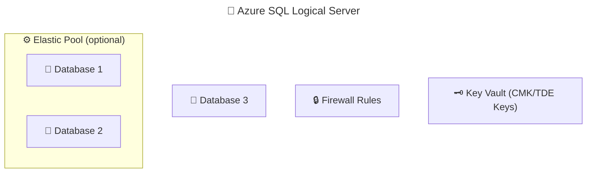
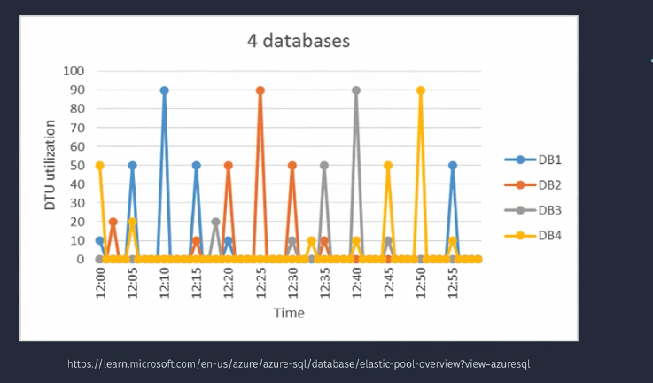
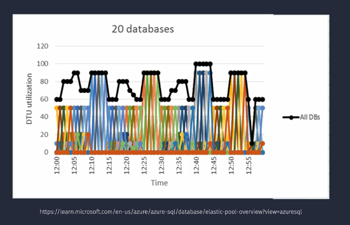

# 🧩 Azure SQL Logical Server & Elastic Pools

> 💡 _Think of the “SQL Server” in Azure as a smart container, not a physical box._

---

## 🧠 What Is an Azure SQL Logical Server?

The **Azure SQL Logical Server** is a **management container** for **one or more Azure SQL Databases** or **Elastic Pools**.

> ⚠️ It’s **not a real VM or SQL instance**.
> It’s a **logical layer** that provides centralized management for:
>
> - Authentication
> - Firewall rules
> - Auditing
> - Threat protection
> - Elastic pool management

---

### 🧱 Logical Structure

<div align="center" style="background-color: #1b3f47ff; border-radius: 10px;">



</div>

💬 So when you “create a SQL database” in Azure Portal, you’re actually:

- 1️⃣ Creating a **Logical Server** (if one doesn’t exist)
- 2️⃣ Then creating your **Database** under it

---

## 🧩 Logical Server Components

<div align="center" style="background-color: #1b3f47ff; border-radius: 10px;">

| Component                         | Description                                         |
| --------------------------------- | --------------------------------------------------- |
| 🪪 **Admin Login**                 | SQL or Azure AD admin for all DBs under this server |
| 🌐 **Server Name**                | DNS endpoint like `myserver.database.windows.net`   |
| 🔥 **Firewall Rules**             | Controls which IPs can connect                      |
| 🧾 **Auditing**                   | Centralized DB-level logs                           |
| 🛡️ **Microsoft Defender for SQL** | Centralized threat protection                       |
| 🧩 **Elastic Pools**              | Optional resource grouping for databases            |
| 🗝️ **Encryption Keys**            | Can integrate with Azure Key Vault for CMK          |

</div>

---

## ⚙️ Step-by-Step: Create Azure SQL Logical Server (Portal)

You’ll usually create it **while creating your first database**, but it can also be created separately.

### 1️⃣ Step — Go to Azure Portal

- Search for **SQL Server** → Click **Create**
- Or during database creation → “Create new server”

---

### 2️⃣ Step — Basics Tab

<div align="center" style="background-color: #1b3f47ff; border-radius: 10px;">

| Setting                    | Description                                            |
| -------------------------- | ------------------------------------------------------ |
| **Server Name**            | Globally unique name → `myserver.database.windows.net` |
| **Region**                 | Choose same region as databases                        |
| **Admin Login / Password** | SQL Authentication credentials                         |
| **Subscription / RG**      | Pick your Azure subscription and resource group        |

</div>

💡 _You can later add Azure AD admin for federated identity login._

---

### 3️⃣ Step — Networking Tab

<div align="center" style="background-color: #1b3f47ff; border-radius: 10px;">

| Setting               | Description                                                  |
| --------------------- | ------------------------------------------------------------ |
| **Connectivity**      | Public endpoint (default) or private endpoint (Private Link) |
| **Firewall Rules**    | Add client IP or allow Azure services                        |
| **Connection Policy** | Redirect (best performance) or Proxy                         |
| **VNet**              | Configure private endpoint for isolation                     |

</div>

💬 _For production: always prefer **Private Endpoint** over public IP._

---

### 4️⃣ Step — Security Tab

<div align="center" style="background-color: #1b3f47ff; border-radius: 10px;">

| Setting              | Description                               |
| -------------------- | ----------------------------------------- |
| **Defender for SQL** | Enable advanced threat protection         |
| **Auditing**         | Send logs to Log Analytics or Storage     |
| **Encryption**       | TDE enabled by default                    |
| **Key Management**   | Optionally integrate with Azure Key Vault |

</div>

---

### 5️⃣ Step — Review + Create

Validate and hit **Create**.
You now have your logical server ready to host databases and elastic pools.

---

## 🧭 How It Works

- All databases under the same logical server share:

  - Admin accounts
  - Firewall rules
  - Threat protection
  - Auditing configuration

- The server also acts as your **connection endpoint**:

  ```ini
  Server: myserver.database.windows.net
  Database: mydb
  Authentication: SQL / Azure AD
  ```

💬 It’s similar to an **instance container**, but **Azure manages the underlying compute** invisibly.

---

## 🧱 What Are Elastic Pools?

> 🧩 _Elastic Pools = Shared compute for multiple Azure SQL Databases._

Instead of giving every DB its own dedicated resources (vCores/DTUs),
you put them in an **elastic pool**, so they **share** CPU, memory, and I/O dynamically.

---

### ⚡ Why Elastic Pools Exist

Imagine you have 100 tenant databases, each used differently:

- Tenant A: Heavy load in morning
- Tenant B: Heavy load at night
  Buying 100 separate compute tiers = 🧨 expensive!

➡️ **Elastic Pools** let all databases share a single pool of compute and storage.
Azure automatically balances performance based on demand.

---

## 🧩 Elastic Pool Architecture

<div align="center" style="background-color: #242A3A ;border-radius: 10px;border: 2px solid white;">
  
</div>

- Without Elastic Pools

<div align="center" style="background-color: #242A3A;border-radius: 10px;border: 2px solid white;margin: 0 30px">
  
</div>

- With Elastic Pools

<div align="center" style="background-color: #242A3A;border-radius: 10px;border: 2px solid white;margin: 0 30px">
  
</div>

## ⚙️ How Elastic Pools Work

<div align="center" style="background-color: #1b3f47ff; border-radius: 10px;">

| Concept                     | Description                                      |
| --------------------------- | ------------------------------------------------ |
| **Shared Compute**          | Pool provides a common compute budget            |
| **Max/Min per DB**          | You can limit how much each DB consumes          |
| **Automatic Balancing**     | Azure dynamically distributes compute            |
| **Predictable Cost**        | You pay for the pool, not per DB                 |
| **Independent DB Settings** | Each DB still has its own schema, users, backups |

</div>

---

## 🧾 Step-by-Step: Create an Elastic Pool (Portal)

### 1️⃣ Step — Go to Azure Portal

Search → **SQL Elastic Pools** → Click **Create**

---

### 2️⃣ Step — Basics Tab

<div align="center" style="background-color: #1b3f47ff; border-radius: 10px;">

| Setting            | Description                 |
| ------------------ | --------------------------- |
| **Resource Group** | Choose existing or new      |
| **Logical Server** | Pick an existing SQL Server |
| **Pool Name**      | e.g., `tenantpool-eastus`   |
| **Region**         | Must match server region    |
| **Compute Model**  | DTU-based or vCore-based    |

</div>

---

### 3️⃣ Step — Configure Compute + Storage

<div align="center" style="background-color: #1b3f47ff; border-radius: 10px;">

| Option                      | Description                        |
| --------------------------- | ---------------------------------- |
| **Total vCores / eDTUs**    | Defines total capacity of the pool |
| **Max/Min per DB**          | Controls performance fairness      |
| **Storage Size**            | Default 256 GB, up to 4 TB         |
| **Auto-Scale (Serverless)** | Optional in vCore-based tier       |

</div>

💡 _vCore model supports General Purpose, Business Critical, and Hyperscale._

---

### 4️⃣ Step — Add Databases

You can:

- Add existing databases
- Create new databases directly into the pool

---

### 5️⃣ Step — Review + Create

Deploy your pool — Azure automatically configures resource sharing.

---

## 📈 Monitoring Elastic Pools

Azure provides built-in pool metrics:

- **CPU, storage, DTU usage**
- **Database-level usage graph**
- **Automatic tuning recommendations**

Navigate:

> `Azure Portal → SQL Server → Elastic Pools → Metrics`

---

## ⚙️ Scaling an Elastic Pool

You can scale **up/down** anytime:

- Increase/decrease total vCores
- Change max/min per DB
- Resize storage

💡 Scaling is **online**, with minimal impact.

---

## 🧠 Use Cases

<div align="center" style="background-color: #1b3f47ff; border-radius: 10px;">

| Scenario                  | Why Elastic Pool Fits                     |
| ------------------------- | ----------------------------------------- |
| 🧱 SaaS Multi-Tenant Apps | Many small DBs with variable usage        |
| 🕒 Time-based Workloads   | DBs active at different hours             |
| 💰 Cost Optimization      | Avoid overprovisioning                    |
| 🧮 Predictable Billing    | Fixed cost for many DBs                   |
| ⚡ Quick Scaling          | Dynamically scale pool instead of each DB |

</div>

---

## 🧩 Best Practices

<div align="center" style="background-color: #1b3f47ff; border-radius: 10px;">

| Area         | Recommendation                                    |
| ------------ | ------------------------------------------------- |
| **Workload** | Similar-sized databases benefit most              |
| **Limits**   | Set fair max/min limits to avoid “noisy neighbor” |
| **Scaling**  | Monitor usage and resize pool monthly             |
| **Backup**   | Uses same automatic backup policies               |
| **Security** | Same as logical server (firewall, AD, TDE)        |

</div>

---

## 📊 Elastic Pool vs Single Database

<div align="center" style="background-color: #1b3f47ff; border-radius: 10px;">

| Feature   | Elastic Pool                     | Single Database      |
| --------- | -------------------------------- | -------------------- |
| Compute   | Shared among DBs                 | Dedicated            |
| Cost      | Shared, fixed                    | Per DB               |
| Scaling   | Pool-level                       | DB-level             |
| Isolation | Logical only                     | Full                 |
| Ideal Use | Multi-tenant, variable workloads | Consistent workloads |

</div>

---

## 🧾 CLI Example

### 🧱 Create Logical Server

```bash
az sql server create \
  --name myserver123 \
  --resource-group myRG \
  --location eastus \
  --admin-user azureadmin \
  --admin-password MyP@ssword123
```

### ⚙️ Create Elastic Pool

```bash
az sql elastic-pool create \
  --name myelasticpool \
  --resource-group myRG \
  --server myserver123 \
  --edition GeneralPurpose \
  --capacity 4 \
  --max-size 100GB
```

### 📄 Create DB inside the Pool

```bash
az sql db create \
  --name tenantdb1 \
  --resource-group myRG \
  --server myserver123 \
  --elastic-pool myelasticpool
```

---

## 🧮 Cost Perspective

Elastic pools can **cut costs by 40–60%** for multiple small databases.

💬 _You pay for the pool, not for each DB instance individually._

---

## ✅ Summary Table

<div align="center" style="background-color: #1b3f47ff; border-radius: 10px;">

| Concept                 | Description                              |
| ----------------------- | ---------------------------------------- |
| **Logical Server**      | Centralized management for databases     |
| **Elastic Pool**        | Shared compute resource for multiple DBs |
| **Connection Endpoint** | `<servername>.database.windows.net`      |
| **Best For**            | Multi-tenant apps, shared workloads      |
| **Backup/HA**           | Automatic, same as individual DB         |
| **Scaling**             | Pool-level scaling, no downtime          |
| **Cost Model**          | Fixed pool cost, unlimited DBs inside    |

</div>
