# 💾 **Azure SQL Backup, Restore, and PITR (Point-in-Time Recovery)**

> “You don’t have a backup strategy until you’ve _successfully restored_ one.” – Every sane DBA ever 😅

---

## 🧭 Overview — Backup Philosophy in Azure SQL

Azure SQL backups are **automatic**, **continuous**, and **geo-redundant** — meaning you **don’t have to schedule anything manually** (unlike on-prem SQL Server).

Depending on the deployment type, backup behavior varies slightly:

<div align="center" style="background-color: #1b3f47ff; border-radius: 10px;">

| Deployment Type             | Backup Managed By | Backup Type                | Retention                |
| --------------------------- | ----------------- | -------------------------- | ------------------------ |
| **SQL Database (PaaS)**     | Azure             | Full, Differential, Log    | 7–35 days (configurable) |
| **SQL Managed Instance**    | Azure             | Full, Differential, Log    | 7–35 days (configurable) |
| **SQL Server on VM (IaaS)** | You               | Manual or via Azure Backup | Custom                   |

</div>

> 🚨 They’re stored in **RA-GRS storage** (Read-Access Geo-Redundant Storage), replicated across regions for disaster recovery.

## 📦 Backup Types

Azure SQL automatically performs **three** kinds of backups:

<div align="center" style="background-color: #1b3f47ff; border-radius: 10px;">

| Backup Type            | Frequency          | Purpose                                              |
| ---------------------- | ------------------ | ---------------------------------------------------- |
| 🧱 **Full**            | Every week         | Complete copy of the database                        |
| ⚙️ **Differential**    | Every 12 hours     | Captures only changed extents since last full backup |
| 🧾 **Transaction Log** | Every 5–10 minutes | Captures ongoing changes for PITR                    |

</div>

💡 You can’t directly access these backups, but you can use them **for restores** via Portal, CLI, PowerShell, or REST API.

---

## ⏱️ Backup Retention Policy

<div align="center" style="background-color: #1b3f47ff; border-radius: 10px;">

| Tier                                       | Retention      | Notes                |
| ------------------------------------------ | -------------- | -------------------- |
| **Basic**                                  | 7 days         | Fixed                |
| **Standard / Premium / Business Critical** | 7–35 days      | Configurable         |
| **Hyperscale**                             | 7–35 days      | Configurable         |
| **Long-Term Retention (LTR)**              | Up to 10 years | Manual configuration |

</div>

### 📊 Change Retention (Portal):

1. Go to **Azure Portal → SQL Database → Backups**
2. Select **Configure retention**
3. Choose a duration between **7–35 days**
4. Save ✅

---

## 🗄️ Long-Term Retention (LTR)

LTR keeps selected **weekly, monthly, or yearly** backups for long-term compliance (e.g., 7 years).

**Portal Steps:**

1. Go to **SQL Database → Backups**
2. Under **Long-term retention**, click **Configure**
3. Choose:

   - Retain **Weekly backup** for `x` weeks
   - Retain **Monthly backup** for `y` months
   - Retain **Yearly backup** for `z` years

4. Save ✅

**Backups are stored in Azure Blob Storage** (RA-GRS), separate from PITR backups.

---

## 🔁 Restore Types

Azure SQL supports several restore options depending on your need:

<div align="center" style="background-color: #1b3f47ff; border-radius: 10px;">

| Restore Type                     | Purpose                                              | Works For   |
| -------------------------------- | ---------------------------------------------------- | ----------- |
| **Point-in-Time Restore (PITR)** | Recover to any moment within retention               | SQL DB / MI |
| **Geo-Restore**                  | Restore from geo-replicated backup in another region | SQL DB / MI |
| **LTR Restore**                  | Restore from long-term backup                        | SQL DB only |
| **Manual Restore (VM)**          | Full restore from .bak or Azure Backup               | SQL on VM   |

</div>

---

### 🔹 1. Point-in-Time Restore (PITR)

**Portal Steps:**

1. Go to your **Azure SQL Database**
2. Click **Restore** (top toolbar)
3. Select:

   - **Point in time**: Choose exact date/time
   - **New DB name**: (e.g., `mydb-restore`)
   - **Target server** (optional)

4. Click **Review + Create**

⏱️ The restore creates a _new_ database with the same schema/data as it was at that time.

---

### 🔹 2. Geo-Restore (Cross-Region)

Used for **regional outages**.

**Portal Steps:**

1. Create a new SQL Database in **another region**
2. Choose **Backup source** = “Geo-restore”
3. Select your database backup from list
4. Review + Create ✅

💡 Restores from geo-replicated storage may take longer.

---

### 🔹 3. LTR Restore (Archived Backup)

**Portal Steps:**

1. Go to **SQL Server → Backups → Long-term retention**
2. Pick desired LTR backup
3. Click **Restore**
4. Choose target name & region
5. Confirm ✅

---

### 🔹 4. Restore Managed Instance (MI)

1. Navigate to **SQL Managed Instance → Backups**
2. Choose **Restore** → select **Point in time**
3. Enter target name
4. Start restore

Managed Instance restores are slower (minutes–hours), but include **system databases** and **SQL Agent jobs**.

---

## 💡 Full vs Incremental in Azure SQL

<div align="center" style="background-color: #1b3f47ff; border-radius: 10px;">

| Behavior                         | Explanation                                                       |
| -------------------------------- | ----------------------------------------------------------------- |
| **Full backups**                 | Complete copy (weekly)                                            |
| **Differential backups**         | Track _changed extents_ since last full backup                    |
| **Transaction log backups**      | Capture real-time changes for PITR                                |
| **Incremental at storage level** | Azure Storage handles internal block deduplication, reducing cost |

</div>

> **Important:**  
> Azure SQL **automatically chains** backups together — you don’t manage differential files.
> During restore, Azure automatically reconstructs the exact state from the needed full + differential + log backups.

---

## ☁️ Backup Storage Location

<div align="center" style="background-color: #1b3f47ff; border-radius: 10px;">

| Backup Type      | Storage Location              | Notes                           |
| ---------------- | ----------------------------- | ------------------------------- |
| **PITR backups** | Azure Blob Storage (RA-GRS)   | Managed by Azure SQL service    |
| **LTR backups**  | Azure Blob Storage (RA-GRS)   | Separate retention              |
| **VM backups**   | Azure Recovery Services Vault | Managed by user or Azure Backup |

</div>

📦 **RA-GRS = Read Access Geo-Redundant Storage**  
→ Primary + Secondary region copies for durability.

---

## ⚙️ Automating Backup Policies (CLI Example)

### 🔹 View backup retention:

```bash
az sql db show --resource-group MyRG --server my-sql-server --name mydb --query "requestedBackupStorageRedundancy"
```

### 🔹 Set backup redundancy (e.g., ZRS):

```bash
az sql db update \
  --resource-group MyRG \
  --server my-sql-server \
  --name mydb \
  --backup-storage-redundancy Zone
```

### 🔹 Configure LTR policy:

```bash
az sql db ltr-policy set \
  --resource-group MyRG \
  --server my-sql-server \
  --name mydb \
  --weekly-retention P12W \
  --monthly-retention P12M \
  --yearly-retention P5Y
```

---

## 🧩 Diagram — Azure SQL Backup Flow

```mermaid
flowchart TD
    A["🧠 SQL Database"] -->|Automatic Full / Diff / Log| B["💾 Azure Storage (RA-GRS)"]
    B --> C["⏱️ PITR Backups (7–35 days)"]
    B --> D["📦 LTR Backups (up to 10 years)"]
    C --> E["♻️ Point-in-Time Restore"]
    D --> F["🌍 LTR Restore or Geo-Restore"]
```

<div align="center" style="background-color: #1b3f47ff; border-radius: 10px;">



</div>

---

## 🧠 Key Takeaways

<div align="center" style="background-color: #1b3f47ff; border-radius: 10px;">

| Feature      | SQL DB          | SQL MI          | SQL VM                |
| ------------ | --------------- | --------------- | --------------------- |
| Auto Backup  | ✅              | ✅              | ❌ (manual)           |
| PITR         | ✅              | ✅              | ❌                    |
| Geo-Restore  | ✅              | ✅              | ✅ (via Azure Backup) |
| LTR          | ✅              | ❌              | ❌                    |
| Storage Type | RA-GRS          | RA-GRS          | Vault / Custom        |
| Encryption   | Always-on (TDE) | Always-on (TDE) | Configurable          |

</div>

---

## ✅ Summary

- Azure SQL automatically handles **full, differential, and log backups**
- PITR allows restoring to **any minute** within retention
- Backups stored in **RA-GRS storage** for resilience
- **LTR extends** backups up to **10 years**
- SQL VMs require **manual configuration via Azure Backup**
