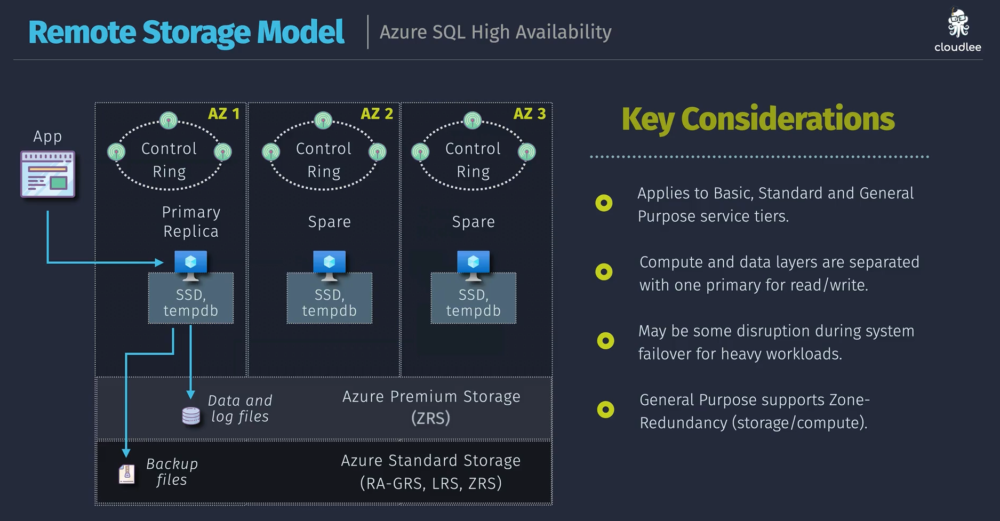
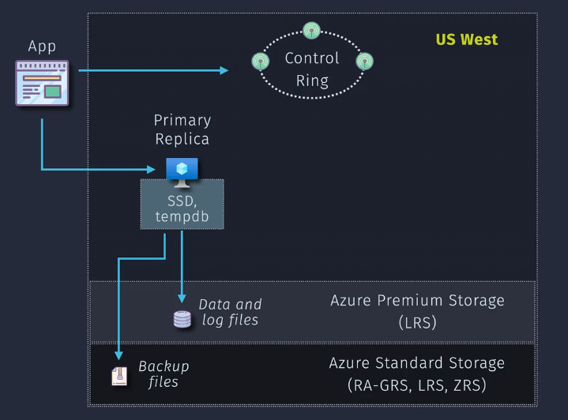
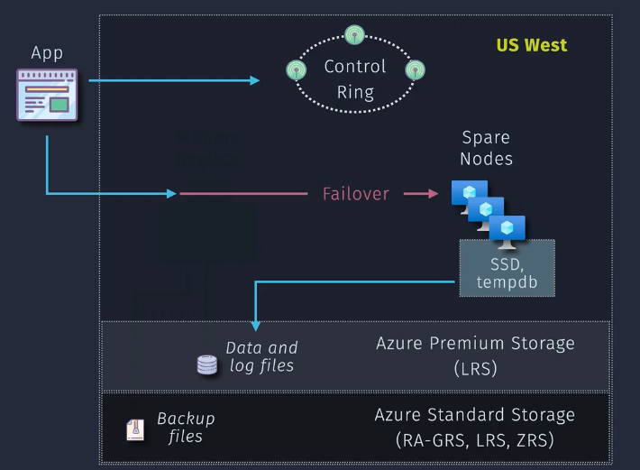
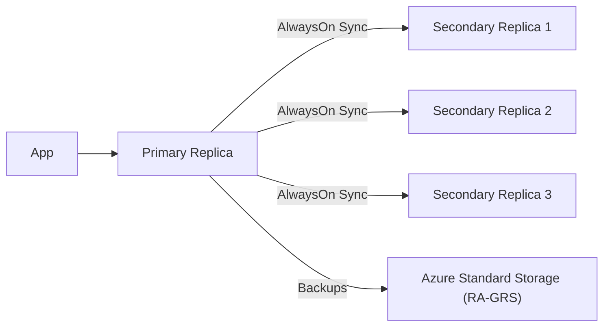
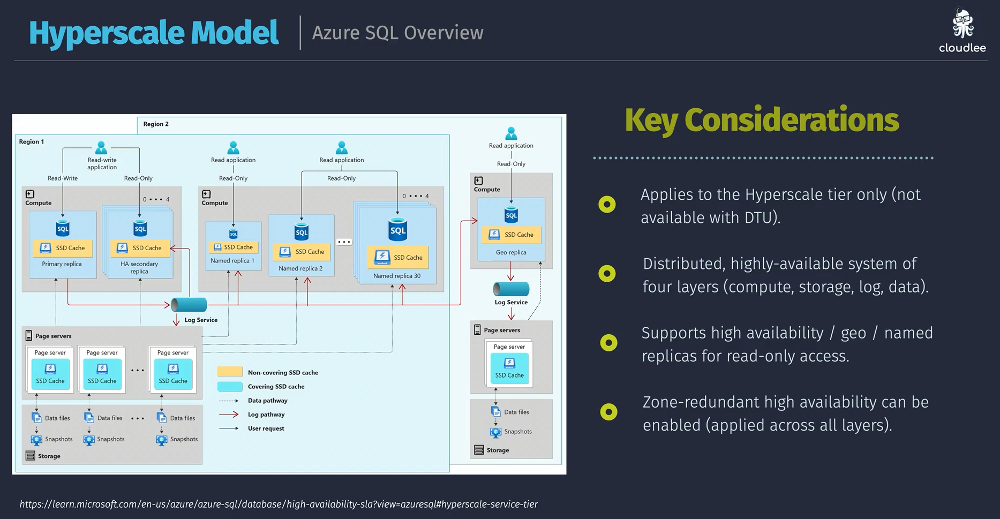
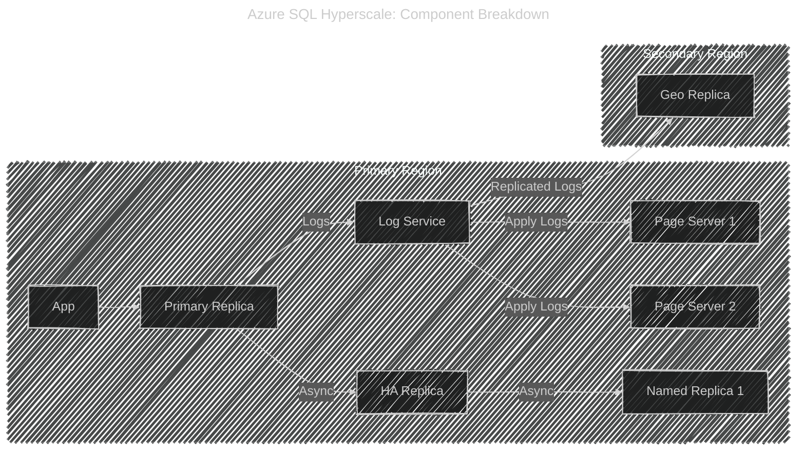

# ⚙️ Azure SQL High Availability Architecture Models

Azure SQL offers **three main HA architecture models**, depending on the **service tier**:

| Model                       | Service Tiers                    | Storage Type                   | Replication                       | Read Replicas                              | Example               |
| --------------------------- | -------------------------------- | ------------------------------ | --------------------------------- | ------------------------------------------ | --------------------- |
| 🛰️ **Remote Storage Model** | Basic, Standard, General Purpose | Azure Premium/Standard Storage | Remote (data/log stored remotely) | ❌ No read replicas                        | Lower-cost workloads  |
| 💾 **Local Storage Model**  | Premium, Business Critical       | Local SSD                      | AlwaysOn Availability Group       | ✅ Yes (sync secondary for read scale-out) | Mission-critical OLTP |
| 🧠 **Hyperscale Model**     | Hyperscale tier only             | Distributed Page Servers       | Async replication via log service | ✅ Yes (many read-only replicas)           | Very large databases  |

---

## 1️⃣ Remote Storage Model (General Purpose Tier)

📍 **Used by:** Basic, Standard, and General Purpose service tiers

  

### 🧩 Architecture Highlights

- **Compute and storage are separated.**
- The **primary replica** handles read/write requests.
- **Data/log files** are stored remotely on Azure Premium Storage.
- During a **failover**, a new compute replica attaches the **same remote storage**.

### 🔄 How Failover Works

- Stable

    

      
    

- Failure

    

      
    

| Step | Description                                               |
| ---- | --------------------------------------------------------- |
| 1️⃣   | Primary replica fails (e.g., due to host crash).          |
| 2️⃣   | Azure SQL automatically reassigns a standby compute node. |
| 3️⃣   | The new node **mounts the same remote data/log files**.   |
| 4️⃣   | Recovery occurs quickly (no data copy needed).            |

### ⚡ Pros

- Low-cost architecture
- Fast restart using same storage
- Simpler to scale compute (independent of data layer)

### ⚠️ Cons

- Data I/O latency slightly higher (remote storage access)
- Failover causes **brief downtime** (no in-memory replica)
- **No read replicas** for scale-out

---

## 2️⃣ Local Storage Model (Business Critical Tier)

📍 **Used by:** Premium and Business Critical service tiers

  

### 🧩 Architecture Highlights

- **Compute and data are co-located** (local SSD for data/log/tempdb).
- Uses **AlwaysOn Availability Groups** for synchronous replication.
- Provides **up to 4 replicas** (1 primary + 3 secondaries).
- One replica can be used for **read scale-out**.

### 🔄 Failover Flow

| Step | Description                                                 |
| ---- | ----------------------------------------------------------- |
| 1️⃣   | Primary node fails.                                         |
| 2️⃣   | Synchronous secondary immediately promoted (no data loss).  |
| 3️⃣   | DNS or connection string rerouted to new primary.           |
| 4️⃣   | New secondary automatically created to maintain redundancy. |

### ⚙️ Characteristics

| Property      | Detail                            |
| ------------- | --------------------------------- |
| Write replica | Only one primary (write master)   |
| Read replicas | Up to 3 (sync secondary replicas) |
| Replication   | Synchronous (HA zone)             |
| Recovery      | Instant (<10s typical)            |
| Local storage | SSD – provides high IOPS          |

### ⚡ Pros

- Zero data loss (synchronous replication)
- Read-scale via secondary replica
- Excellent latency (local SSD)

### ⚠️ Cons

- More expensive
- Compute + data tied (harder to separate scaling)

---

## 3️⃣ Hyperscale Model

📍 **Used by:** Hyperscale tier only

  

---

### 🧩 Architecture Highlights

- **Fully distributed system** — separates compute, log, and data.
- Each component (compute, log, page server) scales independently.
- Supports **multiple read-only replicas** (Named or Geo replicas).
- Storage backed by **page servers** holding database pages + snapshots.

### 🧠 Key Components

| Component                | Role                                        |
| ------------------------ | ------------------------------------------- |
| **Primary replica**      | Handles all writes and read/writes          |
| **HA secondary replica** | Hot standby for quick failover              |
| **Named replicas**       | Read-only replicas for scale-out            |
| **Page servers**         | Store 128MB data pages with local SSD cache |
| **Log service**          | Coordinates log commits and propagation     |

### 🔄 Failover Behavior

- HA replica promoted **instantly** if primary fails.
- Page servers already synced via log service.
- Read replicas continue serving queries with minimal disruption.

### ⚡ Pros

- Horizontal scale to **100+ TB databases**
- Multiple read-only replicas
- Fast restore & backups using snapshots
- Ideal for **large analytical or hybrid workloads**

### ⚠️ Cons

- Slight write latency (due to distributed log coordination)
- Higher cost

---

## 🧠 Summary Table

| Model          | Tier              | Data Location          | Replication             | Read Replicas | Failover Type       | Use Case                      |
| -------------- | ----------------- | ---------------------- | ----------------------- | ------------- | ------------------- | ----------------------------- |
| Remote Storage | General Purpose   | Remote (Azure Storage) | None (single data copy) | ❌            | Attach to same data | Cost-effective workloads      |
| Local Storage  | Business Critical | Local SSD              | Synchronous AlwaysOn    | ✅ 1–3        | Instant             | Low-latency, mission-critical |
| Hyperscale     | Hyperscale        | Page Servers           | Asynchronous            | ✅ Multiple   | Near-instant        | Massive DB, read-heavy        |

---

## 🧭 Key Takeaways

- Azure SQL **always has only one write replica** — multi-write is **not supported**.
- **Read replicas** are:

  - Synchronous for **Business Critical**
  - Asynchronous for **Hyperscale**

- **Failover** is automatic and zone-redundant in Premium tiers.
- **Remote storage** model prioritizes **durability**, while **local storage** model prioritizes **performance**.
