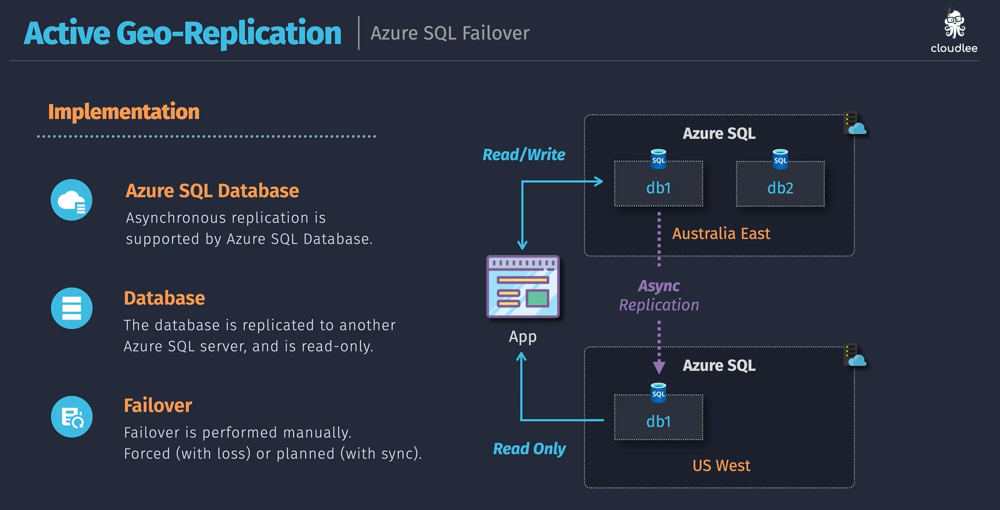
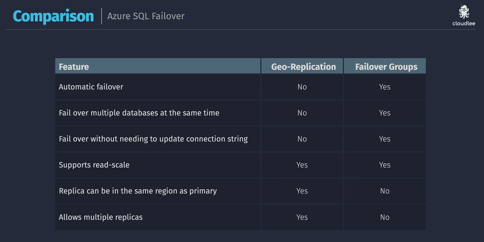

# 🌍 Azure SQL Failover

Let’s explain **both mechanisms** — step by step — in your preferred structured, human-friendly, exam-ready style.

---

## 1️⃣ Active Geo-Replication (per database)

### 💡 Concept

- **Feature of:** **Azure SQL Database (PaaS)** — NOT Managed Instance.
- **Purpose:** Provide **geo-redundancy** and **manual failover** capability for _individual_ databases.
- **Replication Type:** **Asynchronous** (so minor data loss may occur during disaster).
- **Scope:** Database-level (each database is replicated separately).

---

### ⚙️ How It Works

  

1. You have a **primary database** (e.g., `db1`) in `Australia East`.
2. Azure SQL automatically performs **asynchronous replication** to up to **4 secondary databases** (in other regions like `US West`).
3. Those secondaries are **read-only** — great for offloading reporting workloads.
4. Applications connect to **primary for writes**, and optionally to **read replicas** for read-only queries.

---

### 🔄 Failover

- **Manual process**, initiated by you.
- **Two types of failover:**

  - **Forced failover** → immediate but may cause **data loss** (async replication not caught up).
  - **Planned failover** → no data loss (Azure syncs before switching).

- After failover → the **secondary becomes the new primary**, and replication direction reverses.

---

### ✅ Use Case

- Multi-region DR setup where you control failover timing.
- Apps that need **read scale-out** (e.g., analytics).
- Suitable when your app can tolerate **some downtime and small data loss**.

---

### 🚫 Limitations

- Database-level only (not for entire server).
- Manual failover.
- Requires app to manage connection string switching.

---

## 2️⃣ Auto-Failover Groups (server-level, managed failover)

### 💡 Concept

- **Feature of:**

  - Azure SQL Database (multiple DBs)
  - Azure SQL Managed Instance

- **Purpose:** Provide **automatic** DR between **two servers** (primary + secondary).
- **Replication Type:** **Asynchronous**, same as geo-replication.
- **Scope:** Server-level (can include multiple DBs in one failover group).

---

### 🧠 Architecture Overview

  

---

### ⚙️ Components

| Component                   | Description                                                               |
| --------------------------- | ------------------------------------------------------------------------- |
| **Failover Group**          | Logical group linking primary & secondary servers.                        |
| **Databases**               | One or many databases included (replicated together).                     |
| **Failover Group Listener** | A special DNS endpoint — automatically points to the **current primary**. |
| **Failover Policy**         | Configurable: automatic (for outages) or manual (for maintenance).        |

---

### 🔁 Failover Behavior

- **Automatic or manual failover** handled by Azure.
- Application connects via **listener** — no connection string change needed.
- When failover happens:

  - Secondary becomes new primary.
  - Listener updates automatically.
  - Replication reverses direction.

- **No data loss** if planned; **possible minimal loss** in unplanned outage (async replication).

---

### ✅ Use Case

- Mission-critical workloads needing **zero operational intervention**.
- Multi-DB apps where **consistency between DBs** matters.
- Apps that must auto-recover from regional outages.

---

## 🔚 **Summary**

| Feature           | Active Geo-Replication        | Auto-Failover Group                   |
| ----------------- | ----------------------------- | ------------------------------------- |
| **Scope**         | Per database                  | Multiple databases or server          |
| **Failover Type** | Manual                        | Automatic or manual                   |
| **Replication**   | Asynchronous                  | Asynchronous                          |
| **Listener**      | None (you manage connections) | Built-in listener (auto redirect)     |
| **Use Case**      | Custom DR, read-scale         | Full server DR, automatic recovery    |
| **Applies to**    | Azure SQL Database            | Azure SQL Database & Managed Instance |

### 📈 Scaling Behavior:

- **Writes:** Always to primary only (no multi-write).
- **Reads:**

  - Active Geo-Replication → up to 4 readable secondaries.
  - Auto-Failover Group → one readable secondary (the paired server).

- Both use **async replication**, so **read replicas are slightly behind**.
- For **write scaling**, you must use sharding (app-level partitioning), not Azure SQL replication.

---

  

