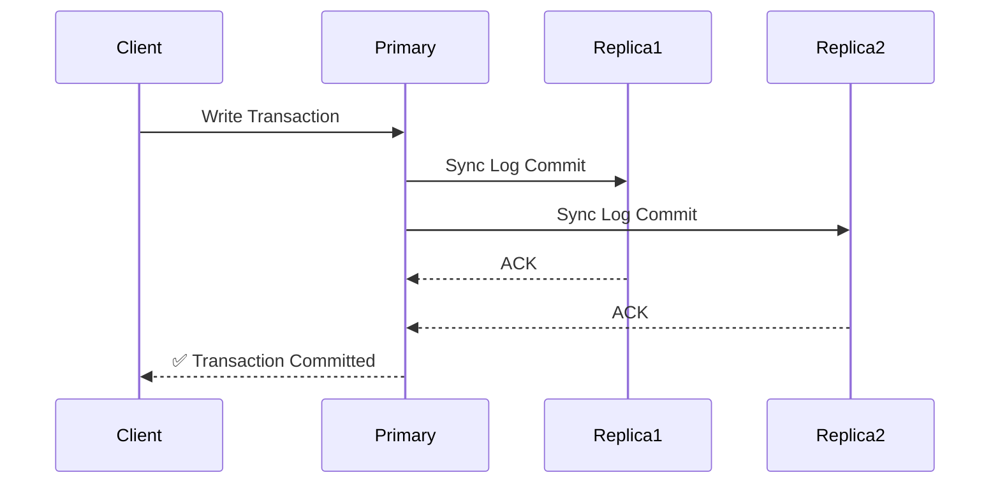
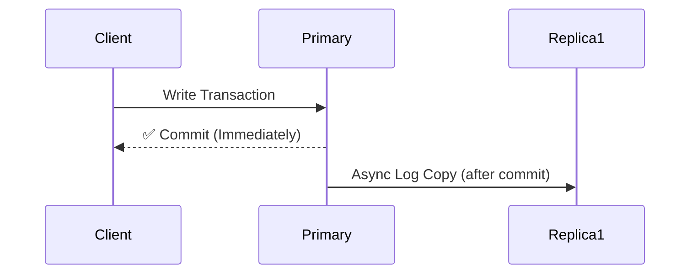

# 🧠 Understanding Read vs Write Scaling in Azure SQL

Azure SQL uses a **primary-replica model** — meaning:

✅ **Only one node** can perform writes (the _primary_).
✅ **Multiple replicas** can perform reads (read scale-out).

Let’s now break down _why_ this is the case and how it works for each architecture.

---

## ⚙️ Write Operations — Always Centralized

All **write (INSERT, UPDATE, DELETE)** requests always go through the **Primary Replica**.
That’s because Azure SQL preserves **ACID consistency** — so there must be **one true source of data**.

If multiple nodes accepted writes concurrently, you’d face:

- Conflicts (row versions mismatch)
- Divergent transaction logs
- Data inconsistency across replicas

Hence:
🧱 **Write scaling = scale vertically (add more vCores)**, not horizontally.

---

## 🧩 Read Replicas — Read-Scale Behavior

| Tier                      | Replica Type     | Purpose             | Readable?              | Replication Mode |
| ------------------------- | ---------------- | ------------------- | ---------------------- | ---------------- |
| **General Purpose**       | None             | Single compute node | ❌                     | —                |
| **Business Critical**     | 3 replicas       | HA + Read Scale-Out | ✅ (readable)          | **Synchronous**  |
| **Hyperscale**            | 4 replicas       | Read Scale-Out + HA | ✅ (readable)          | **Asynchronous** |
| **Managed Instance (BC)** | 1 replica        | HA + Read Scale-Out | ✅ (readable)          | **Synchronous**  |
| **SQL on VM (Always On)** | Up to 8 replicas | HA + DR             | ✅ (depends on config) | Sync or Async    |

---

## ⚡ Synchronous vs Asynchronous Replication

Let’s visualize this difference:

### 🟢 **Synchronous Replication** (Business Critical, Managed Instance BC)



🧩 **Meaning:**

- Transaction is committed only after **replicas confirm** the write.
- Guarantees **zero data loss** (RPO = 0).
- Slightly increases write latency.
- Used for **high availability** inside the same region.

---

### 🟣 **Asynchronous Replication** (Hyperscale)



🧩 **Meaning:**

- Writes commit instantly on the primary.
- Data is later pushed to replicas (eventual consistency).
- Much faster writes.
- Used for **read scalability** and **cross-region DR**.

---

## 🧱 Replica Roles

| Replica Type           | Can Read? | Used for HA? | Description                                  |
| ---------------------- | --------- | ------------ | -------------------------------------------- |
| **Readable Secondary** | ✅        | ✅           | Handles read workloads and can auto-failover |
| **Standby Secondary**  | ❌        | ✅           | Passive; used only for failover              |
| **Geo-Replica**        | ✅        | ✅ (DR only) | In another region, asynchronously updated    |

💡 In Business Critical / Hyperscale tiers, replicas are **readable secondaries**, meaning they **actively serve reads** and also **stand ready to take over** if the primary fails.

So they’re not _just_ “standby” — they’re **read + standby** at once.

---

## 🧮 Read Scale-Out — Developer View

You can connect your app to replicas using a special connection string:

```text
Server=tcp:myserver.database.windows.net;
Database=mydb;
ApplicationIntent=ReadOnly;
```

✨ Azure SQL’s internal routing engine automatically sends your query to a **readable secondary**.

Use it for:

- BI/analytics queries
- Reports
- Dashboard refreshes

Not for:

- Writes or stored procs that modify data

---

## ⚙️ Summary Table

| Operation           | Primary | Secondary (Readable) | Replication           | Scaling Method          |
| ------------------- | ------- | -------------------- | --------------------- | ----------------------- |
| **Write**           | ✅      | ❌                   | Synchronous           | Vertical scale (vCores) |
| **Read (BC/HS)**    | ✅      | ✅                   | Sync (BC), Async (HS) | Horizontal scale-out    |
| **Failover**        | ✅      | ✅                   | Automatic             | Managed by Azure        |
| **Multi-Region DR** | ❌      | ✅ (Geo-Replica)     | Async                 | Manual promotion        |

---

## 💡 Think of it Like This

Imagine a **restaurant kitchen** analogy 🍽️:

| Role                   | What it Does                           | Analogy     |
| ---------------------- | -------------------------------------- | ----------- |
| **Primary Replica**    | Handles all cooking (writes)           | The Chef    |
| **Read-Only Replicas** | Serve food to customers (reads)        | The Waiters |
| **Standby Replica**    | Backup chef — steps in if Chef is sick | HA Replica  |

Only **one chef** can actually cook (write).
Multiple **waiters** can serve food (reads).

---

## 🧠 Quick Memory Recap

| Concept            | Meaning                                |
| ------------------ | -------------------------------------- |
| **No multi-write** | Only 1 active writer (primary replica) |
| **Read replicas**  | Always-on, read + standby              |
| **Synchronous**    | Real-time mirror, zero data loss       |
| **Asynchronous**   | Fast writes, eventual sync             |
| **Scale reads**    | Horizontally via replicas              |
| **Scale writes**   | Vertically (more cores)                |

---

✅ **In short:**

> Azure SQL = _One boss for writes, many helpers for reads._
> Write = Synchronous + Consistent
> Read = Scalable + Isolated
