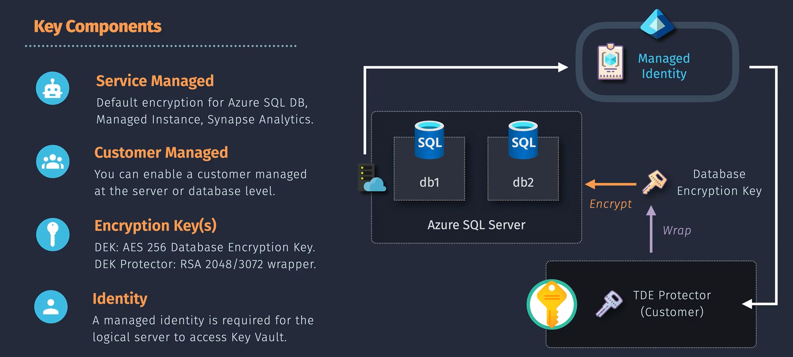
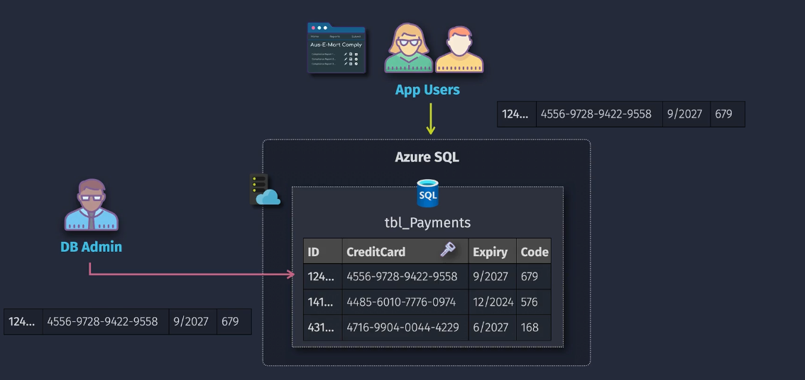
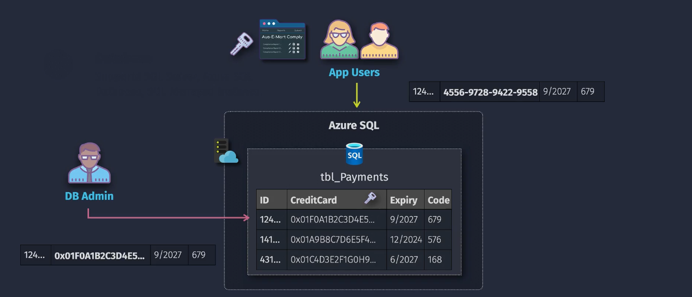
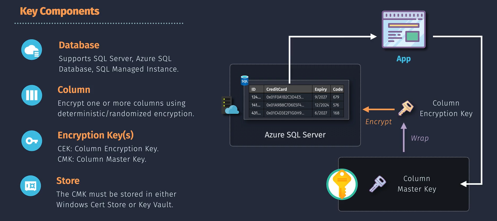
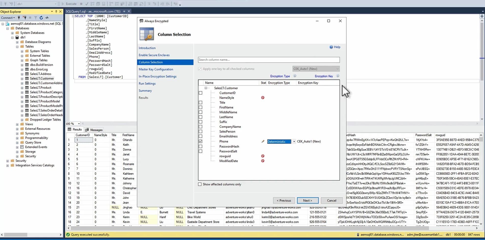
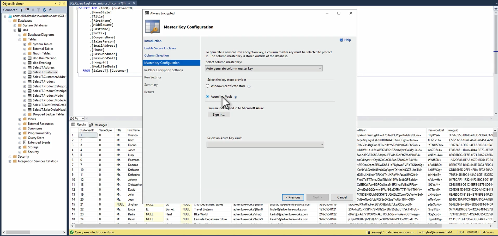
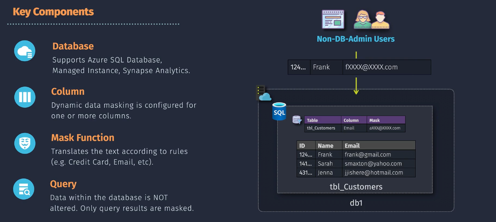
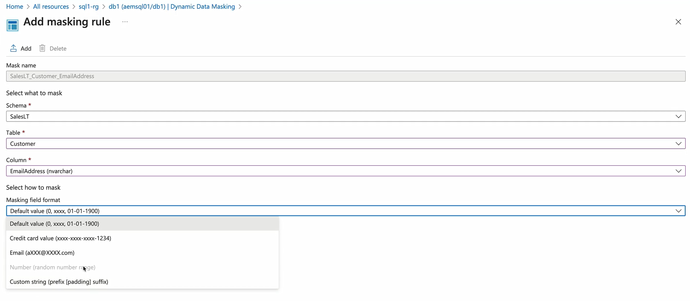
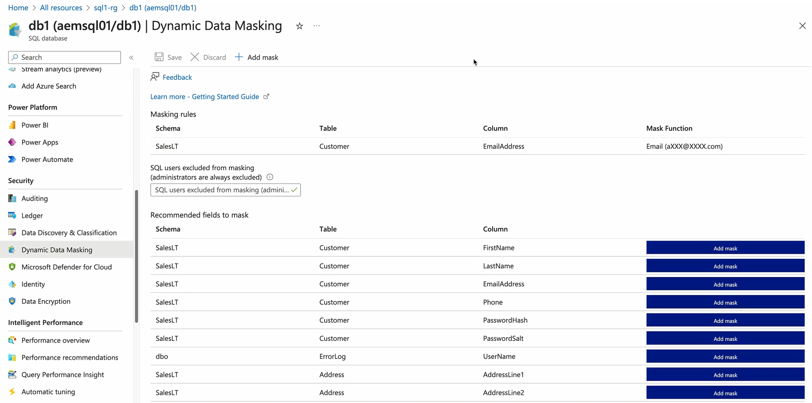
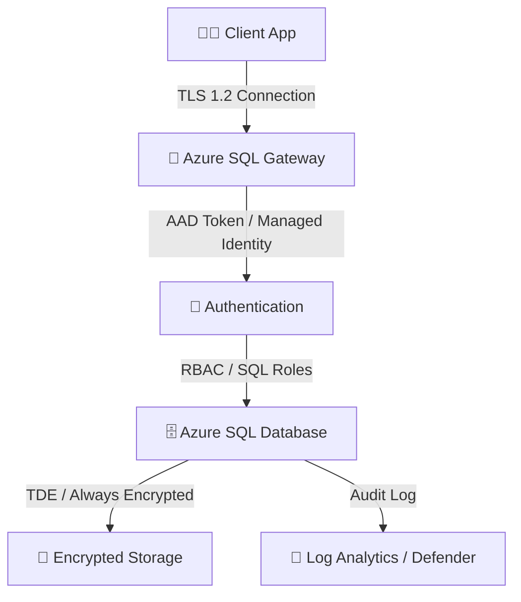

# 🔐 **Azure SQL Security & Encryption**

> “Security is not a feature — it’s a lifestyle.”  
> Azure SQL was designed with _defense-in-depth_, protecting your data from the network layer all the way to the cell values in a table.

---

## 🧭 **Overview** — Azure SQL Security Layers

Azure SQL follows **7 layers of security**, from the outer perimeter (network) to inner data (encryption):

| Layer                | Feature                         | Purpose                           |
| -------------------- | ------------------------------- | --------------------------------- |
| 🔒 Network           | Firewall, Private Link          | Restrict who can connect          |
| 🧑 Identity          | AAD, SQL Auth, Managed Identity | Authenticate securely             |
| 🧩 Access Control    | RBAC, Database Roles            | Authorize users & apps            |
| 🧠 Auditing          | Logs, Alerts                    | Track who did what                |
| 🛡️ Threat Protection | Defender for SQL                | Detect suspicious activity        |
| 🔐 Encryption        | TDE, Always Encrypted           | Protect data at rest & in transit |
| 💾 Backup Security   | Encrypted backups               | Protect stored copies             |

---

## 🧱 **Network-Level Security**

### 🔸 1. Azure SQL Firewall

- Default: **DENY ALL** connections.
- You must explicitly allow:
    - **Client IP ranges**
    - **Azure services (optional toggle)**

- Managed in:
    - **SQL Server (Logical Server) → Networking → Firewall and virtual networks**

📍 **Portal Path:**
`Azure Portal → SQL Server → Networking → Firewall rules`

**Best practice:**
Only open specific IP ranges. Avoid “Allow Azure services” unless necessary.

---

### 🔸 2. Private Link (Private Endpoint)

Private Link = Connect privately using **your VNet’s private IP**, avoiding public internet.

**Setup (Portal):**

1. Go to **SQL Server → Networking → Private endpoint connections**
2. Click **+ Private endpoint**
3. Select:
    - Target SQL resource (server or MI)
    - VNet + Subnet
    - DNS integration

4. Approve the connection ✅

🔒 Result:
Traffic never leaves your VNet; it goes over **Microsoft’s backbone** instead of public IPs.

---

## 🧑‍💻 **Authentication Options**

Azure SQL supports multiple authentication methods:

| Method                      | Description                      | Best For                   |
| --------------------------- | -------------------------------- | -------------------------- |
| **SQL Authentication**      | Username + password              | Legacy apps                |
| **Azure AD Authentication** | Use AAD tokens                   | Modern apps / SSO          |
| **Managed Identity**        | Use system-assigned AAD identity | Apps in Azure (no secrets) |

---

### 🔸 1. Azure AD Authentication Setup

**Portal Steps:**

1. Go to **SQL Server → Active Directory admin**
2. Click **Set admin**
3. Select an **AAD user or group**
4. Save ✅

**Effect:**  
That user can log in with AAD credentials via Azure Data Studio, SSMS, CLI, etc.

> 🚨 `_Only one AAD admin can be configured per server, but multiple users/groups can have AAD access inside the database._`

---

### 🔸 2. Managed Identity Authentication

If your app runs in Azure (e.g., App Service or Function):

1. Enable **System-assigned Managed Identity** on the app.
2. In SQL DB → Run SQL script as admin:

    ```sql
    CREATE USER [myapp] FROM EXTERNAL PROVIDER;
    ALTER ROLE db_datareader ADD MEMBER [myapp];
    ALTER ROLE db_datawriter ADD MEMBER [myapp];
    ```

3. In connection string (App Service), set:

    ```ini
    Authentication=Active Directory Managed Identity
    ```

No passwords needed 🔥

---

## 🧩 **Access Control** (Authorization)

### 🔸 1. Database-Level Roles:

| Role                 | Permission                   |
| -------------------- | ---------------------------- |
| **db_owner**         | Full control                 |
| **db_datareader**    | Read-only                    |
| **db_datawriter**    | Write-only                   |
| **db_ddladmin**      | Schema changes               |
| **db_securityadmin** | Manage roles and permissions |

### 🔸2. Server-Level Roles (MI / SQL VM):

| Role              | Permission                       |
| ----------------- | -------------------------------- |
| **serveradmin**   | Manage server-wide configuration |
| **securityadmin** | Manage logins and permissions    |
| **setupadmin**    | Add/remove linked servers        |

---

## 🧠 **Auditing & Logging**

Azure SQL lets you track every access, query, and change.

### 🔹 1. SQL Auditing

- Captures DB events (logins, schema changes, queries)
- Sends logs to:
    - Azure Storage
    - Log Analytics
    - Event Hubs

**Enable in Portal:**

1. Go to **SQL Server → Auditing**
2. Toggle **Enable auditing**
3. Choose destination
    - ✅ Storage (default)
    - ✅ Log Analytics (for monitoring)

4. Save

📄 Log data: `.xel` format (can query via Log Analytics)

---

### 🔹 2. Defender for SQL (Advanced Threat Protection)

**Detects & alerts** on:

- SQL injection attempts
- Abnormal data access
- Brute-force login attempts
- Privilege escalation

**Enable in Portal:**

1. SQL Server → **Microsoft Defender for Cloud**
2. Enable Defender plan
3. Set alert email or Security Center integration

💡 Alerts are sent within minutes of suspicious behavior.

---

## 🔐 **Encryption Everywhere**

### 🧱 1. Encryption in Transit (TLS)

- All connections use **TLS 1.2+**
- You can enforce “Encrypt = True” in connection strings.

---

### 🧱 2. Encryption at Rest — `TDE`

**Transparent Data Encryption (TDE)** automatically encrypts:

- Data files
- Logs
- Backups

> 🧠 Default: **Enabled by default** on all new SQL databases.

**How it Works:**

- Uses a **Database Encryption Key (DEK)** stored in the database
- DEK is protected by a **server certificate**
- Optionally, you can use a **Customer-Managed Key (CMK)** in Azure Key Vault for more control

<div align="left">
  
</div>

**Types of Keys:**

| Key Type                   | Managed By        |
| -------------------------- | ----------------- |
| Service-managed key (SMK)  | Azure (default)   |
| Customer-managed key (CMK) | Your Key Vault 🔑 |

**Portal Steps (for CMK):**

1. Go to **SQL Server → Transparent data encryption**
2. Choose **Customer-managed key**
3. Select your Key Vault + key
4. Save ✅

---

### 🧱 3. Encryption at Column Level — `Always Encrypted`

**What is it?**

- Encrypts **sensitive columns** (e.g., SSN, credit card)
- Data stays encrypted even for DB admins
- Decryption happens only in the **client app**
- Without Always Encrypted:

<div align="left">
  
</div>

- With Always Encrypted:

<div align="left">
  
</div>

**How it Works:**

- Two types of keys:
    - **Column Encryption Key (CEK)**: Encrypts the data in the column
    - **Column Master Key (CMK)**: Encrypts the CEK, stored in Azure Key Vault
- first, the client app fetches the CMK from Key Vault
- then, it decrypts the CEK
- finally, it uses the CEK to encrypt/decrypt column data

<div align="left">
  
</div>

**Setup:**

1. Create CMK in Azure Key Vault
2. Create CEK in SQL DB, linked to CMK
3. Configure columns to use Always Encrypted

<div align="left">
  
</div>

<div align="left">
  
</div>

**Notes:**

- Client app must handle encryption/decryption
- Requires SQL client that supports Always Encrypted (SSMS / .NET)

---

## 👺 **Dynamic Data Mask**

### **What is it?**

**DDM is a policy-based security feature** that hides sensitive data in query results based on user roles. It’s useful for protecting PII (e.g., emails, SSNs, phone numbers) from developers, analysts, or support staff who don’t need full access.

- Masks sensitive data in query results
- Users see masked data unless they have UNMASK permission
- Example: `123-45-6789` becomes `XXX-XX-6789`

### **How it Works:**

1. Define mask on column (e.g., Default, Email, Random)
2. Users without UNMASK see masked data
3. Users with UNMASK see full data

<div align="left">
  
</div>

---

### ⚙️ How to Implement DDM in Azure SQL

#### ✅ Option 1: **Using Azure Portal**

1. **Go to your SQL Database** in the Azure Portal.
2. Under **Security**, click **Dynamic Data Masking**.
3. Review recommended columns for masking.
4. Click **Add Mask** to apply a masking function:
    - Default
    - Email
    - Custom string
    - Number
    - Date
5. Click **Save** to apply the policy.

<div align="left">
  
</div>

<div align="left">
  
</div>

#### ✅ Option 2: **Using T-SQL**

You can define masking rules directly in SQL:

```sql
ALTER TABLE Customers
ALTER COLUMN EmailAddress ADD MASKED WITH (FUNCTION = 'email()');

ALTER TABLE Customers
ALTER COLUMN PhoneNumber ADD MASKED WITH (FUNCTION = 'default()');
```

To view masked data:

- Create a user with read-only access:

```sql
CREATE LOGIN testuser WITH PASSWORD = 'StrongPassword123!';
CREATE USER testuser FOR LOGIN testuser;
ALTER ROLE db_datareader ADD MEMBER testuser;
```

- When `testuser` queries the table, masked values like `XXXX@XXXX.com` or `000-000-0000` will appear.

---

### 🧪 Masking Functions

| Function    | Description                                     |
| ----------- | ----------------------------------------------- |
| `default()` | Masks based on data type (e.g., `XXXX`, `0`)    |
| `email()`   | Masks email addresses                           |
| `random()`  | Replaces numeric values with random numbers     |
| `custom()`  | Shows partial string (e.g., `prefixXXXXsuffix`) |
| `partial()` | Masks part of the string                        |

---

### 👥 Excluding Users from Masking

Admins and privileged users (e.g., `db_owner`, `sysadmin`, Azure AD admin) see unmasked data. You can also explicitly exclude users:

```sql
GRANT UNMASK TO testuser;
```

### ⚠️ **Notes:**

- Easy to implement, no app changes needed
- Not a replacement for encryption, just an additional layer

---

## 🛡️ **Security Flow Diagram**

<div align="center" style="background-color: #262525ff; border-radius: 20px; ">


```mermaid
flowchart TD
    A["👩‍💻 Client App"] -->|TLS 1.2 Connection| B["🔐 Azure SQL Gateway"]
    B -->|AAD Token / Managed Identity| C["🧠 Authentication"]
    C -->|RBAC / SQL Roles| D["🗄️ Azure SQL Database"]
    D -->|TDE / Always Encrypted| E["💾 Encrypted Storage"]
    D -->|Audit Log| F["📜 Log Analytics / Defender"]
```

</div>

---

## 🧮 **Backup Security**

Azure SQL backups are:

- Automatically encrypted (with TDE key)
- Stored in **RA-GRS storage**
- Restorable cross-region if needed

---

## 🧰 **Security Hands-On** (Portal Summary)

| Task                | Portal Path                                | Notes                |
| ------------------- | ------------------------------------------ | -------------------- |
| Configure firewall  | SQL Server → Networking                    | Add client IP        |
| Enable Private Link | SQL Server → Networking → Private Endpoint | Secure VNet access   |
| Add AAD Admin       | SQL Server → Active Directory admin        | One admin per server |
| Enable TDE          | SQL Server → Transparent Data Encryption   | Default: ON          |
| Enable Audit Logs   | SQL Server → Auditing                      | Choose destination   |
| Enable Defender     | SQL Server → Defender for Cloud            | Advanced protection  |

---

## 🧩 **Best Practices**

| Area                 | Recommendation                                    |
| -------------------- | ------------------------------------------------- |
| **Network**          | Always use Private Link, disable public endpoint  |
| **Identity**         | Use AAD or Managed Identity, not SQL logins       |
| **Encryption**       | Always keep TDE enabled                           |
| **Audit**            | Send logs to Log Analytics                        |
| **Threat Detection** | Enable Defender for SQL                           |
| **Keys**             | Use CMK from Azure Key Vault                      |
| **Monitoring**       | Set alerts for failed logins or privilege changes |

---

## ✅ **Summary**

- Azure SQL has **security built-in across all layers**
- Uses **TDE by default**
- Supports **AAD & Managed Identity**
- Defender for SQL adds **AI-based threat detection**
- **Private Link + Auditing + CMK** = enterprise-grade setup
