# 🔐 **Azure SQL Security & Encryption**

> “Security is not a feature — it’s a lifestyle.” 
> Azure SQL was designed with _defense-in-depth_, protecting your data from the network layer all the way to the cell values in a table.

---

## 🧭 **Overview** — Azure SQL Security Layers

Azure SQL follows **7 layers of security**, from the outer perimeter (network) to inner data (encryption):

| Layer                | Feature                         | Purpose                           |
| -------------------- | ------------------------------- | --------------------------------- |
| 🔒 Network           | Firewall, Private Link          | Restrict who can connect          |
| 🧑 Identity          | AAD, SQL Auth, Managed Identity | Authenticate securely             |
| 🧩 Access Control    | RBAC, Database Roles            | Authorize users & apps            |
| 🧠 Auditing          | Logs, Alerts                    | Track who did what                |
| 🛡️ Threat Protection | Defender for SQL                | Detect suspicious activity        |
| 🔐 Encryption        | TDE, Always Encrypted           | Protect data at rest & in transit |
| 💾 Backup Security   | Encrypted backups               | Protect stored copies             |

---

## 🧱 **Network-Level Security**

### 🔸 1. Azure SQL Firewall

- Default: **DENY ALL** connections.
- You must explicitly allow:

  - **Client IP ranges**
  - **Azure services (optional toggle)**

- Managed in:

  - **SQL Server (Logical Server) → Networking → Firewall and virtual networks**

📍 **Portal Path:**
`Azure Portal → SQL Server → Networking → Firewall rules`

**Best practice:**
Only open specific IP ranges. Avoid “Allow Azure services” unless necessary.

---

### 🔸 2. Private Link (Private Endpoint)

Private Link = Connect privately using **your VNet’s private IP**, avoiding public internet.

**Setup (Portal):**

1. Go to **SQL Server → Networking → Private endpoint connections**
2. Click **+ Private endpoint**
3. Select:

   - Target SQL resource (server or MI)
   - VNet + Subnet
   - DNS integration

4. Approve the connection ✅

🔒 Result:
Traffic never leaves your VNet; it goes over **Microsoft’s backbone** instead of public IPs.

---

## 🧑‍💻 **Authentication Options**

Azure SQL supports multiple authentication methods:

| Method                      | Description                      | Best For                   |
| --------------------------- | -------------------------------- | -------------------------- |
| **SQL Authentication**      | Username + password              | Legacy apps                |
| **Azure AD Authentication** | Use AAD tokens                   | Modern apps / SSO          |
| **Managed Identity**        | Use system-assigned AAD identity | Apps in Azure (no secrets) |

---

### 🔸 1. Azure AD Authentication Setup

**Portal Steps:**

1. Go to **SQL Server → Active Directory admin**
2. Click **Set admin**
3. Select an **AAD user or group**
4. Save ✅

**Effect:**  
That user can log in with AAD credentials via Azure Data Studio, SSMS, CLI, etc.

> 🚨 `_Only one AAD admin can be configured per server, but multiple users/groups can have AAD access inside the database._`

---

### 🔸 2. Managed Identity Authentication

If your app runs in Azure (e.g., App Service or Function):

1. Enable **System-assigned Managed Identity** on the app.
2. In SQL DB → Run SQL script as admin:

   ```sql
   CREATE USER [myapp] FROM EXTERNAL PROVIDER;
   ALTER ROLE db_datareader ADD MEMBER [myapp];
   ALTER ROLE db_datawriter ADD MEMBER [myapp];
   ```

3. In connection string (App Service), set:

   ```ini
   Authentication=Active Directory Managed Identity
   ```

No passwords needed 🔥

---

## 🧩 **Access Control** (Authorization)

### 🔸 1. Database-Level Roles:

<div align="center" style="background-color: #1b3f47ff; border-radius: 10px;">

| Role                 | Permission                   |
| -------------------- | ---------------------------- |
| **db_owner**         | Full control                 |
| **db_datareader**    | Read-only                    |
| **db_datawriter**    | Write-only                   |
| **db_ddladmin**      | Schema changes               |
| **db_securityadmin** | Manage roles and permissions |

</div>

### 🔸2. Server-Level Roles (MI / SQL VM):

<div align="center" style="background-color: #1b3f47ff; border-radius: 10px;">

| Role              | Permission                       |
| ----------------- | -------------------------------- |
| **serveradmin**   | Manage server-wide configuration |
| **securityadmin** | Manage logins and permissions    |
| **setupadmin**    | Add/remove linked servers        |

</div>

---

## 🧠 **Auditing & Logging**

Azure SQL lets you track every access, query, and change.

### 🔹 1. SQL Auditing

- Captures DB events (logins, schema changes, queries)
- Sends logs to:

  - Azure Storage
  - Log Analytics
  - Event Hubs

**Enable in Portal:**

1. Go to **SQL Server → Auditing**
2. Toggle **Enable auditing**
3. Choose destination

   - ✅ Storage (default)
   - ✅ Log Analytics (for monitoring)

4. Save

📄 Log data: `.xel` format (can query via Log Analytics)

---

### 🔹 2. Defender for SQL (Advanced Threat Protection)

**Detects & alerts** on:

- SQL injection attempts
- Abnormal data access
- Brute-force login attempts
- Privilege escalation

**Enable in Portal:**

1. SQL Server → **Microsoft Defender for Cloud**
2. Enable Defender plan
3. Set alert email or Security Center integration

💡 Alerts are sent within minutes of suspicious behavior.

---

## 🔐 **Encryption Everywhere**

### 🧱 1. Encryption in Transit (TLS)

- All connections use **TLS 1.2+**
- You can enforce “Encrypt = True” in connection strings.

### 🧱 2. Encryption at Rest — TDE

**Transparent Data Encryption (TDE)** automatically encrypts:

- Data files
- Logs
- Backups

🧠 Default: **Enabled by default** on all new SQL databases.

<div align="center" style="background-color: #1b3f47ff; border-radius: 10px;">

| Key Type                   | Managed By        |
| -------------------------- | ----------------- |
| Service-managed key (SMK)  | Azure (default)   |
| Customer-managed key (CMK) | Your Key Vault 🔑 |

</div>

**Portal Steps (for CMK):**

1. Go to **SQL Server → Transparent data encryption**
2. Choose **Customer-managed key**
3. Select your Key Vault + key
4. Save ✅

---

### 🧱 3. Encryption at Column Level — Always Encrypted

- Encrypts **sensitive columns** (e.g., SSN, credit card)
- Data stays encrypted even for DB admins
- Decryption happens only in the **client app**

**Setup:**

- Requires SQL client that supports Always Encrypted (SSMS / .NET)
- Choose columns → select encryption type
- Store keys in Azure Key Vault

---

## 🛡️ **Security Flow Diagram**

```mermaid
flowchart TD
    A["👩‍💻 Client App"] -->|TLS 1.2 Connection| B["🔐 Azure SQL Gateway"]
    B -->|AAD Token / Managed Identity| C["🧠 Authentication"]
    C -->|RBAC / SQL Roles| D["🗄️ Azure SQL Database"]
    D -->|TDE / Always Encrypted| E["💾 Encrypted Storage"]
    D -->|Audit Log| F["📜 Log Analytics / Defender"]
```

<div align="center" style="background-color: #262525ff; border-radius: 20px; ">



</div>

---

## 🧮 **Backup Security**

Azure SQL backups are:

- Automatically encrypted (with TDE key)
- Stored in **RA-GRS storage**
- Restorable cross-region if needed

---

## 🧰 **Security Hands-On** (Portal Summary)

<div align="center" style="background-color: #1b3f47ff; border-radius: 10px;">

| Task                | Portal Path                                | Notes                |
| ------------------- | ------------------------------------------ | -------------------- |
| Configure firewall  | SQL Server → Networking                    | Add client IP        |
| Enable Private Link | SQL Server → Networking → Private Endpoint | Secure VNet access   |
| Add AAD Admin       | SQL Server → Active Directory admin        | One admin per server |
| Enable TDE          | SQL Server → Transparent Data Encryption   | Default: ON          |
| Enable Audit Logs   | SQL Server → Auditing                      | Choose destination   |
| Enable Defender     | SQL Server → Defender for Cloud            | Advanced protection  |

</div>

---

## 🧩 **Best Practices**

<div align="center" style="background-color: #1b3f47ff; border-radius: 10px;">

| Area                 | Recommendation                                    |
| -------------------- | ------------------------------------------------- |
| **Network**          | Always use Private Link, disable public endpoint  |
| **Identity**         | Use AAD or Managed Identity, not SQL logins       |
| **Encryption**       | Always keep TDE enabled                           |
| **Audit**            | Send logs to Log Analytics                        |
| **Threat Detection** | Enable Defender for SQL                           |
| **Keys**             | Use CMK from Azure Key Vault                      |
| **Monitoring**       | Set alerts for failed logins or privilege changes |

</div>

---

## ✅ **Summary**

- Azure SQL has **security built-in across all layers**
- Uses **TDE by default**
- Supports **AAD & Managed Identity**
- Defender for SQL adds **AI-based threat detection**
- **Private Link + Auditing + CMK** = enterprise-grade setup
