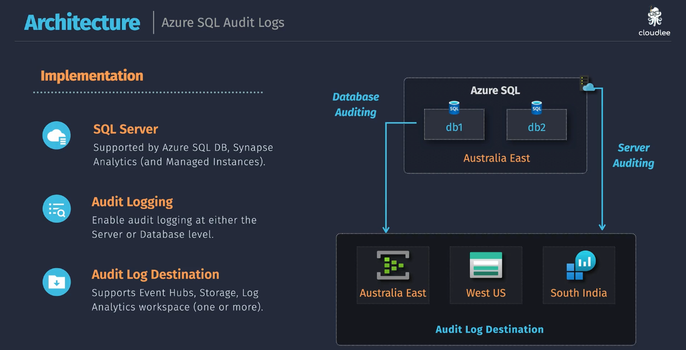
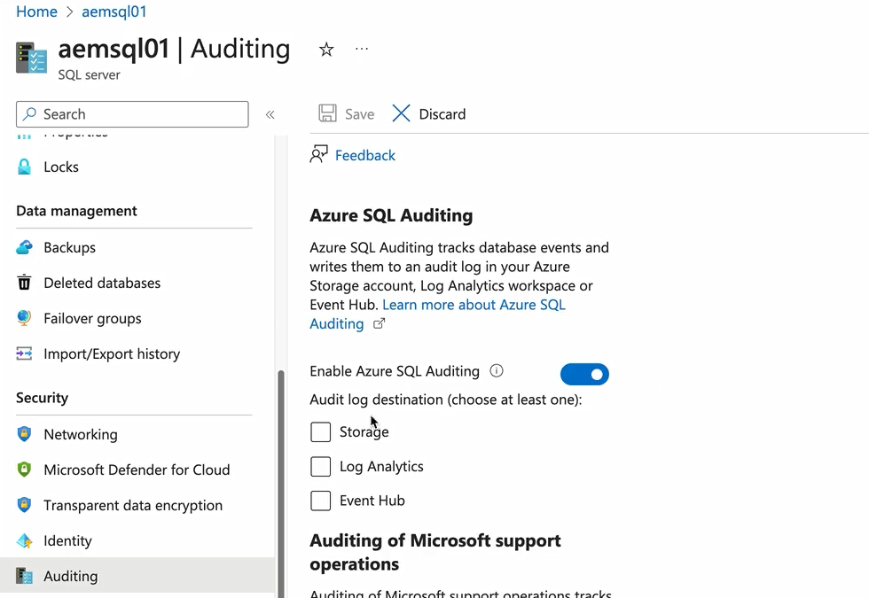

# 🕵️‍♂️ Azure SQL Audit Logs — The Complete Picture

## 🎯 What Is SQL Auditing?

**Azure SQL Auditing** helps you **track and record database events** to:

- Understand what actions were taken **and by whom**.
- Ensure **compliance** (e.g., GDPR, HIPAA, SOC, ISO).
- Detect **suspicious or unauthorized** activities.
- Perform **forensic analysis** if a security incident occurs.

✅ Think of it like a **security camera** inside your SQL Database — watching every login, query, data modification, or permission change.

---

<div align="center" style="background-color: #242A3A ;border-radius: 10px;border: 2px solid white">
  
</div>

## 🧩 Where It Applies

Auditing is supported in:

- **Azure SQL Database (single & elastic pool)**
- **Azure SQL Managed Instance**
- **Azure Synapse Analytics**

---

## 🧱 Levels of Auditing

Azure gives you **two levels** where you can configure auditing:

| Level                       | Applies To                    | Behavior                                               |
| --------------------------- | ----------------------------- | ------------------------------------------------------ |
| **Server-level auditing**   | The entire logical SQL Server | Applies to all databases under it (unless overridden). |
| **Database-level auditing** | A single database             | Overrides server-level settings for that database.     |

🧠 **Tip:** If you enable both, **database-level** settings take precedence.

---

## ⚙️ How It Works

1. **SQL Server or Database** — you enable auditing from the Azure Portal, CLI, ARM, or PowerShell.
2. **Audit Engine** inside Azure SQL continuously monitors events like:

   - Logins and failed logins
   - Data access (SELECT, INSERT, UPDATE, DELETE)
   - Permission changes
   - Schema modifications
   - Security events

3. These events are **written to a target destination** (Storage, Log Analytics, or Event Hub).
4. You can later **query or visualize** these logs to review activity and detect anomalies.

---

## 📦 Audit Log Destinations

You can store audit logs in **one or more of the following**:

| Destination                    | Description                                         | Where                                                             | When to Use                                                |
| ------------------------------ | --------------------------------------------------- | ----------------------------------------------------------------- | ---------------------------------------------------------- |
| 🗃️ **Azure Storage Account**   | Raw `.xel` (Extended Event Log) files               | - If Azure Portal -> same region </br> - If Azure cli -> anywhere | Cheapest option, good for archival & regulatory retention. |
| 📊 **Log Analytics Workspace** | Integrated with Azure Monitor / Sentinel            | Anywhere                                                          | For live analysis, Kusto queries, dashboards, and alerts.  |
| 🔁 **Event Hub**               | Stream logs to external SIEM tools (Splunk, QRadar) | Same region of db/server                                          | For integration with enterprise logging pipelines.         |

🧠 **Tip:** You can use all three simultaneously for redundancy and versatility.

---

<div align="center" style="background-color: #ffff ;border-radius: 10px;border: 2px solid white">
  
</div>

---

## 💡 Example Portal Configuration Steps

1. Go to **Azure Portal → SQL Server or SQL Database**.
2. Under **Security → Auditing**, click **“On”**.
3. Choose:

   - **Audit level** (Server or Database)
   - **Destination type** (Storage, Event Hub, or Log Analytics)

4. Optionally, configure:

   - **Retention days** (e.g., 90 days)
   - **Secondary region destination** for geo-redundancy.

5. Save the configuration — logs start collecting immediately.

---

## 🔍 Viewing Audit Logs

Depending on the destination:

- **Storage Account:** Download `.xel` files and open in SSMS or Log Parser.
- **Log Analytics:** Query with Kusto (KQL):

  ```kusto
  AzureDiagnostics
  | where Category == "SQLSecurityAuditEvents"
  | summarize count() by statement_s, succeeded_s
  ```

- **Event Hub:** Consume via your SIEM pipeline or custom app.

---

## 🛡️ Best Practices

| Recommendation                                 | Reason                                     |
| ---------------------------------------------- | ------------------------------------------ |
| Enable **server-level auditing** by default    | Ensures all DBs are covered automatically. |
| Use **Log Analytics** for real-time monitoring | Centralized visualization and alerting.    |
| Configure **retention policy** (90–365 days)   | Comply with data retention regulations.    |
| Send logs to **multiple regions**              | For resilience and compliance.             |
| Use **Azure Policy**                           | Enforce auditing across your organization. |

---

## ⚡ Difference Between Auditing and Threat Detection

| Feature                                                 | Purpose                                                                        |
| ------------------------------------------------------- | ------------------------------------------------------------------------------ |
| **Auditing**                                            | Records _what happened_ (user actions, events).                                |
| **Advanced Threat Protection (ATP)** / Defender for SQL | Detects _abnormal behavior_ using AI (e.g., SQL injection, data exfiltration). |

➡️ You should enable **both** for a complete SQL security posture.

---

## ✅ Summary

| Concept                   | Summary                                   |
| ------------------------- | ----------------------------------------- |
| **Auditing**              | Tracks who did what in SQL.               |
| **Level**                 | Server-level or database-level.           |
| **Destinations**          | Storage, Event Hub, or Log Analytics.     |
| **Use Cases**             | Compliance, forensics, anomaly detection. |
| **Complementary Feature** | Defender for SQL (for threat detection).  |
