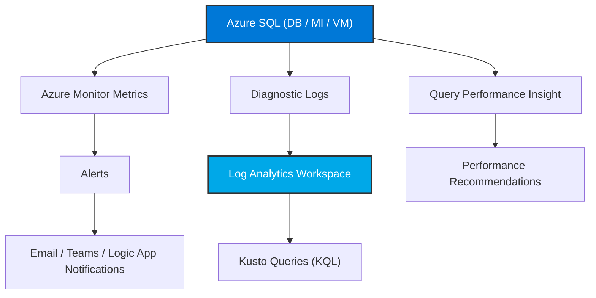
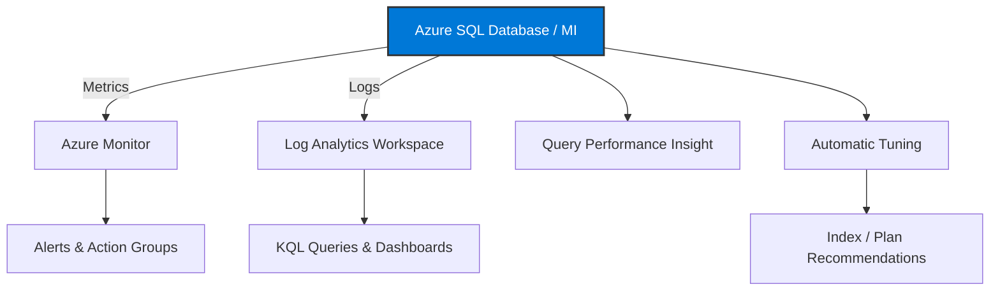

# 📈 **Azure SQL Monitoring, Alerts, and Performance Insights**

> “You can’t improve what you don’t measure.” — So let’s measure **everything** 😎

---

## 🧭 Overview

Azure SQL provides a **built-in monitoring ecosystem** that tracks metrics, performance trends, and anomalies **without installing agents**.

All Azure SQL deployment types (Database, Managed Instance, VM) integrate natively with:

- **Azure Monitor** (for metrics, logs, and alerts)
- **SQL Insights (preview)** (deep engine telemetry)
- **Query Performance Insight**
- **Automatic Tuning**
- **Log Analytics workspace**

---

## 🧩 Monitoring Architecture Overview



---

## 🧱 Azure Monitor for SQL (All Deployments)

**Azure Monitor** collects metrics and logs for:

| Category                | Description                          | Example                    |
| ----------------------- | ------------------------------------ | -------------------------- |
| 💾 Resource Metrics     | CPU, DTU, IOPS, storage              | CPU usage %, Log IO %      |
| 🔍 Query Metrics        | Execution count, duration            | Slow-running queries       |
| ⚡ Performance          | Wait stats, blocking, timeouts       | Top waits by type          |
| 🧠 Intelligent Insights | Auto detection of performance issues | High CPU spikes, deadlocks |
| 🔔 Alerts               | Trigger notifications on thresholds  | DTU > 90%, log IO > 80%    |

---

### 📊 Metrics (Portal Steps)

1. Go to **Azure Portal → SQL Database / MI / VM**
2. Select **Monitoring → Metrics**
3. Choose a **metric namespace**, e.g.:

   - `CPU percentage`
   - `Data IO percentage`
   - `Sessions count`

4. Optionally add **filters** (by database or DTU)
5. Click **New alert rule** to trigger actions

**Example alert:**

> Send email if CPU > 85% for 10 minutes.

---

## 🧠 Intelligent Insights (AI-driven Analysis)

Azure SQL continuously evaluates telemetry and provides:

- Root cause of performance degradation
- Impacted queries
- Recommended actions

**Enable in Portal:**

- Go to **SQL Database → Intelligent Performance → Intelligent Insights**
- Toggle **ON**
- You can review insights under **Performance → Insights**

🔍 Examples of detections:

- Parameter sniffing issues
- High I/O latency
- Missing indexes
- Suboptimal query plans

---

## 📖 Query Performance Insight (QPI)

Visual, easy-to-understand performance dashboard (for **Azure SQL Database only**).

**Use Case:** Identify top resource-consuming queries.

### 🔹 Portal Steps:

1. Navigate to your **SQL Database**
2. Go to **Intelligent Performance → Query Performance Insight**
3. View charts by:

   - **DTU usage**
   - **CPU / IO / Duration**
   - **Top Queries**

4. Click a query to drill into its **execution stats** and **query text**
5. Get **automatic tuning suggestions** (e.g., create index)

---

## ⚙️ Automatic Tuning

Let Azure tune your SQL database automatically.
Three key options:

| Option                   | Description                  | Behavior           |
| ------------------------ | ---------------------------- | ------------------ |
| **CREATE INDEX**         | Adds missing indexes         | Auto-enabled       |
| **DROP INDEX**           | Removes unused indexes       | Optional           |
| **FORCE LAST GOOD PLAN** | Reverts to stable query plan | Highly recommended |

### 📋 Portal Steps:

1. Go to **SQL Database → Intelligent Performance → Automatic tuning**
2. Turn ON options (can inherit from server)
3. Review applied and reverted tunings under **History**

💡 Works only for **Azure SQL Database** and **SQL Managed Instance**.

---

## 🧩 Diagnostic Settings

To send detailed telemetry to a **Log Analytics Workspace**, **Storage Account**, or **Event Hub**:

### 🔹 Portal Steps:

1. Go to **SQL Server / Database → Diagnostic settings**
2. Click **+ Add diagnostic setting**
3. Choose:

   - ✅ **Send to Log Analytics Workspace**
   - 📦 **Archive to Storage Account**
   - ⚙️ **Stream to Event Hub**

4. Select logs to collect:

   - `SQLInsights`
   - `Errors`
   - `QueryStoreRuntimeStatistics`
   - `Timeouts`
   - `Deadlocks`

5. Save ✅

---

## 📘 Log Analytics + KQL Queries

With logs in a **Log Analytics Workspace**, use **Kusto Query Language (KQL)** to analyze performance.

**Example: Find top 10 slow queries:**

```kql
AzureDiagnostics
| where Category == "QueryStoreRuntimeStatistics"
| summarize avg_duration = avg(duration_s) by statement_s
| top 10 by avg_duration desc
```

**Example: Detect blocking:**

```kql
AzureDiagnostics
| where Category == "Blocks"
| project TimeGenerated, blocking_session_id, blocked_session_id, duration_s
```

---

## 🚨 Alerts and Notifications

Use **Action Groups** to notify teams via:

- 📧 Email
- 💬 SMS
- 🔔 Push notifications
- 🤖 Logic Apps (for Teams / Slack)

**Portal Steps:**

1. Go to **Azure Monitor → Alerts → Create alert rule**
2. Choose resource: your SQL Database / Server
3. Condition: `CPU > 80%`
4. Action Group: select existing or create new
5. Save ✅

---

## 🧮 Performance Recommendations Dashboard

Azure automatically generates recommendations under
**SQL Database → Intelligent Performance → Recommendations**

Examples:

- “Create nonclustered index on [Orders].Date”
- “Drop unused index IDX_CustomerName”
- “Force plan ID 45 for query 152”

You can apply fixes directly with one click 🪄

---

## 🧩 SQL Insights (Preview)

For deeper engine-level telemetry across many databases:

- Collects performance counters (CPU, memory, waits)
- Stores data in Log Analytics
- Works for Azure SQL DB, MI, and SQL on VMs
- Useful for fleet-level performance management

Setup via **Azure Monitor → Insights → SQL**.

---

## 🧠 Comparison Table

| Feature                   | SQL DB | Managed Instance | SQL on VM |
| ------------------------- | ------ | ---------------- | --------- |
| Azure Monitor Metrics     | ✅     | ✅               | ✅        |
| Query Performance Insight | ✅     | ❌               | ❌        |
| Intelligent Insights      | ✅     | ✅               | ❌        |
| Automatic Tuning          | ✅     | ✅               | ❌        |
| Diagnostic Logs           | ✅     | ✅               | ✅        |
| Log Analytics Integration | ✅     | ✅               | ✅        |

---

## 📊 Diagram — Monitoring Flow



---

## ✅ Summary

| Concept                       | Summary                                        |
| ----------------------------- | ---------------------------------------------- |
| **Azure Monitor**             | Central telemetry and alerting for SQL         |
| **Query Performance Insight** | Visual breakdown of top resource-heavy queries |
| **Automatic Tuning**          | AI-based self-optimization engine              |
| **Intelligent Insights**      | Detects root causes automatically              |
| **Diagnostic Logs**           | Stream detailed telemetry to Log Analytics     |
| **Alerts**                    | Real-time notification via Action Groups       |
