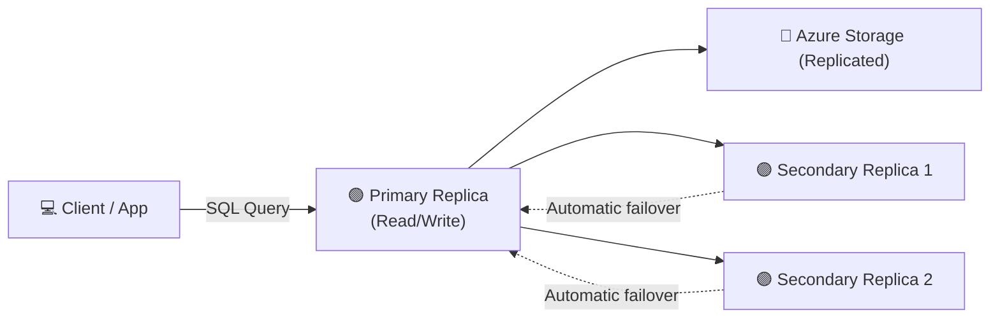
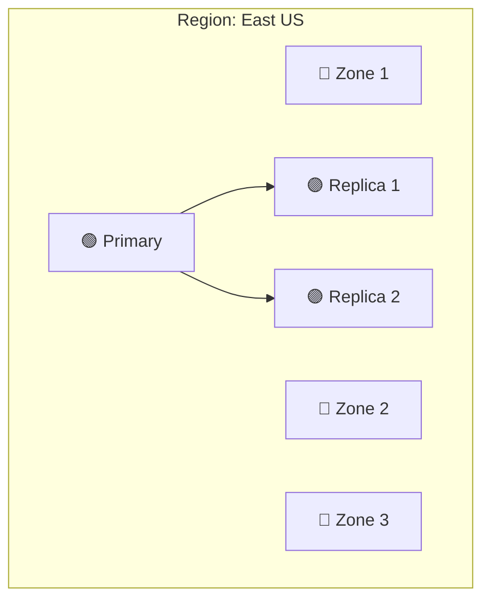
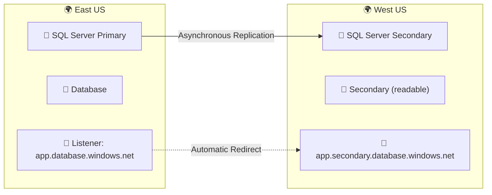

# 🌍 **Azure SQL High Availability (HA) & Geo-Replication**

> 💬 _“What happens if my region, zone, or database goes down?”_
> That’s exactly what this topic answers.

---

## 🧠 Why High Availability (HA) Matters

Azure SQL automatically protects your database from hardware and software failures **without you building clusters or failover systems**.

It’s a **multi-layered protection** model:

1. **Local HA** → inside the region
2. **Geo-Replication** → across regions
3. **Automatic backups** → for point-in-time restore

---

## ⚙️ HA Architecture Depends on Your Tier

| Service Tier          | Storage Type | Built-in HA Mechanism         | Notes                                 |
| --------------------- | ------------ | ----------------------------- | ------------------------------------- |
| **General Purpose**   | Remote SSD   | Remote storage replication    | Cost-optimized, zonal optional        |
| **Business Critical** | Local SSD    | Always On Availability Groups | Best performance and instant failover |
| **Hyperscale**        | Distributed  | Multiple read replicas        | Super-fast failover via replicas      |

---

## 🧩 Core HA Concepts

### 🔁 Automatic Failover

Azure continuously monitors health.
If a compute node fails → another node takes over in seconds.

### 🗃️ Data Replication

Data is always replicated **3 times**:

- **Primary replica** handles reads/writes
- **Secondaries** ready to replace the primary instantly

### 🧮 Load Distribution

Business Critical & Hyperscale tiers can offload **read-only** traffic to replicas for reporting.

---

## 🧱 High Availability Flow

💡 Azure SQL automatically replaces failed nodes; no manual setup required.

---

## ⚙️ High Availability by Tier

| Feature            | General Purpose | Business Critical  | Hyperscale              |
| ------------------ | --------------- | ------------------ | ----------------------- |
| Replication        | Storage-level   | Compute-level (AG) | Page servers + replicas |
| Failover Speed     | ~30 sec         | Instant            | ~10 sec                 |
| Zone Redundancy    | Optional        | Optional           | Built-in                |
| Readable Secondary | ❌              | ✅                 | ✅                      |
| Use Case           | Balanced cost   | Mission-critical   | Ultra-large DBs         |

---

## 🧭 Zone Redundancy

> 🧩 Deploy replicas across **Availability Zones** in the same region.

| Benefit              | Description                              |
| -------------------- | ---------------------------------------- |
| ⚡ Higher resilience | Protects from datacenter outages         |
| 💰 Optional          | You can enable/disable in Portal         |
| 🧱 Applies to        | GP, BC, and Hyperscale tiers             |
| ⚙️ Configuration     | “Zone redundant” toggle when creating DB |

---

## 🌍 Geo-Replication (Disaster Recovery)

**Geo-Replication** = replicate your Azure SQL Database to another **region**.

- **Active Geo-Replication**: up to **4 readable secondaries**
- **Auto-Failover Groups**: automatic failover for multiple DBs
- **RPO**: typically < 5 seconds
- **RTO**: minutes (manual or auto)

---

### 🔁 Option 1 — Active Geo-Replication

| Feature               | Description                    |
| --------------------- | ------------------------------ |
| **Replication Type**  | Asynchronous                   |
| **Max Secondaries**   | 4 per DB                       |
| **Read Access**       | Yes (read-only)                |
| **Failover**          | Manual                         |
| **Connection String** | Change after failover manually |

🧠 Great for:  
Reporting, offloading reads, or regional read-only apps.

---

#### 🧾 Setup (Portal)

1. Open **Azure SQL Database**
2. Go to **Geo-Replication**
3. Click the map 🌍 → Choose target region
4. Select target server → **Create secondary**
5. Optionally enable read access
6. Wait for seeding to complete

---

### ⚙️ Option 2 — Auto-Failover Groups (Recommended for Production)

| Feature                | Description            |
| ---------------------- | ---------------------- |
| **Replication**        | Asynchronous           |
| **Automatic Failover** | ✅ Yes                 |
| **Multi-DB Support**   | ✅ Yes                 |
| **Connection String**  | Uses listener endpoint |
| **Read Access**        | Optional read endpoint |

💡 Perfect for **multi-DB applications** or **Managed Instances**.

---

#### 🔁 Failover Group Example

---

### 🧾 Setup (Portal)

1. Open **SQL Logical Server**
2. Under **Failover Groups → Add Group**
3. Choose:

   - Group name
   - Partner server (secondary region)
   - Databases to include

4. Enable **Automatic Failover**
5. Save ✅

Azure now maintains:

- **Primary endpoint:** `app.database.windows.net`
- **Secondary endpoint:** `app.secondary.database.windows.net`

Failover happens **automatically** when primary is down.

---

## 🧮 Backup vs Geo-Replication

| Feature      | Backup                 | Geo-Replication     |
| ------------ | ---------------------- | ------------------- |
| **Purpose**  | Point-in-time recovery | Regional DR         |
| **Scope**    | Within region          | Across regions      |
| **Failover** | Manual restore         | Automatic or manual |
| **RPO**      | Minutes–hours          | Seconds             |
| **RTO**      | Minutes                | Seconds–minutes     |

💡 _For compliance: use both together._

---

## 🧰 Monitoring HA & DR

| Tool                        | What It Shows                          |
| --------------------------- | -------------------------------------- |
| **Portal → Failover Group** | Replication health, latency            |
| **Azure Monitor**           | Failover events, metrics               |
| **Query Store**             | Plan regressions post-failover         |
| **Log Analytics**           | Availability percentage, downtime logs |

---

## 🧩 Hands-On: Simulate Failover (Portal)

1. Go to your **Failover Group**
2. Click **Failover**
3. Azure promotes secondary → primary
4. Connections automatically reroute via listener endpoint

💡 You can reverse failover later with “Failback”.

---

## 🧱 Best Practices

| Area             | Recommendation                                          |
| ---------------- | ------------------------------------------------------- |
| **Region Pairs** | Always use paired regions (e.g., East US ↔ West US)     |
| **Automation**   | Use Auto-Failover Groups for mission-critical workloads |
| **Backups**      | Keep long-term retention (LTR) enabled                  |
| **Network**      | Use Private Link for both primary and secondary         |
| **Testing**      | Perform failover drills quarterly                       |
| **Monitoring**   | Set Azure Monitor alerts for failover events            |

---

## ✅ Summary Table

| Concept                 | Description                         |
| ----------------------- | ----------------------------------- |
| **Local HA**            | Built-in across all tiers           |
| **Zone Redundancy**     | Optional within region              |
| **Geo-Replication**     | Asynchronous copy to another region |
| **Auto-Failover Group** | Automatic DR for multiple DBs       |
| **Failover Type**       | Manual or automatic                 |
| **Read Replicas**       | Available in BC & Hyperscale        |
| **Backups**             | Still independent and automatic     |

---

## 🧭 Next Topic

Next 👉 **7️⃣ Azure SQL Security & Encryption**
We’ll cover:

- 🔐 TDE vs Always Encrypted vs CMK
- 🧱 Network security (Private Link, Firewall)
- 🧮 Authentication (SQL, AAD, Managed Identity)
- 🧰 Defender for SQL and Auditing

Would you like me to continue with **7️⃣ Azure SQL Security & Encryption**?
