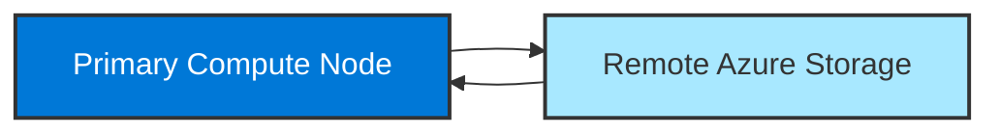
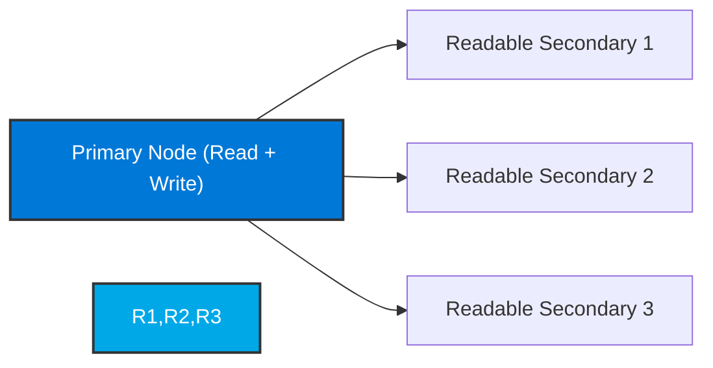
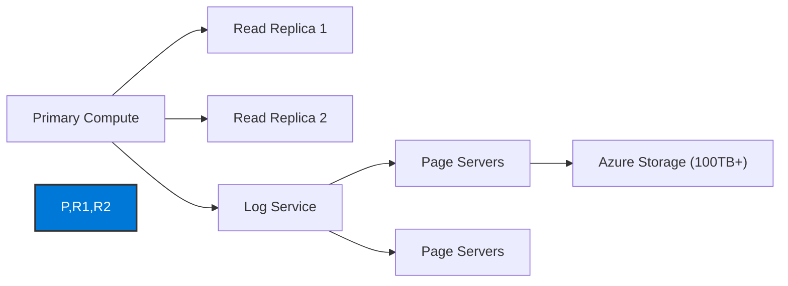
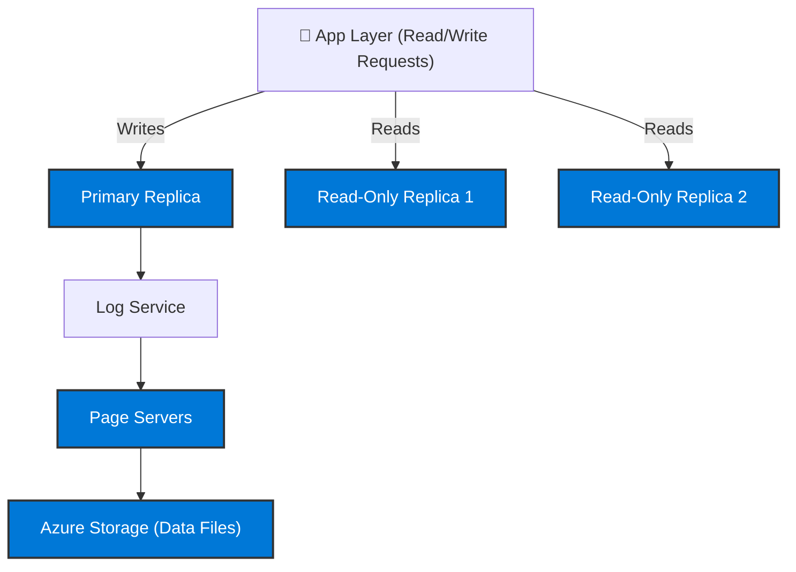

# ⚙️ **Azure SQL Scaling and Performance Optimization**

> “Scalability is not just adding more horsepower — it’s knowing _where_ to add it.” 💡

---

## 🧭 Overview — Scaling in Azure SQL

Azure SQL lets you **scale compute and storage independently** (depending on your model).
It supports both **vertical scaling (scale-up)** and **horizontal scaling (read scale-out)**.

Scaling behavior depends on the **deployment model**:

<div align="center" style="background-color: #1b3f47ff; border-radius: 10px;">

| Deployment               | Scaling Model                                            | Notes                            |
| ------------------------ | -------------------------------------------------------- | -------------------------------- |
| **SQL Server on VM**     | Manual (VM resize)                                       | Traditional IaaS scaling         |
| **SQL Managed Instance** | Vertical (vCore scaling)                                 | Manual or automated with scripts |
| **Azure SQL Database**   | Vertical + Read (Scale-Out) (Premium & Hyperscale tiers) | Supports auto-scale (serverless) |

</div>

---

## 🧱 Scaling Models

<div align="center" style="background-color: #1b3f47ff; border-radius: 10px;">

| Model                                | Description                               | Example                                         |
| ------------------------------------ | ----------------------------------------- | ----------------------------------------------- |
| **Vertical Scaling (Scale Up/Down)** | Change compute resources (vCores or DTUs) | From 2 → 8 vCores                               |
| **Horizontal Scaling (Scale Out)**   | Distribute reads to secondary replicas    | Read scale-out replica in Hyperscale or Premium |
| **Auto Scaling (Serverless)**        | Auto-pause/resume based on workload       | Great for intermittent workloads                |

</div>

---

## ⚡ Performance Models (DTU vs vCore)

Azure SQL uses two compute purchasing models:

<div align="center" style="background-color: #1b3f47ff; border-radius: 10px;">

| Model              | Description                   | Control  | Pricing                                         |
| ------------------ | ----------------------------- | -------- | ----------------------------------------------- |
| 💠 **DTU Model**   | Bundled compute, memory, IO   | Simpler  | Pay per performance level (e.g., S3 = 100 DTUs) |
| 🧩 **vCore Model** | Independent compute & storage | Flexible | Pay for vCores + storage separately             |

</div>

---

### 🧮 DTU Model (Database Transaction Unit)

- DTU = combined measure of CPU + Memory + IO throughput.
- Easy but limited control.
- Choose service tiers (Basic, Standard, Premium).

**Use Case:** small apps, simple pricing.

---

### ⚙️ vCore Model

- Choose **number of cores**, **generation**, and **storage** independently.
- Choose between **General Purpose**, **Business Critical**, and **Hyperscale**.

<div align="center" style="background-color: #1b3f47ff; border-radius: 10px;">

| Tier                  | Architecture                          | Use Case                   |
| --------------------- | ------------------------------------- | -------------------------- |
| **General Purpose**   | Remote storage, balanced cost         | Most workloads             |
| **Business Critical** | Local SSD + replicas                  | High I/O, low-latency apps |
| **Hyperscale**        | Distributed storage, 100 TB+ capacity | Read-heavy, huge DBs       |

</div>

---

## 🧩 Scaling Architecture per Tier

### 🧱 General Purpose Tier

<div align="center" style="background-color: #1b3f47ff; border-radius: 10px;">



</div>

- **Single compute node** for all read/writes
- Data files stored on **remote Azure Premium Storage**
- Scaling = reallocation of compute
- **Downtime** (30–60s) when scaling up/down

---

### 💎 Business Critical Tier

<div align="center" style="background-color: #1b3f47ff; border-radius: 10px;">



</div>

- Uses **Always On Availability Groups**
- **1 primary (read/write)** + **3 replicas (read-only)**
- **Automatic failover** in seconds
- Optional **read scale-out**: offload heavy SELECT queries to replicas

> 💡 **How writes work:**  
> Writes happen on the primary node → replicated to all secondaries (synchronous).  
> Reads can be redirected to secondaries for reporting.

**Scaling:**

- Change vCores = new replicas spun up
- Zero data copy (replicated architecture)

---

### 🚀 Hyperscale Tier

<div align="center" style="background-color: #1b3f47ff; border-radius: 10px;">



</div>

- **Primary node** handles writes
- **Multiple read replicas** handle reads
- **Log service** asynchronously replicates changes to **page servers**
- **Page servers** manage data pages and scale independently

💡 **Reads scale linearly** — you can add up to **4 read replicas** per database.

---

## ⚙️ How Scaling Happens

<div align="center" style="background-color: #1b3f47ff; border-radius: 10px;">

| Operation                 | What Happens Internally                                              | Downtime                |
| ------------------------- | -------------------------------------------------------------------- | ----------------------- |
| **Scale Up (vCores↑)**    | New compute node is provisioned → data reattached → traffic rerouted | 30–60s                  |
| **Scale Down (vCores↓)**  | New smaller compute node → data reattached                           | Short                   |
| **Read Scale-Out**        | Connection string changes (`ApplicationIntent=ReadOnly`)             | None                    |
| **Serverless Auto-Scale** | Compute automatically adjusts based on load                          | None (pauses when idle) |

</div>

---

### 🧩 Serverless Auto-Pause / Resume

<div align="center" style="background-color: #1b3f47ff; border-radius: 10px;">

| Feature         | Description                               |
| --------------- | ----------------------------------------- |
| **Auto-pause**  | Database stops after X mins of inactivity |
| **Auto-resume** | Resumes instantly on connection           |
| **Billing**     | Only for storage + active compute time    |
| **Great For**   | Dev/test databases or low-traffic APIs    |

</div>

**Portal Setup:**

1. During DB creation → choose **Compute Tier = Serverless**
2. Set **Min vCores**, **Max vCores**, **Auto-pause delay**
3. Save ✅

---

## 🧠 Scaling for Reads and Writes

<div align="center" style="background-color: #1b3f47ff; border-radius: 10px;">

| Operation Type                                                     | Scaling Behavior                                 |
| ------------------------------------------------------------------ | ------------------------------------------------ |
| **Writes**                                                         | Handled by the **primary replica** only          |
| **Reads (Premium/BC/Hyperscale)**                                  | Can be distributed across **read-only replicas** |
| **Read Intent Routing**                                            | Use connection string:                           |
| `Server=tcp:mydb.database.windows.net;ApplicationIntent=ReadOnly;` |                                                  |
| **Managed Instance**                                               | Read-scale supported on BC tier only             |
| **SQL on VM**                                                      | Manual setup using Always On AGs                 |

</div>

---

## 💾 Scaling Storage

<div align="center" style="background-color: #1b3f47ff; border-radius: 10px;">

| Tier                     | Max Storage | Scaling Type              |
| ------------------------ | ----------- | ------------------------- |
| **General Purpose / BC** | Up to 4TB   | Manual increase           |
| **Hyperscale**           | Up to 100TB | Auto-expand               |
| **Serverless**           | Up to 4TB   | Auto-expand with workload |

</div>

💡 Hyperscale storage grows _automatically_ — you never pre-allocate disk size.

---

## 🔍 Performance Optimization Tools

<div align="center" style="background-color: #1b3f47ff; border-radius: 10px;">

| Tool                          | Function                                           |
| ----------------------------- | -------------------------------------------------- |
| **Query Performance Insight** | Identifies top resource-heavy queries              |
| **Automatic Tuning**          | Creates/Drops indexes, forces last known good plan |
| **Intelligent Insights**      | Root-cause AI analysis of performance regressions  |
| **Database Advisor**          | Provides ongoing recommendations                   |
| **Azure Monitor Alerts**      | Threshold-based notifications for DTU/vCore usage  |

</div>

---

## 🧩 CLI Scaling Commands

### Scale vCores (SQL Database)

```bash
az sql db update \
  --resource-group MyRG \
  --server my-sql-server \
  --name mydb \
  --compute-model Provisioned \
  --edition GeneralPurpose \
  --family Gen5 \
  --capacity 8
```

### Switch to Serverless

```bash
az sql db update \
  --resource-group MyRG \
  --server my-sql-server \
  --name mydb \
  --compute-model Serverless \
  --min-capacity 1 \
  --max-capacity 8 \
  --auto-pause-delay 30
```

---

## 🔄 Diagram — Full Scaling Picture

<div align="center" style="background-color: #1b3f47ff; border-radius: 10px;">



</div>

---

## 🧠 Quick Memory Summary

<div align="center" style="background-color: #1b3f47ff; border-radius: 10px;">

| Concept               | Tagline                               |
| --------------------- | ------------------------------------- |
| **DTU**               | “Fixed package — easy mode”           |
| **vCore**             | “Flexible — pay for what you use”     |
| **Serverless**        | “Auto-scale, pay per second”          |
| **Hyperscale**        | “Massive scale, read replicas, 100TB” |
| **Business Critical** | “Fast SSD + 4 replicas”               |
| **General Purpose**   | “Affordable + stable”                 |

</div>

---

## ✅ Summary

<div align="center" style="background-color: #1b3f47ff; border-radius: 10px;">

| Feature               | SQL DB                  | Managed Instance | SQL VM         |
| --------------------- | ----------------------- | ---------------- | -------------- |
| Vertical Scaling      | ✅                      | ✅               | ✅ (resize VM) |
| Read Scale-Out        | ✅ Premium / Hyperscale | ✅ BC only       | ✅ (manual AG) |
| Serverless Auto-Scale | ✅                      | ❌               | ❌             |
| Hyperscale            | ✅                      | ❌               | ❌             |
| Storage Auto-Expand   | ✅ (Hyperscale)         | ✅               | ❌             |
| Zero Downtime Reads   | ✅                      | ✅               | ✅ (AG setup)  |

</div>
