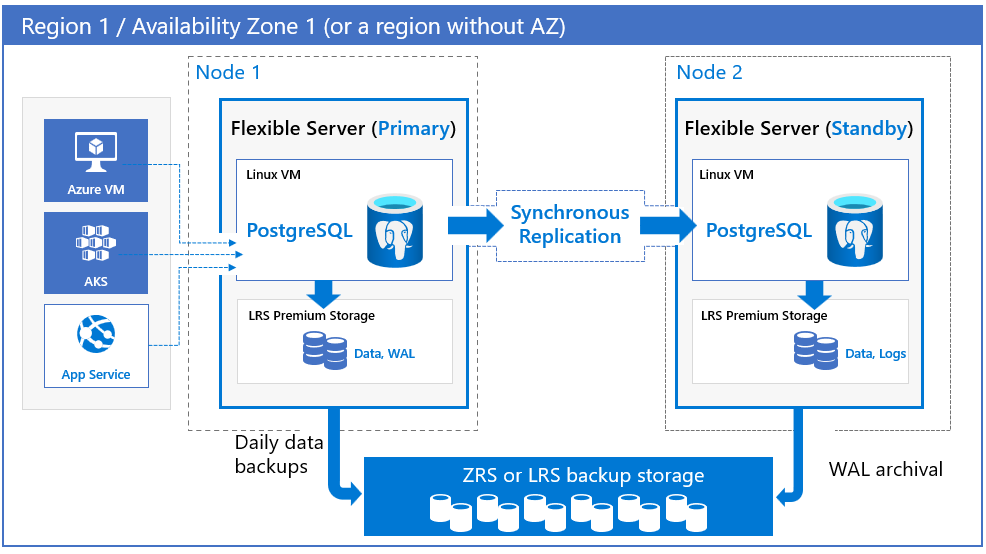
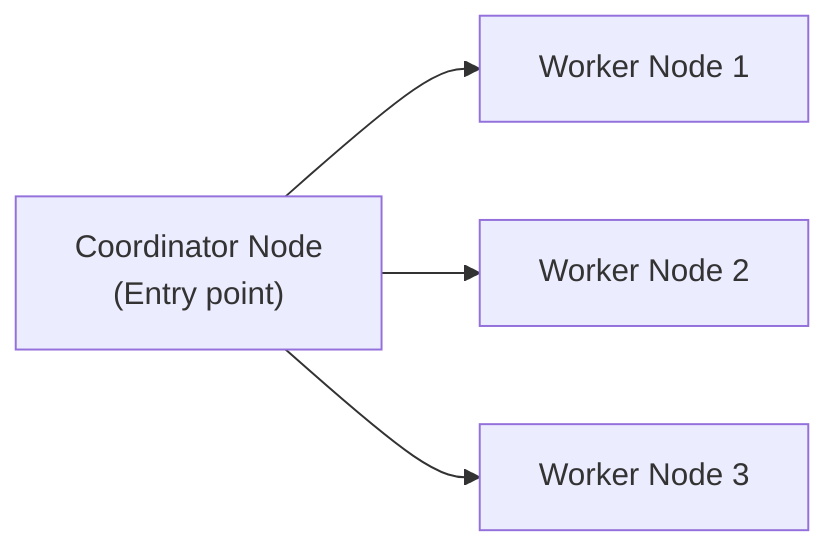
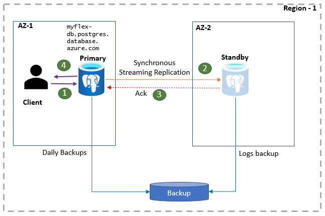

# 🐘 Azure Database for PostgreSQL

## 🧠 What It Is

> **Azure Database for PostgreSQL** is a **fully managed, enterprise-grade PostgreSQL database service** on Azure, offering **built-in high availability, backups, scaling, and security** — all without managing servers.

💬 In simple words:

> It’s **PostgreSQL-as-a-Service**, where Microsoft handles the heavy lifting:
>
> - ✅ Setup,
> - ✅ Patching,
> - ✅ Backups,
> - ✅ Scaling,
> - ✅ HA.

---

## 🧩 Architecture Overview

<div align="center" style="background-color: #ffff ;border-radius: 10px;border: 2px solid white;margin: 0 20px">
  
</div>

---

## ⚙️ Deployment Options (3 Models)

Azure offers **three deployment models** depending on your needs 👇

<div align="center" style="background-color: #000; border-radius: 10px;">

| Model                     | Description                                                  | Best For                               |
| ------------------------- | ------------------------------------------------------------ | -------------------------------------- |
| **1️⃣ Flexible Server**    | Full control over configuration, maintenance, HA, stop/start | ✅ Recommended for new workloads       |
| **2️⃣ Hyperscale (Citus)** | Scales out PostgreSQL horizontally across multiple nodes     | ✅ Massive scale, analytical workloads |

</div>

> ⚠️ Single Server Model is Being retired (migrate to Flexible)

---

## 1️⃣ Flexible Server (Most Common)

This is the **modern default** for most PostgreSQL workloads.

### ✨ Key Features

<div align="center" style="background-color: #000; border-radius: 10px;">

| Feature                       | Description                                    |
| ----------------------------- | ---------------------------------------------- |
| **Zone Redundant HA**         | Active-standby setup across AZs                |
| **Custom Maintenance Window** | Choose when updates happen                     |
| **Stop/Start Capability**     | Save costs when idle                           |
| **Private VNet Integration**  | Fully private connectivity                     |
| **Storage Auto-Grow**         | Automatically increases capacity               |
| **Backup Retention**          | Up to **35 days**                              |
| **Scaling**                   | Vertical scaling of CPU & Memory (no downtime) |
| **Major Versions**            | Supports PostgreSQL 11–16                      |

</div>

---

## 2️⃣ Hyperscale (Citus)

This is the **big-data version** of PostgreSQL on Azure — it uses **sharding** to horizontally distribute data across worker nodes.

> Built for high-throughput analytical workloads or multi-tenant SaaS.

### 🧮 Architecture

<div align="center" style="background-color: #000; border-radius: 10px;">



</div>

- The **Coordinator node** receives queries and breaks them into smaller tasks.
- **Worker nodes** store subsets of data (shards) and run computations in parallel.

### 🧩 Features

<div align="center" style="background-color: #000; border-radius: 10px;">

| Feature                    | Description                                            |
| -------------------------- | ------------------------------------------------------ |
| **Horizontal Scaling**     | Add workers dynamically                                |
| **Distributed SQL Engine** | Queries auto-parallelized                              |
| **High Throughput**        | Ideal for analytics, IoT, or SaaS multi-tenant systems |
| **Same PostgreSQL syntax** | 100% SQL-compatible                                    |
| **Built-in Sharding**      | Uses Citus extension                                   |

</div>

💡 Example Use Case: A SaaS platform hosting data for thousands of customers.

---

## 🔒 Security Features (All Models)

<div align="center" style="background-color: #000; border-radius: 10px;">

| Security Feature                     | Description                               |
| ------------------------------------ | ----------------------------------------- |
| **Network Security**                 | Public or Private (VNet) access           |
| **Firewall Rules**                   | Allow specific IPs                        |
| **TLS Encryption**                   | Mandatory encryption in transit           |
| **Encryption at Rest**               | AES-256 encryption                        |
| **Azure AD Authentication**          | Login without passwords                   |
| **Role-Based Access Control (RBAC)** | Managed via Azure AD                      |
| **Advanced Threat Protection**       | Detects SQL injection or anomalous access |
| **Private Link**                     | Isolates DB access from public internet   |

</div>

💡 Tip: Always combine **Private Link + Managed Identity** for production.

---

## 💾 Backup & Restore

<div align="center" style="background-color: #000; border-radius: 10px;">

| Feature                          | Description                                   |
| -------------------------------- | --------------------------------------------- |
| **Automatic Daily Backups**      | Stored in Azure Storage                       |
| **Retention Period**             | Up to 35 days                                 |
| **Point-in-Time Restore (PITR)** | Restore to any second within retention window |
| **Geo-Redundant Backup**         | Cross-region restore option                   |
| **Incremental Snapshots**        | Only changes are backed up to save space      |

</div>

🧠 You can restore a PostgreSQL server into a **new server** without downtime.

---

## 🧮 Compute & Storage

<div align="center" style="background-color: #000; border-radius: 10px;">

| Tier                            | Description            | Use Case             |
| ------------------------------- | ---------------------- | -------------------- |
| **Burstable (B-Series)**        | Cheap, small workloads | Dev/Test             |
| **General Purpose (D-Series)**  | Balanced CPU & IOPS    | Web apps, APIs       |
| **Memory Optimized (E-Series)** | High RAM, low latency  | Analytics, reporting |

</div>

### Scaling

- **vCores** and **Storage** can be scaled independently.
- Scaling triggers no downtime (Flexible Server).
- **Storage Auto-grow** prevents “out of space” errors.

---

## 🔁 High Availability

<div align="center" style="background-color: #000; border-radius: 10px;">

| Mode               | Description                     | Failover Time |
| ------------------ | ------------------------------- | ------------- |
| **Zone Redundant** | Active + Standby across AZs     | <60 seconds   |
| **Same-Zone HA**   | Both nodes in same AZ (cheaper) | <30 seconds   |
| **No HA**          | Single node                     | N/A           |

</div>

---

<div align="center" style="background-color: #ffff ;border-radius: 10px;border: 2px solid white;margin: 0 20px">
  
</div>

---

💡 Azure continuously replicates **WAL (Write-Ahead Log)** data between active and standby nodes to maintain sync.

---

## 🧰 Developer Features

<div align="center" style="background-color: #000; border-radius: 10px;">

| Feature                                | Description                                                                |
| -------------------------------------- | -------------------------------------------------------------------------- |
| **Extensions**                         | Supports popular PostgreSQL extensions (PostGIS, pg_stat_statements, etc.) |
| **Logical Replication**                | Publish/subscribe setup for multi-region replication                       |
| **Query Store & Performance Insights** | Analyze slow queries and index usage                                       |
| **Custom Parameters**                  | Modify PostgreSQL settings (like shared_buffers, work_mem)                 |
| **Maintenance Window**                 | Choose patch time                                                          |
| **Stop/Start Server**                  | Reduce cost when idle                                                      |
| **Flexible Connections**               | Private endpoint or public DNS                                             |

</div>

---

## 📊 Monitoring & Observability

<div align="center" style="background-color: #000; border-radius: 10px;">

| Tool                          | Purpose                                   |
| ----------------------------- | ----------------------------------------- |
| **Azure Monitor Metrics**     | CPU, connections, read/write IOPS, memory |
| **Log Analytics**             | Query logs, deadlocks, long queries       |
| **Query Performance Insight** | Visual performance analysis               |
| **Alerts**                    | Email/SMS when thresholds exceeded        |
| **Activity Logs**             | Track changes and restarts                |

</div>

---

## 🌐 Networking Modes

<div align="center" style="background-color: #000; border-radius: 10px;">

| Mode                      | Description                               | Best Use                 |
| ------------------------- | ----------------------------------------- | ------------------------ |
| **Public Access**         | Accessible via internet (whitelisted IPs) | Dev/Test                 |
| **Private Access (VNet)** | VNet integration with Private Link        | Production               |
| **Private DNS Zone**      | Resolves names privately                  | Used with Private Access |

</div>

---

## 💸 Pricing & Cost Management

<div align="center" style="background-color: #000; border-radius: 10px;">

| Pricing Factor            | Description                      |
| ------------------------- | -------------------------------- |
| **Compute**               | Pay per vCore-hour               |
| **Storage**               | Pay per GB                       |
| **Backup Storage**        | Free up to DB size, extra billed |
| **HA Option**             | Adds standby cost (~2×)          |
| **Stop/Start (Flexible)** | Pause to save money when idle    |
| **Scaling**               | Dynamic — no downtime            |

</div>

💡 Tip: For dev environments → enable **auto-stop after X minutes** of inactivity.

---

## 🪜 Step-by-Step: Create PostgreSQL Flexible Server (Portal)

---

### 1️⃣ Create the Resource

- Portal → **Create Resource → Databases → Azure Database for PostgreSQL Flexible Server**
- Click **Create**

### 2️⃣ Configure Basics

| Field          | Example                    |
| -------------- | -------------------------- |
| Server Name    | `pg-flex-demo`             |
| Resource Group | `rg-postgres-demo`         |
| Region         | `East US`                  |
| Version        | PostgreSQL 15              |
| Compute Tier   | General Purpose (2 vCores) |

### 3️⃣ Networking

- Choose **Private access (VNet integration)**
- (or Public for test environments)

### 4️⃣ Data & Backup

- Storage: **64 GB**
- Backup retention: **7–35 days**
- Auto-grow: Enabled
- Geo-redundant backup: Optional

### 5️⃣ Review + Create

Azure deploys your PostgreSQL server in ~2–3 minutes ✅

---

## 💻 Azure CLI Example

```bash
# Create resource group
az group create -n rg-postgres-demo -l eastus

# Create PostgreSQL flexible server
az postgres flexible-server create \
  --resource-group rg-postgres-demo \
  --name mypgflexserver \
  --admin-user adminuser \
  --admin-password MyS3cretPwd! \
  --tier GeneralPurpose \
  --sku-name Standard_D2ds_v4 \
  --storage-size 64 \
  --location eastus
```

✅ After deployment → connect via `psql`, DBeaver, or any PostgreSQL client.

---

## 🔁 Migration Options

<div align="center" style="background-color: #000; border-radius: 10px;">

| Source             | Tool                                       | Description             |
| ------------------ | ------------------------------------------ | ----------------------- |
| On-prem PostgreSQL | **Azure Database Migration Service (DMS)** | Schema & data migration |
| AWS RDS PostgreSQL | DMS or logical replication                 | Continuous sync         |
| Self-hosted        | `pg_dump` / `pg_restore`                   | For smaller DBs         |
| Multi-region DR    | Logical replication or DMS                 | Asynchronous copy       |

</div>

---

## 💡 Common Use Cases

<div align="center" style="background-color: #000; border-radius: 10px;">

| Use Case              | Description                                    |
| --------------------- | ---------------------------------------------- |
| **Web & Mobile Apps** | Backend for Django, Node.js, Spring apps       |
| **Geospatial Apps**   | Use PostGIS for maps & location data           |
| **Analytics**         | Combine with Power BI or Synapse               |
| **IoT / Time-series** | Store sensor data with TimescaleDB             |
| **Multi-tenant SaaS** | Hyperscale (Citus) version for scaling tenants |
| **Finance / Banking** | ACID compliance, strong consistency            |

</div>

---

## 🧾 Summary Table

<div align="center" style="background-color: #000; border-radius: 10px;">

| Category               | Details                                              |
| ---------------------- | ---------------------------------------------------- |
| **Type**               | Managed PostgreSQL (PaaS)                            |
| **Models**             | Flexible, Hyperscale (Citus), Single Server (legacy) |
| **Scaling**            | Vertical (vCores/Storage)                            |
| **Backups**            | Auto daily, PITR up to 35 days                       |
| **HA**                 | Zone redundant (active/standby)                      |
| **Security**           | TLS, Encryption, Private Link, AD Auth               |
| **Integration**        | Power BI, ADF, Functions, Synapse                    |
| **Stop/Start**         | Yes (Flexible Server)                                |
| **Supported Versions** | PostgreSQL 11–16                                     |

</div>

---

## ✅ In One Line

> **Azure Database for PostgreSQL** = fully managed, secure, and scalable **PostgreSQL PaaS** with built-in **HA, PITR, Private Link**, and **auto-scaling**, ideal for both **OLTP** and **analytics workloads**.
