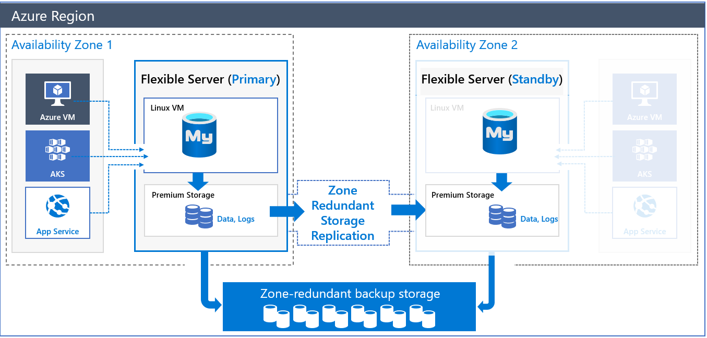

# 🐬 Azure Database for MySQL

## 🧠 What It Is

> **Azure Database for MySQL** is a **fully managed, secure, and scalable MySQL database service** built on the open-source MySQL engine, managed by Microsoft as a **PaaS (Platform-as-a-Service)** offering.

💬 In plain English:

> It’s **the same MySQL** you know — but Azure handles the servers, backups, high availability, scaling, and patching for you.

---

## 🧩 Architecture Overview

<div align="center" style="background-color: #ffff ;border-radius: 10px;border: 2px solid white;margin: 0 20px">
  
</div>

---

## ⚙️ Deployment Models

Azure gives you **2 deployment options** depending on your control and performance needs 👇

<div align="center" style="background-color: #1b3f47ff; border-radius: 10px;">

| Model                         | Description                                                                                           | Recommended For                |
| ----------------------------- | ----------------------------------------------------------------------------------------------------- | ------------------------------ |
| **1️⃣ Flexible Server (new)**  | Best balance of control + cost. Offers VNet, stop/start, zone redundancy, custom maintenance windows. | Most new workloads ✅          |
| **2️⃣ Single Server (legacy)** | Fully managed, simpler, but less control. Limited scaling and no VNet isolation.                      | Legacy apps (being phased out) |

</div>

> ✅ So for **MySQL**, you’ll mostly choose **Flexible Server** today.  
> ⚠️ Hyperscale (Citus) is PostgreSQL only, Not applicable for MySQL.

---

## 🧱 Core Components of Azure Database for MySQL

<div align="center" style="background-color: #1b3f47ff; border-radius: 10px;">

| Component                  | Description                                                |
| -------------------------- | ---------------------------------------------------------- |
| **Compute**                | vCores and memory allocated to your database               |
| **Storage**                | SSD-backed, automatically managed, scales independently    |
| **Networking**             | Public endpoint or Private VNet access                     |
| **Backup**                 | Automatic, geo-redundant backups (up to 35 days retention) |
| **Monitoring**             | Built-in metrics and Azure Monitor logs                    |
| **Security**               | Azure AD auth, TLS, firewall, private access               |
| **Scaling**                | Vertical (scale up/down) — no downtime                     |
| **High Availability (HA)** | Zone redundant or single-zone deployment options           |

</div>

---

## 💾 Storage & Backup Features

<div align="center" style="background-color: #1b3f47ff; border-radius: 10px;">

| Feature                       | Description                                   |
| ----------------------------- | --------------------------------------------- |
| **Automatic Backups**         | Performed daily and stored in Azure Storage   |
| **Retention Period**          | Configurable up to **35 days**                |
| **Point-in-Time Restore**     | Restore to any moment within retention window |
| **Geo-Redundant Backup**      | Optional for disaster recovery across regions |
| **Incremental Backup**        | Stores only changed data to save space        |
| **No manual snapshot needed** | Azure manages snapshots automatically         |

</div>

💡 You can **restore** your MySQL server to a new instance with 1-click in Portal or CLI.

---

## 🧠 Compute & Scaling

<div align="center" style="background-color: #1b3f47ff; border-radius: 10px;">

| Compute Tier                    | Description                               | Use Case            |
| ------------------------------- | ----------------------------------------- | ------------------- |
| **Burstable (B-Series)**        | Cheap and low compute for small apps      | Development         |
| **General Purpose (D-Series)**  | Balanced compute + memory                 | Web apps, SaaS apps |
| **Memory Optimized (E-Series)** | High performance for read-heavy workloads | Reporting, caching  |

</div>

### Scaling Options

- **vCores**: Increase or decrease CPU anytime
- **Storage**: Scale up independently (no downtime)
- **IOPS**: Auto scales with storage size

⚙️ **Flexible Server supports auto-pause and auto-start** — saves cost when idle.

---

## 🔐 Security Features

<div align="center" style="background-color: #1b3f47ff; border-radius: 10px;">

| Feature                              | Description                                                |
| ------------------------------------ | ---------------------------------------------------------- |
| **Network Security**                 | Public access (with firewall) or private VNet integration  |
| **TLS Encryption**                   | All connections are encrypted in transit                   |
| **Data Encryption at Rest**          | Enabled by default using AES-256                           |
| **Managed Identity / Azure AD Auth** | Sign in without passwords                                  |
| **Firewall Rules**                   | Restrict access to allowed IP ranges                       |
| **Private DNS Zone**                 | Used when deploying inside VNet                            |
| **Auditing + Logs**                  | Activity logs available via Azure Monitor or Log Analytics |

</div>

---

## 🧮 High Availability & Disaster Recovery

<div align="center" style="background-color: #1b3f47ff; border-radius: 10px;">

| HA Mode                   | Description                                                 |
| ------------------------- | ----------------------------------------------------------- |
| **Zone Redundant HA**     | Two replicas across Availability Zones (automatic failover) |
| **Single Zone**           | Cheaper option with single instance (no auto failover)      |
| **Point-in-Time Restore** | Recover from accidental data loss                           |
| **Geo-Restore**           | Restore backups to another region                           |
| **Maintenance Window**    | Customizable (Flexible Server only)                         |

</div>

💡 Failover time: typically <60 seconds in Flexible Server.

---

## 🧰 Developer Features

<div align="center" style="background-color: #1b3f47ff; border-radius: 10px;">

| Feature                              | Description                                                   |
| ------------------------------------ | ------------------------------------------------------------- |
| **MySQL Engine Versions**            | Supports MySQL 5.7 and 8.0                                    |
| **Connection Strings**               | Works with all standard MySQL drivers (JDBC, PHP, .NET, etc.) |
| **Query Performance Insight**        | Built-in performance dashboard                                |
| **Slow Query Logs**                  | Detect inefficient queries                                    |
| **Automatic Query Tuning (preview)** | Recommends indexes or optimizations                           |
| **Maintenance Window**               | Choose your preferred time for patching/upgrades              |

</div>

---

## 🌐 Networking Options

<div align="center" style="background-color: #1b3f47ff; border-radius: 10px;">

| Option                                | Description                                | Use When                    |
| ------------------------------------- | ------------------------------------------ | --------------------------- |
| **Public Access**                     | Connect via Internet (firewall controlled) | Simpler setup               |
| **Private Access (VNet Integration)** | Deployed inside your Azure VNet            | Secure production workloads |
| **Private DNS Zone**                  | For internal name resolution               | Private deployments         |

</div>

💡 Best practice:
Use **Private Access (VNet)** + **Managed Identity** for maximum security.

---

## 🧩 Integration with Azure Ecosystem

<div align="center" style="background-color: #1b3f47ff; border-radius: 10px;">

| Service                           | Integration Purpose                       |
| --------------------------------- | ----------------------------------------- |
| **Azure Web Apps**                | Backend database for web applications     |
| **Azure Data Factory**            | ETL pipeline input/output                 |
| **Azure Logic Apps / Functions**  | Trigger automation from MySQL changes     |
| **Power BI**                      | Connect directly for reporting            |
| **Azure Monitor / Log Analytics** | Performance metrics, audit logs           |
| **Azure Backup / Recovery Vault** | Optional long-term retention              |
| **Azure Advisor**                 | Recommends scaling or tuning improvements |

</div>

---

## 🧮 Monitoring & Observability

Azure provides detailed insights through:

<div align="center" style="background-color: #1b3f47ff; border-radius: 10px;">

| Tool                          | Purpose                                           |
| ----------------------------- | ------------------------------------------------- |
| **Azure Monitor Metrics**     | CPU, connections, read/write IOPS, memory         |
| **Query Performance Insight** | Visual query performance dashboard                |
| **Diagnostic Settings**       | Send logs to Log Analytics or Event Hub           |
| **Alerts**                    | Notify when thresholds are exceeded               |
| **Activity Logs**             | Track who changed configuration or stopped server |

</div>

💡 Example metrics:

- `cpu_percent`
- `storage_used`
- `connections_failed`
- `iops_read/write`

---

## 💸 Pricing Model

<div align="center" style="background-color: #1b3f47ff; border-radius: 10px;">

| Pricing Dimension    | Description                        |
| -------------------- | ---------------------------------- |
| **Compute**          | Pay per vCore/hour                 |
| **Storage**          | Pay per GB/month                   |
| **IOPS**             | Included but scales with storage   |
| **Backup Storage**   | Free up to 100% of DB storage size |
| **Backup Retention** | Up to 35 days                      |
| **HA Option**        | Zone-redundant costs extra         |

</div>

🧠 **Stop/Start feature** in Flexible Server lets you save cost for dev/test workloads when idle.

---

## 🪜 Step-by-Step: Create Azure Database for MySQL (Portal)

---

### 1️⃣ Create the Resource

- Azure Portal → **Create Resource → Databases → Azure Database for MySQL Flexible Server**
- Click **Create**

### 2️⃣ Configure Basics

| Field             | Example                   |
| ----------------- | ------------------------- |
| Subscription      | Default                   |
| Resource Group    | `rg-mysql-demo`           |
| Server Name       | `my-mysql-demo`           |
| Region            | `East US`                 |
| Availability Zone | Zone redundant (optional) |
| Version           | MySQL 8.0                 |

### 3️⃣ Compute + Storage

- Compute Tier: **General Purpose**
- vCores: **2**
- Storage: **32 GB**
- Auto-grow: Enabled

### 4️⃣ Networking

- Connectivity: **Private Access (recommended)**
  or **Public Access + IP whitelist**

### 5️⃣ Security

- Enable **SSL Enforcement**
- Optionally use **Azure AD authentication**

### 6️⃣ Review + Create

Azure deploys your managed MySQL server 🚀

---

## 🧮 CLI Example (Azure CLI)

```bash
# Create resource group
az group create -n rg-mysql-demo -l eastus

# Create MySQL flexible server
az mysql flexible-server create \
  --resource-group rg-mysql-demo \
  --name mymysqlserver \
  --admin-user adminuser \
  --admin-password P@ssword1234 \
  --tier GeneralPurpose \
  --sku-name Standard_D2ds_v4 \
  --storage-size 32 \
  --location eastus
```

✅ After creation, you’ll get the **connection string** for apps.

---

## 🔁 Migration Options

<div align="center" style="background-color: #1b3f47ff; border-radius: 10px;">

| Source        | Tool                                       | Description            |
| ------------- | ------------------------------------------ | ---------------------- |
| On-Prem MySQL | **Azure Database Migration Service (DMS)** | Migrate schema & data  |
| AWS RDS MySQL | DMS or dump/restore                        | Continuous replication |
| Local Dump    | `mysqldump` → Import                       | Simple for small DBs   |

</div>

---

## 🧠 Common Use Cases

<div align="center" style="background-color: #1b3f47ff; border-radius: 10px;">

| Scenario              | Example                                   |
| --------------------- | ----------------------------------------- |
| **Web & Mobile Apps** | PHP, Python, .NET apps with MySQL backend |
| **SaaS Applications** | Multi-tenant web applications             |
| **E-Commerce / CMS**  | WordPress, Magento, Joomla                |
| **Analytics Storage** | Combined with Power BI or ADF             |
| **IoT Data Storage**  | Store processed telemetry data            |

</div>

---

## 🧾 Summary

<div align="center" style="background-color: #1b3f47ff; border-radius: 10px;">

| Category         | Key Points                                            |
| ---------------- | ----------------------------------------------------- |
| **Type**         | Managed MySQL database (PaaS)                         |
| **Models**       | Flexible Server (recommended), Single Server (legacy) |
| **Backups**      | Automatic, 35-day retention, geo-redundant            |
| **Scaling**      | vCore + Storage scaling (no downtime)                 |
| **HA**           | Zone redundant or single-zone                         |
| **Security**     | TLS, Private Link, Azure AD, Firewall                 |
| **Cost Control** | Auto-pause, pay per vCore                             |
| **Integration**  | Works with ADF, Power BI, Functions, Web Apps         |
| **CLI / Portal** | Fully supported                                       |
| **Migration**    | Supported via DMS                                     |

</div>

---

✅ **In one line:**

> **Azure Database for MySQL** = same open-source MySQL you love ❤️, but with **Azure-managed backups, scaling, high availability, and security**, so you focus only on your app — not the servers.
