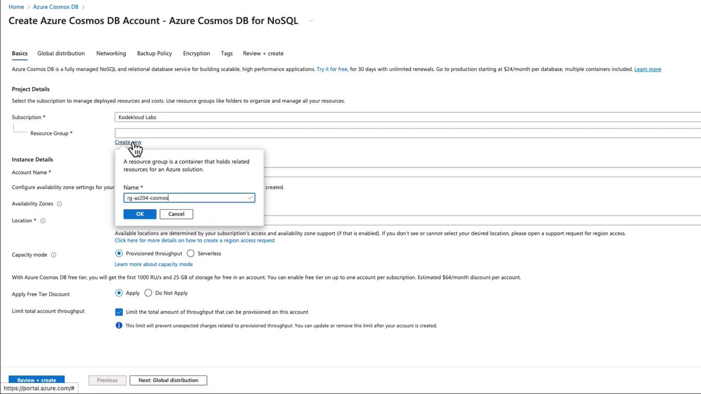

# 🛠️ Deploying Azure Cosmos DB Account – Full Hands-On

<div align="center">
  
</div>

## 1️⃣ Step 1: Open Azure Portal

- Go to 👉 [portal.azure.com](https://portal.azure.com).
- Search for **Cosmos DB** in the top search bar.
- Click **Create → Azure Cosmos DB**.

---

## 2️⃣ Step 2: Choose API (Critical Choice 🚨)

When creating an account, you must pick the **API model**:

- **Core (SQL)** → Default & most common. Uses SQL-like queries. _(Recommended for AZ-204 exams and most apps)_
- **MongoDB** → Mongo-compatible wire protocol.
- **Cassandra** → Wide-column DB API.
- **Gremlin** → Graph API.
- **Table** → Azure Table Storage compatible.

👉 For AZ-204, focus on **Core (SQL)**.

---

## 3️⃣ Step 3: Basics Tab

- **Subscription** → Select your Azure subscription.
- **Resource Group** → Create new (e.g., `rg-cosmosdb-demo`).
- **Account Name** → Must be globally unique (`mycosmosdb123`).
- **API** → Select **Core (SQL)**.
- **Location** → Choose primary region (e.g., `East US`).
- **Capacity Mode**:

  - **Provisioned Throughput** (default).
  - **Serverless** (pay per request).
  - _(Autoscale is configured later when setting RU/s)_.

👉 Exam Tip: Minimum **400 RU/s** required for SLAs.

---

## 4️⃣ Step 4: Global Distribution 🌍

- **Geo-Redundancy**:

  - ON → Automatically adds a second region (for HA).
  - OFF → Single region only.

- **Multi-region Writes**:

  - OFF → Single write region, multiple read regions.
  - ON → Multi-master (active-active writes).

👉 For AZ-204 labs, keep **Geo-Redundancy = OFF**, **Multi-region writes = OFF** (simpler, cheaper).

---

## 5️⃣ Step 5: Networking 🔐

- **Connectivity**:

  - Public endpoint (default).
  - Public endpoint + selected networks.
  - Private Endpoint (VNet only).

- **Firewall rules**: Restrict access by IP.

👉 For hands-on: leave as **All networks**. For production: use **Private Endpoint**.

---

## 6️⃣ Step 6: Backup Policy

- **Continuous Backup (Recommended)**: Allows **Point-in-Time Restore (PITR)**.
- **Periodic Backup**: Default every 4 hours, retained 30 days.

👉 For exam: Continuous = better recovery.

---

## 7️⃣ Step 7: Encryption

- Always ON.
- Options:

  - **Microsoft-managed keys** (default).
  - **Customer-managed keys (CMK)** from Azure Key Vault.

👉 For labs: keep default.

---

## 8️⃣ Step 8: Review + Create

- Click **Review + Create** → **Create**.
- Deployment takes \~5 minutes.

---

## 9️⃣ Step 9: Create Database & Container

Once account is ready:

- Go to your **Cosmos DB account**.
- Click **Data Explorer → New Database**.

  - Name: `store`

- Inside DB → **New Container**:

  - Name: `products`
  - Partition Key: `/category`
  - Throughput: 400 RU/s (or Autoscale).

---

## 1️⃣0️⃣ Step 10: Insert Data

### Option A: Portal Data Explorer

- Click `New Item`.

```json
{
  "id": "p1",
  "name": "Laptop",
  "category": "Electronics",
  "price": 1200
}
```

### Option B: CLI Insert Document

```bash
az cosmosdb sql container create \
  --account-name mycosmosdb123 \
  --resource-group rg-cosmosdb-demo \
  --database-name store \
  --name products \
  --partition-key-path "/category" \
  --throughput 400
```

```bash
az cosmosdb sql item create \
  --account-name mycosmosdb123 \
  --resource-group rg-cosmosdb-demo \
  --database-name store \
  --container-name products \
  --partition-key-value "Electronics" \
  --content '{"id":"p1","name":"Laptop","category":"Electronics","price":1200}'
```

---

## 1️⃣1️⃣ Step 11: Query Data

### Portal → Data Explorer → Query

```sql
SELECT * FROM products p WHERE p.category = 'Electronics'
```

### CLI Query Example

```bash
az cosmosdb sql query \
  --account-name mycosmosdb123 \
  --resource-group rg-cosmosdb-demo \
  --database-name store \
  --container-name products \
  --query "SELECT * FROM c WHERE c.price > 1000"
```

---

## 🧭 Summary (AZ-204 Focus)

- **API = SQL (Core)** for exam.
- **RU/s** must be ≥400 for SLAs.
- **Partition key** must be chosen carefully.
- **Geo-Redundancy + Multi-Region Writes** = high availability.
- **Private Endpoint** = secure networking.
- **Continuous Backup** = point-in-time restore.
- Always authenticate via **Managed Identity** in apps.
