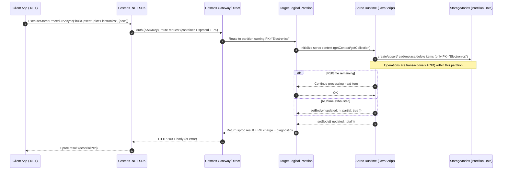
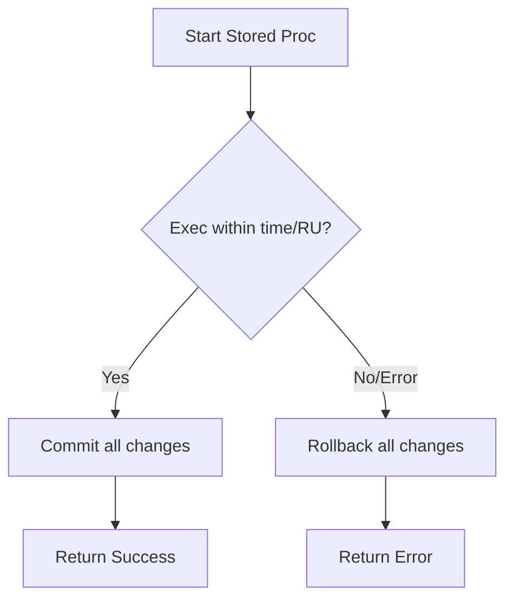
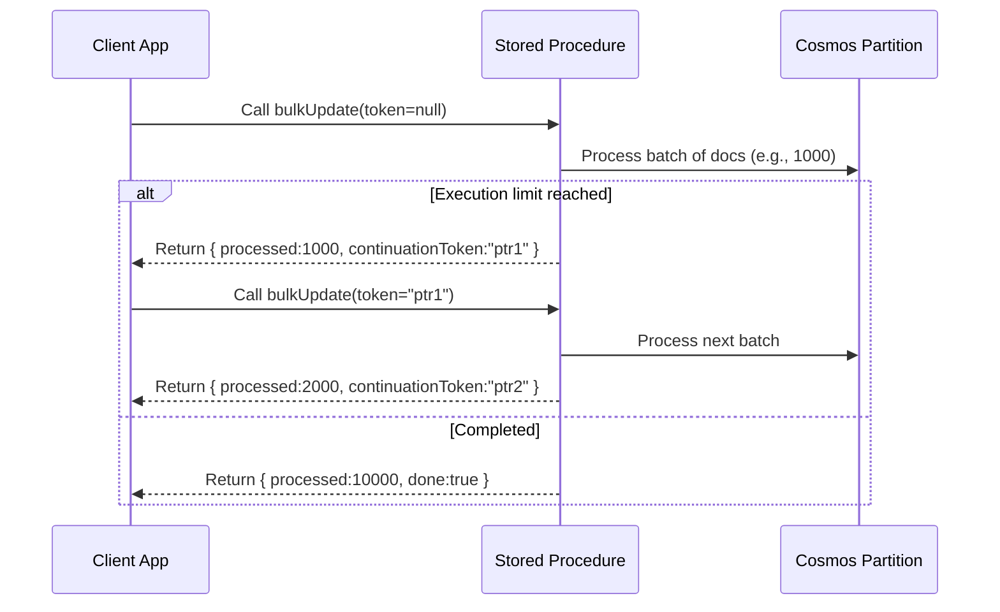
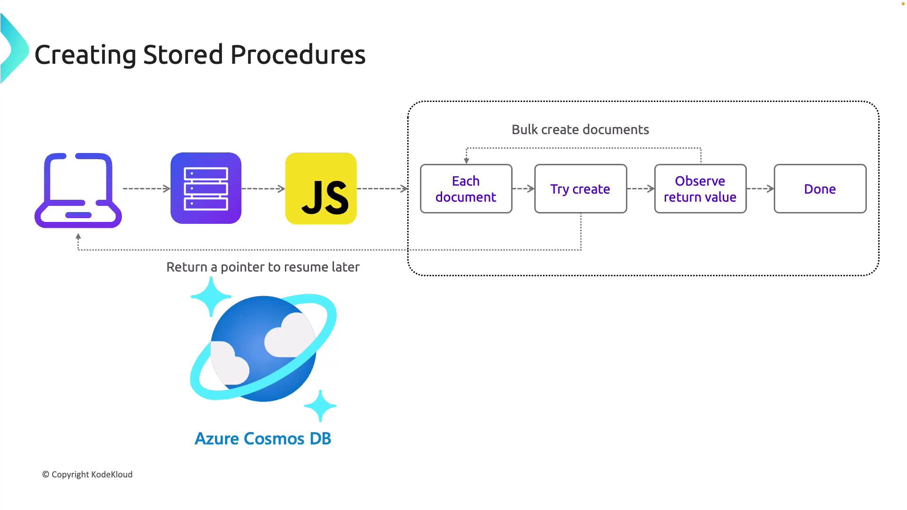

# 🧠 What are Stored Procedures in Cosmos DB?

- **Server-side JavaScript** functions you upload to a **container**.
- Run **inside the database engine** and can perform **multiple operations atomically** **within a single logical partition** (same partition key value).
- Great for: reducing round-trips, enforcing invariants, and doing **ACID** multi-item changes in one go.

> Scope rule (critical): a stored proc can **only read/write items in one logical partition** (i.e., a single value of your partition key). That’s how Cosmos DB guarantees transactionality.

---

## 🧭 When should you use them?

Use a stored procedure when you need **any combination** of:

1. **Atomic multi-item operations** within a partition
   e.g., “update order + its items together or roll back all.”
2. **Business logic close to data** to cut RU + latency
   e.g., bulk upserts of 100 items with one network call.
3. **Conditional workflows** that must be all-or-nothing
   e.g., only insert if a guard document says capacity left.

### Consider alternatives

- **Stored Procedure (sproc)** in Cosmos DB **does not** run automatically or intercept requests.
- It **runs only when your app explicitly calls it** (like calling a function on the server).
- If you want “middleware-like interception,” that’s what **Triggers** are for:

  - **Pre-trigger**: runs **before** a create/replace operation.
  - **Post-trigger**: runs **after** a create/replace operation.

- **TransactionalBatch** (SDK feature) is often simpler for multi-item insert/update/delete in one partition.
- **Change Feed + Functions** for asynchronous pipelines.

> Still, stored procedures shine when you want **custom control flow** and **looping** server-side, not just a batch of simple ops.

---

## 🧱 How they work (quick internals)

- Written in **JavaScript** using the built-ins:

  - `getContext()` → request/response context
  - `getCollection()` → data operations (query/create/replace/delete)

- You call them with:

  - **ID** of the stored procedure
  - A **PartitionKey** value (the transaction’s partition)
  - Optional **parameters** (JSON serializable)

- They execute with **bounded time/RU**, so typical patterns use **continuations** (callbacks) and **early returns** when RU/time is tight.

---

## ⚙️ What actually happens when a sproc runs?

- You call it from your app via SDK/REST: `ExecuteStoredProcedureAsync("sprocId", partitionKey, params...)`.
- Cosmos routes the call to the **target logical partition** (based on the partition key **you pass**).
- The **JavaScript** sproc runs **inside that partition**, can read/write **only items with that same partition key value**, and is **atomic** (ACID) within that scope.
- It returns a **response body** (whatever you set in `getResponse().setBody(...)`) or throws, which rolls back the transaction.

---

<div>



</div>

---

## ⚖️ When do you use each: sproc vs trigger?

### 1️⃣ Stored Procedure

- **How it runs:** Only when **you call it**.
- **Scope:** One **logical partition** (same partition key value).
- **Use for:** Complex multi-step logic, loops, conditionals, multi-item **atomic** updates, custom validation + writes in one transaction.

### 2️⃣ Trigger (middleware-like)

- **How it runs:** Automatically **when attached** to a create/replace operation.

  - **Pre-trigger**: runs **before** the write; can modify the document or reject the op.
  - **Post-trigger**: runs **after** the write; good for audit, side-effects.

- **Scope:** The single item being written (same partition, since the write itself is scoped).
- **Use for:** Validation, stamping metadata, audit trails, enforcing invariants per item.

> UDFs (user-defined functions) are different again: small JS functions used **inside queries** for custom calculations (no I/O, no writes).

---

## 🛠️ Full Hands-On: Create, Register, Execute

We’ll build a stored proc `bulkUpsert` that:

- Accepts an array of documents (all with the **same partition key value**),
- Upserts them one by one,
- Returns how many it inserted/updated.

Assume our container is **`products`** with partition key **`/category`**.

### 1) Stored Procedure (JavaScript)

```javascript
// id: bulkUpsert
function bulkUpsert(docs) {
  var context = getContext();
  var coll = context.getCollection();
  var response = context.getResponse();

  if (!docs || !docs.length) {
    response.setBody({ updated: 0 });
    return;
  }

  var count = 0;

  // Try to upsert each doc; stop if we run out of time/RU
  tryUpsert(docs[count]);

  function tryUpsert(doc) {
    // Ensure doc has the correct partition key value (required for transaction scope)
    // Example: doc.category must be same for all docs
    var accepted = coll.upsertDocument(coll.getSelfLink(), doc, function (err, docCreated) {
      if (err) throw err;

      count++;

      if (count >= docs.length) {
        // done
        response.setBody({ updated: count });
      } else {
        // continue
        tryUpsert(docs[count]);
      }
    });

    // If engine can’t accept more work in this tick (time/RU bounded), return what we have
    if (!accepted) {
      response.setBody({ updated: count, partial: true });
    }
  }
}
```

> Notes
>
> - `upsertDocument` creates or replaces by `id`.
> - We bail out early if the engine can’t accept more work; the caller can re-invoke with the remaining docs.
> - All docs must share the **same `category`** (the partition key value).

### 2) Register the Stored Procedure (C#/.NET)

```csharp
using Microsoft.Azure.Cosmos;

// client, db, container already created…
var sprocBody = File.ReadAllText("bulkUpsert.js");

var sprocProps = new StoredProcedureProperties
{
    Id = "bulkUpsert",
    Body = sprocBody
};

// Create or update (idempotent-ish pattern)
try
{
    await container.Scripts.CreateStoredProcedureAsync(sprocProps);
}
catch (CosmosException ex) when (ex.StatusCode == System.Net.HttpStatusCode.Conflict)
{
    await container.Scripts.ReplaceStoredProcedureAsync(sprocProps);
}
```

### 3) Execute the Stored Procedure (C#/.NET)

```csharp
var categoryPk = "Electronics"; // partition value for the whole transaction
var docs = new[]
{
    new { id = "p101", name = "Headphones", category = categoryPk, price = 199 },
    new { id = "p102", name = "Keyboard",   category = categoryPk, price = 89  },
    new { id = "p103", name = "Mouse",      category = categoryPk, price = 49  }
};

// Execute with partition key + params (params must match JS signature)
StoredProcedureExecuteResponse<dynamic> rsp =
    await container.Scripts.ExecuteStoredProcedureAsync<dynamic>(
        storedProcedureId: "bulkUpsert",
        partitionKey: new PartitionKey(categoryPk),
        parameters: new dynamic[] { docs });

Console.WriteLine(rsp.Resource); // { "updated": 3 }  (or partial true if it stopped early)
```

---

## ⏱️ Bounded Execution Model in Cosmos DB

### 📖 What It Means

- **All server-side code (Stored Procedures, Triggers, UDFs)** in Cosmos DB must finish within a **bounded execution time** (≈ a few seconds, enforced by RU + resource limits).
- If the execution **completes within the limit** → changes are **committed atomically**.
- If the execution **times out or errors** → the entire transaction is **rolled back** (no partial updates).

> 👉 This ensures **ACID** transactions at the partition level.  
> 💡 Maximum execution time for a stored procedure is **5 seconds**.

---

### 💭 Example

Imagine you run a stored procedure to update an airport’s code:

- ✅ If it runs fast and finishes → the new code is saved.
- ❌ If it takes too long (e.g., too many reads/writes) → Cosmos aborts and **rolls back all updates**.

This prevents **half-updated data**.

---

### 🖼️ Bounded Execution Flow

<div align="center">



</div>

---

### 📝 Exam Tip

- Always assume **bounded runtime** for sprocs/triggers/UDFs.
- Design sprocs to do **small work per call**.
- For bulk ops, combine with **continuation model** (next section).

---

## 🔁 Transaction Continuation

### 📖 What It Means

- Cosmos DB provides a **continuation model** for long-running sprocs.
- Instead of failing when the **execution bound is hit**, a sproc can:

  - Do **partial work** (e.g., process first 100 docs).
  - Return a **continuation token** (like a pointer/marker).
  - Client re-calls the sproc, passing the token, so it resumes where it left off.

👉 This way, bulk operations are broken into **safe, resumable chunks**.

---

### 💭 Example

Updating 10,000 airport records in one partition:

- First call → updates 1,000 docs, then returns token.
- Second call → resumes with token, updates next 1,000.
- Repeat until all docs are processed.

Every **chunk is ACID within itself**.

---

### 🖼️ Continuation Flow

<div align="center">



</div>

---

<div align="center">
  
</div>

---

## ✍️ Another classic pattern: transactional “transfer”

If you need **read-modify-write** across **multiple docs** in the **same partition**, a stored procedure can:

1. Query doc A (ensure invariants),
2. Update doc A,
3. Update doc B,
4. Return success or throw to roll back everything.

> This is similar to `TransactionalBatch`, but a sproc lets you **query/branch** mid-transaction in JavaScript.

---

## 🧩 Common options, tips & gotchas

- **Partition scope**: You must pass the **partition key value** when executing. All reads/writes must target that same value.
- **Time/RU bounded**: If your loop is big, design for **partial progress** and re-invoke with remaining work (the example above handles this).
- **Security**:

  - Key-based apps: fine.
  - **AAD/RBAC**: ensure your principal has data plane rights that allow scripts (e.g., **Cosmos DB Built-in Data Contributor**).

- **Versioning**: Treat sproc body as code; store in source control and redeploy via CI/CD.
- **Debugging**: Return useful info in the response body (`counts`, `ids processed`) and log from your app on failures.
- **When not to use**:

  - Cross-partition transactions (not supported).
  - Simple same-partition CRUD without branching → prefer **TransactionalBatch** (cleaner, typed).

- **Triggers & UDFs (for context)**:

  - **Pre-trigger**: validate/augment docs before create/replace.
  - **Post-trigger**: audit/log after write.
  - **UDFs**: custom scalar functions usable inside SQL queries (no I/O).

- Stored procedures **must finish within bounded execution time**.
- If they don’t → **rollback happens automatically**.
- Use **continuation tokens** to implement **resumable transactions**.

---

## 📎 Minimal “cheat sheet” to memorize

- **Where**: Stored on **container**; execute with **partition key**.
- **Language**: **JavaScript** with `getContext()/getCollection()`.
- **Why**: **Atomic** multi-item work in **one partition**; fewer round-trips.
- **Call**: `container.Scripts.ExecuteStoredProcedureAsync<T>(id, pk, params)`
- **Bulk**: Loop `createDocument/upsertDocument`; stop when not `accepted` (partial progress).
- **Alt**: Prefer **TransactionalBatch** for simple multi-item ops; sprocs for custom logic.
