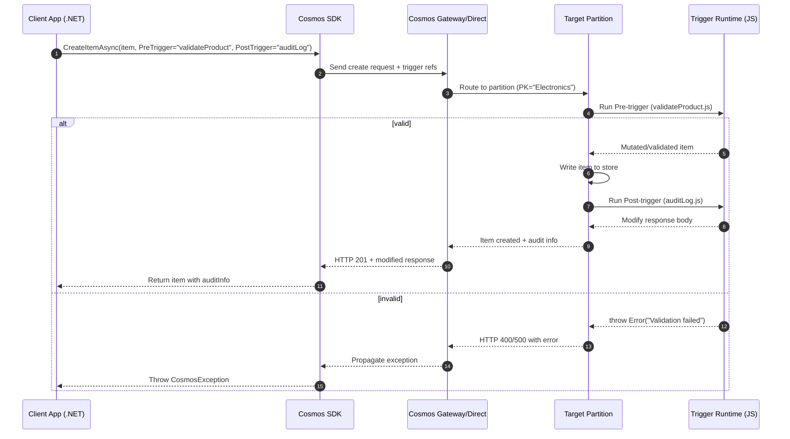

# 🔁 Cosmos DB Triggers (SQL API)

## 🧠 What are Triggers?

- Small **JavaScript functions** that run **server-side** inside Cosmos DB.
- Attached to a **container** and executed:

  - **Pre-trigger** → runs **before** a create/replace operation.
  - **Post-trigger** → runs **after** a create/replace operation.

- Scoped to the **single item** being modified (unlike sprocs which can touch multiple).
- Must be **explicitly attached** to the operation — they **don’t fire automatically** on every request.  
  👉 You specify in SDK call: `PreTriggers = { "myTrigger" }`.

---

## 🧭 When to Use Triggers

### Pre-trigger ✅

- Validate documents before insert/update.
- Enforce business rules (e.g., “price can’t be negative”).
- Add/modify fields automatically (timestamps, userId, etc.).

### Post-trigger ✅

- Audit or log metadata after the item is created.
- Cascade small actions (e.g., update summary doc).
- Return a computed value along with response.

---

## ⚖️ When NOT to Use

- **Bulk operations** → Pre/Post triggers execute **per item**, which can become expensive.
- **Cross-item logic** → Triggers only affect the single item in the operation.
  Use **Stored Procedures** or **TransactionalBatch** for multi-item atomicity.
- **Read-only scenarios** → Triggers don’t fire on `Read` or `Query`.

---

## 🛠️ Full Hands-On Example

Assume container: **`products`** with partition key `/category`.

---

### 1) Pre-Trigger: Validation & Auto-field

```javascript
// id: validateProduct
function validateProduct() {
  var ctx = getContext();
  var req = ctx.getRequest();
  var doc = req.getBody();

  if (!doc.name) {
    throw new Error("Product must have a name.");
  }
  if (doc.price < 0) {
    throw new Error("Price must be non-negative.");
  }

  // Add audit fields
  doc.createdAt = new Date().toISOString();
  doc.verified = true;

  // Set updated doc back to request
  req.setBody(doc);
}
```

👉 This ensures every inserted product has `createdAt` and `verified` fields.

---

### 2) Post-Trigger: Audit Example

```javascript
// id: auditLog
function auditLog() {
  var ctx = getContext();
  var resp = ctx.getResponse();

  var doc = resp.getBody();

  // Modify the response sent to the client
  doc.auditInfo = "Item successfully inserted at " + new Date().toISOString();

  resp.setBody(doc);
}
```

👉 This doesn’t modify the stored item, only the **response body** returned to the client.

---

### 3) Register Triggers (C# SDK)

```csharp
var preTrigger = new TriggerProperties
{
    Id = "validateProduct",
    Body = File.ReadAllText("validateProduct.js"),
    TriggerOperation = TriggerOperation.Create,       // Run only on Create
    TriggerType = TriggerType.Pre
};

await container.Scripts.CreateTriggerAsync(preTrigger);

var postTrigger = new TriggerProperties
{
    Id = "auditLog",
    Body = File.ReadAllText("auditLog.js"),
    TriggerOperation = TriggerOperation.Create,       // Run only on Create
    TriggerType = TriggerType.Post
};

await container.Scripts.CreateTriggerAsync(postTrigger);
```

---

### 4) Use Triggers in Operations

```csharp
var item = new { id = "p200", name = "Monitor", category = "Electronics", price = 299 };

// Call Create with Pre and Post triggers
var options = new ItemRequestOptions
{
    PreTriggers = new List<string> { "validateProduct" },
    PostTriggers = new List<string> { "auditLog" }
};

var resp = await container.CreateItemAsync(item, new PartitionKey("Electronics"), options);

Console.WriteLine(resp.Resource); // includes auditInfo from Post-trigger
```

---

## 📊 Mermaid Sequence: Pre & Post Trigger Flow

<div align="center">



</div>

---

## 🧩 Quick Exam-style Cheat Points

- **Pre-trigger**: modifies/validates **request** before write.
- **Post-trigger**: modifies **response** after write.
- **Scope**: single item, not multi-item.
- **Must attach explicitly**: they do _not_ auto-run on every operation.
- **Common trap**: triggers are **not** invoked on queries or reads.
- **Best practice**: use them sparingly (validation/audit), not for every write in high-throughput workloads (RU overhead).
