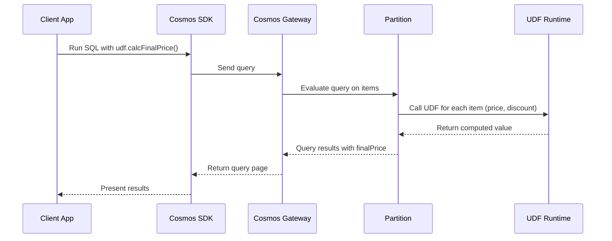

# 🧠 What is a UDF in Cosmos DB?

- A **User-Defined Function (UDF)** is a **JavaScript function** you register in a container.
- It can be called **inside SQL queries** to apply custom logic that isn’t natively available in Cosmos SQL.
- **Scope**:

  - Runs **per item during query evaluation**.
  - Purely computational → **cannot read/write data**.

- Think of it as: _“custom SQL scalar function but for Cosmos DB.”_

---

## 🧭 When to Use UDFs

✅ Use UDFs when you need:

- Custom **transformations** or **calculations**.
- Business logic in queries (e.g., complex tax rules, string cleanup).
- Reusable formulas across queries.

❌ Don’t use UDFs when:

- You need to **modify documents** (use stored procedures/triggers).
- You need **cross-document logic**.
- You can achieve the same with **native SQL operators** (cheaper, faster).

---

## 🛠️ Full Hands-On Example

Assume container **`products`** with docs like:

```json
{ "id": "p1", "name": "Laptop", "price": 1200, "discount": 0.15 }
```

---

### 1) Define UDF in JavaScript

```javascript
// id: calcFinalPrice
function calcFinalPrice(price, discount) {
  if (!discount) {
    discount = 0;
  }
  return price - price * discount;
}
```

👉 Notice:

- Pure function.
- Returns a single value.
- No access to other docs.

---

### 2) Register UDF via C# SDK

```csharp
var udf = new UserDefinedFunctionProperties
{
    Id = "calcFinalPrice",
    Body = File.ReadAllText("calcFinalPrice.js")
};

await container.Scripts.CreateUserDefinedFunctionAsync(udf);
```

---

### 3) Query Using UDF

```csharp
var sql = "SELECT c.name, udf.calcFinalPrice(c.price, c.discount) AS finalPrice FROM c";

var it = container.GetItemQueryIterator<dynamic>(sql);
while (it.HasMoreResults)
{
    foreach (var doc in await it.ReadNextAsync())
    {
        Console.WriteLine($"{doc.name} costs {doc.finalPrice}");
    }
}
```

👉 Expected output:

```ini
Laptop costs 1020
```

---

## 📊 Mermaid Flow – Query with UDF



---

## 🧩 Cheat Sheet

- **Definition**: Custom JavaScript function you call inside SQL queries.
- **Scope**: Runs per-item; no I/O (cannot read/write docs).
- **Register**: `container.Scripts.CreateUserDefinedFunctionAsync(props)`.
- **Call**: `udf.<name>(args...)` inside SQL.
- **Use case**: Custom formula, transformation, string/date logic.
- **Limit**: Consumes RUs like normal query operators (but slightly more than built-ins).

---

## ✅ Exam Tips

- UDFs are **only usable inside SELECT/WHERE/ORDER BY** in SQL queries.
- They do **not** trigger automatically (unlike Triggers).
- They do **not** run in write paths (unlike Triggers/Sprocs).
- If you need **transactional logic**, use Stored Procedures.
