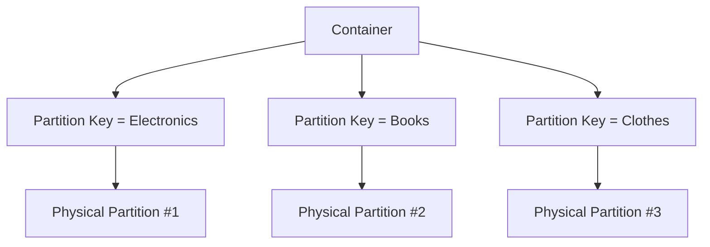

# 🌍 Cosmos DB – Global Distribution & Partitioning

## 🗺️ Global Distribution – The Big Picture

Cosmos DB was designed for **planet-scale applications**. That means:

- Data lives **close to users** (low latency worldwide).
- Failover happens **automatically** (disaster recovery built-in).
- Developers don’t need to manage replication themselves.

**How it works:**

- Each **Cosmos DB account** can be associated with **multiple Azure regions**.
- Cosmos DB automatically replicates data to those regions using **multi-master replication protocol**.
- Developers choose the **consistency level** (we’ll cover later).

📌 **Exam Note**: By default, writes go to the **write region**. You can enable **multi-region writes** for true multi-master.

---

## 🔄 Failover Behavior

- **Automatic Failover** → Cosmos switches traffic to the next priority region if the write region fails.
- **Manual Failover** → You trigger it (e.g., maintenance/test).
- Failover priorities are configured per region.

👉 Example Exam Question:
_“You need 99.999% availability and automatic failover across 3 regions. Which setting must be enabled?”_
✔️ Enable **multi-region writes** + configure **automatic failover**.

---

## 🧩 Partitioning – The Heart of Scalability

Cosmos DB’s scale magic = **partitioning**.

Think of it like this:

- **Logical Partition** = Group of items sharing the same **Partition Key value**.
- **Physical Partition** = Actual storage + compute unit managed by Azure.



- You define a **Partition Key path** (like `/category`).
- Cosmos DB hashes the partition key value → maps it to a **physical partition**.
- Each physical partition has a fixed RU and storage quota (≈ 50 GB, 10,000 RU/s).

📌 Cosmos DB **splits partitions automatically** when you outgrow one.

---

## ⚡ Why Partitioning Matters

Partitioning affects:

1. **Performance** – Queries targeting a single partition are faster + cheaper.
2. **Scaling** – Load is distributed evenly only if partition key has **high cardinality** (many unique values).
3. **RU Consumption** – Cross-partition queries = more RU usage.

👉 **Bad Partition Key**: `/country` (only a few values, e.g., "US", "UK", "IN").  
👉 **Good Partition Key**: `/userId` (millions of unique values).

📌 **Exam Tip**: Always choose a partition key with **high cardinality** and **even access patterns**.

---

## 📦 Partition Routing

- **Point Reads/Writes**: If you supply `id + partitionKey`, Cosmos directly goes to the right partition (fast, cheap).
- **Queries Without Partition Key**: Cosmos fans out to **all partitions** → slower, expensive.

👉 Example:

```sql
-- Efficient: hits only one partition
SELECT * FROM Products WHERE category = 'Electronics' AND id = '123'

-- Expensive: fan-out query
SELECT * FROM Products WHERE price > 1000
```

---

## 🧭 Multi-Region Writes vs Single-Region Writes

| Mode                    | Behavior                                                   | Use Case                                   |
| ----------------------- | ---------------------------------------------------------- | ------------------------------------------ |
| **Single Write Region** | One primary write region, multiple read regions            | Simpler apps, write-heavy in one geography |
| **Multi-Region Writes** | All regions accept writes, conflict resolution rules apply | Global apps with active users everywhere   |

📌 Conflict resolution defaults to **last-write-wins**, but you can configure **custom conflict resolution policies** (like stored procedures).

---

## 🆚 AWS Comparison

| Concept                | Cosmos DB                           | DynamoDB                       |
| ---------------------- | ----------------------------------- | ------------------------------ |
| **Global Replication** | Built-in, multi-master option       | DynamoDB Global Tables         |
| **Partition Key**      | Mandatory, drives scaling           | Mandatory, drives scaling      |
| **Partition Split**    | Automatic                           | Automatic                      |
| **Failover**           | Configurable priority (auto/manual) | Region-level, more manual      |
| **Multi-API**          | SQL, Mongo, Cassandra, etc.         | Only Dynamo API (with PartiQL) |

---

## 🛠️ Implementation Example

### Create a Multi-Region Account (Azure CLI)

```bash
az cosmosdb create \
  --name mycosmos \
  --resource-group myrg \
  --locations regionName=eastus failoverPriority=0 \
  --locations regionName=westeurope failoverPriority=1 \
  --default-consistency-level Session
```

### Add a Container with Partition Key (C# SDK)

```csharp
Container container = await db.CreateContainerIfNotExistsAsync(
    id: "products",
    partitionKeyPath: "/category", // Partition Key
    throughput: 400
);
```

---

## 🎯 Exam Gotchas (Global Dist. + Partitioning)

- **Partition Key is mandatory** for containers (except fixed containers <20 GB).
- **Cross-partition queries cost more RU**.
- **Unit of scale = Container**, not Database.
- **Multi-Region Writes** = active-active, conflicts possible.
- **Automatic failover** needs to be explicitly enabled.
- **SLA (99.999%)** only applies when you use **multi-region writes**.
