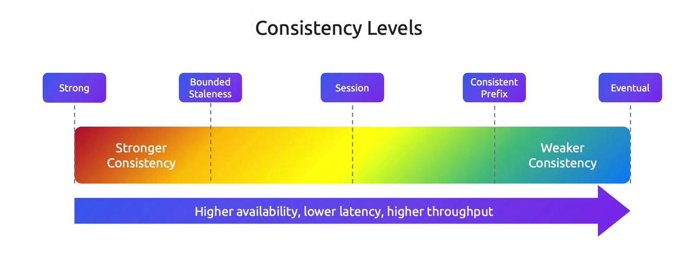
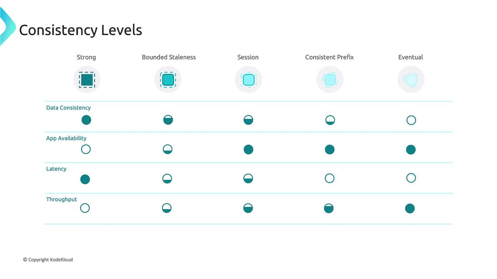

# ⚖️ Cosmos DB – Consistency Models

## 📖 What is Consistency in Cosmos DB?

When you replicate data across multiple regions, you need a contract between:

- **Consistency** (how fresh/accurate the data is)
- **Latency** (how fast queries return)
- **Availability** (what happens during failures)

Cosmos DB gives you **5 tunable consistency models**, instead of just strong vs eventual like DynamoDB.
This lets you choose the right balance for your app.

---

## 🔑 The 5 Consistency Levels

Think of them on a spectrum:

<div align="center" style="background-color: #ffffffff ;border-radius: 10px;border: 2px solid white">
  
</div>

### 1. **💪 Strong**

- **Guarantee**: Always read the **latest committed write**.
- **Trade-off**: Highest latency + reduced availability (only works within 1 region OR two <u title="مجاورة">adjacent</u> regions).
- **Use Case**: Banking transactions, <u title="تجارة المخازن">stock trading</u>.

### 2. **⏳ <u title="الركود المحدود" >Bounded Staleness</u>**

- **Guarantee**: Reads lag behind writes by at most **N versions** or **T time interval**.
- **Trade-off**: Medium latency, predictable staleness.
- **Use Case**: Leaderboards, order tracking (slight delay OK).

### 3. **👤 Session** _(Default)_

- **Guarantee**: Within a client session, you always see your own writes (Read-Your-Own-Writes).
- **Trade-off**: Best balance of **performance + consistency**.
- **Use Case**: Web/mobile apps where a user should see their updates immediately.

### 4. **📖 Consistent Prefix**

- **Guarantee**: Reads never see out-of-order writes (e.g., if writes are A → B → C, you’ll never see A → C without B).
- **Trade-off**: Better latency than Session, but less strict.
- **Use Case**: Social media feeds, logs.

### 5. **🌊 Eventual**

- **Guarantee**: No ordering guarantees; reads eventually converge.
- **Trade-off**: Lowest latency, cheapest.
- **Use Case**: Analytics, recommendations, non-critical reads.

---

## ⚖️ Comparison Table

<div align="center" style="background-color: #ffffffff ;border-radius: 10px;border: 2px solid white">
  
</div>

---

### 📊 Final Comparison Table (Cosmos DB Consistency Models)

<div align="center" style="color:white;background-color: #545b6bff ;border-radius: 10px;border: 2px solid white">

| Model                 | Freshness           | Ordering  | Latency | Throughput | Availability |
| --------------------- | ------------------- | --------- | ------- | ---------- | ------------ |
| **Strong**            | Latest              | Ordered   | Highest | Lowest     | Lowest       |
| **Bounded Staleness** | N versions / T time | Ordered   | High    | Low        | High         |
| **Session**           | Latest in session   | Ordered   | Medium  | Medium     | High         |
| **Consistent Prefix** | Can be stale        | Ordered   | Low     | High       | High         |
| **Eventual**          | Eventually          | Unordered | Lowest  | Highest    | Highest      |

</div>

---

### 🔍 Header Explanations

The consistency level offered by Cosmos DB. Each model defines how data is read across replicas in a distributed system.

#### 🥗 **Freshness**

How **up-to-date** the data is when read.

- High freshness = latest data
- Low freshness = possibly stale data

#### ⚡ **Latency**

How **quickly** the system responds to a read request.

- Low latency = fast response
- High latency = slower due to coordination

#### 🛡️ **Availability**

How **reliably** the system can serve reads, even during failures.

- High availability = system rarely fails to respond
- Low availability = system may reject reads during issues

#### 🔁 **Ordering**

Whether reads **preserve the order** of writes.

- Ordered = reads follow the sequence of writes
- Unordered = reads may arrive out of order

#### 🚀 **Throughput**

How many **operations per second** the system can handle.

- High throughput = more scalable
- Low throughput = more coordination overhead

---

## 🧠 How It Works Internally

- Cosmos DB uses a **replication protocol** across regions.
- The chosen consistency model defines how many replicas must **acknowledge a write** before confirming.
- Example:

  - **Strong** → All replicas must confirm.
  - **Eventual** → Primary replica confirms immediately, secondaries catch up later.

---

## 🆚 AWS Comparison

| Cosmos DB                                   | DynamoDB                         |
| ------------------------------------------- | -------------------------------- |
| 5 consistency levels                        | Only **Strong** and **Eventual** |
| Fine-grained tuning                         | Simple but less flexible         |
| Session-level reads (RYOW)                  | Not directly supported           |
| Global multi-region SLA tied to consistency | Only region-based replication    |

👉 **Cosmos DB is more flexible**, which is why MSFT loves to test it.

---

## 🛠️ Implementation Examples

### Set Consistency at Account Level (CLI)

```bash
az cosmosdb update \
  --name mycosmos \
  --resource-group myrg \
  --default-consistency-level Session
```

### Override Consistency Per Request (C# SDK)

```csharp
QueryRequestOptions options = new QueryRequestOptions
{
    ConsistencyLevel = ConsistencyLevel.BoundedStaleness
};

var query = container.GetItemQueryIterator<dynamic>(
    "SELECT * FROM c", requestOptions: options);
```

📌 **Default = Session**. You can override per request if needed.

---

## 🎯 Exam Gotchas

- **Default consistency = Session**.
- **Strong consistency** only supported across **≤2 regions in the same Azure geography**.
- **Bounded Staleness** → must specify N versions or T interval.
- **Session consistency** ensures **Read-Your-Own-Writes** but not across users.
- **Consistent Prefix** preserves order but not freshness.
- **Eventual consistency** gives max performance but no guarantees.
- **Consistency can be set at account level** (default) and **overridden per request**.

👉 Typical Exam Question:
_“A global shopping app requires users to always see their own updates instantly, but can tolerate stale data from other users. Which consistency model?”_
✔️ **Session**.

---

## 🎬 The Movie Analogy 🎥

Imagine you and your friends are watching a **movie** that’s being released globally.
Different consistency levels = how fast everyone sees the **latest scene**.

### 1. **Strong** 💪 = _Everyone in the cinema sees the latest scene at the same time._

- No one is behind.
- **But** you must wait for everyone’s screen to sync → slow.
- ✅ Use: Banking, critical systems.
- ❌ Don’t use: Global apps with high latency tolerance.

---

### 2. **Bounded Staleness** ⏳ = _Everyone sees the movie with a delay of exactly 5 minutes._

- You’ll never be more than **N versions** or **T time** behind.
- Predictable delay.
- ✅ Use: Leaderboards, order status (delay OK, but not chaos).
- ❌ Don’t use: Anything needing _instant correctness_.

---

### 3. **Session** 👤 = _Each person has their own private Netflix account._

- You **always see your own actions instantly** (e.g., “continue watching”).
- But other users’ actions might lag.
- ✅ Use: Most web/mobile apps (user sees their own cart, posts, likes).
- ❌ Don’t use: Global shared truth across all users.

---

### 4. **Consistent Prefix** 📖 = _Everyone sees the movie in the correct order of scenes, but they might be behind._

- If the movie is A → B → C, you’ll never see A → C without B.
- But you might only be at A or AB while others are at ABC.
- ✅ Use: Feeds, logs (order matters more than freshness).
- ❌ Don’t use: Apps needing up-to-date reads.

---

### 5. **Eventual** 🌊 = _Everyone gets the movie scenes at random times, but eventually everyone catches up._

- You might see scene C before B.
- Lowest latency, maximum chaos.
- ✅ Use: Analytics, recommendations, background tasks.
- ❌ Don’t use: Transactions or user-facing critical flows.

---

## 📊 Easy Table to Memorize

| Level                 | Guarantee                        | Real-Life Analogy              | Best For                     |
| --------------------- | -------------------------------- | ------------------------------ | ---------------------------- |
| **Strong**            | Always latest write              | Everyone in cinema, same frame | Banking, stock trades        |
| **Bounded Staleness** | At most N versions/T time stale  | Always 5 min behind            | Order tracking, leaderboards |
| **Session**           | Read-Your-Own-Writes             | Netflix “Continue Watching”    | Most apps (default)          |
| **Consistent Prefix** | Order preserved, freshness not   | Watch movie scenes in order    | Feeds, logs                  |
| **Eventual**          | Eventually consistent, unordered | Scenes arrive randomly         | Analytics, caching           |

---

## 🎯 Exam Hacks

1. **If “Read-Your-Own-Writes” appears → Session**.
2. **If “Must always see latest globally” → Strong**.
3. **If “Predictable lag” (N versions or T time) → Bounded Staleness**.
4. **If “Order must be preserved, but freshness can lag” → Consistent Prefix**.
5. **If “Performance/lowest latency, stale data fine” → Eventual**.

---

## 🧩 Memory Trick

### 🎭 Mnemonic: "**Super Boring Sessions Can Explode**"

Each word stands for a consistency model in **descending order of consistency** (from strictest to loosest):

| Word         | Model                 | Personality      |
| ------------ | --------------------- | ---------------- |
| **Super**    | **Strong**            | 🛡️ Perfectionist |
| **Boring**   | **Bounded Staleness** | ⏳ Timekeeper    |
| **Sessions** | **Session**           | 👤 Loyal Friend  |
| **Can**      | **Consistent Prefix** | 📚 Historian     |
| **Explode**  | **Eventual**          | 🌀 Free Spirit   |

---

### 🧠 How to Use It

Imagine a **team of five characters** in a sitcom:

- **Super**: Always wants the freshest gossip, but takes forever to get ready.
- **Boring**: Shows up late but insists on telling stories in order.
- **Sessions**: Only remembers what _you_ told them.
- **Can**: Tells stories in order but forgets the juicy bits.
- **Explode**: Bursts in with random updates, no timeline, no order.

---

### 🪄 Bonus: Arabic Twist for Humor

If you want to explain this to Arabic-speaking peers:

> تخيلهم زي خمس شخصيات في مسلسل كوميدي:  
> "سوبر" دايمًا عايز آخر الأخبار، بس ب يحتاج وقت.  
> "بورينج" بيحب النظام بس مش دايمًا سريع.  
> "سيشنز" فاكر كلامك بس مش كل حاجة.  
> "كان" بيحكي بالترتيب بس ممكن يكون قديم.  
> "إكسبلود" بيقول أي حاجة في أي وقت!
