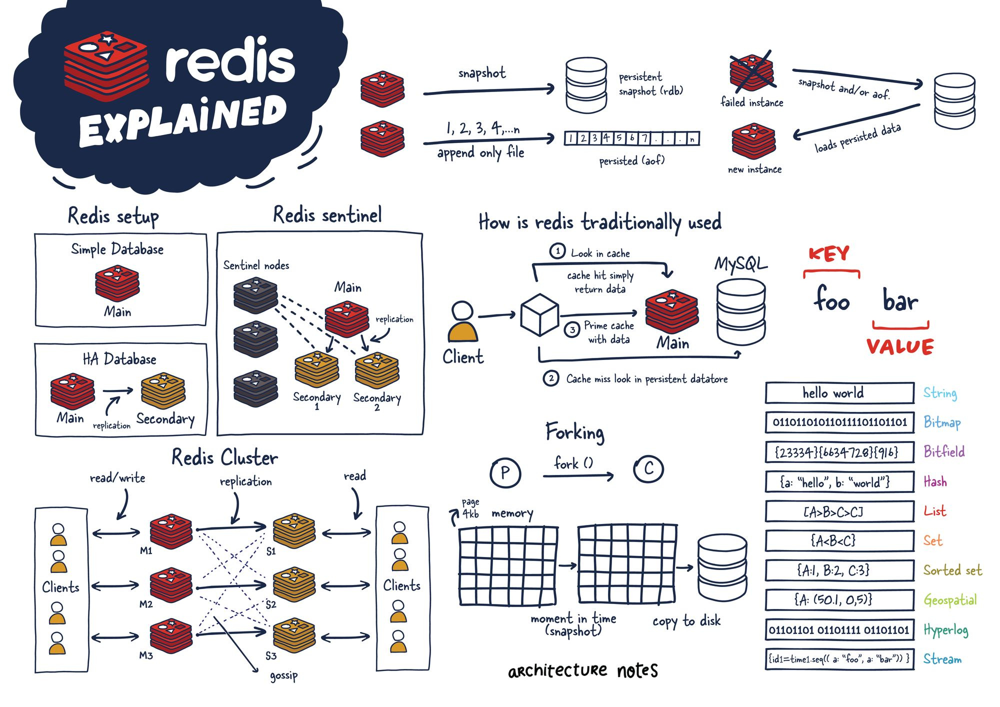
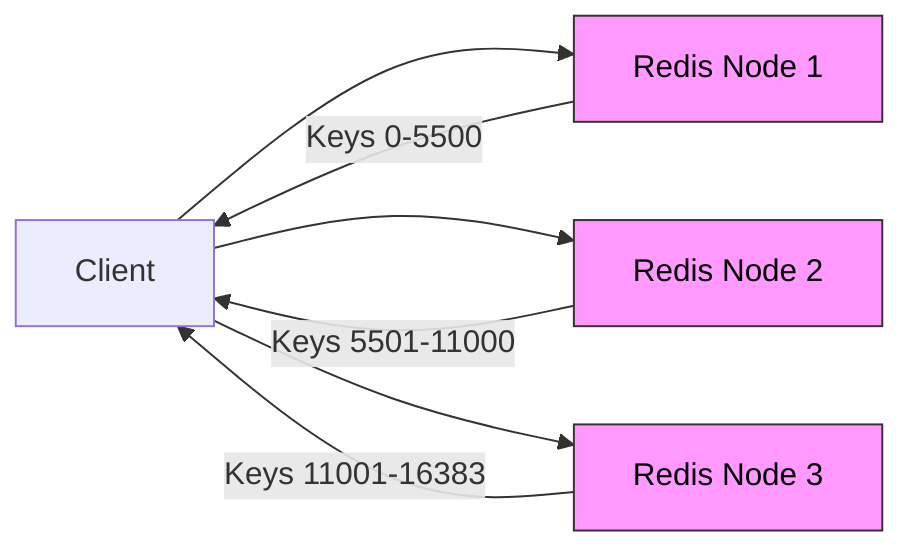

# ⚡ **Redis**

📖 **Redis (REmote DIctionary Server)** is an **in-memory data store** used as:

- **Cache** (super-fast, keep hot data in RAM)
- **Database** (key-value, with optional persistence)
- **Message Broker** (Pub/Sub, Streams, Queues)

---

<div align="center" style="background-color: #ffffffff ;border-radius: 10px;border: 2px solid white;margin:0 30px;">
  
</div>

---

## 🔑 **Common Redis Data Types & Commands**

### 🔹 Strings

- Most common type — simple key/value

  ```bash
  SET name "azure"
  GET name
  INCR counter
  EXPIRE name 60   # TTL 60 sec
  ```

### 🔹 Hashes

- Store object-like structures (like JSON but lighter)

  ```bash
  HSET user:1 name "Alice" age 30
  HGET user:1 name
  HGETALL user:1
  ```

### 🔹 Lists

- Ordered collection, push/pop from both ends

  ```bash
  LPUSH queue task1
  RPUSH queue task2
  LPOP queue
  LRANGE queue 0 -1
  ```

### 🔹 Sets

- Unique values, like a `HashSet`

  ```bash
  SADD tags azure redis cache
  SMEMBERS tags
  SISMEMBER tags redis
  ```

### 🔹 Sorted Sets

- Like Sets, but with a score → good for leaderboards

  ```bash
  ZADD leaderboard 100 "Alice"
  ZADD leaderboard 200 "Bob"
  ZRANGE leaderboard 0 -1 WITHSCORES
  ```

### 🔹 Pub/Sub

- Simple message broadcasting

  ```bash
  SUBSCRIBE news
  PUBLISH news "Hello Redis!"
  ```

### 🔹 Streams

- Log-based data, Kafka-lite style

  ```bash
  XADD mystream * user "Alice" msg "Hello"
  XRANGE mystream - +
  XREAD COUNT 1 STREAMS mystream $
  ```

---

### 🔹 Special Data Types

- **Bitmap** → track bits efficiently (`SETBIT`, `GETBIT`)
- **HyperLogLog** → approx unique count (`PFADD`, `PFCOUNT`)
- **Geospatial** → store/query lat-long (`GEOADD`, `GEORADIUS`)
- **Streams** → append-only log for events (`XADD`, `XREAD`)

---

## ⚙️ **How Redis Works**

- **In-memory engine**: All keys/values live in RAM → microsecond access.
- **Persistence** (optional):

  - **RDB (snapshot)**: saves dump.rdb at intervals
  - **AOF (append-only file)**: logs every write → replay on restart
  - Can combine RDB + AOF

- **Single-threaded event loop** (non-blocking I/O) → predictable latency
- **Network model**: Uses **RESP protocol** over TCP (binary-safe).

---

## 📈 **Scaling Redis**

Redis can scale in **two ways**:

### ⬆️ Vertical Scaling (VL)

- Add more CPU, RAM to single node.
- ✅ Simple
- ❌ Expensive, limited by machine size

---

### ➡️ Horizontal Scaling (HZ – Redis Cluster)

- Data **sharded** into 16,384 **hash slots**.
- Slots distributed across multiple **masters (M1, M2, M3)**.
- Each master has replicas (S1, S2, S3).
- **Clients → ask cluster → cluster routes request to correct slot.**
- Uses **Gossip protocol** to share node state.

<div align="center" style="background-color: #ffffffff ;border-radius: 10px;border: 2px solid white;margin:0 30px;">



</div>

---

> 📌 Example:  
> 🔹 `SET user:100` → Redis hashes key → slot → sends to correct master.  
> 🔹 If that master fails → replica promoted → HA.

---

## ❤️ **High Availability (HA)**

### 🟢 Replication

- Master → one or more replicas.
- Replicas can serve read queries.

### 🟢 Redis Sentinel

- Separate monitoring nodes.
- Detect failure of master.
- Elect a replica → promote to master.
- Clients automatically redirected.

### 🟢 Redis Cluster

- Combines **sharding + replication + HA**.
- Built-in failover, no single point of failure.

---

## 🚦 **Typical Use Cases**

- **Cache-aside** pattern → reduce DB load
- **Session store** → fast user sessions
- **Leaderboard** → sorted sets
- **Queue** → lists or streams
- **Rate limiting** → counters + TTL
- **Pub/Sub** → event notifications

---

## 📝 **Quick Memory Hooks**

- **String** = basic value
- **Hash** = object (user profile)
- **List** = queue/stack
- **Set** = unique tags
- **Sorted Set** = leaderboard
- **Pub/Sub** = chat, events
- **Streams** = Kafka-lite
