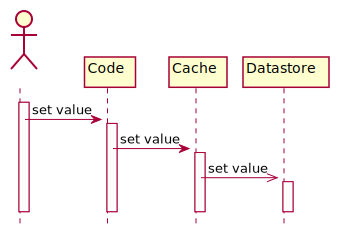

# 🚀 **Caching Patterns**

Caching is about **speed vs. freshness**.
👉 Instead of hitting the **slow database** every time, we keep a **copy of data in cache** (fast memory).
But _how_ we sync cache with DB = caching pattern.

---

## 1️⃣ Cache-Aside (a.k.a Lazy Loading) 💤

**How it works:**

- App checks cache first.
- If **miss**, fetch from DB → store in cache → return.
- Writes: update DB + clear cache/update cache.

- **Cache-Aside For Read:**

  

- **Cache-Aside For Write:**

  

> ✅ Simple, everyone understands it.  
> ❌ Risk: DB and cache can get **out of sync** (if one fails).

👉 Think: _“If it’s not in my fridge, I’ll go to the store and then put it in the fridge for next time.”_ 🛒

---

## 2️⃣ Read-Through 📖

**How it works:**

- App only talks to cache.
- Cache knows how to fetch from DB if needed.

  

> ✅ Cleaner code → app doesn’t care about DB.  
> ❌ Requires a **smarter cache provider**.

👉 Think: _“I always ask my assistant (cache). If they don’t know, they’ll go check the store (DB).”_ 🤵

---

## 3️⃣ Write-Through ✍️

**How it works:**

- App writes to **cache only**.
- Cache writes to DB **synchronously**.

  

> ✅ Always in sync, app code is simpler.  
> ❌ Slower writes (waiting for DB).

👉 Think: _“When I tell my assistant to buy milk, they instantly note it in the fridge (cache) AND the pantry list (DB).”_ 🥛

---

## 4️⃣ Write-Behind (a.k.a Write-Back) ⏳

**How it works:**

- App writes to cache.
- Cache writes to DB **later (async)**.

  

> ✅ Super fast writes 🚀.  
> ❌ Risk of **data loss/inconsistency** if cache crashes before writing DB.

👉 Think: _“I told my assistant to add milk to the pantry list later. Hopefully they don’t forget.”_ 😅

---

## 5️⃣ Refresh-Ahead 🔄

**How it works:**

- Cache refreshes items **before they expire**.
- Users always see fresh(ish) data.

  

> ✅ Reduces cache misses.  
> ❌ More complexity (extra jobs to refresh).

👉 Think: _“My assistant restocks the fridge before I run out, so I never notice.”_ 🍎

---

## 🧠 Easy Way to Memorize (Fun Mnemonic)

- **💤 Cache-Aside** → _Lazy loading fridge_ → “I’ll get it if I don’t have it.”
- **📖 Read-Through** → _Smart assistant_ → “Ask cache, it fetches if needed.”
- **✍️ Write-Through** → _Double write immediately_ → “Cache + DB always updated together.”
- **⏳ Write-Behind** → _Write later_ → “Cache first, DB later (async).”
- **🔄 Refresh-Ahead** → _Auto restock_ → “Cache refreshes before it expires.”

---

## 📚 **References**

- [A Hitchhiker’s Guide to Caching Patterns](https://hazelcast.com/blog/a-hitchhikers-guide-to-caching-patterns/)
