# ⚡ Azure Cache for Redis

## 📖 What Is It?

Azure Cache for Redis is a **fully managed, in-memory cache service** based on the open-source **Redis** (Remote Dictionary Server).

It’s designed for:

- ⚡ **Ultra-fast data access** (sub-millisecond latency).
- 👯 **High-throughput workloads** (millions of requests/sec).
- 🖇️ **Decoupling backend bottlenecks** (offloading repeated reads from DB/API).

---

## 🏗️ Internal Architecture

Azure takes open-source **Redis** and wraps it with:

1. **Clustered infrastructure** (scale-out with sharding).
2. **High availability** (replicas across VMs/zones).
3. **Monitoring, patching, auto-failover** handled by Azure.
4. **Enterprise security** (VNet, TLS, RBAC, Private Link, etc.).

**Internally, Redis itself:**

- Stores everything **in-memory** (RAM, not disk).
- Supports multiple data structures:

  - 🔑 **Strings** → cache HTML fragments, JSON, or tokens.
  - 📜 **Lists** → message queues.
  - 🔀 **Sets / Sorted Sets** → leaderboards, unique tags.
  - 📓 **Hashes** → user profile data.
  - 🔔 **Pub/Sub** → event notifications.

---

## 🔄 How It Works (Flow)

```mermaid
---
config:
  look: handDrawn
  theme: dark # dark,neutral
title: "How Redis Works"
---
flowchart LR
A[App Client] -->|Cache Lookup| B{Azure Cache for Redis}
B -->|Hit 🔥| C[Return Cached Data]
B -->|Miss ❌| D[Database / API]
D --> E[Add Result to Redis]
E --> A
```

<div align="left" style="background-color: #282833ff ;border-radius: 10px;border: 2px solid white">



- Step 1: App checks Redis first (cache-aside).
- Step 2: If **cache hit**, return instantly.
- Step 3: If **cache miss**, query DB/API → add to Redis → return.
- Step 4: Next request = ⚡ instant.

</div>

---

## 🔑 **Cache Access Patterns**

1. **Cache-Aside (Lazy Loading)**

   - App first checks cache → if missing, pull from DB.
   - Most common pattern.

2. **Write-Through**

   - Writes go to DB + cache at the same time.
   - Ensures cache always has fresh data.

3. **Read-Through**

   - App always talks to cache, and cache itself fetches from DB if missing.
   - Less common in Azure; cache-aside is more typical.

4. **Write-Behind**

   - App writes to cache only → cache flushes to DB later.
   - Risky if cache fails, but good for high-write workloads.

---

## 🔐 Security

- Supports **TLS encryption** for traffic.
- **Private endpoints** → restrict access inside VNet.
- **Azure RBAC** + **Access Keys**.
- Enterprise tier adds **Active Geo-Replication** for DR.

---

## ⚙️ Deployment Tiers

<div align="center" style="background-color: #ffffffff ;border-radius: 10px;border: 2px solid white;margin:0 30px;">
  
</div>

- **Basic** → Single node (cheap, no SLA).
- **Standard** → Two-node primary/replica (99.9% SLA).
- **Premium** → Persistence, clustering, VNet isolation, better SLA.
- **Enterprise / Enterprise Flash** → Uses Redis OSS 6.x/7.x, DR, larger memory with SSD backing.

---

## 💡 Real-World Use Cases

1. **Session Store** 🧑‍💻

   - Store user session state (shopping cart, auth tokens).
   - Works across multiple web servers → stateless apps.

2. **Caching Hot Data** 🔥

   - Frequently-read data like product catalogs, user profiles.
   - Prevents hammering SQL or Cosmos DB.

3. **Pub/Sub Messaging** 📢

   - Real-time chat apps, leaderboards, notifications.

4. **Rate Limiting / Throttling** 🚦

   - Keep counters in Redis for API call limits per user.

5. **Background Jobs / Queues** ⏳

   - Use Redis Lists/Streams as lightweight queues.

---

## 🖥️ Hands-On: Using Redis in .NET

Install package:

```bash
dotnet add package StackExchange.Redis
```

### Connect to Redis

```csharp
using StackExchange.Redis;

var redis = ConnectionMultiplexer.Connect("yourcache.redis.cache.windows.net:6380,password=YourPassword,ssl=True,abortConnect=False");
IDatabase db = redis.GetDatabase();
```

### Store & Retrieve

```csharp
// Write
db.StringSet("user:123", "John Doe");

// Read
string user = db.StringGet("user:123");
Console.WriteLine(user); // Output: John Doe
```

### Lists (Queue Example)

```csharp
db.ListRightPush("tasks", "Task1");
db.ListRightPush("tasks", "Task2");

string nextTask = db.ListLeftPop("tasks");
Console.WriteLine(nextTask); // Task1
```

### Pub/Sub

```csharp
ISubscriber sub = redis.GetSubscriber();

// Subscribe
sub.Subscribe("news", (channel, message) => {
    Console.WriteLine($"Received: {message}");
});

// Publish
sub.Publish("news", "Breaking: Redis is awesome!");
```

---

## ⚔️ Azure Cache vs Database

- **DB** → Persistent, slower, stores all data.
- **Redis** → Volatile (in-memory), super-fast, stores only _hot/needed_ data.
- Use **together** → Redis reduces DB load.

---

## 🧠 Easy Way to Memorize

Think of Azure Cache for Redis like **RAM for your cloud app**:

- **Redis = RAM** → fast, temporary, holds hot stuff.
- **DB = Disk** → permanent, slower, holds all stuff.
- **Cache-aside = Sticky Note** → "if not in note, go check the book."
