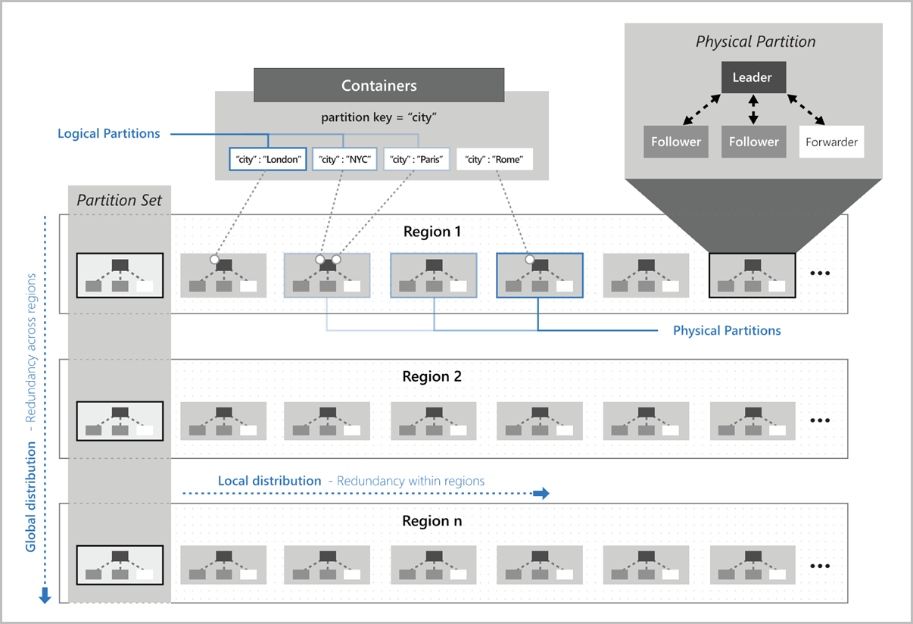
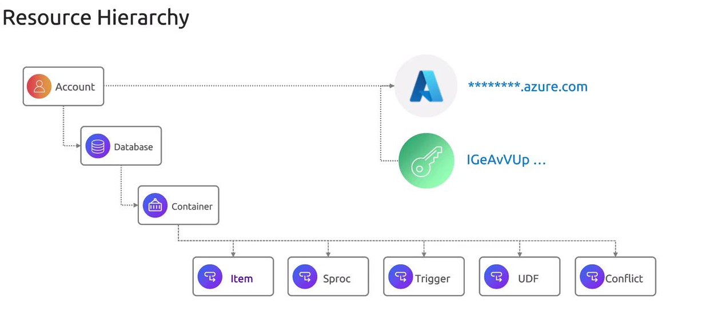

# 🌌 Azure Cosmos DB – Fundamentals

## 📖 What is Cosmos DB?

Azure Cosmos DB is Microsoft’s **globally distributed, multi-model NoSQL database service**.

- **Globally Distributed** → Data can be replicated automatically across multiple Azure regions.
- **Multi-model** → Supports different APIs for different data models (SQL/Document, MongoDB, Cassandra, Gremlin, Table).
- **Serverless and Elastic** → Handles auto-partitioning, scaling, indexing, and replication behind the scenes.
- **Developer Friendly** → Query using SQL-like syntax, SDKs, or APIs.
- **SLAs** → Provides **five 9s availability (99.999%)**, predictable low latency (<10 ms reads, <15 ms writes at 99th percentile), and RU-based throughput guarantees.

---

> 💡 Cosmos DB Server-Side Programming
>
> Azure Cosmos DB supports powerful server-side functionalities including
>
> - `stored procedures`,
> - `triggers`,
> - `user-defined functions (UDFs)`, and
> - `conflict resolution policies`.

---

<div align="center" style="background-color: #ffffffff ;border-radius: 10px;border: 2px solid white">
  
</div>

---

## 🤔 Why did Microsoft create Cosmos DB?

Before Cosmos DB, Azure had **DocumentDB** (2014) — a document database, but limited:

- Only JSON documents.
- Single-region focus.
- Less flexible scaling & APIs.

Microsoft realized customers needed:

- **Global apps** (e.g., Facebook-like apps needing instant reads/writes anywhere).
- **Choice of APIs** (Mongo, Cassandra developers didn’t want to re-learn).
- **Predictable performance** (DynamoDB-style RU/s).
- **Tunable consistency** (not just strong vs eventual).

So in 2017 → DocumentDB evolved into **Cosmos DB** with:

- Multi-region replication.
- Multiple APIs.
- New consistency models.
- Stronger SLAs.

---

## 🗻 Core Building Blocks (Hierarchy)

<div align="center" style="background-color: #ffffffff ;border-radius: 10px;border: 2px solid white">
  
</div>

Cosmos DB is organized like this:

1. **Account** → Top-level, tied to an Azure subscription + region(s).
2. **Database** → Logical grouping of containers.
3. **Container** (collection/table/graph depending on API)

   - Unit of scalability + partitioning.
   - Must define **Partition Key**.

4. **Item** → Actual JSON document (row, node, entity, depending on API).

At the top of the hierarchy is the `account`. This global entry point is tied to a specific subscription and can span multiple regions to ensure high availability and low latency. When you create an account through the Azure Portal, you're provided with a resource URI (commonly referred to as an endpoint) along with keys—both read-write and read-only—similar to what you see with an Azure Storage account.

Within an account, you create `databases`. In Azure Cosmos DB, a database acts much like a traditional relational database but is inherently distributed. It serves as a logical container for various collections or tables, depending on the API you choose.

Inside each database, you further organize your resources into `containers`. Containers are fundamental to Cosmos DB; they store multiple items and are partitioned to facilitate horizontal scaling. The throughput provisioned automatically manages the scalability and performance of each container. Depending on the Cosmos DB API, these containers may be realized as collections, tables, graphs, or alternative data structures.

Within a container, the primary data elements are `items`, which are analogous to rows in a relational database. Each item is stored as a JSON document, making it well-suited for unstructured or semi-structured data.

> 📌 **Exam Tip**: Containers are the _unit of scaling and distribution_, not databases.

---

## 📃 JSON Document Handling in Azure Cosmos DB

Depending on the Cosmos DB API, an item can be represented as a
**document**, **row**, **node**, or **edge**.

Azure Cosmos DB stores items as JSON documents—ideal for

1. supporting flexible schemas,
2. attribute-value pairs,
3. recursive embedding, and
4. embedded arrays.

For example, the NoSQL API supports JSON documents up to 2 megabytes, while the MongoDB API supports documents up to 16 megabytes.

Below is a sample JSON document demonstrating the flexible schema capabilities of Azure Cosmos DB:

```json
{
  "InvoiceID": "IN12341287",
  "TotalItems": 9,
  "TotalValue": 52.15,
  "Customer": {
    "CSID": 112423532,
    "FullName": "Fred Flaire"
  },
  "Lines": [
    {
      "ProductCode": 63137,
      "Description": "Formal Work Pants (M)",
      "Quantity": 1,
      "Size": 32,
      "Color": "Black"
    },
    {
      "ProductCode": 63137,
      "Description": "Kitkat Jumbo",
      "Quantity": 8,
      "Size": 2.34,
      "Pack": 6,
      "Color": "Bars"
    }
  ]
}
```

## 🔄 APIs & Data Models (Multi-Model Nature)

Cosmos DB is “one engine, many faces”:

| API / Model            | Use Case                        | Exam Keyword              | AWS Equivalent        |
| ---------------------- | ------------------------------- | ------------------------- | --------------------- |
| **SQL Core (default)** | JSON docs with SQL-like queries | Document DB, rich queries | DynamoDB + PartiQL    |
| **MongoDB API**        | For Mongo drivers/tools         | Mongo-compatible          | DocumentDB (old AWS)  |
| **Cassandra API**      | Column-family model             | Wide-column store         | Keyspaces on DynamoDB |
| **Gremlin API**        | Graph queries                   | Social graphs             | Neptune               |
| **Table API**          | Key-Value store                 | Azure Table replacement   | DynamoDB              |

👉 Internally, **all APIs are stored as JSON**, but Cosmos exposes APIs to “speak the dialect” you want.

---

## ⚙️ How It Works Internally

At a high level:

1. **Client Request** → SDK/HTTP sends query or write.
2. **Gateway Layer** → Authenticates, checks throttling, forwards to partition.
3. **Partition Layer** →

   - Uses **Partition Key** to map request → correct **Physical Partition**.
   - Handles RU allocation.

4. **Replication Layer** → If multi-region enabled, replicates data to secondary regions using chosen **consistency model**.
5. **Storage Layer** → Writes into distributed storage with automatic **indexing**.

📌 You don’t manage nodes/instances. Cosmos auto-handles partition splits, replication, and failover.

---

## 🆚 AWS Comparison (to leverage your background)

| Feature                | Cosmos DB                                        | AWS DynamoDB                             |
| ---------------------- | ------------------------------------------------ | ---------------------------------------- |
| **APIs**               | Multiple (SQL, Mongo, Cassandra, Gremlin, Table) | Mostly NoSQL (native API + PartiQL)      |
| **Consistency**        | 5 levels (Strong → Eventual)                     | 2 levels (Strong, Eventual)              |
| **Global Replication** | Built-in, multi-region, multi-master             | DynamoDB Global Tables                   |
| **Scaling**            | RU/s (Provisioned, Autoscale, Serverless)        | WCU/RCU (Provisioned, On-Demand)         |
| **Indexing**           | Automatic on all fields                          | Primary key + secondary indexes (manual) |
| **SLA**                | 99.999% availability, latency + consistency      | Availability SLA only (no latency SLA)   |

---

## 🛠️ Implementation Basics

### 1. Create Cosmos DB (Portal)

- Go to **Azure Portal → Create Resource → Databases → Azure Cosmos DB**.
- Choose API (SQL Core recommended for exam unless question specifies otherwise).
- Select region(s).
- Set throughput mode (Provisioned or Serverless).

### 2. Example: Insert Document (SQL API with .NET SDK)

```csharp
using Microsoft.Azure.Cosmos;

CosmosClient client = new CosmosClient("<endpoint>", "<key>");
Database db = await client.CreateDatabaseIfNotExistsAsync("mydb");
Container container = await db.CreateContainerIfNotExistsAsync("products", "/category");

var item = new { id = "p1", name = "Laptop", category = "Electronics" };
await container.CreateItemAsync(item, new PartitionKey("Electronics"));
```

📌 Partition Key (`/category`) decides distribution + scalability.

---

## 🎯 Exam Gotchas (Fundamentals Level)

- **Unit of scaling = Container** (not DB).
- **Partition Key** is mandatory (except for small shared throughput DBs).
- **All items stored as JSON** internally, regardless of API.
- **Consistency models** exist even if you use Mongo/Cassandra APIs.
- **Automatic Indexing** is ON by default, unlike DynamoDB.

---

<div align="center" style="background-color: #ffffffff ;border-radius: 10px;border: 2px solid white">
  
</div>
