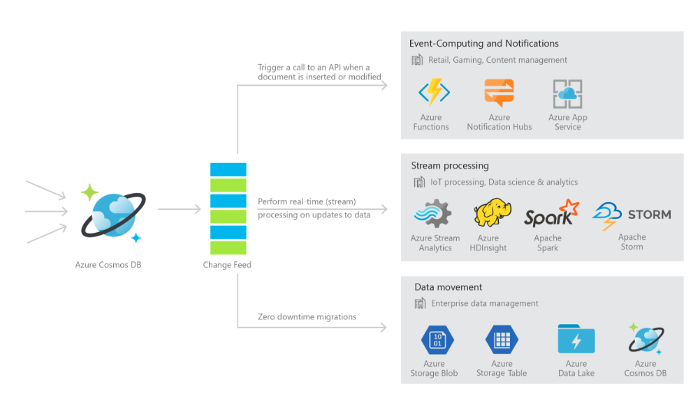
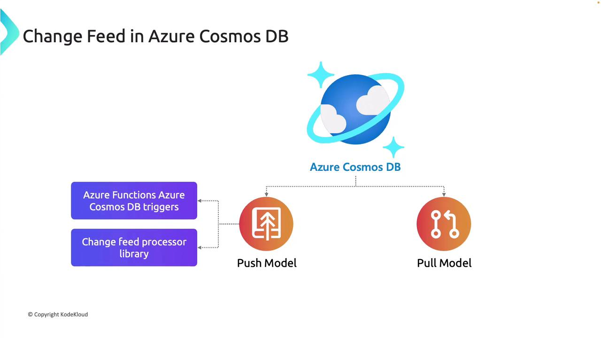

# 🔄 Change Feed in Azure Cosmos DB

## 📖 What It Is

- A **persistent, ordered log** of all item changes (insert and update) in a container.
- Changes are captured in the order they occur, per partition.
- By default, deletes are **not included**, but you can use **“soft delete” pattern** or **TTL delete feed** to track them.
- Available across **all APIs** (SQL, Mongo, Cassandra, Gremlin, Table).

---

<div align="center">
  
</div>

---

## 🎯 Why It Exists

- To enable **event-driven architectures** and **real-time data pipelines** without manual polling of the entire container.
- Instead of querying for “what changed since X?”, you just consume the **change feed**.
- Common use cases:

  - 🔔 Event notifications
  - 📊 Analytics pipelines (ETL into Synapse/Databricks)
  - 🗂️ Projections (materialized views)
  - 🔄 Data replication & cache invalidation

---

## 🏗️ Architecture Components

1. **Monitored Container**

   - Your main table/collection (example: `Orders`).
   - Every new/updated document is written here and appears in the change feed.

2. **Lease Container**

   - A helper container Cosmos DB uses to **remember progress**.
   - It keeps track of:

     - Which changes are already processed
     - Which processor (server) is handling which partition

3. **Compute Instance (Host)**

   - The machine or service running the **processor**.
   - Could be: Azure Functions, App Service, AKS, or a VM.

4. **Delegate (Your Code)**

   - The function you write that says:

     - “For every batch of changes, do this…”

   - Example: send new orders to **Teams**, or update **search index**, or push to **Event Hub**.

## 📊 Mermaid Flow Diagram

<div align="center">
  
</div>

---

## 📦 Models of Consuming Change Feed

### 1️⃣ Pull Model (manual)

- Your app polls changes at its own pace.
- You decide when/how often to read.
- **Pros:** control, good for batch jobs.
- **Cons:** extra plumbing (tracking continuation tokens, scaling).

### 2️⃣ Push Model (recommended by Azure)

- Cosmos pushes changes into your processing logic automatically.
- Implemented via:

  - **Azure Functions (Cosmos DB Trigger)** ✅
  - **Change Feed Processor Library (in SDK)** ✅

👉 These two handle scaling, partition distribution, and continuation tokens for you.

---

<div align="center">
  
</div>

---

## ✍🏻 Implementations

### 🅰️ Push Model – Azure Functions Trigger (serverless)

#### Steps

1. Create an **Azure Function** project.
2. Add a **Cosmos DB Trigger**.
3. Configure:

   - Connection string setting
   - Database name
   - Monitored container name
   - Lease container name (must exist beforehand)

4. Write your handler logic.

#### Example (C# Function)

```csharp
public static class ProductChangeHandler
{
    [FunctionName("ProcessProductChanges")]
    public static void Run(
        [CosmosDBTrigger(
            databaseName: "store",
            containerName: "products",
            Connection = "CosmosConnectionString",
            LeaseContainerName = "leases",
            CreateLeaseContainerIfNotExists = true)] IReadOnlyList<JObject> input,
        ILogger log)
    {
        if (input != null && input.Count > 0)
        {
            log.LogInformation($"Detected {input.Count} changes...");
            foreach (var doc in input)
            {
                log.LogInformation($"Changed item ID: {doc["id"]}, name: {doc["name"]}");
                // custom logic: push to queue, recalc cache, etc.
            }
        }
    }
}
```

👉 Cosmos automatically scales out leases to multiple function instances.

---

### 🅱️ Push Model – Change Feed Processor Library (SDK)

#### Steps

1. Provision **lease container** (empty, same DB as source).
2. Use `.GetChangeFeedProcessorBuilder<T>()` on the monitored container.
3. Provide a delegate to handle batches of changes.
4. Start the processor → it will **continuously monitor**.

#### Example (C# SDK)

```csharp
private static async Task<ChangeFeedProcessor> StartProcessorAsync(CosmosClient client)
{
    var db = client.GetDatabase("store");
    var source = db.GetContainer("products");
    var lease = db.GetContainer("leases");

    var processor = source
        .GetChangeFeedProcessorBuilder<dynamic>(
            processorName: "productProcessor",
            onChangesDelegate: async (IReadOnlyCollection<dynamic> changes, CancellationToken token) =>
            {
                foreach (var doc in changes)
                {
                    Console.WriteLine($"Change detected: {doc.id}, {doc.name}");
                }
            })
        .WithInstanceName("consoleApp")
        .WithLeaseContainer(lease)
        .Build();

    await processor.StartAsync();
    Console.WriteLine("Change Feed Processor started.");
    return processor;
}
```

👉 If you scale this app to multiple instances, leases are automatically balanced.

---

### 🅾️ Pull Model – Manual Iterator

#### Steps

1. Use `GetChangeFeedIterator<T>()` on container.
2. Choose `ChangeFeedStartFrom.Now()` or `.Beginning()`.
3. Loop with `.ReadNextAsync()`.

#### Example

```csharp
var iterator = container.GetChangeFeedIterator<Product>(
    ChangeFeedStartFrom.Now(),
    ChangeFeedMode.Incremental);

while (true)
{
    var response = await iterator.ReadNextAsync();
    foreach (var item in response)
    {
        Console.WriteLine($"Change: {item.id}, {item.name}");
    }
    await Task.Delay(1000); // control polling interval
}
```

👉 This requires you to manage continuation tokens and scaling.

---

## 🧩 Best Practices

- Always **use a dedicated lease container** (don’t reuse a business container).
- **Size lease container throughput** to match workload (each partition generates lease docs).
- Use **Functions Trigger or Processor library** for real-time, scalable apps.
- Use **Pull Model** only for batch processing or custom polling scenarios.
- For **deletes**, use:

  - **Soft-delete flag** in docs, or
  - **TTL + delete feed** option.

---

## 📝 Exam Cheat Grid

| Feature              | Push (Functions)         | Push (Processor Lib)               | Pull (Iterator)           |
| -------------------- | ------------------------ | ---------------------------------- | ------------------------- |
| Scale automatically  | ✅ via Functions runtime | ✅ via lease distribution          | ❌ manual                 |
| Continuation handled | ✅                       | ✅                                 | ❌ manual                 |
| Best for             | Event-driven serverless  | Custom worker apps (microservices) | Batch, controlled polling |
| Effort to implement  | Low                      | Medium                             | High                      |

---

✅ So:

- If you see **“real-time, serverless, easy scaling”** → **Functions Trigger**.
- If you see **“distributed workers, more control”** → **Change Feed Processor**.
- If you see **“periodic batch”** → **Pull Iterator**.
