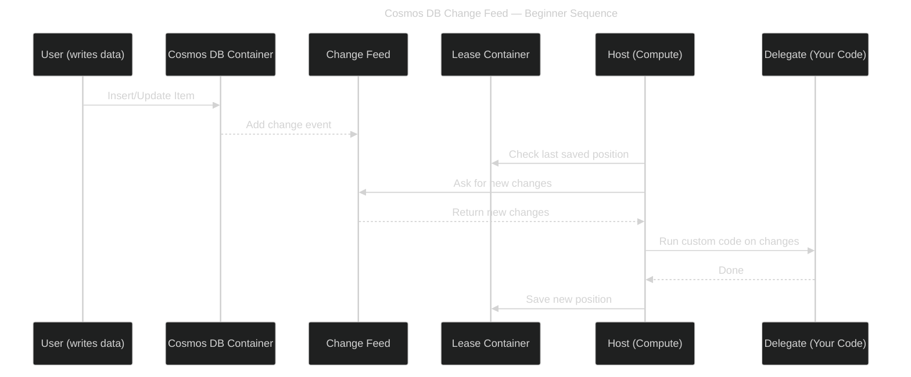
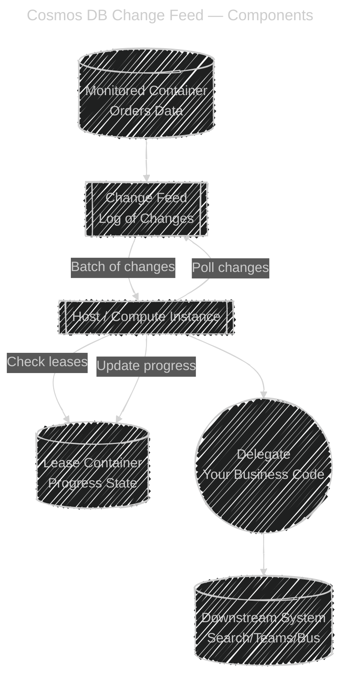

# 🌟 Cosmos DB Change Feed (Beginner-Friendly)

## 🟢 What is Change Feed?

The **Change Feed** in Cosmos DB is like a **“log of all changes”** in your data.
Every time you **add** or **update** an item, Cosmos DB records that event in a **feed** so that other programs can react to it.

Think of it like a **security camera** 📹:

- Every time someone enters or moves in the store → the camera records it.
- Similarly, every new or updated record in Cosmos DB shows up in the change feed.

---

## 🏗️ Main Components

1. **📃 Monitored Container**

   - Your main table/collection (example: `Orders`).
   - Every new/updated document is written here and appears in the change feed.

2. **📊 Lease Container**

   - A helper container Cosmos DB uses to **remember progress**.
   - It keeps track of:

     - Which changes are already processed
     - Which processor (server) is handling which partition

3. **💻 Compute Instance (Host)**

   - The machine or service running the **processor**.
   - Could be: Azure Functions, App Service, AKS, or a VM.

4. **⚙️ Delegate (Your Code)**

   - The **processor** which is a function you write that says:

     - “For every batch of changes, do this…”

   - Example: send new orders to **Teams**, or update **search index**, or push to **Event Hub**.

---

## ⚡ How it Works (Step by Step)

1. **Data written** → A new order is inserted in `Orders` container.
2. **Change Feed updates** → Cosmos DB adds it to the change log of that partition.
3. **Processor checks** → The host (Azure Function/VM) polls the feed to see if there are changes.
4. **Delegate runs** → Your custom code processes those changes.
5. **Lease updated** → The lease container is updated with the latest position so processing can continue next time without redoing.

---

## 🖼️ Simple Sequence (Events in Order)

---

## 🖼️ Flowchart of Components

---

## ✅ Key Beginner Takeaways

- The **Change Feed** is just a **log of inserts/updates** in your container.
- To use it, you need:

  - **Monitored container** (data)
  - **Lease container** (progress tracker)
  - **Compute host** (runner)
  - **Delegate** (your custom code)

- It guarantees **order within a partition** and **at-least-once delivery**.
- Great for **real-time processing**: analytics, search, downstream events, etc.

---

👉 Would you like me to now give you a **real simple example with Azure Functions** (triggered by Cosmos DB Change Feed) so you see how the delegate is written in code?
