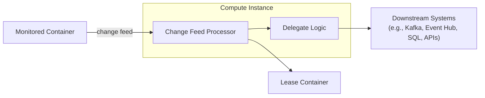

# ⚡ Cosmos DB Change Feed Processor — Architecture

The **Change Feed Processor** automatically listens to inserts and updates in a **monitored container** and distributes work across multiple workers, while allowing you to run custom logic for each change.

---

<div align="center">
  
</div>

---

## 1️⃣ Monitored Container

- **Definition**: This is the **source container** in Cosmos DB that holds your operational data.
- **What happens here**: Every **insert or update** creates an event in the _change feed_.
- **Note**: Deletes don’t appear in the change feed (unless using **soft-delete** or TTL workarounds).

📌 Example:

```sql
-- Suppose monitored container = Invoices
INSERT { "id": "inv-001", "customer": "Linda", "amount": 100 }
UPDATE { "id": "inv-001", "amount": 150 }
```

👉 Both events will appear in the change feed for processing.

---

## 2️⃣ Lease Container

- **Definition**: A separate container that the CFP uses internally to track **progress and partition ownership**.
- **What it does**:

  - Stores _state checkpoints_ so you don’t reprocess the same changes.
  - Distributes partitions across multiple workers in a **scalable, fault-tolerant way**.

- **Think of it like**: a coordination table for load balancing.

📌 Example Lease Document:

```json
{
  "id": "lease-0",
  "PartitionId": "0",
  "Owner": "Worker1",
  "ContinuationToken": "Lsn_345"
}
```

👉 This means partition 0 is owned by Worker1, currently at log sequence number 345.

---

## 3️⃣ Compute Instance

- **Definition**: The environment where your **change feed processor host** is running.
- Can be:

  - **Azure Functions** (most common) → built-in trigger.
  - **App Service / Container App** → custom host.
  - **Kubernetes or VMs** → for large-scale or on-prem hybrid.

💡 **Best practice**: Use Azure Functions with the **Cosmos DB Trigger** if you just need event-driven processing. Use CFP SDK if you need more advanced control (parallelism, custom scaling).

📌 Example: Function.json (Cosmos DB Trigger)

```json
{
  "bindings": [
    {
      "name": "inputDocs",
      "type": "cosmosDBTrigger",
      "direction": "in",
      "connectionStringSetting": "CosmosDBConnection",
      "databaseName": "SalesDB",
      "collectionName": "Invoices",
      "leaseCollectionName": "leases",
      "createLeaseCollectionIfNotExists": true
    }
  ]
}
```

---

## 4️⃣ Delegate (Custom Processing Logic)

- **Definition**: Your **application logic** that processes batches of changes.
- Could:

  - Update downstream systems (e.g., push to Kafka, Event Hub).
  - Trigger another workflow (e.g., Logic App).
  - Perform aggregations (e.g., update totals in another container).

📌 Example: C# Delegate

```csharp
public static async Task HandleChangesAsync(
    ChangeFeedProcessorContext context,
    IReadOnlyCollection<Document> changes,
    CancellationToken cancellationToken)
{
    foreach (var doc in changes)
    {
        Console.WriteLine($"Detected change for document Id: {doc.Id}");
        // custom business logic
        await SendToServiceBusAsync(doc);
    }
}
```

---

## 🔄 Workflow Summary

1. **Monitored container** → Data changes generate events.
2. **Lease container** → Tracks checkpoint & distributes load across workers.
3. **Compute instance** → Runs the CFP (Function, App, Container).
4. **Delegate** → Executes your business logic for each change.

---

## 📊 Visual Overview



---

## 🎯 Key Benefits

- **Scalable** → partitions auto-distributed.
- **Reliable** → state tracked via leases.
- **Event-driven** → near real-time response.
- **Flexible** → process in Functions, Containers, or Apps.

---

✅ In short: The Change Feed Processor = _a distributed event consumer framework_ for Cosmos DB, with **monitored container (source)**, **lease container (coordination)**, **compute host (runtime)**, and **delegate (your code)**.
