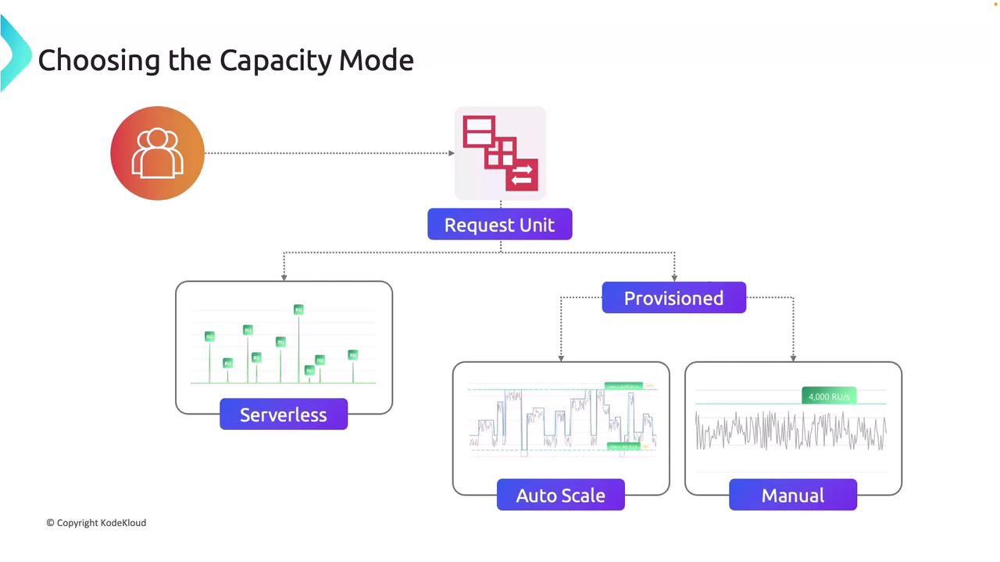

# ⚡ Cosmos DB – Throughput & Scaling (RU/s)

## 🧐 What is an RU (Request Unit)?

In Cosmos DB, performance is measured using **Request Units (RUs)**.

- **1 RU ≈ the cost of a simple read of a 1 KB item**.
- All operations (reads, writes, queries, stored procs) consume RUs.
- If you run out of RUs → Cosmos **throttles** with `HTTP 429 (Request Rate Too Large)` until quota resets.

👉 Think of RUs like **currency**: every query spends some RUs.

---

## 📦 How RU/s Works

- You **provision throughput** in **RU/s** at the **container** (or sometimes database) level.
- RU/s are evenly distributed across **physical partitions**.
- Simple **read** of a **1 KB** document typically consumes 1 RU.
- When **inserting** new JSON documents, the cost in RUs **depends on** both the **document size** and the **indexing requirements**.
  - Since the operation involves creating a new entry and updating indexes, it generally consumes more RUs than a basic read.
- Each partition can handle **max 10,000 RU/s and 50 GB storage**.

Example:

- You provision **20,000 RU/s**.
- Cosmos splits across **2 partitions** → each gets **10,000 RU/s**.

---

## ⚙️ Provisioning Models

When deploying a Cosmos DB account, you must choose between two capacity modes: provisioned throughput and serverless.

<div align="center">
  
</div>

### **Provisioned Throughput**

#### 1. **Manual Throughput**

- You pick RU/s (e.g., 400 RU/s).
- Always reserved (billed even if unused).
- Best for predictable workloads.
- **Minimum = 400 RU/s** per container.

#### 2. **Autoscale Throughput**

- Scales between **10% and 100% of max RU/s**.
- Example: If max = 10,000 RU/s, Cosmos auto-scales between 1,000 → 10,000 RU/s.
- Best for unpredictable workloads with spikes.

### **Serverless Mode**

- Pay per operation (per RU consumed).
- No fixed throughput.
- Best for **small, intermittent workloads** (e.g., dev/test, low-traffic apps).

---

## 🧩 RU Consumption Examples

- **Read 1 KB item** → ≈ 1 RU
- **Write 1 KB item** → ≈ 5 RUs
- **Query filtering 100 items** → ≈ 20–30 RUs (depends on indexing & partitions)
- **Cross-partition query** → Much higher RU usage

👉 **Exam Trap**: Large queries or cross-partition scans eat up RUs quickly.

---

## 🗂️ RU and Partitioning

RUs are distributed across **physical partitions**.

Example:

- Provision 30,000 RU/s.
- Cosmos splits into 3 physical partitions (10k each).
- If your **Partition Key** is skewed (all traffic goes to one partition) → that partition throttles, even if others are underutilized.

📌 **Choosing a good partition key** ensures even RU usage.

---

## 🆚 AWS Comparison

| Cosmos DB                            | DynamoDB                                     |
| ------------------------------------ | -------------------------------------------- |
| RU-based currency for all operations | WCU/RCU (Write/Read Capacity Units)          |
| Provisioned, Autoscale, Serverless   | Provisioned, On-Demand                       |
| RU per partition max = 10k           | 3,000 RCU per partition (scales differently) |
| Automatic scaling & partition split  | Automatic scaling too, but fewer options     |

👉 Cosmos DB is more flexible in **autoscale & serverless**.

---

## 🛠️ Implementation Examples

### Provision Throughput (Azure CLI)

```bash
az cosmosdb sql container create \
  --account-name mycosmos \
  --database-name mydb \
  --name products \
  --partition-key-path "/category" \
  --throughput 400
```

### Autoscale Container (C# SDK)

```csharp
ContainerProperties props = new ContainerProperties("orders", "/userId");

ThroughputProperties autoscale = ThroughputProperties.CreateAutoscaleThroughput(10000);

await db.CreateContainerIfNotExistsAsync(props, autoscale);
```

### Serverless Mode (Portal)

- When creating account → choose **Serverless** capacity mode.
- No need to set throughput on containers.

---

## 🎯 Exam Gotchas

- **RU/s are provisioned at container or DB level**.
- **Minimum = 400 RU/s** for provisioned containers.
- **RU cost depends on item size, query complexity, indexing, and partitions**.
- **Cross-partition queries** consume more RU.
- **Autoscale = 10% to 100% of max** (e.g., 400–4000).
- **Serverless** = pay per request (no RU reserved).
- If **one partition hot-spots**, it throttles even if others are free.

👉 Typical Exam Question:
_“Your app has unpredictable traffic spikes. You want Cosmos DB to handle spikes automatically while minimizing cost. Which throughput model should you use?”_
✔️ **Autoscale Throughput**.
