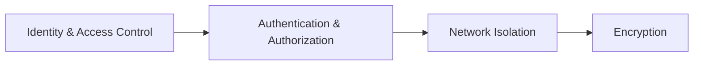

# 🔐 Cosmos DB – Security

## 🛡️ Security Layers in Cosmos DB

Think of Cosmos DB security as **four layers**:



---

1. **Identity & Access Control** → Who are you? (Keys, Entra ID, Managed Identities, RBAC).
2. **Authentication & Authorization** → Can you access DB/containers/items?
3. **Network Isolation** → Where can you connect from? (Firewall, Private Link, VNet).
4. **Encryption** → How is data protected at rest and in transit?

---

## 1️⃣ Authentication & Authorization

### 📌 a. **Keys (Legacy / Default)**

- Every Cosmos DB account has:

  - **Primary Key** (full access).
  - **Secondary Key** (backup key).

- Stored in Azure Portal or Key Vault.
- Used in connection strings for SDKs.
- ❌ Weak security model → anyone with the key = admin.

Example (C# SDK):

```csharp
CosmosClient client = new CosmosClient("<endpoint>", "<primary-key>");
```

---

### 📌 b. **Resource Tokens**

- Generated by **master key**.
- Scoped access to specific **DB/Container/Item**.
- Expire after a time (default: 1 hour).
- Useful for **client apps** (e.g., mobile, web).
-

---

### 📌 c. **Azure Entra ID (RBAC)** ✅ _(Exam favorite)_

- Modern approach → no keys.
- Uses Azure **Role-Based Access Control (RBAC)**.
- Assign roles:

  - `Cosmos DB Built-in Data Contributor`
  - `Cosmos DB Built-in Data Reader`

- Works with **`users`, `service principals`, `managed identities`**.

Example: Assign RBAC role via CLI

```bash
az role assignment create \
  --assignee <user-object-id> \
  --role "Cosmos DB Built-in Data Contributor" \
  --scope "/subscriptions/<subId>/resourceGroups/<rg>/providers/Microsoft.DocumentDB/databaseAccounts/<cosmos-account>"
```

---

## 2️⃣ Network Isolation

Cosmos DB is public by default, but you can lock it down:

- **Firewall rules** → Allow specific IPs only.
- **Private Endpoint (Private Link)** → Access only via VNet, no public internet.
- **Service Endpoint** → VNet subnet access (less secure than Private Link).

📌 **Exam Tip**: If you see _“must prevent access over public internet”_ → answer = **Private Endpoint**.

---

## 3️⃣ Encryption

- **At Rest** → Always encrypted with **Microsoft-managed keys**.

  - Can bring your own key (CMK) via **Key Vault**.

- **In Transit** → Always via HTTPS/TLS 1.2+.

👉 You never see unencrypted data on disk.

---

## 4️⃣ Security Best Practices

- **Prefer Entra ID + Managed Identity** (don’t use keys in apps).
- **Rotate keys** regularly if using key-based auth.
- **Use Key Vault** to store secrets.
- **Restrict network** with Private Link or firewall.
- **Exclude sensitive fields** from indexing if not needed.

---

## 🆚 AWS Comparison

| Feature             | Cosmos DB                       | DynamoDB          |
| ------------------- | ------------------------------- | ----------------- |
| Keys                | Primary/Secondary               | Access Key/Secret |
| Fine-grained tokens | Resource Tokens                 | IAM Policies      |
| Identity            | Entra ID RBAC, Managed Identity | IAM Roles, STS    |
| Network             | Firewall, VNet, Private Link    | VPC Endpoints     |
| Encryption          | Default + CMK                   | Default + KMS     |

👉 Same concepts, different branding.

---

## 🛠️ Implementation Example

### Using Managed Identity in .NET (Best Practice)

```csharp
// App Service / Function must have Managed Identity enabled
DefaultAzureCredential credential = new DefaultAzureCredential();

CosmosClient client = new CosmosClient(
    accountEndpoint: "https://mycosmos.documents.azure.com:443/",
    tokenCredential: credential
);

Database db = client.GetDatabase("mydb");
```

---

## 🎯 Exam Gotchas

- **Default auth = Keys**, but best practice = **Entra ID RBAC**.
- **Managed Identity** = best for apps (no secrets).
- **Private Endpoint** = required to block public internet.
- **Encryption at rest = always ON** (cannot disable).
- **Firewall rules** allow specific IPs/subnets.
- **Resource Tokens** = short-lived access for client apps.

> 👉 Example Exam Question:  
> _“You must allow an Azure Function to access Cosmos DB without storing credentials. What should you use?”_
> ✔️ **Managed Identity + RBAC**.
