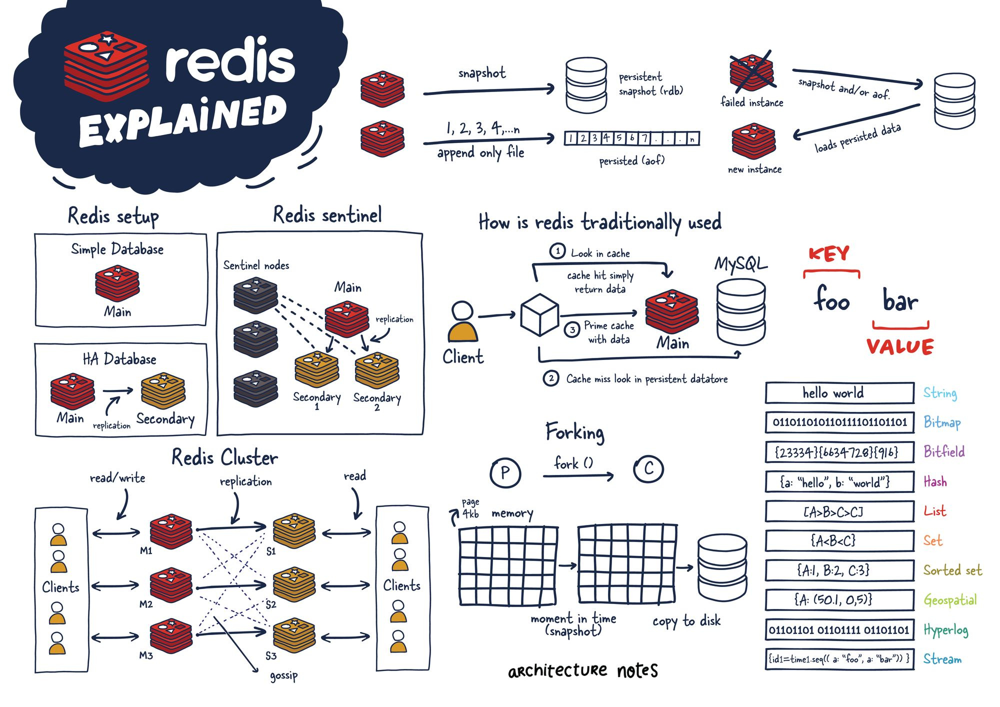
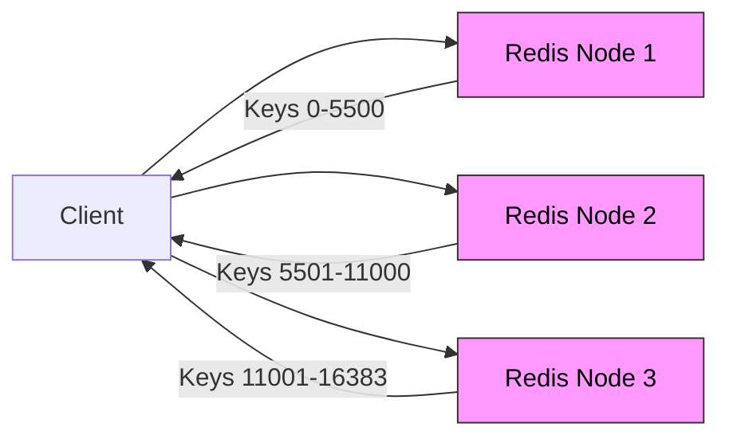

# ⚡ **Redis**

📖 **Redis (REmote DIctionary Server)** is an **in-memory data store** used as:

- **Cache** (super-fast, keep hot data in RAM)
- **Database** (key-value, with optional persistence)
- **Message Broker** (Pub/Sub, Streams, Queues)

---

<div align="center" style="background-color: #ffffffff ;border-radius: 10px;border: 2px solid white;margin:0 30px;">
  
</div>

---

## 🔑 **Common Redis Data Types**

1. `Strings`
2. `Lists`
3. `Sets`
4. `Sorted Sets`
5. `Hashes`
6. `Pub/Sub`
7. `Streams`

### 1️⃣ **Strings**

**🔹 Store simple values (text, JSON, binary).**

**🔹 Commands:**

```bash
SET key1 value1              # Set a key
GET key1                     # Get a key
DEL key1                     # Delete a key
MSET key1 val1 key2 val2     # Set multiple keys
MGET key1 key2               # Get multiple keys
INCR key1                    # Increment integer
DECR key1                    # Decrement integer
APPEND key1 "extra"          # Append to string
STRLEN key1                  # String length
```

**🔹 Example:**

```bash
SET user:1 "John"
GET user:1
  # "John"

INCR counter
  # (integer) 1

MSET a 10 b 20
MGET a b
  # 1) "10"
  # 2) "20"
```

---

### 2️⃣ **Lists**

**🔹 Ordered collection, supports queue (FIFO) and stack (LIFO).**

**🔹 Commands:**

```bash
LPUSH list1 val1 val2        # Push to left
RPUSH list1 val1 val2        # Push to right
LPOP list1                   # Pop left
RPOP list1                   # Pop right
LRANGE list1 0 -1            # Get all elements
LLEN list1                   # Length of list
LINDEX list1 index           # Get element at index
LREM list1 count value       # Remove occurrences
LTRIM list1 start stop       # Trim list to given range
```

**🔹 Example:**

```bash
LPUSH tasks "task1" "task2"
RPUSH tasks "task3"

LRANGE tasks 0 -1
  # 1) "task2"
  # 2) "task1"
  # 3) "task3"

LPOP tasks
  # "task2"
```

---

### 3️⃣ **Sets**

**🔹 Unordered unique values.**

**🔹 Commands:**

```bash
SADD set1 val1 val2         # Add members
SMEMBERS set1               # Get all members
SISMEMBER set1 value        # Check membership
SCARD set1                  # Count members
SREM set1 value             # Remove value
SINTER set1 set2            # Intersection
SUNION set1 set2            # Union
SDIFF set1 set2             # Difference
```

**🔹 Example:**

```bash
SADD users "Alice" "Bob" "Charlie" "Alice"
SMEMBERS users
  # 1) "Charlie"
  # 2) "Alice"
  # 3) "Bob"
SISMEMBER users "Alice"
  # (integer) 1
SCARD users
  # (integer) 3
```

---

### 4️⃣ **Sorted Sets** (ZSet)

**🔹 Set Ordered by numeric score.**

**🔹 Commands:**

```bash
ZADD set1 score member      # Add with score
ZRANGE set1 0 -1            # Ascending order
ZREVRANGE set1 0 -1         # Descending order
ZRANK set1 member           # Get rank
ZSCORE set1 member          # Get score
ZREM set1 member            # Remove member
ZCARD set1                  # Count members
ZINCRBY set1 increment member # Increment score
```

**🔹 Example:**

```bash
ZADD leaderboard 100 "Alice" 200 "Bob" 150 "Charlie"
ZRANGE leaderboard 0 -1 WITHSCORES
  # 1) "Alice"   "100"
  # 2) "Charlie" "150"
  # 3) "Bob"     "200"
ZREVRANGE leaderboard 0 -1 WITHSCORES
  # 1) "Bob"     "200"
  # 2) "Charlie" "150"
  # 3) "Alice"   "100"
ZSCORE leaderboard "Charlie"
  # "150"
ZRANK leaderboard "Alice"
  # (integer) 0
```

---

### 5️⃣ **Hashes**

**🔹 Map of field-value pairs.**

**🔹 Commands:**

```bash
HSET key1 field1 value1 field2 value2   # Set field
HGET key1 field1                        # Get field
HGETALL key1                            # Get all fields
HDEL key1 field1                        # Delete field
HKEYS key1                              # Get all field names
HVALS key1                              # Get all field values
HEXISTS key1 field1                     # Check if field exists
HINCRBY key1 field1 number              # Increment field
HLEN key1                               # Count fields
```

**🔹 Example:**

```bash
HSET user:1 name "John" age "30" country "UAE"
HGET user:1 name
  # "John"
HGETALL user:1
  # 1) "name" "John" "age" "30" "country" "UAE"
HINCRBY user:1 age 1
  # (integer) 31
```

---

### 6️⃣ **Pub/Sub** Channels

**🔹 Real-time messaging.**

**🔹 Commands:**

```bash
SUBSCRIBE channel1            # Subscribe to channel
PUBLISH channel1 message      # Publish to channel
UNSUBSCRIBE channel1          # Unsubscribe
PSUBSCRIBE pattern            # Subscribe with pattern
```

**🔹 Example:** (two clients)

**Client A:**

```bash
SUBSCRIBE news
```

**Client B:**

```bash
PUBLISH news "Breaking: Azure supports Redis Pub/Sub"
```

**Client A Output:**

```ini
"message"
"news"
"Breaking: Azure supports Redis Pub/Sub"
```

---

### 7️⃣ **Streams**

**🔹 Append-only log (Kafka-like).**

**🔹 Commands:**

```bash
XADD stream1 * field value             # Add event
XRANGE stream1 - +                     # Read all
XREVRANGE stream1 + -                  # Reverse read
XLEN stream1                           # Length
XREAD COUNT 2 STREAMS key ID           # Read after ID
XGROUP CREATE key group id             # Create consumer group
XREADGROUP GROUP g c STREAMS key >     # Read by group
```

**🔹 Example:**

```bash
XADD mystream * sensor "temp" value "24"
XADD mystream * sensor "temp" value "25"
XRANGE mystream - +
  # 1) "1685701234567-0"
  #    1) "sensor" "temp" "value" "24"
  # 2) "1685701234578-0"
  #    1) "sensor" "temp" "value" "25"
```

---

### ➕ **Special Data Types**

- **Bitmap** → track bits efficiently (`SETBIT`, `GETBIT`)
- **HyperLogLog** → approx unique count (`PFADD`, `PFCOUNT`)
- **Geospatial** → store/query lat-long (`GEOADD`, `GEORADIUS`)

---

## ⚙️ **How Redis Works**

- **In-memory engine**: All keys/values live in RAM → microsecond access.
- **Persistence** (optional):

  - **RDB (snapshot)**: saves dump.rdb at intervals
  - **AOF (append-only file)**: logs every write → replay on restart
  - Can combine RDB + AOF

- **Single-threaded event loop** (non-blocking I/O) → predictable latency
- **Network model**: Uses **RESP protocol** over TCP (binary-safe).

---

## 📈 **Scaling Redis**

Redis can scale in **two ways**:

### ⬆️ Vertical Scaling (VL)

- Add more CPU, RAM to single node.
- ✅ Simple
- ❌ Expensive, limited by machine size

---

### ➡️ Horizontal Scaling (HZ – Redis Cluster)

- Data **sharded** into 16,384 **hash slots**.
- Slots distributed across multiple **masters (M1, M2, M3)**.
- Each master has replicas (S1, S2, S3).
- **Clients → ask cluster → cluster routes request to correct slot.**
- Uses **Gossip protocol** to share node state.

<div align="center" style="background-color: #ffffffff ;border-radius: 10px;border: 2px solid white;margin:0 30px;">



</div>

---

> 📌 Example:  
> 🔹 `SET user:100` → Redis hashes key → slot → sends to correct master.  
> 🔹 If that master fails → replica promoted → HA.

---

## ❤️ **High Availability (HA)**

### 🟢 Replication

- Master → one or more replicas.
- Replicas can serve read queries.

### 🟢 Redis Sentinel

- Separate monitoring nodes.
- Detect failure of master.
- Elect a replica → promote to master.
- Clients automatically redirected.

### 🟢 Redis Cluster

- Combines **sharding + replication + HA**.
- Built-in failover, no single point of failure.

---

## 🚦 **Typical Use Cases**

- **Cache-aside** pattern → reduce DB load
- **Session store** → fast user sessions
- **Leaderboard** → sorted sets
- **Queue** → lists or streams
- **Rate limiting** → counters + TTL
- **Pub/Sub** → event notifications

---

## 📝 **Quick Memory Hooks**

- **String** = basic value
- **Hash** = object (user profile)
- **List** = queue/stack
- **Set** = unique tags
- **Sorted Set** = leaderboard
- **Pub/Sub** = chat, events
- **Streams** = Kafka-lite
