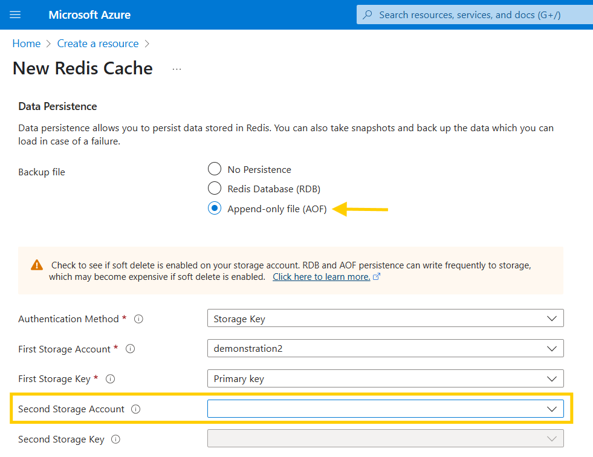
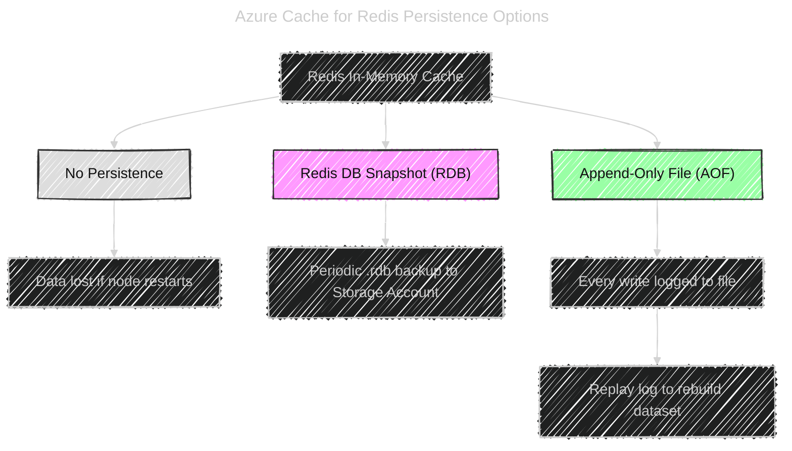
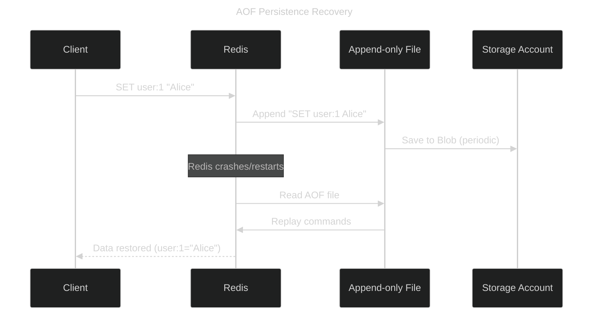

# 🗄️ Data Persistence in Azure Cache for Redis

## 📖 Official definition

By default, Redis is **in-memory only** → super fast 🚀 but volatile.  
Azure adds **persistence options** so you can recover data if the cache restarts, node fails, or service reboots.

---

## 🔑 Persistence options

  

---

### 1️⃣ **No Persistence**

- Redis only stores data in memory.
- If the VM hosting the cache fails → data is lost.
- Best for:

  - Pure caching (data already stored elsewhere, e.g. SQL, CosmosDB).
  - Scenarios where losing cached data is acceptable.

---

### 2️⃣ **RDB (Redis Database Snapshot)**

- **Point-in-time snapshots** of your Redis dataset.
- Periodically writes the full dataset to an Azure Storage Account as `.rdb` files.
- Useful for:

  - Disaster recovery (restore to a specific snapshot).
  - Scenarios where full dataset backups at intervals are acceptable.

- Trade-offs:

  - Snapshot frequency = risk of data loss between snapshots.
  - Good balance of **performance + durability**.

---

### 3️⃣ **AOF (Append-Only File)**

- Logs every write operation (`SET`, `INCR`, etc.) to an append-only file.
- On restart, Redis **replays the log** to reconstruct the dataset.
- Advantages:

  - **More durable**: minimizes risk of data loss (depends on write frequency).
  - Supports **“always safe” mode** (write after every operation).

- Trade-offs:

  - Higher storage I/O cost.
  - Slight performance impact vs RDB.

---

## 🧭 Flow: Redis Persistence Options

---

## 📜 Sequence: Recovery workflow with AOF

---

## 🧪 Hands-on tip

When enabling persistence:

- **Choose storage account(s):** You can configure primary + secondary storage accounts for redundancy (that’s the empty “Second Storage Account” in your screenshot).
- **Soft delete warning:** If soft delete is ON in Blob Storage, AOF writes may accumulate → storage costs rise. (Azure even warns you in the UI ✅).

---

## 🧠 Cheat sheet

- **No Persistence** → fastest, but data gone on restart.
- **RDB** → periodic snapshots, good compromise.
- **AOF** → logs every write, best durability, higher cost.
- **Best practice**:

  - Use **No Persistence** when Redis is just a cache.
  - Use **RDB/AOF** when Redis is acting as a **primary data store** (not just a cache).
  - Always configure a **secondary storage account** for HA in production.

---

✅ In short:

- **RDB = backup snapshots** (efficient, periodic).
- **AOF = write journal** (durable, continuous).
- Choose based on **cache vs datastore** role.
