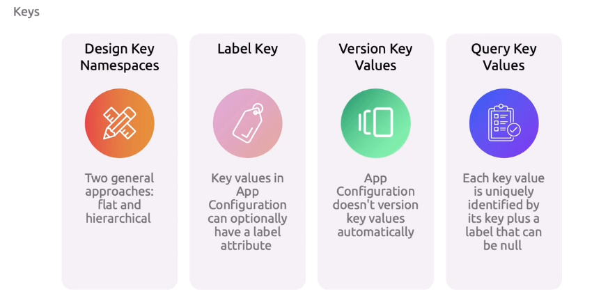
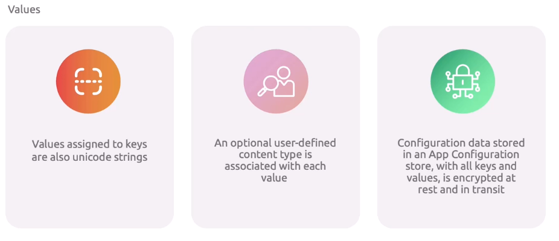
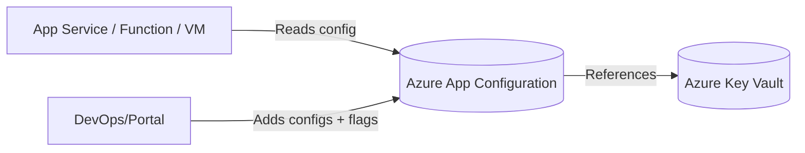
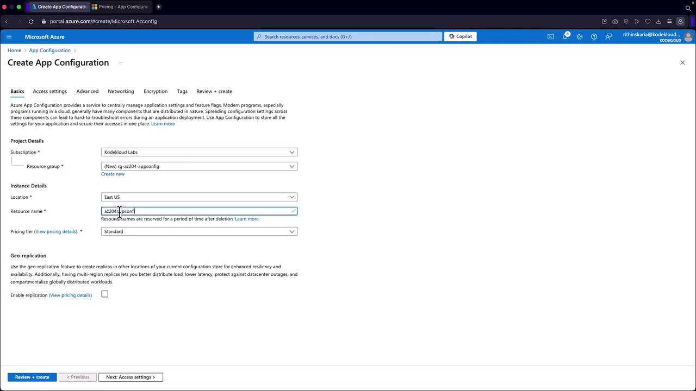
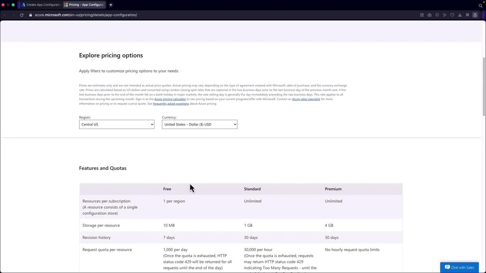
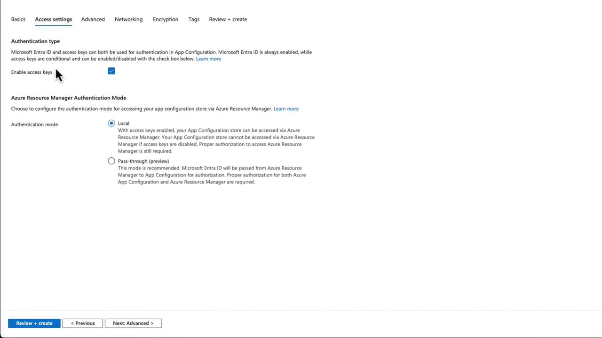
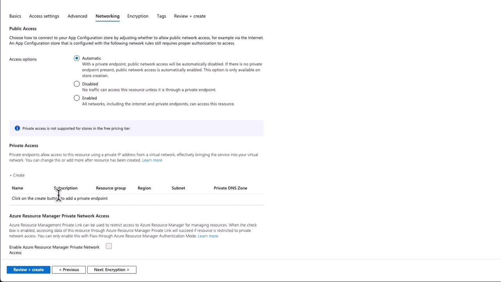
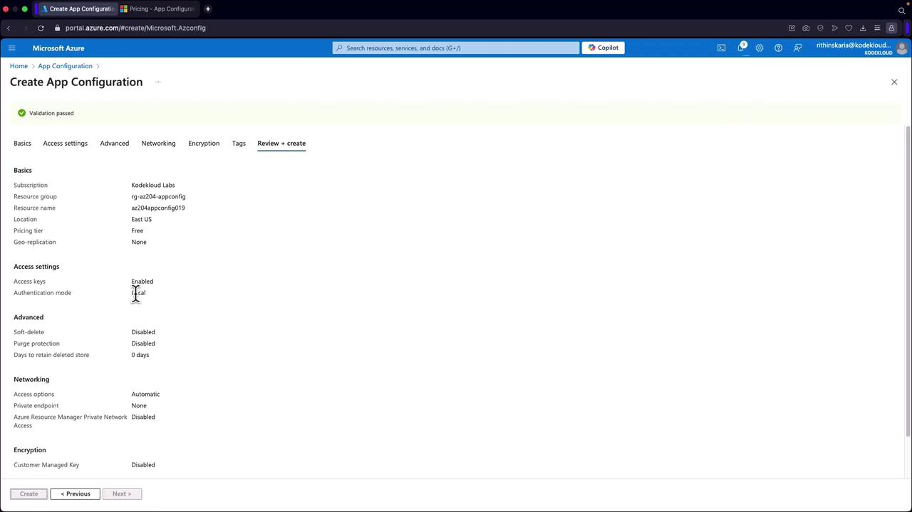

# ⚙️ **Azure App Configuration** — Centralized Config-as-a-Service

## 📌 **The Problem Before App Config**

- Apps had configs (settings, feature flags, env vars) scattered across:

  - JSON/XML files in repos
  - App Service **App Settings**
  - Kubernetes ConfigMaps
  - Secrets in Key Vault

- Result → config drift, duplication, and chaos when scaling microservices.

---

## 📌 **What Is It?**

👉 **Azure App Configuration** is a **centralized store** for your application settings + feature flags.

Think of it as:

- 📂 **Config DB** for your app’s runtime settings.
- 🟢 **Feature Flag service** to enable/disable features on the fly.
- 🔑 Works with **Key Vault** for secrets, but **not a replacement**.

---

## 📌 **Key Features**

| Problem                             | Azure App Configuration Solves It          |
| ----------------------------------- | ------------------------------------------ |
| ⚠️ Scattered config across services | Centralized control panel                  |
| 🤕 Manual config per environment    | Environment-based key management           |
| 🔁 Redeploy app to update settings  | Dynamic refresh at runtime                 |
| 🤯 Too many toggles in code         | Built-in **Feature Flags** support         |
| 😵 Secrets mixed with configs       | Keep configs here, secrets in Key Vault 🔐 |

---

## ⚙️ Key Concepts

<!--
<div align="center">
  
</div>

<div align="center">
  
</div>

---
-->

### 1. **Key-Value Pairs**

- Store config as `key=value`
- Use **labels** for versioning or environments
- Ex: `AppTitle = MyApp` with label `Production`

### 2. **Labels**

- Add metadata to keys
- Ex: `AppTitle = MyApp` with `label=Dev`, `label=Prod`
- Your app fetches the correct version based on environment

### 3. **Feature Flags**

- Turn features on/off without code deploys
- Support filters like:

  - User targeting
  - % rollout
  - Time windows

### 4. **Configuration Refresh**

- SDK can auto-poll or watch for config changes
- Dynamically reload into your app without restarting 🚀

---

## 📦 What Can You Store?

| Key Type         | Example                                          |
| ---------------- | ------------------------------------------------ |
| String values    | `AppTheme = dark`                                |
| JSON blobs       | `EmailSettings = { "smtp": "...", "port": 587 }` |
| Nested keys      | `Logging:LogLevel:Default = Information`         |
| Labels           | `Environment=Production`, `Environment=Dev`      |
| 🏁 Feature Flags | `BetaFeature = On/Off` with filters!             |

---

## 📌 **App Config vs Key Vault**

| Feature      | **App Configuration**                       | **Key Vault**                           |
| ------------ | ------------------------------------------- | --------------------------------------- |
| Stores       | **App settings**, Feature flags             | **Secrets**, Keys, Certs                |
| Rotation     | No                                          | Yes (auto rotation)                     |
| Typical Data | URLs, feature toggles, env-specific configs | Passwords, connection strings, API keys |
| Example      | `EnableDarkMode = true`                     | `SQLPassword = SuperSecret123`          |

👉 **Best practice:** Use **both** together:

- App Config → app settings & flags.
- Key Vault → sensitive values.
- Link them: App Config can reference Key Vault secrets.

---

## 📌 **Architecture Flow**

<div align="center">



</div>

---

## 📌 **Hands-On: Create & Use App Config via Portal**

### 👉🏻 Create an App Configuration resource

1️⃣ Search and Create the Resource:

- In the Azure Portal, use the search bar to locate "App Configuration" and click "Create."

2️⃣ Create a New Resource Group:

- Create a new resource group (e.g., "RGAZ204AppConfig") and click "OK."

3️⃣ Specify a Unique Resource Name:

- Provide a unique name for your App Configuration instance. For instance, if "AZ204AppConfig" is unavailable, try an alternative such as "AZ204AppConfig019."

<div align="left">
  
</div>

4️⃣ Review Pricing Tiers:

- Azure offers multiple pricing tiers. For a demo, the Free tier typically suffices. To review details, click the pricing link.

<div align="left">
  
</div>

5️⃣ Configure Access Settings:

- Go to "Access Settings," where keys should be enabled by default. Set the authentication mode to local.

  > 💡 Tip: In production, enable purge protection and soft delete for enhanced security, even though the Free tier does not support purge protection.

<div align="left">
  
</div>

6️⃣ Configure Networking:

- For demonstration purposes, select automatic networking with public access. In production environments, configuring private access is recommended for better security.

<div align="left">
  
</div>

7️⃣ Encryption Settings:

- For production scenarios, consider using customer-managed keys stored in Azure Key Vault. Note that the Free tier does not support this option, but you can integrate it later for increased control over encryption.

8️⃣ Create the Resource:

- After reviewing your settings, click "Create" to deploy your App Configuration resource.

<div align="left">
  
</div>

### 👉🏻 Configuring Key-Value Pairs

With your resource deployed, follow these steps to set up configuration data:

1. Click on "Go to Resource" and expand the configuration settings to access the Configuration Explorer.
2. Create a new configuration by defining a key (e.g., "DB") and assigning a corresponding value (e.g., "Azure Cosmos DB").
3. Optionally, add a label and specify a content type (for example, "text").
4. Click "Apply" to store the key-value pair for future application use.

## 📌 **Hands-On: Create & Use App Config Via .NET SDK**

### 🔹 Step 1: Create App Configuration Store

```bash
az appconfig create \
  --name myAppConfigStore123 \
  --resource-group rg-demo \
  --location eastus
```

---

### 🔹 Step 2: Add Configuration Settings

```bash
# Add simple key-value
az appconfig kv set --name myAppConfigStore123 \
  --key "App:Theme" --value "Dark" --label "Prod"

# Add feature flag
az appconfig feature set --name "BetaFeature" \
  --appconfig-name myAppConfigStore123
```

---

### 🔹 Step 3: Use in .NET App

Install SDK:

```bash
dotnet add package Microsoft.Extensions.Configuration.AzureAppConfiguration
dotnet add package Microsoft.FeatureManagement
```

Configure in `Program.cs`:

```csharp
var builder = WebApplication.CreateBuilder(args);

builder.Configuration.AddAzureAppConfiguration(options =>
{
    options.Connect(new Uri("https://myAppConfigStore123.azconfig.io"),
        new DefaultAzureCredential())
        .UseFeatureFlags();
});

builder.Services.AddAzureAppConfiguration();
builder.Services.AddFeatureManagement();

var app = builder.Build();

// Example: Read config
string theme = builder.Configuration["App:Theme"];
Console.WriteLine($"Theme: {theme}");

// Example: Use feature flag
app.Use(async (context, next) =>
{
    var featureManager = context.RequestServices.GetRequiredService<IFeatureManager>();
    if (await featureManager.IsEnabledAsync("BetaFeature"))
    {
        await context.Response.WriteAsync("✅ Beta Feature Enabled");
    }
    else
    {
        await next();
    }
});

app.Run();
```

👉 This pulls config + flags directly from Azure App Config.

---

## 📌 **Best Practices**

- 🏷 Use **labels** for environment separation (`Dev`, `Test`, `Prod`).
- 🔒 Don’t store secrets here → reference Key Vault instead.
- 🚦 Use **feature flags** to enable gradual rollouts.
- 📊 Enable **diagnostics logging** for audits.
- 🪝 Combine with **Azure Pipelines** or **GitHub Actions** for CI/CD config updates.

---

## 🏁 **TL;DR**

- **Azure App Configuration** = centralized config + feature flag store.
- Use it with **Key Vault** (not instead of).
- Great for **microservices + CI/CD pipelines**.
- SDKs make it easy: `.AddAzureAppConfiguration()`, `.UseFeatureFlags()`.
