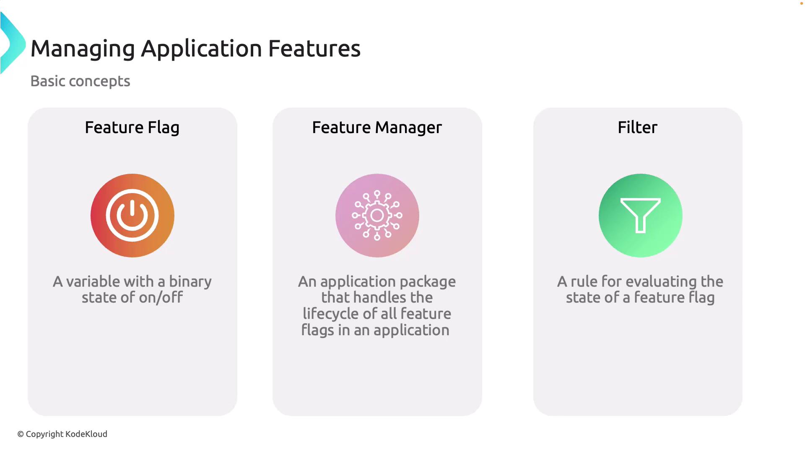

# 🧩 **What is Feature Management?**

**Feature management** lets you **turn features on/off at runtime** without redeploying.
You define **feature flags** (aka toggles) and optional **rules/filters** (who gets it, when, how many).

- Toggle safely (kill-switch)
- Gradual rollout (percentage)
- Target groups/users (ring deployment)
- Schedule windows (time-boxed experiments)

> Store flags in **Azure App Configuration** and read them in your app via the **Feature Management** libraries.

---

<div align="center">
  
</div>

---

## 🧠 **Core building blocks**

- **Feature flag**: named switch (e.g., `BetaCheckout`).
- **Feature filters**: rules to evaluate a flag (e.g., 10% rollout).

  - Built-in: **Percentage**, **TimeWindow**, **Targeting**

- **Clients**:

  - `.NET`: `Microsoft.FeatureManagement` (+ `.AspNetCore`)
  - App Config provider: `Microsoft.Extensions.Configuration.AzureAppConfiguration`

- **Gate points**:

  - `IFeatureManager` / `IFeatureManagerSnapshot`
  - `[FeatureGate]` attribute (controllers/pages)
  - Middleware / `MapWhen` in ASP.NET Core

---

## 🛠 **Step-by-Step Implementation (Azure App Config + .NET)**

### 0) Prereqs

```bash
# Create App Config
az group create -n rg-appcfg -l eastus
az appconfig create -g rg-appcfg -n appcfg-demo-123 -l eastus
```

#### Add a feature flag (simple ON)

```bash
az appconfig feature set \
  --feature BetaCheckout \
  --appconfig-name appcfg-demo-123
```

#### (Optional) Add rules

**10% rollout**:

```bash
az appconfig feature set \
  --feature BetaCheckout \
  --appconfig-name appcfg-demo-123 \
  --yes \
  --conditions "{ \"client_filters\": [ { \"name\": \"Microsoft.Percentage\", \"parameters\": { \"Value\": 10 } } ] }"
```

**Time window**:

```bash
az appconfig feature set \
  --feature HappyHour \
  --appconfig-name appcfg-demo-123 \
  --yes \
  --conditions "{ \"client_filters\": [ { \"name\": \"Microsoft.TimeWindow\", \"parameters\": { \"Start\":\"2025-09-18T16:00:00Z\",\"End\":\"2025-09-18T18:00:00Z\" } } ] }"
```

**Targeting (rings/users/groups)**:

```bash
az appconfig feature set \
  --feature NewNav \
  --appconfig-name appcfg-demo-123 \
  --yes \
  --conditions '{
    "client_filters": [
      {
        "name": "Microsoft.Targeting",
        "parameters": {
          "Audience": {
            "Users": [ "alice@contoso.com" ],
            "Groups": [
              { "Name": "Beta", "RolloutPercentage": 50 }
            ],
            "DefaultRolloutPercentage": 5
          }
        }
      }
    ]
  }'
```

> Tip: use **Labels** to scope flags by environment: `--label Prod` / `--label Dev`.

---

### 1) Add packages to your .NET (ASP.NET Core) app

```bash
dotnet add package Microsoft.Extensions.Configuration.AzureAppConfiguration
dotnet add package Microsoft.FeatureManagement
dotnet add package Microsoft.FeatureManagement.AspNetCore
dotnet add package Azure.Identity
```

---

### 2) Wire up App Configuration + Feature flags (`Program.cs`)

```csharp
using Azure.Identity;
using Microsoft.FeatureManagement;
using Microsoft.FeatureManagement.Mvc; // for FeatureGate

var builder = WebApplication.CreateBuilder(args);

// 1) Add App Configuration as a configuration source
builder.Configuration.AddAzureAppConfiguration(options =>
{
    options.Connect(new Uri("https://appcfg-demo-123.azconfig.io"), new DefaultAzureCredential())
           // Pull all keys (or filter by a prefix/label)
           .Select(KeyFilter.Any, label: "Prod")
           // Dynamic refresh: use a sentinel key to trigger full refresh
           .ConfigureRefresh(refresh =>
               refresh.Register(key: "AppConfig:Sentinel", refreshAll: true)
                      .SetCacheExpiration(TimeSpan.FromSeconds(30)))
           // Enable feature flags + set cache for evaluations
           .UseFeatureFlags(ff =>
               ff.CacheExpirationInterval = TimeSpan.FromSeconds(10));
});

// 2) Add services
builder.Services.AddAzureAppConfiguration();
builder.Services.AddFeatureManagement() // registers IFeatureManager
                .AddFeatureFilter<Microsoft.FeatureManagement.FeatureFilters.PercentageFilter>()
                .AddFeatureFilter<Microsoft.FeatureManagement.FeatureFilters.TimeWindowFilter>()
                .AddFeatureFilter<Microsoft.FeatureManagement.FeatureFilters.TargetingFilter>();

// Provide Targeting context (for Microsoft.Targeting filter)
builder.Services.AddSingleton<ITargetingContextAccessor, HttpContextTargetingAccessor>();

var app = builder.Build();

// 3) Middleware to activate dynamic refresh/feature flags in the request pipeline
app.UseAzureAppConfiguration();

app.MapGet("/", async (IFeatureManager fm, HttpContext ctx) =>
{
    bool beta = await fm.IsEnabledAsync("BetaCheckout");
    return Results.Ok(new { BetaCheckout = beta });
});

// Example of gating an endpoint
app.MapGet("/new-nav", [FeatureGate("NewNav")] () => Results.Ok("New navigation!"));

app.Run();

// Targeting accessor (users/groups for targeting filter)
public sealed class HttpContextTargetingAccessor : ITargetingContextAccessor
{
    public ValueTask<TargetingContext> GetContextAsync()
    {
        // In real apps, map from your auth principal/claims
        var userId = "anonymous"; // fallback
        var groups = new List<string>(); // e.g., "Beta", "Ring1"
        return ValueTask.FromResult(new TargetingContext { UserId = userId, Groups = groups });
    }
}
```

**What this gives you!**

- Reads flags from **App Config** (Prod label).
- **Dynamic refresh** every 30s (or instantly when the **sentinel** key changes).
- Feature flags cached for 10s to reduce calls.
- Built-in **filters** ready to use.
- **Endpoint gating** with `[FeatureGate]`.

---

### 3) Use flags in MVC/Razor/Minimal API

#### Minimal API (shown above):

```csharp
if (await fm.IsEnabledAsync("BetaCheckout")) { /* show beta */ }
```

#### MVC / Controllers:

```csharp
[FeatureGate("BetaCheckout")]
public IActionResult BetaOnly() => View();
```

#### Razor (Tag Helper):

```cshtml
<feature name="NewNav">
  <partial name="_NewNavBar" />
</feature>
```

---

### 4) Dynamic refresh in practice

- Add/update `AppConfig:Sentinel` in App Config to force client refresh:

```bash
az appconfig kv set \
  --name appcfg-demo-123 \
  --key "AppConfig:Sentinel" \
  --value "$(date -u +%s)" \
  --label "Prod"
```

- Your app will re-fetch all keys/flags within **\~30s** (as configured).

---

## 🧪 **Custom Feature Filter (advanced)**

Example: enable a feature for **premium** users only.

```csharp
using Microsoft.FeatureManagement;

public sealed class PremiumUserFilter : IContextualFeatureFilter<HttpContext>
{
    public Task<bool> EvaluateAsync(FeatureFilterEvaluationContext context, HttpContext http)
    {
        var isPremium = http.User?.HasClaim("tier", "premium") ?? false;
        return Task.FromResult(isPremium);
    }
}

// register it
builder.Services.AddFeatureManagement()
                .AddFeatureFilter<PremiumUserFilter>();
```

App Config flag condition:

```json
{
  "client_filters": [{ "name": "PremiumUserFilter" }]
}
```

---

## 🧯 **Best Practices**

- **Name flags** clearly & consistently: `Area:Feature` (e.g., `Checkout:BetaFlow`).
- Use **labels** per environment: `Dev`, `Test`, `Prod`.
- Keep a **kill-switch** for risky features.
- Prefer **server-side** gating (don’t trust client-side checks for security).
- Use **percentage** or **targeting** for gradual rollouts (rings).
- Set up **dynamic refresh** with a **sentinel key** to push changes quickly.
- Clean up **stale flags** after rollout (avoid tech debt).
- Log flag states to correlate with incidents/AB tests.

---

## 🏁 **TL;DR Implementation Flow**

1. Create App Config → **add feature flags** (+ optional filters).
2. Add packages → wire **AddAzureAppConfiguration() + UseFeatureFlags()**.
3. Gate code with `IFeatureManager`, `[FeatureGate]`, or tag helpers.
4. Enable **dynamic refresh** (sentinel) for near-real-time toggling.
5. Use **Targeting/Percentage/TimeWindow** for safe rollouts.
