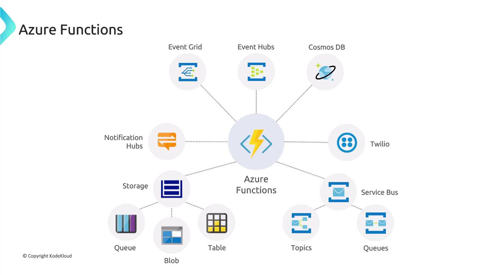
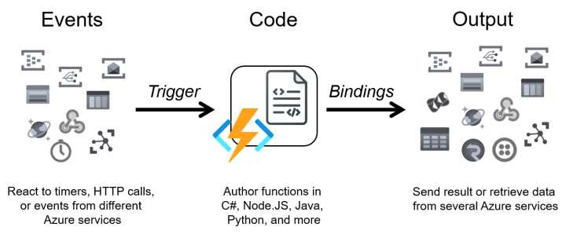
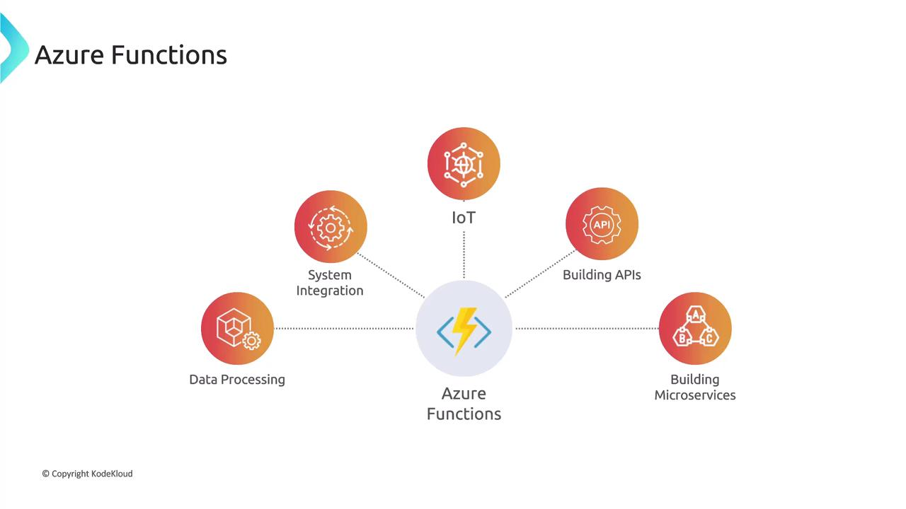

# ⚡ **Azure Functions**

## 📌 **What is Azure Functions?**

Azure Functions is a **serverless compute service** that lets you run small units of code (functions) **without managing servers or infrastructure**.

Think of it as:

- Write your code → Azure runs it when **something happens** (an event).
- No VM, no container setup, no scaling headaches.
- Pay only for the **execution time** and resources used.

---

<div align="center" style="background-color: #ffffffff ;border-radius: 10px;border: 2px solid white">
  
</div>

---

## 🎯 **Why Use It?**

- **Event-driven** – respond to triggers like HTTP requests, queue messages, timers, database changes.
- **Scale automatically** – from 0 to thousands of executions per second.
- **Pay-per-use** – consumption plan charges only when your function runs.
- **Polyglot** – supports C#, Python, Java, JavaScript, PowerShell, Go, etc.
- **Integrations** – deep integration with Azure services (Storage, Service Bus, Event Grid, Cosmos DB).

---

## 🖼 **Azure Functions Architecture**

🔹 **Trigger**: Starts the function (e.g., HTTP request, queue message, CRON schedule).  
🔹 **Function Code**: Your logic.  
🔹 **Binding**: Simplifies connecting to services (input/output).

<div align="center" style="background-color: #ffffffff ;border-radius: 10px;border: 2px solid white;margin: 0 10px">
  
</div>

---

## 🚀 **Hosting Models**

| Hosting Plan                   | Use Case                                 | Scaling                       |
| ------------------------------ | ---------------------------------------- | ----------------------------- |
| **1️⃣ Consumption Plan**        | Default, pay-per-use, auto-scale         | Cold start possible           |
| **2️⃣ Premium Plan**            | For predictable workloads, no cold start | Auto-scale + VNET integration |
| **3️⃣ Dedicated (App Service)** | Runs on App Service Plan (fixed cost)    | Manual scaling                |

---

## 🔌 **Triggers & Bindings**

### 🔹 Triggers (start function execution)

- HTTP Trigger (API endpoint)
- Timer Trigger (`CRON` jobs)
- Blob Trigger (file upload in storage)
- Queue Trigger (message in Azure Storage Queue)
- Service Bus Trigger
- Event Grid / Event Hub Trigger
- Cosmos DB Trigger

### 🔹 Bindings (connect to other services)

- Input Binding → bring data in.
- Output Binding → send data out.

👉 Example: Function triggered by an HTTP request → writes result to Cosmos DB.

---

## 🛠 **Step-by-Step: Create Azure Function**

### 1️⃣ Using **Azure Portal**

1. Go to **Azure Portal → Create a Resource → Function App**.
2. Configure:

   - Resource Group
   - Function App name (unique)
   - Runtime (C#, Python, Node.js, etc.)
   - Hosting plan (Consumption is default)
   - Storage Account (required for state + logs)

3. Deploy → Go to **Functions → Create → HTTP Trigger**.
4. Test with built-in editor or Postman.

---

### 2️⃣ Using **Azure CLI**

```bash
# Create RG
az group create --name rg-func-demo --location eastus

# Create Storage (required)
az storage account create \
  --name funcdemosa123 \
  --location eastus \
  --resource-group rg-func-demo \
  --sku Standard_LRS

# Create Function App
az functionapp create \
  --resource-group rg-func-demo \
  --consumption-plan-location eastus \
  --runtime dotnet \
  --functions-version 4 \
  --name funcdemo12345 \
  --storage-account funcdemosa123
```

---

### 3️⃣ Function Code Example (C# HTTP Trigger)

```csharp
using System.IO;
using Microsoft.AspNetCore.Mvc;
using Microsoft.Azure.WebJobs;
using Microsoft.Azure.WebJobs.Extensions.Http;
using Microsoft.AspNetCore.Http;
using Microsoft.Extensions.Logging;
using Newtonsoft.Json;

public static class HelloFunction
{
    [FunctionName("HelloFunction")]
    public static async Task<IActionResult> Run(
        [HttpTrigger(AuthorizationLevel.Function, "get", "post")] HttpRequest req,
        ILogger log)
    {
        log.LogInformation("C# HTTP trigger processed a request.");

        string name = req.Query["name"];
        string responseMessage = string.IsNullOrEmpty(name)
            ? "Hello, Azure Functions 🚀!"
            : $"Hello, {name}! 👋";

        return new OkObjectResult(responseMessage);
    }
}
```

👉 Call with:

```bash
curl https://funcdemo12345.azurewebsites.net/api/HelloFunction?name=John
```

Response:

```ini
Hello, John! 👋
```

---

## 🧩 **Real Use Cases**

🔹 **Serverless APIs** → quick REST endpoints without full backend.  
🔹 **Data processing** → process images when uploaded to Blob Storage.  
🔹 **Event-driven workflows** → new order → push to queue → trigger function → notify user.  
🔹 **CRON jobs** → nightly cleanup, scheduled emails.

---

<div align="center" style="background-color: #ffffffff ;border-radius: 10px;border: 2px solid white;margin: 0 10px">
  
</div>

---

## 📚 **Best Practices**

- Keep functions **small and single-purpose**.
- Use **managed identity** for secure access to resources (no secrets).
- Handle **cold starts** → use Premium Plan for latency-sensitive apps.
- Log with **Application Insights**.
- Use **Durable Functions** for workflows/orchestrations.
