# ⚡ **Azure Functions** vs 🧩 **Logic Apps** vs 🔄 **WebJobs**

## 📌 **The Big Picture**

All three services help you **run background tasks, workflows, or event-driven jobs** in Azure — but they differ in **how you build, scale, and pay for them**.

Think of it like this:

- **Azure Functions** → "I want to **write code** that reacts to events."
- **Logic Apps** → "I want to **orchestrate workflows** with connectors, drag-and-drop, minimal code."
- **WebJobs** → "I already run an **App Service** and want background tasks inside it."

---

## 🆚 **Functions vs Logic Apps**

| Aspect           | ⚡ Azure Functions (Code-First)           | 🧩 Logic Apps (Designer-First)                                             |
| ---------------- | ----------------------------------------- | -------------------------------------------------------------------------- |
| **Development**  | Write code (C#, Python, Node.js, etc.)    | Visual designer + drag-and-drop connectors                                 |
| **Connectivity** | Triggers + custom bindings                | 400+ built-in connectors (Outlook, Teams, SAP, Salesforce, SharePoint)     |
| **Actions**      | Must code logic                           | Many out-of-the-box actions (send email, add to SharePoint, post to Teams) |
| **Monitoring**   | Application Insights (detailed telemetry) | Azure Monitor Logs + portal run history                                    |
| **Management**   | Via Portal, CLI, VS Code, APIs            | Portal GUI is main control + APIs                                          |
| **Execution**    | Runs locally + in cloud                   | Cloud-first, less focus on local                                           |
| **Cost Model**   | Pay-per-execution                         | Pay-per-action/connector run                                               |

👉 **When to use**:

- **Functions** → When you need **custom logic** in code (e.g., image processing, API backends, ML inference).
- **Logic Apps** → When you need to **orchestrate integrations quickly** (e.g., “When email arrives in Outlook → Save attachment to Blob Storage → Notify in Teams”).

---

## 🆚 **Functions vs WebJobs**

| Aspect            | ⚡ Azure Functions                               | 🔄 WebJobs                                         |
| ----------------- | ------------------------------------------------ | -------------------------------------------------- |
| **Compute Model** | Serverless, auto-scale                           | Runs inside App Service Plan (shared with web app) |
| **Scaling**       | Auto-scale to 1000s of instances                 | Limited by App Service Plan scaling                |
| **Development**   | Local + Portal editing                           | Local dev only, deploy manually                    |
| **Pricing**       | Pay-per-execution                                | Fixed App Service Plan cost (even if idle)         |
| **Integration**   | Native bindings to Event Hub, Cosmos DB, Storage | Manual integration (SDKs or code)                  |
| **Languages**     | C#, Python, Node.js, Java, PowerShell, etc.      | Mostly .NET-focused                                |
| **Best Use Case** | Burst workloads, event-driven jobs               | Continuous jobs tied to your web app               |

👉 **When to use**:

- **Functions** → Event-driven, variable workloads (e.g., resize images on blob upload).
- **WebJobs** → If you already run **App Service** and want **simple background jobs** (e.g., cleanup tasks).

---

## 🎯 **Decision Cheat Sheet**

- ✅ Use **Azure Functions** if:

  - You need **scalable serverless code**.
  - Event-driven: triggers from HTTP, queues, events, or timers.
  - You want **polyglot support** (C#, Node, Python, Java).
  - Pay only when it runs.

- ✅ Use **Logic Apps** if:

  - You’re integrating **multiple services quickly**.
  - Low-code/no-code solution needed.
  - You need prebuilt connectors (Teams, Outlook, SAP).
  - You want **business workflow automation** (approvals, notifications).

- ✅ Use **WebJobs** if:

  - You already have an **App Service**.
  - Want to run **continuous or scheduled background jobs**.
  - Your workload is **.NET-heavy** and tied to an existing web app.

---

## 🖼 Visual Comparison

```mermaid
graph TD
    A[Event or Schedule] --> B1[⚡ Azure Function]
    A --> B2[🧩 Logic App]
    A --> B3[🔄 WebJob]

    B1 -->|Custom Code| DB[(Cosmos DB)]
    B2 -->|Prebuilt Connector| Teams[(MS Teams)]
    B3 -->|Runs in App Service| Cleanup[Background Task]
```

---

✅ **Key takeaway**:

- **Functions** = serverless code, scale, flexibility.
- **Logic Apps** = workflows, connectors, business process automation.
- **WebJobs** = background jobs inside App Service.
