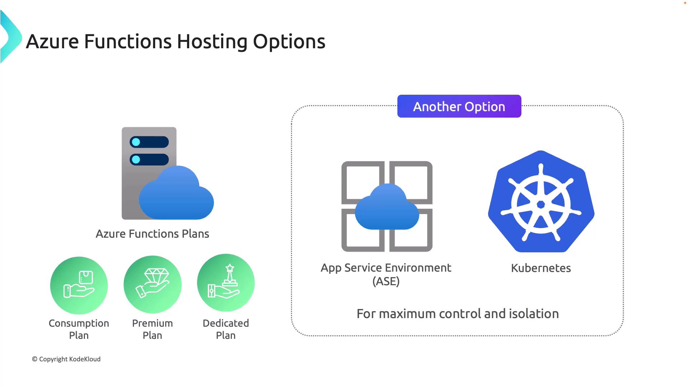
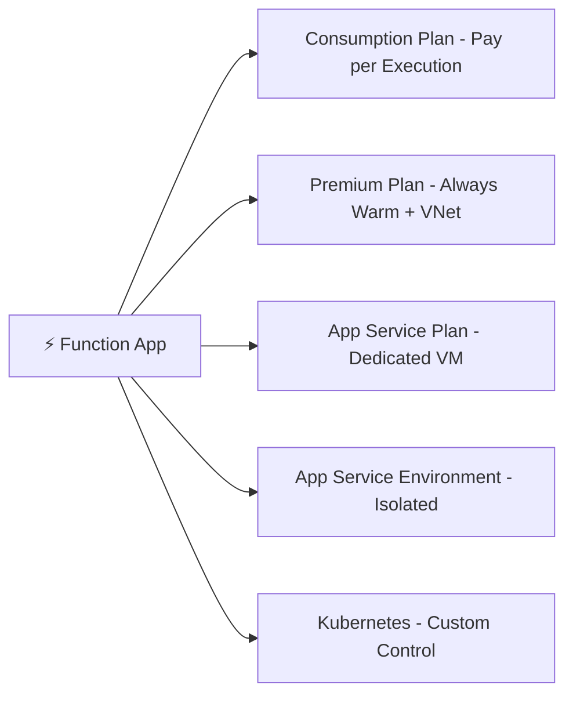

# ⚡ **Azure Functions Hosting Options**

## 🛑 **Problem: Why Hosting Plans Matter**

When you deploy an **Azure Function App**, you need to pick a **hosting plan**.
This choice decides:

- **How your app scales** (auto vs. fixed).
- **What resources you get** (CPU, memory).
- **How much you pay** (per execution vs. reserved instances).
- **Which advanced features** you can enable (VNet, longer execution, etc.).

If you pick the wrong one → your app might be **too slow**, **too costly**, or **lacking key features**.

---

## ✅ **Solution: Hosting Plan Options**

Azure Functions offers multiple plans. Let’s explore them one by one.

---

  

---

### 1️⃣ **Consumption Plan (Pay-per-Use)**

💡 **Best for:** Cost efficiency + unpredictable traffic

- Auto-scales based on demand.
- **Billed only for execution time + memory used**.
- Handles **bursty workloads** with no upfront costs.
- Execution timeout: **5 minutes by default, up to 10 mins** (can increase with Premium).

📌 **Example**

- A function that resizes images whenever a blob is uploaded.
- Runs 20 seconds → you only pay for 20 seconds.

👉 **Downside:** **Cold start delay** ⏳ (first request may be slow).

---

### 2️⃣ **Premium Plan (Always Warm)**

💡 **Best for:** **Low-latency** apps + enterprise features

- Fixes the **cold start issue** → pre-warmed instances.
- Longer execution → up to **60 minutes per function**.
- Advanced features:

  - **VNet integration**
  - **Dedicated hardware** options
  - **Scaling beyond 200 instances**

- Billed for **pre-warmed instances + execution time**.

📌 **Example**

- A financial API that must respond **instantly**, even if idle.
- Needs to call private databases in a VNet.

👉 **Downside:** More expensive 💰 than Consumption.

---

### 3️⃣ **App Service Plan (Dedicated Hosting)**

💡 **Best for:** Reusing existing App Service capacity

- Runs Functions on the same **dedicated VM pool** as your web apps.
- Good if you already have **underutilized App Service resources**.
- Can run **continuously** without execution limits.
- Useful for **long-running jobs**.

📌 **Example**

- You already run an **App Service Plan (S1)** hosting a website.
- Deploy a **Function App** in the same plan → no extra cost.

👉 **Downside:** No pay-per-use → you pay for the VM whether functions run or not.

---

### 4️⃣ **App Service Environment (ASE – Single Tenant)**

💡 **Best for:** **Compliance + isolation**

- Fully **isolated, single-tenant environment**.
- Runs inside your **own VNet**.
- Enterprise-grade security:

  - Internal load balancer
  - Compliance standards (e.g., PCI, HIPAA, GDPR)

- Expensive, but powerful.

📌 **Example**

- A healthcare provider app that processes patient data.
- Needs **regulatory compliance + private networking**.

👉 **Downside:** High cost 💸.

---

### 5️⃣ **Kubernetes (Custom Hosting)**

💡 **Best for:** Hybrid + multi-cloud scenarios

- Run Functions in **AKS (Azure Kubernetes Service)** or any **K8s cluster**.
- Full control: scaling, networking, hybrid setups.
- Use **KEDA (Kubernetes Event-driven Autoscaling)** to scale Functions on events.

📌 **Example**

- A global enterprise runs workloads across **Azure + on-prem + AWS**.
- Deploy the same Functions consistently in all environments.

👉 **Downside:** You manage **Kubernetes complexity**.

---

## 🖼 Visual: Hosting Options

---

## 📊 **Comparison Table**

| Plan                 | Cost Model        | Scaling            | Cold Start | Max Execution | Best For                     |
| -------------------- | ----------------- | ------------------ | ---------- | ------------- | ---------------------------- |
| **Consumption**      | Pay-per-execution | Auto, event-driven | Yes ❄️     | 5–10 min      | Bursty, low-traffic apps     |
| **Premium**          | Pay + pre-warm    | Auto + VNet        | No 🚀      | 60 min        | Low-latency, enterprise apps |
| **App Service Plan** | Fixed VM cost     | Manual scaling     | No 🚀      | Unlimited     | Reuse existing capacity      |
| **App Service Env.** | High fixed cost   | Dedicated + VNet   | No 🚀      | Unlimited     | Compliance, isolation        |
| **Kubernetes**       | Custom infra      | KEDA-driven        | Depends    | Custom        | Hybrid, multi-cloud control  |

---

## 🎯 **Decision Guide**

- Pick **Consumption** if you want **cheapest, burst-friendly serverless**.
- Pick **Premium** if you need **instant response, VNet, long runs**.
- Pick **App Service Plan** if you already have App Service capacity.
- Pick **ASE** if you need **compliance, isolation, private hosting**.
- Pick **Kubernetes** if you want **hybrid/multi-cloud flexibility**.
