# ⚡ **Azure Functions Hosting Options**

## 🛑 **Problem: Why Hosting Plans Matter**

When you deploy an **Azure Function App**, you need to pick a **hosting plan**.
This choice decides:

- **How your app scales** (auto vs. fixed).
- **What resources you get** (CPU, memory).
- **How much you pay** (per execution vs. reserved instances).
- **Which advanced features** you can enable (VNet, longer execution, etc.).

If you pick the wrong one → your app might be **too slow**, **too costly**, or **lacking key features**.

---

## ✅ **Solution: Hosting Plan Options**

Azure Functions offers multiple plans. Let’s explore them one by one.

---

<div align="center">
  
</div>

<div align="center">
  
</div>

---

### 1️⃣ **Consumption Plan (Pay-per-Use)**

💡 **Best for:** Cost efficiency + unpredictable traffic

- Auto-scales based on demand.
- **Billed only for execution time + memory used**.
- Handles **bursty workloads** with no upfront costs.
- Execution timeout: **5 minutes by default, up to 10 mins** (can increase with Premium).

📌 **Example**

- A function that resizes images whenever a blob is uploaded.
- Runs 20 seconds → you only pay for 20 seconds.

👉 **Downside:** **Cold start delay** ⏳ (first request may be slow).

---

### 2️⃣ **Premium Plan (Always Warm)**

💡 **Best for:** **Low-latency** apps + enterprise features

- Fixes the **cold start issue** → pre-warmed instances.
- Longer execution → up to **60 minutes per function**.
- Advanced features:

  - **VNet integration**
  - **Dedicated hardware** options
  - **Scaling beyond 200 instances**

- Billed for **pre-warmed instances + execution time**.

📌 **Example**

- A financial API that must respond **instantly**, even if idle.
- Needs to call private databases in a VNet.

👉 **Downside:** More expensive 💰 than Consumption.

---

### 3️⃣ **App Service Plan (Dedicated Hosting)**

💡 **Best for:** Reusing existing App Service capacity

- Runs Functions on the same **dedicated VM pool** as your web apps.
- Good if you already have **underutilized App Service resources**.
- Can run **continuously** without execution limits.
- Useful for **long-running jobs**.

📌 **Example**

- You already run an **App Service Plan (S1)** hosting a website.
- Deploy a **Function App** in the same plan → no extra cost.

👉 **Downside:** No pay-per-use → you pay for the VM whether functions run or not.

---

### 4️⃣ **App Service Environment (ASE – Single Tenant)**

💡 **Best for:** **Compliance + isolation**

- Fully **isolated, single-tenant environment**.
- Runs inside your **own VNet**.
- Enterprise-grade security:

  - Internal load balancer
  - Compliance standards (e.g., PCI, HIPAA, GDPR)

- Expensive, but powerful.

📌 **Example**

- A healthcare provider app that processes patient data.
- Needs **regulatory compliance + private networking**.

👉 **Downside:** High cost 💸.

---

### 5️⃣ **Kubernetes (Custom Hosting)**

💡 **Best for:** Hybrid + multi-cloud scenarios

- Run Functions in **AKS (Azure Kubernetes Service)** or any **K8s cluster**.
- Full control: scaling, networking, hybrid setups.
- Use **KEDA (Kubernetes Event-driven Autoscaling)** to scale Functions on events.

📌 **Example**

- A global enterprise runs workloads across **Azure + on-prem + AWS**.
- Deploy the same Functions consistently in all environments.

👉 **Downside:** You manage **Kubernetes complexity**.

---

## 🖼 Visual: Hosting Options

```mermaid
flowchart LR
    A[⚡ Function App] --> B1[Consumption Plan - Pay per Execution]
    A --> B2[Premium Plan - Always Warm + VNet]
    A --> B3[App Service Plan - Dedicated VM]
    A --> B4[App Service Environment - Isolated]
    A --> B5[Kubernetes - Custom Control]
```



---

## 📊 **Comparison Table**

| Plan                 | Cost Model        | Scaling            | Cold Start | Max Execution | Best For                     |
| -------------------- | ----------------- | ------------------ | ---------- | ------------- | ---------------------------- |
| **Consumption**      | Pay-per-execution | Auto, event-driven | Yes ❄️     | 5–10 min      | Bursty, low-traffic apps     |
| **Premium**          | Pay + pre-warm    | Auto + VNet        | No 🚀      | 60 min        | Low-latency, enterprise apps |
| **App Service Plan** | Fixed VM cost     | Manual scaling     | No 🚀      | Unlimited     | Reuse existing capacity      |
| **App Service Env.** | High fixed cost   | Dedicated + VNet   | No 🚀      | Unlimited     | Compliance, isolation        |
| **Kubernetes**       | Custom infra      | KEDA-driven        | Depends    | Custom        | Hybrid, multi-cloud control  |

---

## 🎯 **Decision Guide**

- Pick **Consumption** if you want **cheapest, burst-friendly serverless**.
- Pick **Premium** if you need **instant response, VNet, long runs**.
- Pick **App Service Plan** if you already have App Service capacity.
- Pick **ASE** if you need **compliance, isolation, private hosting**.
- Pick **Kubernetes** if you want **hybrid/multi-cloud flexibility**.

---

## 🏃 Azure Functions Runtimes

### 💻 The Core Runtime Versions

Azure Functions itself has a **host runtime** (v1, v2, v3, v4).

- **v1** (2016, .NET Framework 4.7) → legacy, Windows-only, **deprecated**.
- **v2/v3** (.NET Core-based, cross-platform) → also legacy, superseded.
- **v4** (current, GA) → supports **.NET 6/7/8, Python 3.9–3.11, Node.js 18+, Java 11/17/21, PowerShell 7.2/7.4**.
- **v5** (in preview, 2025) → built on **.NET Aspire/isolated improvements**.

👉 Today, almost every new Function App is created with **Functions v4** runtime.

---

### ⚙️ Supported Language Runtimes (as of 2025)

Here are the **stacks you can pick** when creating a Function App:

| **Language**             | **Versions Supported**                                                             | **Notes**                                                                                                             |
| ------------------------ | ---------------------------------------------------------------------------------- | --------------------------------------------------------------------------------------------------------------------- |
| **.NET**                 | .NET 6 (LTS), .NET 8 (LTS), .NET 7 (STS), .NET Framework 4.8 (Windows-only legacy) | Two models: **in-process** (tight binding with Functions host) and **isolated worker** (recommended, cross-platform). |
| **JavaScript / Node.js** | Node.js 18, Node.js 20                                                             | Uses function.json for bindings. Perfect for quick APIs or event-driven apps.                                         |
| **Python**               | 3.9, 3.10, 3.11                                                                    | Supports v1 (JSON model) and v2 (Python programming model) SDKs.                                                      |
| **Java**                 | Java 11, Java 17, Java 21                                                          | Uses Maven/Gradle. Annotations (`@FunctionName`, `@HttpTrigger`) define bindings.                                     |
| **PowerShell**           | 7.2 (LTS), 7.4                                                                     | Great for scripting/automation in IT/DevOps scenarios.                                                                |
| **Custom Handler**       | Any language via HTTP stdin/stdout                                                 | Write in **Go, Rust, PHP, etc.** — you provide a “custom handler” binary that speaks JSON to the Functions host.      |

---

### 🏷️ Available `--runtime` Options

When you create a Function App with `az functionapp create`, these are valid:

| Runtime option        | Notes                                                                                                                      |
| --------------------- | -------------------------------------------------------------------------------------------------------------------------- |
| `dotnet`              | Classic in-process model. Limited to **.NET 6 LTS**.                                                                       |
| `dotnet-isolated`     | Isolated worker model. Supports **.NET 7, .NET 8 (LTS)**. Recommended for new projects.                                    |
| `node`                | Node.js stack. You specify `--runtime-version 18` or `20`.                                                                 |
| `python`              | Python stack. Use `--runtime-version 3.9`, `3.10`, `3.11`.                                                                 |
| `java`                | Java worker. Specify `--runtime-version 11`, `17`, or `21`.                                                                |
| `powershell`          | PowerShell stack. Specify `--runtime-version 7.2` or `7.4`.                                                                |
| `custom` (via Docker) | Not passed as `--runtime`, but if you deploy a containerized app, you control the base image (can be Go, Rust, PHP, etc.). |

---

### ✍🏻 Example CLI usage

#### .NET in-process (Functions v4 + .NET 6)

```bash
az functionapp create \
  -g myrg -n func-inprocess-demo \
  --storage-account mystg \
  --consumption-plan-location westeurope \
  --functions-version 4 \
  --runtime dotnet \
  --runtime-version 6
```

#### .NET isolated worker (Functions v4 + .NET 8)

```bash
az functionapp create \
  -g myrg -n func-isolated-demo \
  --storage-account mystg \
  --consumption-plan-location westeurope \
  --functions-version 4 \
  --runtime dotnet-isolated \
  --runtime-version 8
```

#### Python 3.11

```bash
az functionapp create \
  -g myrg -n func-python-demo \
  --storage-account mystg \
  --consumption-plan-location westeurope \
  --functions-version 4 \
  --runtime python \
  --runtime-version 3.11
```

---

### ✅ Which Should You Pick?

- If you’re starting **fresh today** → choose **`dotnet-isolated`** with **.NET 8**.
- If you must support **legacy .NET 6 projects** → use **`dotnet`** (in-process).
- If you’re polyglot: pick `python`, `node`, `java`, `powershell`.
- If your language isn’t officially supported → use a **custom handler** or **container image**.
