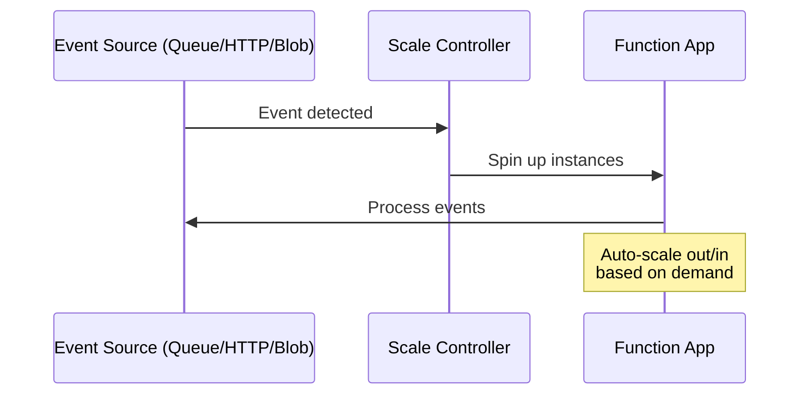
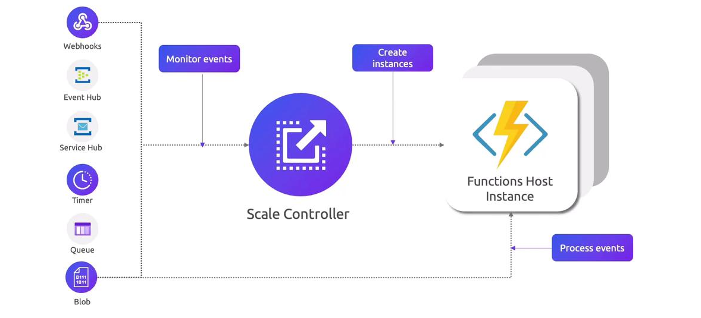

# ⚡ **Azure Functions Scaling**

## 🛑 **Problem – Why Scaling Matters**

Azure Functions is **event-driven** and **serverless**, which means:

- You don’t manage servers.
- You rely on **Azure to automatically add/remove instances**.
- If scaling isn’t understood, your app may suffer from:
  - 🚦 Latency (cold starts)
  - ⚠️ Timeouts on long-running tasks
  - 💸 Unexpected costs if misconfigured

---

## ✅ **How Scaling Works**

1. **Scaling Unit** → The **Function App** (not individual functions).

   - All functions inside the same app **scale together**.

2. **Scale Controller** → Azure has a **scale controller** running in the background.

   - It monitors **events** (HTTP, Queue, Event Hub, Blob, Service Bus, CRON timers).
   - Decides when to **add or remove instances**.

3. **Scale to Zero** (Consumption plan only)

   - If no events, app scales to **0 instances → \$0 cost**.
   - First call after idle = **cold start** ⏳.

4. **Burst Scaling**
   - When traffic spikes, Azure can quickly spin up **hundreds of instances** in parallel.



<div align="center">
  
</div>

---

## 📊 **Scaling by Hosting Plan**

| Hosting Plan                | Max Instances                | Scale Behavior                                 | Cold Start | Timeout                       |
| --------------------------- | ---------------------------- | ---------------------------------------------- | ---------- | ----------------------------- |
| **Consumption**             | Win: 200 <br> Linux: 100     | Event-driven, scales to 0                      | Yes ❄️     | 5 min default <br> 10 min max |
| **Premium**                 | Win: ~100 <br> Linux: 20–100 | Auto + Pre-warmed                              | No 🚀      | 30 min default <br> Unlimited |
| **Dedicated (App Service)** | 10–30 (up to 100 in ASE)     | Manual + Auto (with App Service scaling rules) | No 🚀      | 30 min default <br> Unlimited |
| **Container Apps**          | 10–300                       | KEDA-based autoscaling                         | Depends    | Configurable                  |

---

## ⏳ **Timeout Configuration**

Defined in **`host.json`** under `functionTimeout`:

```json
{
  "functionTimeout": "00:10:00" // 10 minutes
}
```

- **Consumption Plan** → Default 5 min, Max 10 min
- **Premium / Dedicated / Container Apps** → Default 30 min, Configurable to **unlimited**

---

## ⚠️ **Performance Considerations**

- **Cold Starts**

  - Consumption Plan may pause apps → first call is slow.
  - Premium/Dedicated → pre-warmed, no cold start.

- **Burst Limits**

  - Event Hubs / Service Bus scaling tied to **partition count**.
  - Queue triggers scale based on **queue length** + message rate.

- **Concurrency**
  - Each instance may process **multiple events** concurrently.
  - Example: A single HTTP instance might handle **100 requests simultaneously**.

---

## ⚡ **What Does an "Instance" Mean in Azure Functions?**

### 🔹 Instance ≠ Single Function Execution

- An **instance** in Azure Functions = a **compute container** (think of it as a small VM/container managed by Azure) that runs your **Function App runtime**.
- Each instance:

  - Can host **all functions** in the Function App.
  - Can process **multiple executions in parallel** (depending on trigger type + runtime settings).

---

### 🔹 Parallelism Inside an Instance

- One instance does **not** equal one request.
- Each instance can handle **many requests concurrently**.

#### Example:

- **HTTP Trigger**

  - Each instance is like a mini web server (Kestrel for .NET).
  - Can process **hundreds of requests/second**, depending on CPU, memory, and runtime settings.

- **Queue/Service Bus/Blob Trigger**

  - Each instance pulls **batches of messages** from the queue.
  - Example: If batch size = 16, one instance may process **16 messages in parallel**.

---

### 🔹 Scaling Example (Consumption Plan, HTTP Trigger)

- Let’s say you’re under **Consumption Plan** (max 200 instances for Windows).
- 200 instances spun up ≠ 200 RPS (requests/sec).
- It means **200 mini VMs** are running your Function App.
- Each instance might handle **100–200 HTTP requests/sec**, so **200 instances → 20,000–40,000 RPS** capacity (theoretical).

---

## 🎯 **When to Use Each Scaling Model**

- **Consumption Plan** → Best for **sporadic, bursty workloads** (IoT triggers, nightly jobs).
- **Premium Plan** → Best for **low-latency APIs**, private VNet integration, or long jobs.
- **Dedicated/App Service** → Best when **you already run App Service** and want to reuse compute.
- **Container Apps (KEDA)** → Best for **hybrid/multi-cloud** or **fine-grained scaling control**.

---

## 🏁 **Key Takeaways**

- Azure Functions scale **automatically** → but the **plan defines the limits**.
- Consumption = **cheapest**, but has **cold starts + 10-min cap**.
- Premium/Dedicated = **low latency, unlimited runtime, VNet support**.
- Use **Container Apps/K8s** for advanced **event-driven scaling in custom environments**.
