# 🔔 **Triggers & Bindings in Azure Functions**

Azure Functions becomes powerful because it can react to events (**triggers**) and easily connect to services (**bindings**) without boilerplate code.

---



```mermaid
flowchart LR
    subgraph ExternalServices["🌐 External Services"]
        HTTPReq["HTTP Request"]
        QueueMsg["Queue Message"]
        TimerEvt["Timer Event"]
        BlobEvt["Blob Event"]
    end

    subgraph AzureFunction["⚡ Azure Function"]
        Trigger["🔔 Trigger (1 per function)"]
        Code["📝 Function Code"]
        InputB["⬅️ Input Binding(s)"]
        OutputB["➡️ Output Binding(s)"]
    end

    subgraph Destinations["📤 Destinations"]
        BlobStore["Blob Storage"]
        TableStore["Table Storage"]
        CosmosDB["Cosmos DB"]
        HttpResp["HTTP Response"]
    end

    %% Flows
    HTTPReq --> Trigger
    QueueMsg --> Trigger
    TimerEvt --> Trigger
    BlobEvt --> Trigger

    Trigger --> |optional| InputB
    InputB --> |optional|Code
    Code --> |optional| OutputB

    OutputB --> BlobStore
    OutputB --> TableStore
    OutputB --> CosmosDB
    OutputB --> HttpResp
```

- **Triggers (🔔)**: exactly **one per function**, comes from external event (HTTP, Queue, Timer, Blob).
- **Input Bindings (⬅️)**: optional, provide extra data _into_ the function.
- **Function Code (📝)**: your business logic.
- **Output Bindings (➡️)**: optional, send processed data _out_ to Azure services.
- **Destinations (📤)**: could be Blob Storage, Cosmos DB, Table Storage, or just an HTTP response.

> 💡 Triggers and bindings are defined differently depends on the specific programming language

---

## **📥 Triggers** (The “Start Button” 🚀)

- **Definition**: A trigger is an event that **starts** a function.
- **Rule**: Each function must have **exactly one trigger**.
- **Examples**:

  - `HttpTrigger` → when an HTTP request is received
  - `QueueTrigger` → when a new message appears in Azure Queue Storage
  - `TimerTrigger` → scheduled (like a CRON job)
  - `BlobTrigger` → when a blob is added/updated in Azure Storage

👉 Think of triggers as **“what wakes your function up”**.

---

## **📤 Bindings** (The “Connectors” 🔗)

- **Definition**: Bindings provide a **declarative way** to connect your function to external services (databases, queues, storage) **without writing integration code**.
- **Types**:

  - **Input binding** → brings data _into_ your function
  - **Output binding** → sends data _out_ of your function
  - **In-Out binding** → read + update the same resource

👉 Think of bindings as **“pipes that move data in/out”** of your function automatically.

---

## 📜 Definitions of Triggers/Bindings in Azure Function

As you Know Azure Functions can be created using multiple programming languages, and the method to define triggers and bindings depends on the language:

### 1️⃣ **C# / Java**

> 👉🏻 use **attributes/annotations**

Use attributes within the class library to define triggers and bindings. For instance, annotate your function with `[HttpTrigger]` for an HTTP trigger and `[Blob]` for Blob Storage access.

```csharp
public static void Run(
    [HttpTrigger(AuthorizationLevel.Function, "post")] HttpRequest req,
    [Table("MyTable", Connection="AzureWebJobsStorage")] IAsyncCollector<MyEntity> tableBinding)
```

#### ✍🏻 Sample C# Function Using the Azure Storage SDK

Below is an example C# function that processes an HTTP POST request. The function deserializes the JSON payload and writes an entity to Azure Table Storage using the Azure.Data.Tables SDK.

```cs
using System.IO;
using System.Threading.Tasks;
using Microsoft.AspNetCore.Mvc;
using Microsoft.Azure.WebJobs;
using Microsoft.Azure.WebJobs.Extensions.Http;
using Microsoft.AspNetCore.Http;
using Microsoft.Extensions.Logging;
using Newtonsoft.Json;
using Azure.Data.Tables;
using Azure;


public static class WebToTableFunction
{
    [FunctionName("WebToTableFunction")]
    public static async Task<IActionResult> Run(
        [HttpTrigger(AuthorizationLevel.Function, "post", Route = null)] HttpRequest req,
        ILogger log)
    {
        log.LogInformation("C# HTTP trigger function processed a request.");


        string requestBody = await new StreamReader(req.Body).ReadToEndAsync();
        dynamic data = JsonConvert.DeserializeObject(requestBody);


        string partitionKey = data?.partitionKey;
        string rowKey = data?.rowKey;
        string name = data?.name;
        string email = data?.email;


        if (string.IsNullOrEmpty(partitionKey) || string.IsNullOrEmpty(rowKey))
        {
            return new BadRequestObjectResult("Please pass both partitionKey and rowKey in the request body");
        }


        string storageConnectionString = Environment.GetEnvironmentVariable("AzureWebJobsStorage");
        TableServiceClient tableServiceClient = new TableServiceClient(storageConnectionString);
        TableClient tableClient = tableServiceClient.GetTableClient(tableName: "UserDetails");


        await tableClient.CreateIfNotExistsAsync();


        var entity = new TableEntity(partitionKey, rowKey)
        {
            { "Name", name },
            { "Email", email }
        };


        await tableClient.AddEntityAsync(entity);


        return new OkObjectResult("Data has been written to Azure Table Storage.");
    }
}
```

### 2️⃣ JavaScript, PowerShell, Python, and TypeScript

> 👉🏻 use **function.json**

In these languages, triggers and bindings are configured in a separate `function.json` file that specifies the binding type, direction, and other properties.

#### ✍🏻 **Example**: Queue → Blob (Combined Flow 📦 → ☁️)

Scenario:

- Trigger: New queue message
- Input binding: Reads queue message
- Output binding: Writes result to Blob storage

```json
{
  "bindings": [
    {
      "type": "queueTrigger",
      "direction": "in",
      "name": "myQueueItem",
      "queueName": "orders",
      "connection": "AzureWebJobsStorage"
    },
    {
      "type": "blob",
      "direction": "out",
      "name": "outputBlob",
      "path": "processed/{rand-guid}.txt",
      "connection": "AzureWebJobsStorage"
    }
  ]
}
```

- Function is triggered when a message appears in `orders` queue
- Data is saved into Blob Storage automatically (`processed/…txt`)

---

#### ✍🏻 **Example:** HTTP → Table Storage (Full Flow 🌐 → 📊)

Scenario:

- Trigger: HTTP POST request
- Output: HTTP response
- Output: Row written to Table Storage

```json
{
  "bindings": [
    {
      "type": "httpTrigger",
      "direction": "in",
      "name": "req",
      "authLevel": "function",
      "methods": ["post"]
    },
    {
      "type": "http",
      "direction": "out",
      "name": "$return"
    },
    {
      "type": "table",
      "direction": "out",
      "name": "outputTable",
      "tableName": "MyTable",
      "connection": "AzureWebJobsStorage",
      "partitionKey": "{partitionKey}",
      "rowKey": "{rowKey}"
    }
  ]
}
```

---

> 💡 **C#** can use either (attributes or JSON).

---

## 📌 Binding Directions

- **Trigger (always IN)** → starts the function
- **Input binding (IN)** → pulls data into the function
- **Output binding (OUT)** → pushes data out
- **In-Out binding (IN-OUT)** → read/update resource

---

## ✅ Key Takeaways

- **One trigger per function**.
- **Multiple bindings allowed** (input/output).
- Bindings save you from boilerplate integration code.
- Use **attributes (C#/Java)** or **function.json (JS/Python/etc.)**.
- You can always fall back to SDKs for advanced control.
