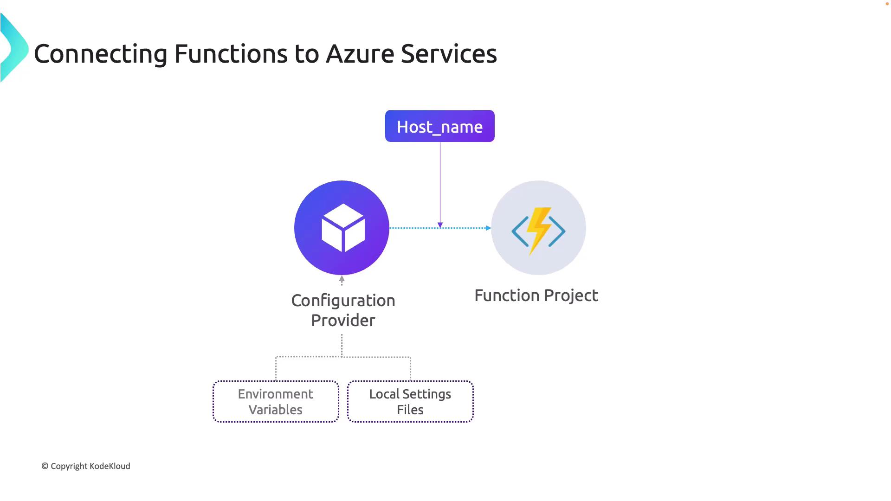
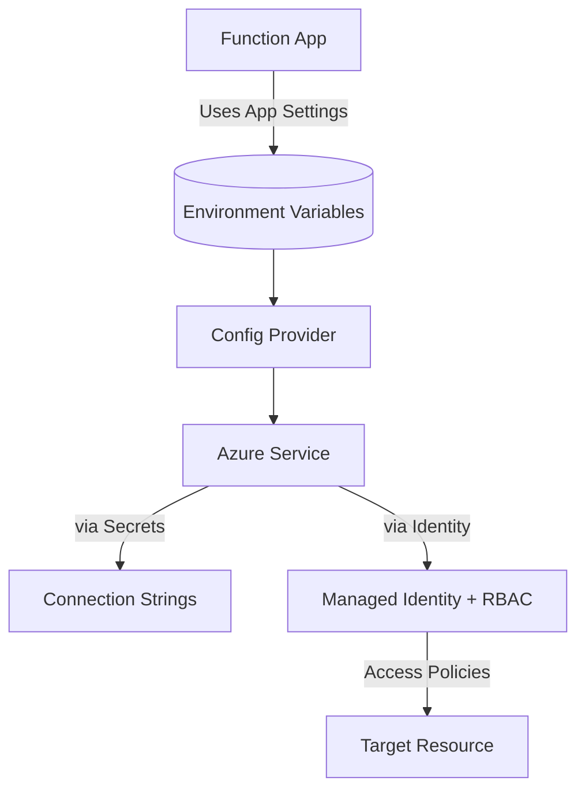

# 🔌 **Connecting Azure Functions to Azure Services**

When you build serverless apps, your functions rarely live in isolation, they usually **connect to other Azure services** (Storage, Service Bus, Cosmos DB, Key Vault, etc.). Managing these connections securely and flexibly is essential for **scalability and security**.

---

<div align="center" style="background-color: #ffffffff ;border-radius: 10px;border: 2px solid white">
  
</div>

---

## 🗂️ **Configuration & Connection Management**

- **No hardcoding 🚫** → Azure Functions avoid embedding connection strings directly in code.
- **Config Providers** → pull values from **environment variables** or **app settings**.
- **Environment awareness** → automatically adapts to dev/staging/prod environments.

📌 **Local development**

- Reads from `local.settings.json`.
- Example:

  ```json
  {
    "IsEncrypted": false,
    "Values": {
      "AzureWebJobsStorage": "UseDevelopmentStorage=true",
      "ServiceBusConnection": "<connection-string>"
    }
  }
  ```

📌 **Azure environment**

- Same keys exist as **Application Settings** in the Function App → available as environment variables.

---

## 🔑 **Secrets vs Identity**

Traditionally, connection strings hold **secrets** (keys, passwords). Example:

```json
"Values": {
  "SqlConnectionString": "Server=tcp:mydb.database.windows.net;User ID=appuser;Password=P@ssw0rd!"
}
```

But… storing secrets is risky 😨.
Better alternative → **Identity-based access** using **Managed Identity**.

---

## 🆔 **Using Managed Identity** Instead of Secrets

### What it is

- Azure assigns your Function App an **identity in Microsoft Entra ID**.
- That identity can request tokens and authenticate **without passwords or keys**.

### How to use

1. Enable **System-assigned Managed Identity** in Function App.
2. Assign a **role** on the target resource.
3. In code/config, reference identity instead of secret.

Example: **Accessing Blob Storage** via RBAC, no connection string:

```csharp
var credential = new DefaultAzureCredential();
var blobClient = new BlobClient(
    new Uri("https://mystorage.blob.core.windows.net/mycontainer/file.txt"),
    credential);
```

---

## 🛡️ **Granting Permissions (RBAC)**

When using identity, you **must assign roles**:

- Example:
  Function needs to read blobs → grant **Storage Blob Data Reader** role.
- Scope can be:

  - **Resource** (e.g., specific storage account container)
  - **Resource group**
  - **Subscription**

👉 Always follow **principle of least privilege** — don’t give “Contributor” if “Reader” is enough.

### Special case: Key Vault

- Add Function’s identity to **Key Vault Access Policy** (or use RBAC if enabled).
- Allows secret retrieval with SDK (instead of storing in `local.settings.json`).

---

## 🧩 **Grouping Settings with `__` Prefix**

- If service requires **multiple environment variables**, you can group them logically.
- Convention: `PREFIX__SubSetting`

  - Example:

    ```json
    "Values": {
      "CosmosDB__AccountEndpoint": "...",
      "CosmosDB__DatabaseName": "...",
      "CosmosDB__Key": "..."
    }
    ```

- Code binds them into a config section.

---

## ⚠️ **Security Considerations**

- ✅ Use **Managed Identities** wherever possible.
- ✅ Use **Azure Key Vault references** for secrets if absolutely required.
- ✅ Apply **least privilege roles** (Reader > Contributor > Owner).
- ❌ Never commit `local.settings.json` with secrets into Git repos.

---

## 📊 **Visual Summary**

<div align="center">



</div>

---

## ✅ **Quick Takeaways**

- Azure Functions **read connections from environment variables** → local from `local.settings.json`, in Azure from App Settings.
- Prefer **Managed Identity** over secrets for secure, passwordless connections.
- Always assign the **minimum RBAC role** needed for the target service.
- Use `__` convention for grouping related settings.
- For secrets that must exist → use **Azure Key Vault references**.
