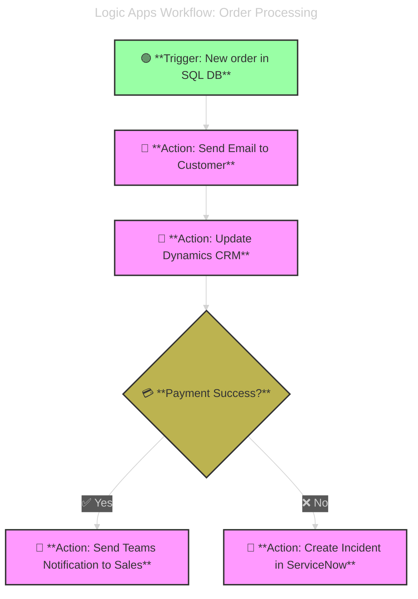
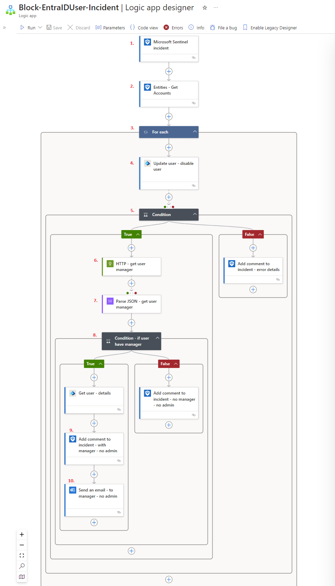
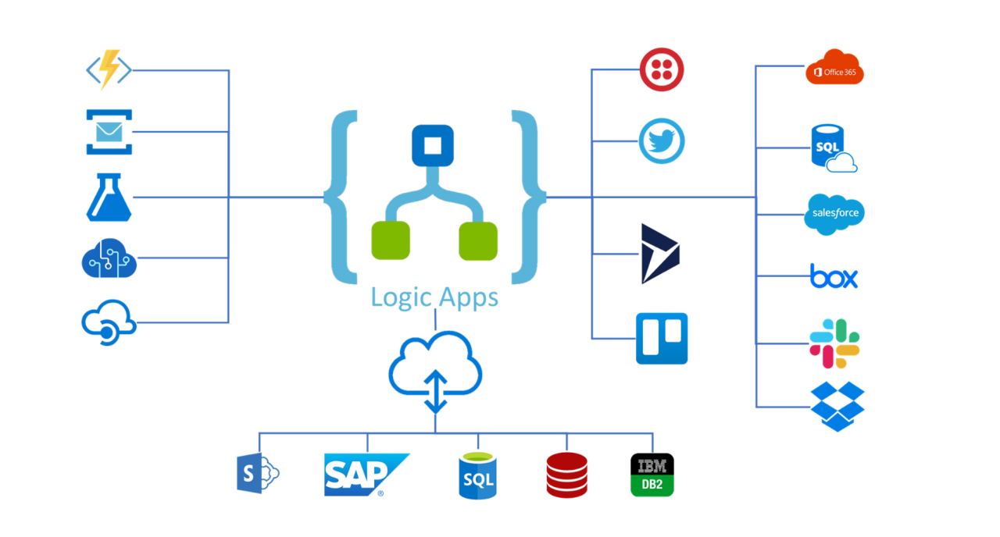

# 🪄 Azure Logic Apps

> 📖 **Official Definition**: Cloud Service that helps you schedule, automate and orchestrate tasks, business processes and workflows when you need to integrate apps, data, systems and services across enterprise or organizations.

## 📌 1. What is Logic Apps?

**Azure Logic Apps** is a **workflow automation service** that lets you build **event-driven, serverless workflows** using a **visual designer**. You can connect cloud services, on-prem systems, APIs, and data sources—without writing much code.

- Automates **business workflows** (approvals, alerts, ticketing).
- Integrates with **Azure + external systems** (Office 365, Salesforce, SAP, ServiceNow, Twitter, etc.).
- Runs in the cloud, serverless (you don’t manage infrastructure).

---

---

## ⚖️ AWS Comparison

| Azure Logic Apps                                        | AWS Equivalent(s)                               |
| ------------------------------------------------------- | ----------------------------------------------- |
| Visual workflow designer                                | AWS Step Functions (but Logic Apps is low-code) |
| Event triggers (HTTP, timers, etc.)                     | AWS EventBridge + CloudWatch Events             |
| Built-in connectors (Office 365, SQL, Salesforce, etc.) | AWS AppFlow + Lambda integrations               |
| Serverless execution                                    | AWS Lambda                                      |
| B2B integrations (EDI, AS2, etc.)                       | AWS B2B Data Exchange (less mature)             |

---

## ⚙️ How It Works

- You define a **workflow** using a visual designer or JSON (ARM/Bicep).
- Each workflow has **triggers** (e.g., HTTP request, file upload, timer).
- It runs **actions** (e.g., send email, call API, transform data).
- You can integrate with **Azure Functions**, **APIs**, **Service Bus**, **Blob Storage**, etc.

---

## 💭 Use Cases

- 📨 Send email when a new file is uploaded to Blob Storage
- 🔄 Sync data between SQL Server and Salesforce
- 🧾 Automate invoice processing with OCR and approval steps
- 🧪 Trigger workflows from Azure Monitor alerts
- 🧠 Build AI-powered workflows with OpenAI or Azure AI services

### 💭 Scenario: E-commerce company

1. A new order is placed → Event in SQL DB.
2. Logic App picks it up → Sends confirmation email via Outlook.
3. Updates CRM (Dynamics 365).
4. If payment fails → Creates incident in ServiceNow.

👉 No coding → just connecting services.

---

## 📌 Core Concepts

| Concept       | Meaning                                 | Example                           |
| ------------- | --------------------------------------- | --------------------------------- |
| **Trigger**   | Starts the workflow                     | “When new email arrives”          |
| **Action**    | Step performed                          | “Send Teams message”              |
| **Connector** | Prebuilt integration with a service     | Outlook, SAP, Twitter, ServiceNow |
| **Workflow**  | The whole Logic App (trigger + actions) | Order → Email → Ticket            |
| **Run**       | Each execution of workflow              | Every time a new email arrives    |

---

## 📌 Why Use Logic Apps?

- 🖇️ **Integration** → connect on-prem + cloud apps.
- 🧑‍💼 **Business automation** → approvals, notifications, onboarding.
- ⚡ **Serverless** → pay-per-run, auto-scale.
- ⏱️ **Fast development** → no need to write full apps for simple automations.
- 🔌 **Connector library** → 1,000+ connectors (Azure services, SaaS, custom APIs).

---

## 🖼️ Example Workflow (Visual)

  

---

## 💰 Pricing

- **Consumption Plan** → pay per run.
- **Standard Plan** → fixed cost, more performance, can run in **VNET / private envs**.

---

## 🧬 Integrations With Azure Services

  

---

## ♾️ Integration with DevOps

- Logic Apps can be managed as **code (ARM/Bicep/Terraform)**.
- Deploy via **Azure DevOps Pipelines**.
- Example: Deploy workflow JSON template → run integration tests.

---

## ✅ TL;DR

- **Azure Logic Apps** = Serverless **workflow automation + integration** service.
- Uses **triggers** (event) + **actions** (steps).
- Connects 1,000+ systems (Azure, SaaS, on-prem).
- Perfect for **approvals, ticketing, monitoring, data sync, messaging**.
- Exam keyword = _“workflow automation & integration”_.
