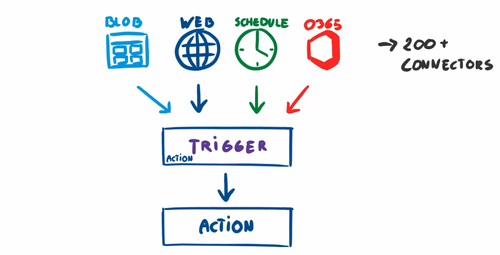
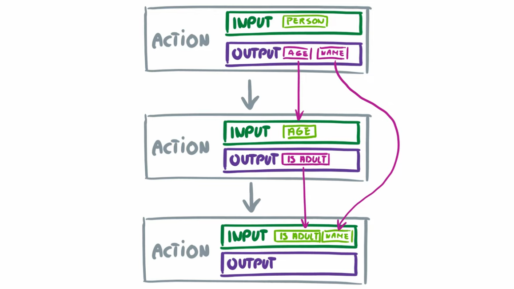

# ⚡ Azure Logic Apps — Components, Explained with Examples

Azure Logic Apps is a **serverless workflow automation service**. It allows you to **orchestrate business processes, system integrations, and event-driven automation** without writing (much) code.

---

## 🏗️ Core Components of Logic Apps

Let’s break it down into **building blocks**:

---

### 1️⃣ **Workflows**

- **Definition**: The entire Logic App definition — triggers + actions = workflow.
- **Structure**: JSON under the hood, but designed visually in the portal.

#### Example Workflow (pseudocode)

```json
{
  "definition": {
    "triggers": {
      "manual": {
        "type": "Request",
        "kind": "Http"
      }
    },
    "actions": {
      "send_email": {
        "type": "ApiConnection",
        "inputs": {
          "method": "post",
          "path": "/v2/Mail"
        }
      }
    }
  }
}
```

💡 Workflow: When an HTTP request is received → send an email.

---

### 2️⃣ **Trigger**

- **Definition**: Every Logic App starts with a trigger.
- **Types**:

  - **Recurrence trigger** → Run on schedule.
  - **HTTP/Webhook trigger** → Run when an API is called or event occurs.
  - **Connector triggers** → Run when something happens in a service (e.g., "When a new email arrives in Outlook").

<div align="left">
  
</div>

#### Example: Recurrence trigger

```json
{
  "type": "Recurrence",
  "interval": 1,
  "frequency": "Day"
}
```

💡 This runs **once per day**.

---

### 3️⃣ **Actions**

- **Definition**: Steps executed after the trigger.
- Each action performs **a task** — e.g., call API, transform data, send email.
- Actions can run **sequentially** or **in parallel**.

<div align="left">
  
</div>

#### Example: Action to send an email

```json
{
  "type": "ApiConnection",
  "inputs": {
    "method": "post",
    "host": {
      "connection": {
        "name": "@parameters('$connections')['office365']['connectionId']"
      }
    },
    "path": "/v2/Mail"
  }
}
```

💡 This action sends an email using Office 365.

---

### 4️⃣ **Connectors**

- **Definition**: Prebuilt integrations with services (like plugins).
- Categories:

  - **Standard connectors** (free/commonly used): Outlook, Twitter, Azure Storage.
  - **Premium connectors** (paid): SAP, Salesforce, ServiceNow.
  - **Enterprise connectors**: Industry systems like IBM MQ, SAP Hana.
  - **Custom connectors**: Bring your own API.

#### Example use cases:

- **Azure Blob Storage connector** → Trigger workflow when a new file is uploaded.
- **Twitter connector** → Post a tweet automatically.

---

### 5️⃣ **Control Actions**

- **Definition**: Logic for conditional flow.
- Types:

  - **Condition** → If/Else
  - **Switch** → Multiple branches
  - **For each** → Loop through items
  - **Until** → Loop until condition true
  - **Scope** → Group actions (with error handling)

#### Example: Condition

- If a file > 1MB → Send approval email.
- Else → Log and continue.

---

### 6️⃣ **Integration Account**

- **Definition**: Add-on for **B2B/Enterprise integration**.
- Used for **EDI, B2B protocols (AS2, X12, EDIFACT), and XML transforms**.
- Provides:

  - Schemas
  - Maps
  - Trading partner agreements

💡 Think of it as the “B2B brain” of Logic Apps.

---

### 7️⃣ **Run History & Monitoring**

- Each workflow execution = **run**.
- Azure Portal shows:

  - Input/output per step
  - Duration
  - Errors with diagnostics

- Can integrate with **Application Insights** for advanced telemetry.

---

### 8️⃣ **Deployment & Management**

- Logic Apps are **ARM resources** → deployable via:

  - **Portal (visual designer)**
  - **ARM Templates / Bicep / Terraform**
  - **Azure DevOps / GitHub Actions** (CI/CD)

---

## 🌍 Real Examples of Logic Apps

### ✍🏻 Example 1: Automating Daily Report Email

1. **Trigger**: Recurrence → Every day at 8 AM.
2. **Action 1**: Query Azure SQL Database.
3. **Action 2**: Format data into CSV.
4. **Action 3**: Send email with CSV attachment.

---

### ✍🏻 Example 2: Event-Driven File Processing

1. **Trigger**: "When a blob is added to Azure Storage".
2. **Action 1**: Extract file metadata.
3. **Action 2**: Transform content (via Azure Function or inline).
4. **Action 3**: Upload processed data into Cosmos DB.

---

### ✍🏻 Example 3: Twitter Sentiment Monitoring

1. **Trigger**: "When a tweet with #Azure is posted".
2. **Action 1**: Call Cognitive Services Text Analytics API → Get sentiment.
3. **Action 2 (Condition)**: If sentiment is negative → send Teams notification.

---

## 🔄 Logic Apps vs Alternatives

- **Logic Apps** → Best for **low-code integration** with 1000+ connectors.
- **Azure Functions** → Code-first serverless (more flexible).
- **Power Automate** → End-user focused (citizen developers).

💡 Interview tip: If asked, say **Logic Apps = enterprise-grade workflows with SLA, connectors, B2B support**.

---

## 🎯 Summary

Azure Logic Apps = **workflow automation engine** with these main components:

- **Triggers** → start events (HTTP, schedule, connectors).
- **Actions** → steps (API calls, processing).
- **Connectors** → integrations (standard, premium, custom).
- **Control Actions** → conditions, loops, scopes.
- **Integration Account** → B2B, EDI support.
- **Run history/Monitoring** → debug + insights.
