# ✍🏻 Building a Logic App in the Azure Portal (Enhanced Walkthrough)

In this walkthrough, we’ll create a **business workflow** in Azure Logic Apps.
🎯 **Scenario**: Linda, a new team member, receives invoice emails. Each invoice must:

1. Trigger a Teams notification (so Linda never misses one).
2. Capture Linda’s response (completed/pending).
3. Send a confirmation email back to the team.

This shows how Logic Apps can **integrate Outlook + Teams + business logic** with _zero custom backend code_.

---

## 🛠️ Step 1. Create the Logic App

1. Log in to the **Azure Portal**.
2. Search for **Logic Apps**.
3. Click **Add** → choose or create a resource group.
4. Select **Consumption model** (serverless, pay-per-execution).
5. Give it a name → e.g., `LindaTeamsWorkflow`.
6. Pick a region (e.g., _East US_) and click **Create**.
7. After deployment → click **Go to resource** → open **Logic Apps Designer** to start adding triggers and actions.

<div align="left">
  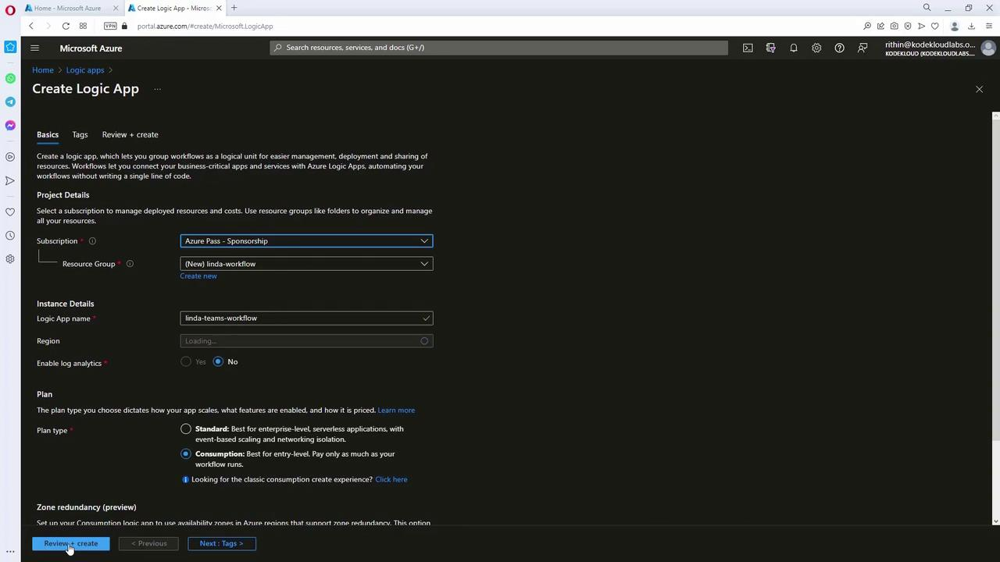
</div>

<div align="left">
  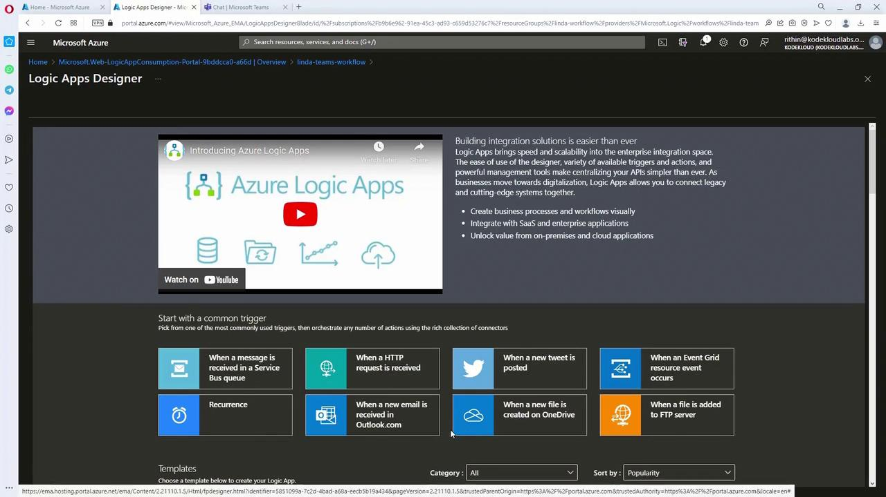
</div>

---

## 📩 Step 2. Configure the Email Trigger

The workflow starts when Linda gets an invoice email.
We’ll use **Outlook 365 connector** with **“When a new email arrives”**.

1. Add trigger → Outlook 365 → “When a new email arrives”.
2. Sign in with Linda’s account.
3. Configure filters:

   - Folder: `Inbox`
   - Importance: `Any`
   - Subject filter: `"INV"` (only triggers on invoice emails).

<div align="left">
  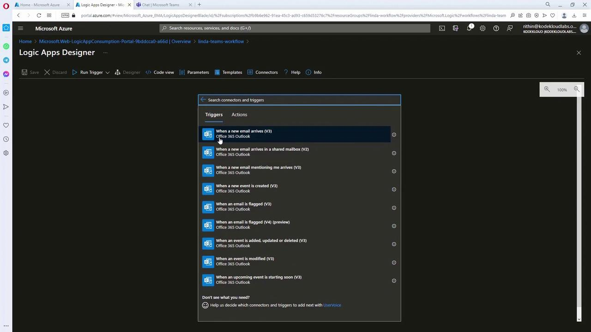
</div>

<div align="left">
  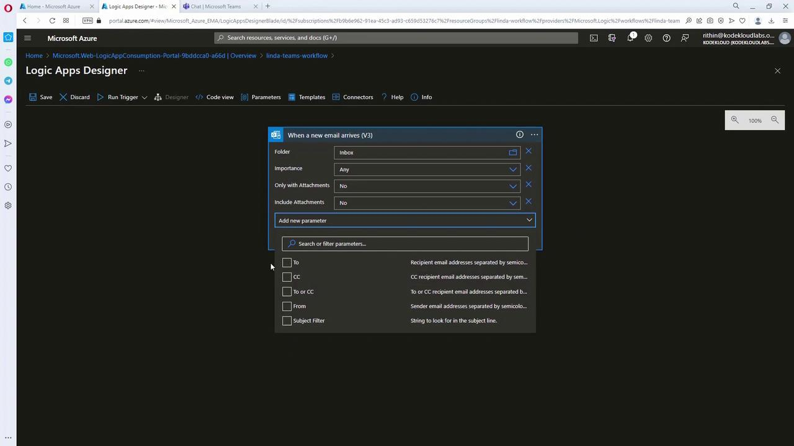
</div>

---

> ✅ **Best practice**: Always filter early at the trigger level to reduce unnecessary executions (saves cost + improves performance).

---

## 💬 Step 3. Add Microsoft Teams Action

Next, we notify Linda in **Teams**.

1. Add an **Action** → Microsoft Teams connector.
2. Authenticate with Linda’s account.
3. Use “Post a message” (or “Post adaptive card and wait for a response” for richer UI).
4. Insert **dynamic content** (e.g., invoice number from the email subject).

<div align="left">
  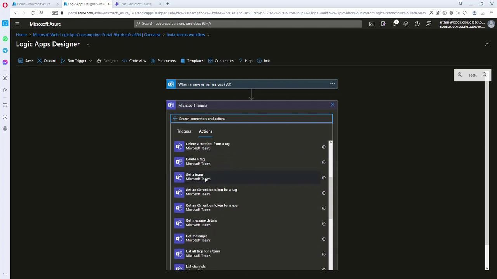
</div>

---

> 💡 **Tip**: Dynamic content ensures the Teams message always carries invoice details **from the original email trigger**.

---

## 🔀 Step 4. Add Conditional Logic (User Response)

We want to branch workflow based on Linda’s response.

1. Insert **Condition Control**.
2. Evaluate `Selected Option` from Teams.

   - ✅ If `"completed"` → Send confirmation email.
   - ❌ If `"pending"` → End workflow with log.

---

### ✅ Case: Completed

- Action: Outlook 365 → “Send an email”.
- Recipients: Rithin (with Linda cc’d).
- Body: Include **confirmation number** from Teams response.

<div align="left">
  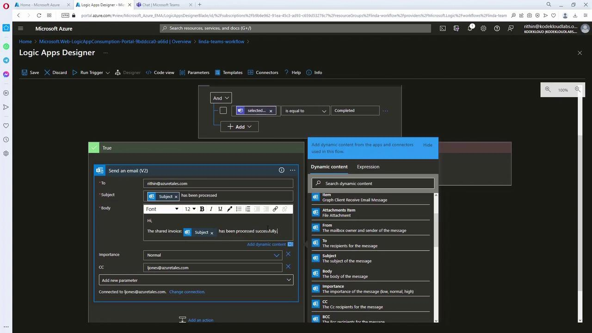
</div>

---

### ❌ Case: Pending

- Action: Terminate workflow.
- Optionally log → “Invoice not completed” with status code **500**.

<div align="left">
  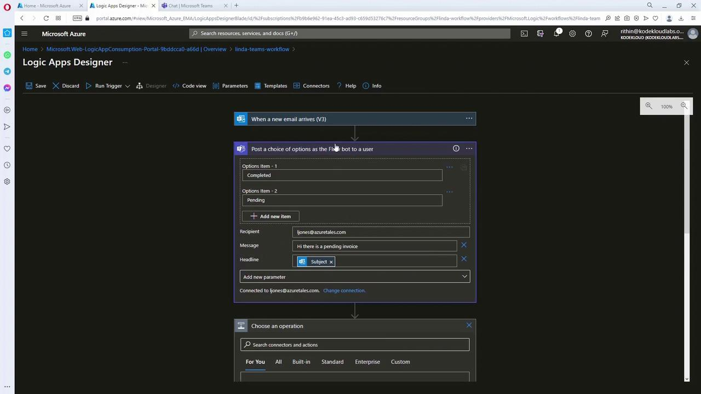
</div>

---

## 🧪 Step 5. Test the Logic App

1. Send an email → subject contains `"INV12345"`.
2. Logic App triggers → Teams message appears with invoice details.
3. Linda replies `"completed: 7890"`.
4. Logic App → sends confirmation email with **invoice + confirmation number**.

### Sample JSON (trigger output)

```json
{
  "subscribe": {
    "method": "post",
    "queries": {
      "fetchOnlyWithAttachment": "False",
      "folderPath": "Inbox",
      "importance": "Any"
    }
  }
}
```

### Sample Payload (email trigger)

```json
{
  "BodyPreview": "please process.",
  "importance": "normal",
  "conversationId": "AAQAGQZzJk4OTQkLWFmZDQ2NGIyNC04NTRlTM2Yjk4",
  "isRead": false,
  "isHtml": true,
  "from": "rithin@azuretales.com",
  "toRecipients": ["jiones@azuretales.com"]
}
```

---

## 📸 User Experience Flow

- Linda’s Teams message:

<div align="left">
  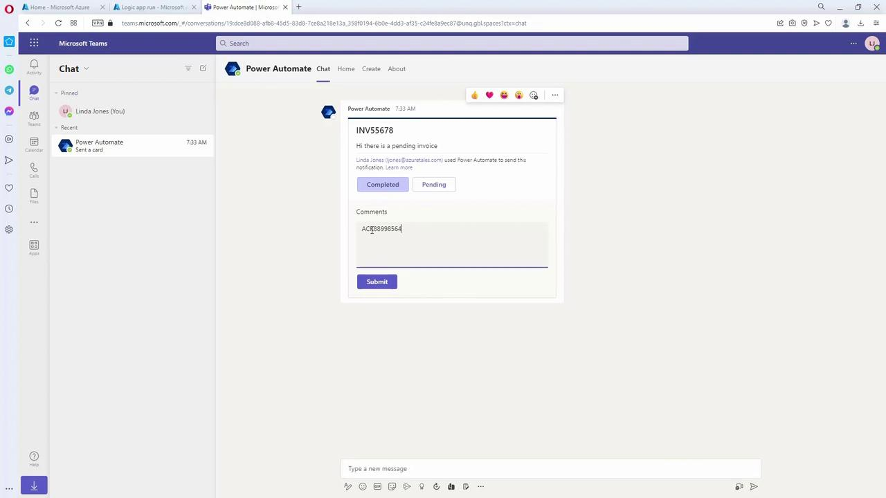
</div>

- Confirmation email to Rithin:

<div align="left">
  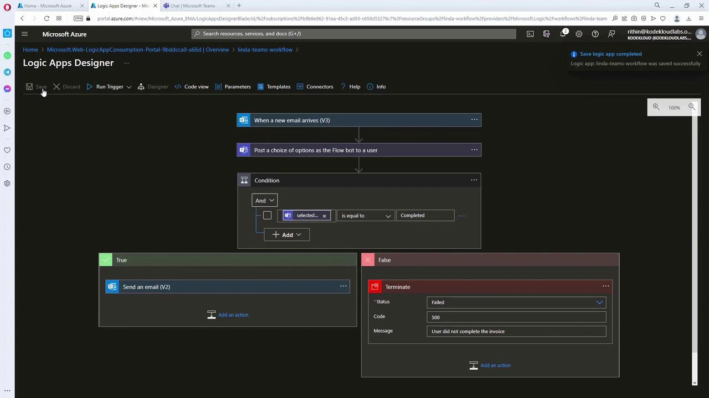
</div>

- Logic App run status (portal monitoring):

<div align="left">
  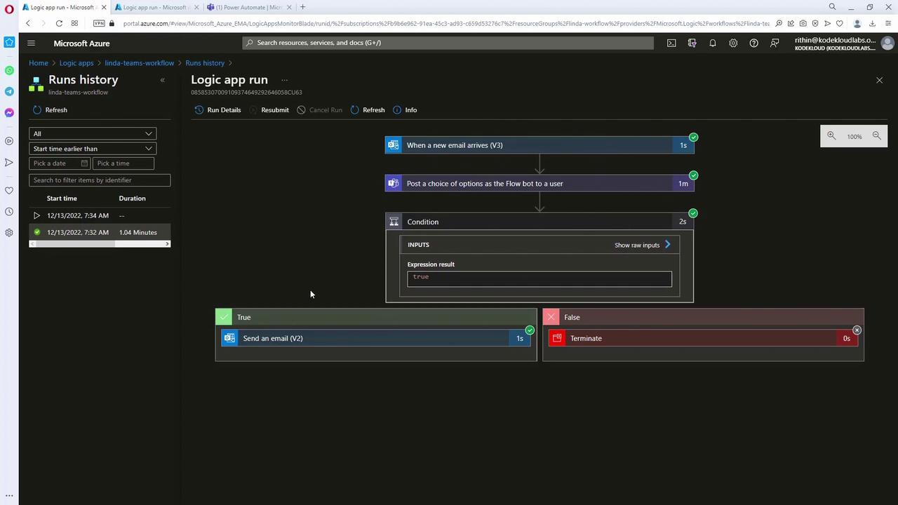
</div>

---

## 🎯 Key Takeaways

- **Triggers**: Define when a workflow starts (email in this case).
- **Actions**: Steps (Teams message, email).
- **Control logic**: Conditions make workflows smart.
- **Dynamic content**: Glue between steps.
- **Monitoring**: Every run shows inputs/outputs → easy troubleshooting.

---

## 🧠 Exam/Interview Tip

- If asked to compare:

  - **Logic Apps** → enterprise workflows with connectors, B2B integration, designer-first.
  - **Power Automate** → end-user workflows (citizen dev).
  - **Azure Functions** → code-first automation.

---

## 🏁 Summary WorkFlow

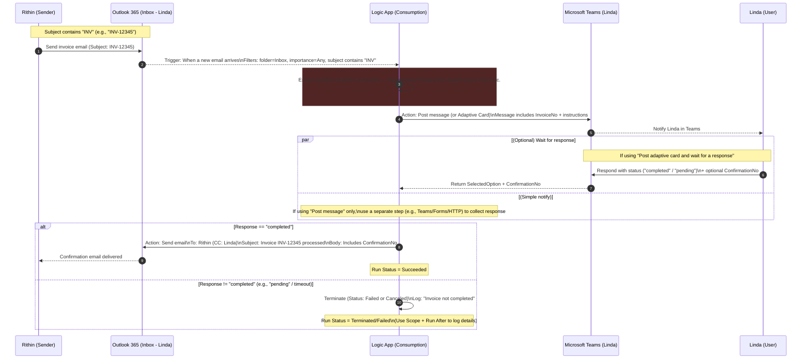

- **Trigger**: Outlook 365 → _When a new email arrives_

  - Filters: `Inbox`, `Importance = Any`, `Subject contains "INV"`.

- **Teams step**: prefer **“Post adaptive card and wait for a response”** (richer UX + built-in wait).

  - Captures: `SelectedOption`, `ConfirmationNo` (from a text input).

- **Condition**: `@equals(body('Teams_Step')?['SelectedOption'], 'completed')`
- **Email (then branch)**: use dynamic content from trigger and Teams step:

  - Subject: `Invoice @{triggerBody()?['Subject']} processed`
  - Body: `Confirmation #: @{body('Teams_Step')?['ConfirmationNo']}`

- **Terminate (else branch)**: set `Status = Failed` (or `Canceled`) and log a friendly message.

  - Wrap main steps in a **Scope** and add a **Run After** path for error logging → better observability.

## 📚 References

- <https://notes.kodekloud.com/docs/AZ-305-Microsoft-Azure-Solutions-Architect-Expert/Design-a-compute-solution/Design-for-Azure-Logic-Apps>
