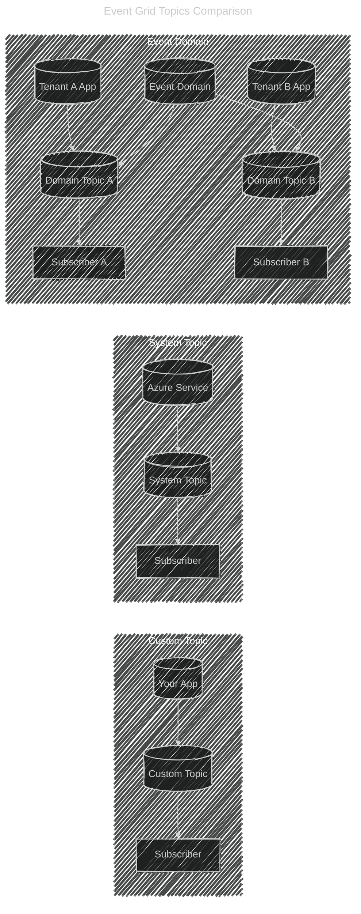
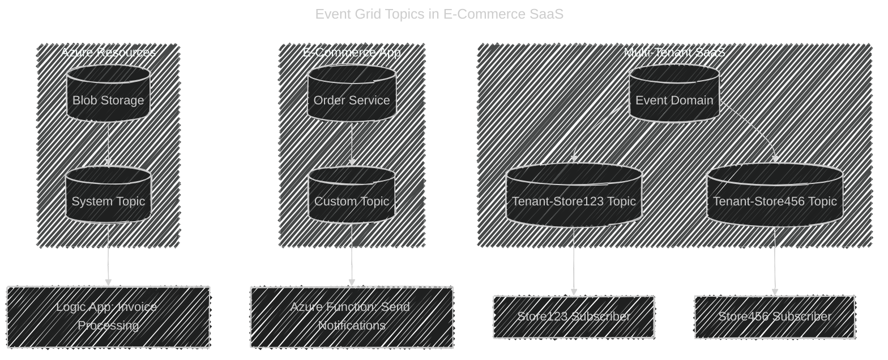

# 🌐 Event Grid Topics — Three Types

Event Grid is all about **topics**, but not all topics are the same.
Here’s the difference:

---

## 1️⃣ **Custom Topic**

- **You create it** yourself.
- It’s used when **your app or service is the event publisher**.
- Example:

  - You build an **Order Service**.
  - You create a **custom topic** called `order-events`.
  - Your app publishes events (like _OrderCreated_, _OrderShipped_).
  - Subscribers (Functions, Logic Apps, Event Hubs) listen to them.

👉 Think of it as:
**“My app, my events, my topic.”**

---

## 2️⃣ **System Topic**

- **Created automatically by Azure services** (you don’t need to create it).
- Used when an **Azure service is the publisher**.
- Example:

  - A **Storage Account** generates blob events.
  - A **System Topic** called `blobservices/default` is auto-created.
  - You just subscribe to it.

👉 Think of it as:
**“Azure resource events, managed for me.”**

---

## 3️⃣ **Event Domain**

- **Advanced version of custom topics**, designed for **multi-tenant SaaS scenarios**.
- Instead of creating 1000 separate custom topics, you create **one domain** and then create **domain topics inside it**.
- Each tenant/app/customer can publish and subscribe to their **own domain topic** securely.
- Example:

  - A SaaS provider has 5000 customers.
  - Each customer gets a **domain topic** like `customer-123-events`.
  - The provider manages just **1 event domain**, not 5000 separate topics.

👉 Think of it as:
**“Many custom topics under one roof.”**

---

## 🖼️ Visual Comparison

<div align="center" style="background: #343739ff; border-radius: 20px">



</div>

---

## ✅ Quick Cheat Sheet

| Feature               | **Custom Topic** | **System Topic**       | **Event Domain**                  |
| --------------------- | ---------------- | ---------------------- | --------------------------------- |
| Who creates it?       | You              | Azure (auto)           | You (domain), then sub-topics     |
| Who publishes events? | Your app/service | Azure resource         | Many apps/tenants                 |
| Scope                 | One app/service  | One Azure resource     | Multi-tenant SaaS / many topics   |
| Example               | `order-events`   | `blobservices/default` | `my-saas-events` with 5000 topics |

---

✨ In short:

- Use **Custom Topics** when **your app** is the publisher.
- Use **System Topics** when **Azure service** is the publisher.
- Use **Event Domains** when you need **multi-tenant event isolation and scale**.

---

## 🛒 Real-World Scenario: E-Commerce SaaS

Imagine you are running a big SaaS **E-commerce platform** that serves thousands of online stores (tenants).
You want to track:

1. **Azure resource events** (like blobs for receipts/invoices).
2. **Application events** (like order creation).
3. **Multi-tenant isolation** (each store only sees its own events).

Here’s how all three fit in:

---

### 1️⃣ **System Topic — Azure Storage**

- Each online store uploads **invoice PDFs** into a Blob Storage container.
- Every upload triggers a **BlobCreated event**.
- Azure automatically creates a **System Topic** for the Storage Account.
- You subscribe a **Logic App** to automatically extract invoice data.

👉 Example Event:

```json
{
  "eventType": "Microsoft.Storage.BlobCreated",
  "subject": "/blobServices/default/containers/invoices/blobs/inv123.pdf",
  "data": { "url": "https://storex.blob.core.windows.net/invoices/inv123.pdf" }
}
```

---

### 2️⃣ **Custom Topic — Order Events**

- Your **Order Service** (built in .NET or Java) publishes events like:

  - `OrderCreated`
  - `OrderShipped`
  - `OrderReturned`

- You create a **Custom Topic** named `order-events`.
- Azure Functions subscribe to this topic to send emails or push notifications.

👉 Example Event:

```json
{
  "eventType": "OrderCreated",
  "subject": "orders/store123/order789",
  "data": { "orderId": "order789", "customer": "Linda" }
}
```

---

### 3️⃣ **Event Domain — Multi-Tenant Events**

- Since you have **5,000+ online stores (tenants)**, you don’t want 5,000 custom topics.
- You create **one Event Domain**: `ecommerce-domain`.
- Inside it, you create **Domain Topics**:

  - `tenant-store123`
  - `tenant-store456`
  - `tenant-store789` … and so on.

- Each store publishes and subscribes only to **its own topic**.
- You enforce **RBAC policies** so Store 123 cannot read Store 456’s events.

👉 Example Event (Store 123 domain topic):

```json
{
  "eventType": "OrderShipped",
  "subject": "orders/order999",
  "data": { "trackingId": "DHL12345", "customer": "Sam" }
}
```

---

## 🖼️ Visual Architecture

<div align="center" style="background: #343739ff; border-radius: 20px">



</div>

---

## ✅ Which One to Use When?

| Use Case                                                                       | Best Choice      |
| ------------------------------------------------------------------------------ | ---------------- |
| You want events from an **Azure service** (like Storage, Event Hubs, IoT Hub). | **System Topic** |
| You want to publish **your own app’s events**.                                 | **Custom Topic** |
| You want **multi-tenant scale** (thousands of isolated event streams).         | **Event Domain** |

---

✨ Final takeaway:

- **System Topics** → "Azure services as publishers"
- **Custom Topics** → "Your app as publisher"
- **Event Domains** → "Thousands of apps/customers under one umbrella"
