# 🏷️ **Event Grid Domain Topics — Problem to Solution**

## ❌ The Problem

Imagine you’re running a **SaaS platform** with **thousands of tenants (customers)**.
Each tenant (like Store123, Store456, etc.) needs to **publish and consume events** securely.

If you used **Custom Topics**:

- You’d need to **create 5,000 topics** (one per tenant).
- Managing **access policies, keys, subscriptions, and scaling** for each is a nightmare.
- Cost and complexity would skyrocket.

👉 Clearly, custom topics **don’t scale well** for multi-tenant systems.

---

## ✅ The Solution: Event Domains + Domain Topics

- You create **one Event Domain**.
- Inside it, you create **Domain Topics** for each tenant.
- Each tenant publishes and consumes **only their events** via their own domain topic.
- Azure handles:

  - **Routing** (per tenant/topic).
  - **Isolation** (RBAC & SAS tokens).
  - **Scalability** (millions of events/sec).

> 💡 A Domain Topic in an Event Domain is like a “virtual topic” , Think of it like an **event super-highway**, where each tenant has their **own lane** instead of building separate highways.

---

## 🏷️ Why Domain Topics ≠ 5,000 Custom Topics

At first glance, **Event Domains with Domain Topics** still look like _“we’re creating 5,000 topics anyway”_. But here’s the **real difference** 👇

### ❌ With Custom Topics

- Each tenant requires a **full Azure Event Grid Topic resource**.
- That means:

  - Its own **endpoint**
  - Its own **policies & keys**
  - Its own **resource management**
  - You pay for **5,000 individual resources** in Azure.

👉 Admin nightmare. Scaling, securing, monitoring = 🔥🔥🔥

---

### ✅ With Event Domains

- You create **ONE domain resource** (`ecommerce-domain`).
- Inside it, you define **lightweight Domain Topics** (like `store123-events`, `store456-events`).
- All topics **share the same parent resource**:

  - One billing unit (per domain, not per topic).
  - One set of **global access & RBAC policies**, inherited down.
  - Centralized monitoring, metrics, and throttling.
  - Scales to **100,000+ topics** under a single domain.

> 💡 A Domain Topic in an Event Domain is like a “virtual topic” , Think of it like an **event super-highway**, where each tenant has their **own lane** instead of building separate highways.

---

## 🔄 Visual Difference

```mermaid
---
config:
  look: handDrawn
  theme: dark
title: "Custom Topics vs Event Domains"
---
flowchart LR
    subgraph CustomTopics["❌ Custom Topics"]
      T1[(Custom Topic 1)]
      T2[(Custom Topic 2)]
      T3[(Custom Topic 5000)]
    end

    subgraph EventDomain["✅ Event Domain"]
      ED[(Event Domain Resource)]
      D1[(Domain Topic 1)]
      D2[(Domain Topic 2)]
      D3[(Domain Topic 5000)]
      ED --> D1
      ED --> D2
      ED --> D3
    end
```

<div align="center" style="background: #343739ff; border-radius: 20px">



</div>

---

## 🔄 Workflow of Event Domain Topics

<div align="center">
  
</div>

---

## 💡 Use Cases

### 1. **SaaS Platforms**

- Multi-tenant e-commerce, healthcare, or finance platforms.
- Each tenant gets isolated event streams.

### 2. **Large Enterprises**

- Internal departments need **separate event pipelines** (HR, Finance, Sales).
- One domain, multiple department-specific topics.

### 3. **Regulated Industries**

- Banking or healthcare, where **data isolation** between tenants/customers is mandatory.

### 4. **Multi-Region Event Routing**

- Use domain topics to **separate regional event flows** under one umbrella.

---

## ⚙️ Implementation (Step by Step)

### Step 1: Create an Event Domain

```bash
az eventgrid domain create \
  --name ecommerce-domain \
  --resource-group my-rg \
  --location eastus
```

### Step 2: Create Domain Topics (per tenant)

```bash
az eventgrid domain topic create \
  --domain-name ecommerce-domain \
  --name store123-events \
  --resource-group my-rg
```

### Step 3: Publish Events

Tenant’s app posts an event:

```bash
curl -X POST \
  -H "aeg-sas-key: <key>" \
  -d '[{
    "id": "1",
    "eventType": "OrderCreated",
    "subject": "orders/order789",
    "data": { "orderId": "order789", "customer": "Linda" },
    "eventTime": "2025-10-03T15:00:00Z",
    "dataVersion": "1.0"
  }]' \
  https://ecommerce-domain.eastus-1.eventgrid.azure.net/api/events/store123-events
```

### Step 4: Create Subscriptions (per tenant)

```bash
az eventgrid domain topic event-subscription create \
  --domain-name ecommerce-domain \
  --domain-topic-name store123-events \
  --name store123-sub \
  --endpoint https://store123-function.azurewebsites.net/runtime/webhooks/EventGrid?functionName=ProcessOrder
```

---

## 🏁 Key Benefits

- **Scalability** → Millions of events/sec, no need for 1,000s of custom topics.
- **Security** → RBAC or SAS ensures tenants only access their domain topic.
- **Simplicity** → One Event Domain to manage, not thousands.
- **Flexibility** → Different tenants can have their own subscribers, filters, workflows.

---

✨ In summary:

- **Custom Topic** = single app or service.
- **Event Domain + Domain Topics** = many apps/tenants/customers.
- It turns **complex SaaS eventing problems** into a **clean, scalable solution**.

## 📚 References

- <https://learn.microsoft.com/en-us/azure/event-grid/event-domains?tabs=cloud-event-schema>
