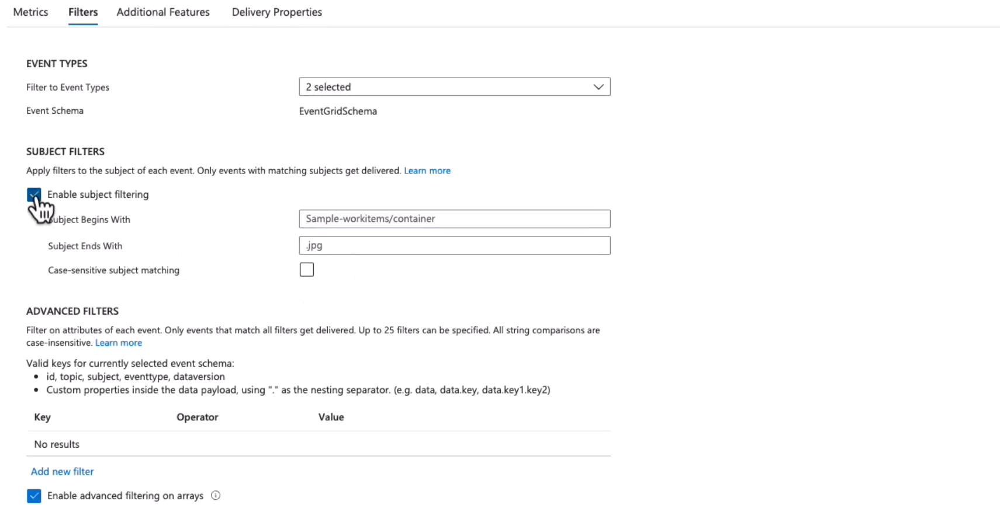
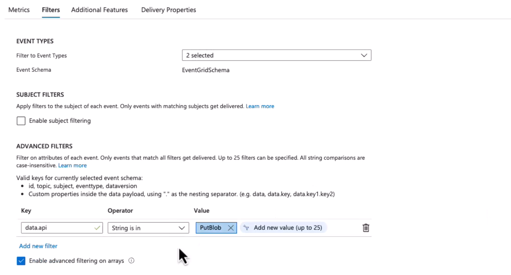

# 🚿 **Azure Event Grid Filters**

Event Grid lets you **select only the events you want** at subscription time. You do this with three filter families:

- **Event Type filter** — choose which event kinds to receive
- **Subject filter** — match on the event’s `subject` (prefix/suffix, optional case sensitivity)
- **Advanced filters** — match on specific fields in the event (e.g., `data.api`, `data.contentLength`)

Below you’ll find what each does, **how to configure it in the Portal**, and **JSON you can use in ARM/Bicep/REST**. I also note how filters combine (AND/OR).

---

## 1. 🏷️ **Event Type Filtering**

**What it does**  
Receive only specific event kinds produced by the publisher (e.g., Storage → `Microsoft.Storage.BlobCreated`, `Microsoft.Storage.BlobDeleted`, …).

**When to use**  
You only care about certain operations (e.g., new uploads) and want to drop the rest at the source.

**Portal — Step by step:**

1. Open your **Event Grid Topic/System Topic** → **+ Event Subscription**.
2. **Destination**: pick your endpoint (Function, Webhook, Logic App, Queue…).
3. Go to **Filters**.
4. Under **Event Types**, select only the types you want (e.g., `Microsoft.Storage.BlobCreated`).
5. Review & **Create**.

**JSON example (Event types only):**

```json
{
  "type": "Microsoft.EventGrid/eventSubscriptions",
  "name": "only-blob-created",
  "properties": {
    "destination": {
      "endpointType": "WebHook",
      "properties": { "endpointUrl": "https://example.com/webhook" }
    },
    "filter": {
      "includedEventTypes": ["Microsoft.Storage.BlobCreated"],
      "isSubjectCaseSensitive": false
    },
    "eventDeliverySchema": "EventGridSchema"
  }
}
```

**Combination logic:**

- Multiple items in `includedEventTypes` behave like **OR** (receive any listed type).

---

## 2. 📂 **Subject Filtering** (Prefix/Suffix)

**What it does**  
Matches the string in the event’s **`subject`**. For Storage events it looks like:
`/blobServices/default/containers/<container>/blobs/<path/filename.ext>`

- `subjectBeginsWith` → prefix match
- `subjectEndsWith` → suffix match
- `isSubjectCaseSensitive` → default `false`

**When to use:**  
You only want events from a folder/container or of a specific file extension.

**Portal — Step by step:**

1. **+ Event Subscription** → **Filters** tab.
2. Set **Subject Begins With** (e.g., `/blobServices/default/containers/photos/`).
3. Set **Subject Ends With** (e.g., `.png`).
4. Leave **Case sensitive** off unless you truly need it.
5. **Create**.

**JSON example (Prefix + Suffix):**

```json
{
  "type": "Microsoft.EventGrid/eventSubscriptions",
  "name": "photos-png-only",
  "properties": {
    "destination": {
      "endpointType": "WebHook",
      "properties": { "endpointUrl": "https://example.com/webhook" }
    },
    "filter": {
      "subjectBeginsWith": "/blobServices/default/containers/photos/",
      "subjectEndsWith": ".png",
      "isSubjectCaseSensitive": false
    },
    "eventDeliverySchema": "EventGridSchema"
  }
}
```

**Combination logic:**

- `subjectBeginsWith` **AND** `subjectEndsWith` must both match (AND).

---

## 3. 🧠 **Advanced Filters** (Field-Level)

**What it does:**
Filters on specific fields inside the event (top-level or under `data.*`). Supports string, number, bool comparisons.

**Common operators:**

- Strings: `StringEquals`, `StringIn`, `StringBeginsWith`, `StringEndsWith`, `StringContains`
- Numbers: `NumberGreaterThan`, `NumberLessThan`, `NumberIn`, `NumberNotIn`
- Boolean: `BoolEquals`

**When to use:**
You need precise control: only uploads (`data.api = PutBlob`), only large files (`data.contentLength > 1MB`), only certain clients (`data.clientRequestId startsWith "MobileApp"`), etc.

**Portal — Step by step:**

1. **+ Event Subscription** → **Filters** tab.
2. In **Advanced filters**, click **Add**.
3. Choose **Field** (e.g., `data.api`).
4. Pick **Operator** (e.g., `StringEquals`).
5. Provide **Value(s)** (e.g., `PutBlob`).
6. Add more advanced filters as needed.
7. **Create**.

**JSON example (3 advanced rules):**

```json
{
  "type": "Microsoft.EventGrid/eventSubscriptions",
  "name": "uploads-bigger-than-1mb-mobileapp",
  "properties": {
    "destination": {
      "endpointType": "WebHook",
      "properties": { "endpointUrl": "https://example.com/webhook" }
    },
    "filter": {
      "isSubjectCaseSensitive": false,
      "advancedFilters": [
        { "key": "data.api", "operatorType": "StringEquals", "values": ["PutBlob"] },
        { "key": "data.contentLength", "operatorType": "NumberGreaterThan", "values": [1048576] },
        { "key": "data.clientRequestId", "operatorType": "StringBeginsWith", "values": ["MobileApp"] }
      ]
    },
    "eventDeliverySchema": "EventGridSchema"
  }
}
```

**Combination logic:**

- **Across advancedFilters**: **AND** (every entry must pass).
- **Within one advanced filter’s `values`**: typically **OR** (e.g., `StringIn` values list).

---

## 🔗 **Combining All Filters Together**

You can mix all three to precisely target events. The overall logic is:

- `(Event Type is in includedEventTypes)` **AND**
- `(subjectBeginsWith matches if set)` **AND** `(subjectEndsWith matches if set)` **AND**
- `(every advancedFilters entry matches)`

**JSON example (Event Type + Subject + Advanced):**

```json
{
  "type": "Microsoft.EventGrid/eventSubscriptions",
  "name": "photos-jpg-uploads-only",
  "properties": {
    "destination": {
      "endpointType": "WebHook",
      "properties": { "endpointUrl": "https://example.com/webhook" }
    },
    "filter": {
      "includedEventTypes": ["Microsoft.Storage.BlobCreated"],
      "subjectBeginsWith": "/blobServices/default/containers/photos/",
      "subjectEndsWith": ".jpg",
      "isSubjectCaseSensitive": false,
      "advancedFilters": [{ "key": "data.api", "operatorType": "StringEquals", "values": ["PutBlob"] }]
    },
    "eventDeliverySchema": "EventGridSchema"
  }
}
```

---

## 📊 **Hands-On Example (Portal Setup)**

1. Go to your **Event Subscription** in Azure Portal.
2. Under **Filters**, configure:

   - **Event Types** → select only `BlobCreated`.
   - **Subject Filters** → Prefix `/containers/photos/`, Suffix `.jpg`.
   - **Advanced Filters** → `data.api = PutBlob`.

3. Save subscription → Now your webhook/Function/Queue only gets the events you actually want.

<div align="left">
  
</div>

---

<div align="left">
  
</div>

---

## ✅ **Test & Operate**

1. **Trigger** events that should pass and some that should be filtered.
2. Check your destination (Function logs, webhook receiver, Logic App runs).
3. In Event Grid resource, review **Metrics** and **Delivery attempts**.
4. For production, configure **dead-letter** and **retryPolicy** as needed.

---

## 🏁 **Quick Cheat Sheet**

- Use **Event Types** to drop whole categories you don’t care about.
- Use **Subject** to scope by container/folder/extension.
- Use **Advanced** to target payload details (API, size, IDs).
- Logic: EventTypes (OR within list) + Subject (AND between prefix/suffix) + Advanced (AND across entries).
