# 📢 Azure Event Grid

> **📖 Official definition**:
> Event Grid is a **fully managed event routing service** in Azure that enables you to build **event-driven applications** by **connecting event sources with event handlers**.
>
> **💭 Think of it like this**:
>
> - Event postman who delivers events from **publishers (sources)** to **subscribers (handlers)** in **real-time**.
> - It’s **pub/sub at cloud scale** – no polling, no constant checking.
> - It Works like **SNS Topic** in AWS.

---

<div align="center" style="background-color: #ffffffff ;border-radius: 10px;border: 2px solid white">
  
</div>

> 💡 Azure Event Grid leverages the Cloud Native Foundation's Cloud Events 1.0 specification to standardize event formats, ensuring consistency across different systems.

---

## ⚙️ **How Event Grid Works**

Event Grid uses a **publisher–event–subscriber** model.

1. **Event Sources (Publishers)**

   - These are services that emit events.
   - Example: Blob Storage (file created), Event Hubs, IoT Hub, Azure Subscriptions (resource changes).

2. **Event Types**

   - Each publisher has specific event types.
   - Example: Blob Storage → `BlobCreated`, `BlobDeleted`.

3. **Event Topics**

   - A **topic** is where events are sent.
   - You can use **system topics** (built-in for Azure services) or **custom topics** (for your own apps).

4. **Event Subscriptions**

   - Subscribers (like Functions, Logic Apps, Webhooks) **subscribe** to events from a topic.
   - Filtering can be applied (e.g., only listen to `.jpg` files).

5. **Event Handlers (Subscribers)**

   - Services that process the event.
   - Example: Azure Function runs, Logic App workflow starts, or your custom app endpoint is triggered.

---

## 💭 **Real-World Example: Auto-Processing Images**

Consider a scenario that involves the automatic processing of images uploaded to Azure Blob Storage:

1. **Event Generation**:  
   Azure Blob Storage acts both as the publisher and event source. When a new image is uploaded, an event is published containing detailed information such as the file name, file size, upload time, and file extension.

2. **Event Routing**:  
   The published event is sent to a custom Event Grid topic, for instance, "image processing events."

3. **Event Filtering**:  
   An event subscription on this topic applies filters to capture only specific image types (e.g., JPEG and PNG), excluding others like BMP or GIF for targeted processing.

4. **Event Handling**:  
   An Azure Function, serving as the event handler, is triggered by the subscription. This Function processes the uploaded image according to the defined logic.

This real-world workflow clearly demonstrates how the core concepts of Azure Event Grid work together to form a robust, event-driven system.

## 📊 **Diagram (Event Grid Flow)**

```mermaid
flowchart LR
    A[Event Source 📦] -->|Blob Created| B[(Event Grid Topic)]
    B --> C{Event Subscription 🎯}
    C -->|Filter: .jpg| D[Azure Function ⚡]
    C -->|All Events| E[Logic App 🛠️]
    C -->|Filtered| F[Custom Webhook 🌐]
```

<div align="center" style="background-color: #1c2529ff ;border-radius: 10px;border: 2px solid white">



</div>

> 👉 Example: A new `.jpg` uploaded to Blob Storage triggers Event Grid → Event Grid filters `.jpg` → Calls Azure Function → Function resizes image.

---

## 🛠️ Hands-on Example: Event Grid with Blob Storage + Azure Function

### 1. Create Event Subscription

```bash
az eventgrid event-subscription create \
  --name ImageUploadSub \
  --source-resource-id /subscriptions/<sub-id>/resourceGroups/myRG/providers/Microsoft.Storage/storageAccounts/myStorage \
  --endpoint https://myfunction.azurewebsites.net/runtime/webhooks/eventgrid?code=<function-key>
```

### 2. Azure Function (Python Example)

```python
import logging
import azure.functions as func

def main(event: func.EventGridEvent):
    result = f"File event: {event.subject}, Type: {event.event_type}"
    logging.info(result)
```

📌 This function logs every file event from Blob Storage.

---

## ⚙️ Key Features

- **Massive Scale**: Millions of events per second.
- **Low Latency**: Sub-second delivery.
- **Reliable Delivery**: At-least-once delivery, retries with exponential backoff.
- **Filters**: Event subscriptions can filter by subject or event type.
- **Fan-out**: One event can trigger multiple subscribers.
- **Integration**: Works seamlessly with Azure Functions, Logic Apps, Service Bus, Event Hubs, Webhooks.

---

## ✅ Real-world Use Cases

- **Serverless automation**:
  Blob uploaded → Trigger image resize function.
- **Security & governance**:
  Subscription updated → Notify admins via Teams.
- **IoT event routing**:
  IoT telemetry → Forward to Event Hubs + Functions.
- **Multi-service workflows**:
  Logic Apps → Kick off approvals when new events arrive.
- **Custom apps**:
  Your app publishes custom events (e.g., order placed) → Event Grid → downstream services notified.

---

## 🔒 Security

- Supports **Azure RBAC**, **Managed Identity**, and **Key authentication**.
- Events sent over HTTPS.
- Dead-letter destination (Blob Storage or Storage Queue) for failed deliveries.

---

## 🆚 Event Grid vs. Event Hubs vs. Service Bus

| Feature      | Event Grid ⚡                   | Service Bus 📬                             | Event Hubs 📡             |
| ------------ | ------------------------------- | ------------------------------------------ | ------------------------- |
| **Use case** | Reactive, event-driven          | Enterprise messaging (commands, workflows) | High-throughput streaming |
| **Delivery** | Push                            | Push/pull                                  | Stream (pull)             |
| **Scale**    | Millions/sec                    | Lower                                      | Millions/sec              |
| **Ordering** | Not guaranteed                  | FIFO (with sessions)                       | Partitioned               |
| **Example**  | Blob created → trigger Function | Order processing, transactions             | IoT telemetry, logs       |

> 👉 **Event Grid = lightweight notifications**,
> while Event Hubs & Service Bus = **heavy data streaming & messaging**.

---

## 🎯 Summary

- **Azure Event Grid = Azure’s event postman** 📬
- It **connects event sources** (like Blob Storage, IoT Hub, custom apps) to **event handlers** (like Functions, Logic Apps, Webhooks).
- It’s **lightweight, scalable, and real-time**, great for **event-driven serverless apps**.
- Not for big data streams (use Event Hubs) or workflow messaging (use Service Bus).
