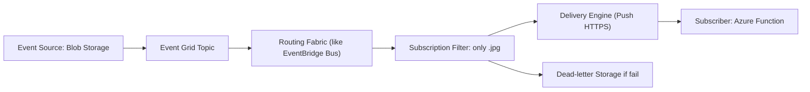

# ⚡ **Azure Event Grid Internals**

## 📖 **What is Event Grid**

- Event Grid is **Azure’s SNS (Simple Notification Service)**.
- It delivers **lightweight events** from sources (Blob Storage, IoT Hub, etc.) to subscribers (Functions, Logic Apps, Webhooks).
- **Key point**: It’s **not a queue** (like SQS) and not a stream (like Kinesis). It’s just **real-time event routing**.

---

## 🏗️ **Internal Building Blocks**

### 1. **📌 Ingress Layer (Publishers → Topics)**

- Works like **SNS Topic** in AWS.
- Azure services (e.g., Blob Storage) or custom apps **publish events** to a **Topic**.
- Event Grid normalizes the message into a standard **CloudEvents schema** (think of it like AWS EventBridge JSON format).

---

### 2. **📌 Routing Fabric (The Brain 🧠)**

- This is Event Grid’s internal router.
- Job: Match incoming events with subscriptions.
- Works like **AWS EventBridge event bus** – filters events and figures out which subscribers need them.
- Internally, this routing runs on **Azure-managed microservices** (originally Service Fabric, now often Linux containers in AKS).

  - Don’t worry about Service Fabric → just think of it as **Azure’s cluster manager**, like Kubernetes.

---

### 3. **📌 Subscription Processor (Filters)**

- Every subscription can apply rules:

  - By **event type** → e.g., only “BlobCreated”.
  - By **subject** → e.g., only \*.jpg files.
  - By **advanced filters** → e.g., “size > 1MB”.

- Same idea as **EventBridge Rules** in AWS.
- Internally, filters are stored in a metadata system and applied in-memory for fast matching.

---

### 4. **📌 Delivery Engine (Push Model)**

- Event Grid **pushes** events out (doesn’t wait for consumers to pull).
- Protocol: **HTTPS POST** (like EventBridge sending to Lambda, or webhook).
- Reliability:

  - **At-least-once delivery** → retries until ack.
  - **Exponential backoff** retries.
  - If all retries fail → event goes to a **dead-letter destination** (Blob Storage or Queue).

👉 In AWS terms: Dead-letter = **SNS DLQ (SQS or Lambda destination)**.

---

### 5. **📌 Persistence & Resiliency**

- Event Grid doesn’t store streams (unlike Kinesis or Kafka).
- Events are temporarily buffered in **internal queues** just to ensure reliable push.
- Metadata (subscriptions, filters, delivery state) is stored in **replicated storage** (similar to DynamoDB/Cosmos DB).
- Events are replicated across regions for **geo-resilience**.

---

## 🔒 **Security**

- Authentication via **Azure Active Directory (like AWS IAM)**.
- Role-based access (RBAC) defines who can publish/subscribe.
- Events always sent over **HTTPS/TLS**.
- Subscribers can be secured with **Managed Identity** (like AWS IAM Role with trust policy).

---

## 📊 **How It Compares (AWS vs Azure)**

| Concept               | Azure Event Grid ⚡          | AWS Equivalent           |
| --------------------- | ---------------------------- | ------------------------ |
| Event Source          | Blob, IoT Hub, etc.          | S3, DynamoDB, etc.       |
| Topic                 | Event Grid Topic             | SNS Topic                |
| Subscription (Filter) | Event Grid Sub               | EventBridge Rule         |
| Event Bus (Router)    | Event Grid Fabric            | EventBridge Bus          |
| Delivery Target       | Function, Logic App, Webhook | Lambda, SQS, HTTP target |
| Dead Letter           | Blob / Queue                 | SQS DLQ                  |

---

## 🖼️ **Internal Flow Diagram** (Simplified)

---

## 🧠 **Key Takeaways**

- Event Grid = **Azure’s SNS/EventBridge hybrid** → **notification router**, not a message broker.
- **Not Kafka, not RabbitMQ** → It’s proprietary, cloud-native, lightweight.
- Internals use:

  - **Ingress Gateways** (like API endpoints).
  - **Routing Fabric** (event bus like EventBridge).
  - **Filters & Subscriptions** (like rules).
  - **Delivery Engine** (push events reliably).

- Focus = **fan-out, filtering, fast notifications**.

---

## ✅ In short:

Event Grid is **Azure’s distributed event router** → built for **millions of lightweight push events per second**, with **filters + fan-out + DLQ**, similar in spirit to **AWS EventBridge/SNS**, but **not streaming (Kafka)** and **not queueing (RabbitMQ/SQS)**.
