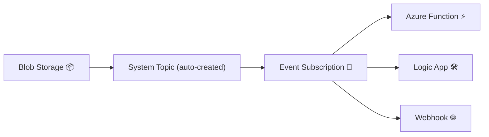

# ⚡ Event Grid – System Topics

## 🏷️ What Are Topics in Event Grid?

- In Event Grid, a **Topic** is where events are sent.
- **Two types of topics**:

  1. **System Topics** → Automatically created for Azure services (no manual setup needed).
  2. **Custom Topics** → You create them for your own apps or external systems.

👉 Think of a **Topic as a “channel”** where events flow before going to subscribers.

---

## 1️⃣ **System Topics**

- **Built-in integration** with Azure services.
- When an Azure service (e.g., Storage, Key Vault, Event Hubs, IoT Hub) emits events, Event Grid can **automatically generate a system topic** for it.
- You don’t publish anything manually — Azure does it for you.
- Example:

  - Blob uploaded to **Azure Blob Storage**.
  - Event Grid auto-creates a **System Topic** for that storage account.
  - You just subscribe to it (e.g., send to Azure Function).

👉 AWS analogy: This is like **EventBridge automatically wiring S3 events to the bus**.

---

## 2️⃣ **Custom Topics**

- Used when you want your **own app** to publish events.
- You create a **Custom Topic** resource, then your app sends events via REST/SDK.
- Example:

  - An **e-commerce app** creates a custom topic.
  - It publishes events like `OrderCreated`, `OrderShipped`.
  - Subscribers (Functions, Logic Apps, Webhooks) handle those events.

👉 AWS analogy: Similar to **creating a custom EventBridge bus** or publishing custom events into EventBridge.

---

## 📊 Visual – System Topics Flow

<div align="center" style="background-color: #1c2529ff ;border-radius: 10px;border: 2px solid white">



</div>

👉 In this example:

- You upload a file → Blob Storage emits event.
- Event Grid automatically pipes it into the **System Topic**.
- Subscriptions deliver it to Functions, Logic Apps, or Webhooks.

---

## 🖥️ Example: Monitor Storage Events with System Topic

### Step 1. Blob Uploads an Event

When a `.jpg` is uploaded to container `images`, Blob Storage triggers a `BlobCreated` event.

### Step 2. System Topic Auto-Generated

Event Grid has a **system topic** for your storage account:
`/subscriptions/<id>/resourceGroups/<rg>/providers/Microsoft.Storage/storageAccounts/<name>`

### Step 3. Create an Event Subscription

```bash
az eventgrid event-subscription create \
  --name BlobCreatedSub \
  --source-resource-id /subscriptions/<id>/resourceGroups/myRG/providers/Microsoft.Storage/storageAccounts/mystorage \
  --endpoint https://myfunction.azurewebsites.net/runtime/webhooks/eventgrid?code=<function-key>
```

👉 This means: **“Whenever BlobCreated happens in mystorage → call my Function.”**

---

## 📦 AWS Comparison

| Azure Event Grid                                   | AWS Equivalent                                                 |
| -------------------------------------------------- | -------------------------------------------------------------- |
| **System Topic** (auto from Blob, Key Vault, etc.) | **EventBridge default bus with S3, DynamoDB, etc. integrated** |
| **Custom Topic** (user-published events)           | **Custom EventBridge bus + PutEvents API**                     |
| **Event Subscription**                             | **EventBridge Rule + Target**                                  |

---

## 🎯 Key Takeaways

- **System Topics** = auto-created event channels for Azure services.
- Best for **monitoring native Azure resources** (Storage, Key Vault, IoT, etc.).
- **Custom Topics** = manual event channels for your own apps.
- Saves setup time → you don’t have to configure publishers manually.
